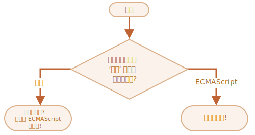

importance: 2

---

# 자바스크립트의 공식 이름

`if..else` 구조를 이용해 "자바스크립트의 '공식' 이름은 무엇일까요?"라는 질문을 하는 코드를 작성해 보세요.

사용자가 'ECMAScript'를 입력했다면 '정답입니다!', 아니라면 '모르셨나요? 정답은 ECMAScript입니다!'라는 메시지를 보여주세요.

[demo src="ifelse_task2"]
