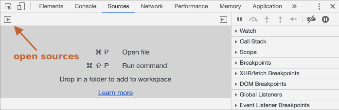

# Chrome으로 디버깅하기

좀 더 복잡한 코드를 작성하기 전에, 디버깅이란 것에 대해 이야기해봅시다.

[디버깅(debugging)](https://en.wikipedia.org/wiki/Debugging)은 스크립트 내 에러를 검출해 제거하는 일련의 과정을 의미합니다. 모던 브라우저와 호스트 환경 대부분은 개발자 도구 안에 UI 형태로 디버깅 툴을 구비해 놓습니다. 이 툴을 사용하면 디버깅이 훨씬 쉬워지고, 실행 단계마다 어떤 일이 일어나는지를 코드 단위로 추적할 수 있습니다.

이 글에선 Chrome 브라우저에서 제공하는 디버깅 툴을 사용하도록 하겠습니다. 기능이 다양하고, Chrome에 익숙해지면 다른 브라우저에서 지원하는 디버깅 툴은 쉽게 익힐 수 있기 때문입니다.

## "Sources" 패널

Chrome 버전에 따라 보이는 화면은 약간씩 다를 수 있습니다. 하지만 버전이 바뀌어도 구성은 크게 바뀌지 않기 때문에 화면 캡쳐본과 함께 설명을 이어나가겠습니다. 

- Chrome을 사용해 [예시 페이지](debugging/index.html)를 엽니다.
- `key:F12`(MacOS: `key:Cmd+Opt+I`)를 눌러 개발자 도구를 엽니다.
- `Sources` 패널(panel)을 선택합니다.

Sources 패널을 처음 열었다면 아래와 같은 화면이 보일 겁니다.



토글 버튼 <span class="devtools" style="background-position:-168px -76px"></span>을 누르면 탭이 하나 열리고 현재 열려있는 사이트와 관련된 파일들이 보입니다.

파일 목록 트리에서 `hello.js`를 클릭해 아래와 같이 화면을 바꿔봅시다.


Sources 패널은 크게 세 개의 영역으로 구성됩니다.

1. **리소스 영역** --  페이지를 구성하는 데 쓰인 모든 리소스(HTML, JavaScript, CSS, 이미지 파일 등)를 트리 형태로 보여줍니다. Chrome 익스텐션이 여기 나타날 때도 있습니다.
2. **소스 코드 영역** -- 리소스 영역에서 선택한 파일의 소스 코드를 보여주고, 편집 기능도 제공합니다.
3. **디버깅 영역** -- 디버깅에 관련된 기능을 제공합니다. 곧 자세히 살펴보겠습니다.

토글 버튼 <span class="devtools" style="background-position:-200px -76px"></span>을 다시 누르면 리소스 영역이 사라지고, 소스 코드 영역이 더 넓어집니다.

## 콘솔

`key:Esc`를 누르면, 개발자 도구 하단부에 콘솔 창이 열립니다. 여기에 명령어를 입력하고 `key:Enter`를 누르면 해당 명령어가 실행됩니다.

콘솔 창에 구문(statement)을 입력하고 실행하면 아랫줄에 실행 결과가 출력됩니다.

`1+2`를 입력하면 `3`이 출력되고, `hello("debugger")`를 입력하면 `undefined`가 출력되죠. `undefined`가 출력되는 이유는 `hello("debugger")`가 아무것도 반환하지 않기 때문입니다.


## 중단점

[예시 페이지](debugging/index.html) 내부에서 무슨 일이 일어나는지 자세히 살펴봅시다. `hello.js`를 소스 코드 영역에 띄우고 네 번째 줄 코드 좌측의 줄 번호, `4`를 클릭합시다. 코드가 아닌 아닌 줄 번호 `4`에 마우스 커서를 옮긴 후 클릭해야 합니다.

축하합니다! 중단점을 성공적으로 설정하셨습니다. 줄 번호 `8`도 클릭해 중단점을 하나 더 추가해봅시다.

지금까지 잘 따라오셨다면 아래와 같은 화면이 보여야 합니다. 줄 번호 `4`와 `8`이 파란색으로 바뀐 게 보이시죠?


*중단점(breakpoint)* 은 말 그대로 자바스크립트의 실행이 중단되는 코드 내 지점을 의미합니다.

0중단점을 이용하면 실행이 중지된 시점에 변수가 어떤 값을 담고 있는지 등의 정보를 얻을 수 있습니다. 또한 콘솔 창에 명령어를 입력해 실행이 중지된 시점을 기준으로 해당 명령어를 실행할 수도 있습니다. 이런 기능을 이용해 디버깅하면 됩니다.  

Sources 패널 우측의 디버깅 영역을 보면 중단점 목록을 확인할 수 있습니다. 파일 여러 개에 다수의 중단점을 설정해 놓은 경우, 디버깅 영역을 이용하면 아래와 같은 작업을 할 수도 있습니다.
- 항목을 클릭해 해당 중단점을 설정한 소스 코드 줄로 바로 이동할 수 있습니다,
- 체크 박스 선택을 해제해 해당 중단점을 비활성화 할 수 있습니다.
- 마우스 오른쪽을 클릭해 중단점 제거 관련 메뉴를 선택하면 해당 중단점을 삭제할 수도 있습니다.
- 이 외에도 다양한 기능이 있습니다.

```smart header="조건부 중단점"
줄 번호에 마우스 커서를 옮긴 후 *우클릭*하면 *조건부 중단점(conditional breakpoint)* 을 만들 수 있습니다. 조건부 중단점은 입력한 표현식이 참인 경우에만 실행을 중지시킵니다.

조건부 중단점을 설정하면 변수에 특정 값이 할당될 때나 함수의 매개 변수에 특정 값이 들어올 때만 실행을 중단시킬 수 있어 디버깅 시 유용하게 활용할 수 있습니다. 
```

## debugger 명렁어

아래 예시처럼 스크립트 내에 `debugger` 명령어를 적어주면 중단점을 설정한 것처럼 실행을 중단시킬 수 있습니다.

```js
function hello(name) {
  let phrase = `Hello, ${name}!`;

*!*
  debugger;  // <-- 여기서 실행이 멈춥니다.
*/!*

  say(phrase);
}
```

debugger 명령어를 사용하면 중단점을 설정하기 위해 브라우저를 켜 개발자 도구를 열고 소스 코드 영역을 띄우는 수고를 하지 않아도 됩니다. 에디터를 떠나지 않고도 중단점을 설정할 수 있기 때문에 편리하죠.


## 멈추면 보이는 것들

예시 페이지를 불러올 때 함수 `hello()`가 호출되므로, 새로 로침 단축키 `key:F5`(Windows, Linux 사용자)나 `key:Cmd+R`키(MacOS 사용자)를 눌러 중단점을 작동시켜봅시다. 중단점이 제대로 설정된 상태에서 말이죠.

아래 그림과 같이 네 번째 줄에서 실행이 중단되는 걸 확인할 수 있습니다.


이 상태에서 디버깅 영역의 화살표 `▼`를 클릭해 하위 패널들을 하나씩 펼쳐봅시다. 각 패널은 아래와 같은 기능을 제공합니다.

1. **`Watch` -- 표현식을 평가하고 결과를 보여줍니다.**

    Add Expression 버튼 `+`를 클릭해 원하는 표현식을 입력한 후 `key:Enter`를 누르면 중단 시점의 값을 보여줍니다. 입력한 표현식은 실행 과정 중에 계속해서 재평가됩니다. 

2. **`Call Stack` -- 코드를 해당 중단점으로 안내한 실행 경로를 역순으로 표시합니다.**

    실행은 `index.html` 안에서 `hello()`를 호출하는 과정 중에 멈췄습니다. 함수 `hello` 내에 중단점을 설정했기 때문에, 콜 스택(Call Stack) 최상단엔 `hello`가 위치합니다. 함수를 `index.html` 안에서 정의한 것이 아니기 때문에 콜 스택 하단엔 "anonymous"가 출력됩니다.

    콜 스택 내의 항목을 하나 클릭하면 디버거가 해당 코드로 휙 움직입니다. "anonymous"를 클릭해 이를 확인해 봅시다. 디버거가 이동하면, 변수 역시 재평가됩니다. 
3. **`Scope` -- 현재 정의된 모든 변수를 출력합니다.**

    `Local`은 함수의 지역변수를 보여줍니다. `Scope` 패널에 출력된 변수에 대한 정보는 `소스 코드 영역`에서도 확인(강조 표시)할 수 있습니다. 

    `Global`은 (함수 바깥에 정의된) 전역 변수를 보여줍니다.

    `this`에 대한 정보도 출력되는데, 이에 대해선 추후에 학습하도록 하겠습니다.

## 실행 추적하기

이제 본격적으로 실행 단계마다 어떤 일이 일어나는지 *추적* 해보겠습니다.

먼저, 디버깅 영역의 최상단에 있는 버튼이 무슨 일을 하는지 알아봅시다.

<span class="devtools" style="background-position:-7px -76px"></span> -- 다시 시작(단축키 `key:F8`)
: 다음 중단점까지 실행을 재개합니다. 추가 중단점이 없는 경우 정상 실행이 재개되고, 디버거는 동작하지 않습니다.

버튼을 클릭해봅시다.


실행이 다시 시작됩니다. 그러다가 `say()` 안에 설정한 중단점 때문에 실행이 중단됩니다. 이 시점에서 우측의 "Call stack"을 살펴봅시다. 스택 최상단에 콜(`say`)이 하나 더 추가된 것을 확인할 수 있습니다. 현재 실행은 `say()`에 멈춰있는 상황입니다.

<span class="devtools" style="background-position:-137px -76px"></span> -- Step Over(단축키 `key:F10`)
: 다음 명령어를 실행합니다. 단, 실행하려는 명령어에 함수 호출이 포함된 경우 해당 함수 내로 진입하지 않고 *지나갑니다(step over)*.

<span class="devtools" style="background-position:-72px -76px;background-image:url(/article/debugging-chrome/toolbarButtonGlyphs.svg);"></span> -- Step Into(단축키 `key:F11`)
: Step Over와 동일한 기능(다음 명령어 실행)을 합니다. 다만 실행하려는 명령어에 함수 호출이 포함되어 있으면 해당 함수 *안으로 진입합니다(step into)*. Step Into는 어떤 함수로 진입하거나 빠져나오든 상관없이 하나의 명령문만 실행되도록 보장하므로 스크립트 전체를 '한 번에 한 줄씩' 실행하고자 할 때 유용합니다.

<span class="devtools" style="background-position:-104px -76px"></span> -- Step Out(단축키 `key:Shift+F11`)
: 현재 함수의 나머지 부분을 끝까지 실행하고, 함수 호출 다음 명령문에서 일시 중지합니다. 실수로 <span class="devtools" style="background-position:-72px -76px"></span>를 클릭해 중첩 호출 안으로 들어갔을 때, <span class="devtools" style="background-position:-104px -76px"></span>를 누르면 빠져나갈 수 있습니다.

<span class="devtools" style="background-position:-7px -28px"></span> -- 모든 중단점을 활성화/비활성화
: 모든 중단점을 일시적으로 활성화/비활성화합니다. 중단점을 제거하지 않고 전체 실행을 재개하고자 할 때 유용합니다. 

<span class="devtools" style="background-position:-264px -4px"></span> -- 예외시 일시 중지 활성화/비활성화
: 예외 발생 시 코드를 자동 중지시켜주는 기능을 활성화/비활성화합니다. 활성화된 상태이고, 개발자 도구가 열려있는 상황에서 스크립트 실행 중에 에러가 발생하면 실행이 중단됩니다. 실행이 중단되었기 때문에, 개발자는 변수 등을 조사해 어디서 에러가 발생했는지 찾을 수 있게 됩니다. 해당 기능이 비활성화된 상태에서 스크립트가 죽었다면, 기능을 활성화 한 후 페이지를 다시 불러오면 위와 같은 절차로 디버깅을 수행할 수 있습니다.

```smart header="Continue to here 옵션"
특정 줄에서 마우스 오른쪽 버튼을 클릭해 컨텍스트 메뉴를 열면 "Continue to here"라는 옵션을 볼 수 있습니다.

중단점을 설정하기는 귀찮은데 해당 줄에서 실행을 재개하고 싶을 때 아주 유용한 옵션입니다.
```

## Logging

`console.log` 함수를 이용하면 코드를 이용해 원하는 것을 콘솔에 출력할 수 있습니다.

Console 패널을 연 후, 아래 예시를 실행해 봅시다. 숫자 `0`부터 `4`까지 출력됩니다.

```js run
// 콘솔에 결과가 출력됩니다.
for (let i = 0; i < 5; i++) {
  console.log("숫자", i);
}
```

일반 사용자는 콘솔 패널을 열지 않은 이상 출력 결과를 볼 수 없습니다. 개발자 도구의 콘솔 패널을 직접 열면 출력 결과를 볼 수 있습니다. 콘솔 패널 이외에 다른 패널이 열려있는 상황이라면 `key:Esc`를 눌러 화면 하단에 콘솔 패널을 띄울 수 있습니다.  

코드에 `console.log`를 적절히 넣어주었다면 디버거 없이도 무슨 일이 일어나고 있는지 충분히 파악할 수 있으므로, Logging과 디버거를 적절히 활용하시기 바랍니다.

## 요약

아래와 같은 방법으로 스크립트의 실행을 중단시킬 수 있습니다.
1. 중단점 설정
2. `debugger` 명령어 입력
3. 개발자 도구를 열고, <span class="devtools" style="background-position:-264px -4px"></span> 버튼을 "활성화", (에러가 발생할 때 스크립트가 중지)

스크립트의 실행이 중지되면 중단 시점을 기준으로 변수에 어떤 값이 들어가 있는지 확인할 수 있습니다. 또한 단계별로 코드를 실행해 가며 해당 중단 시점을 기준으로 어디서 문제가 발생했는지 추적할 수도 있습니다. 이런 방식을 통해 디버깅할 수 있습니다.   

개발자 도구는 여기서 소개한 기능 이외의 다양한 기능을 지원합니다. Google에서 제공하는 개발자 도구 공식 매뉴얼은 <https://developers.google.com/web/tools/chrome-devtools>에서 확인할 수 있습니다.

위에서 소개한 기능들은 당장 디버깅을 시작하기에 부족하지 않습니다. 그런데 여기선 브라우저가 제공하는 고급 기능을 다루지 않았기 때문에 보충이 필요합니다. Google 공식 매뉴얼에 들어가 개발자 도구의 고급기능에 대해 더 알아보시기 바랍니다.  

매뉴얼을 정독하지 않아도 괜찮습니다. 개발자 도구를 열어 이것저것 클릭하면서 활용 방법을 익혀도 좋습니다. 직접 부딪쳐 보는 게 가장 빠른 학습 방법일 수 있으니까요. 우클릭해서 컨텍스트 메뉴를 띄워보는 것도 꼭 해보시길 바랍니다!
