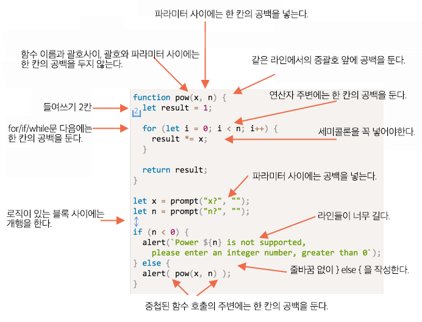
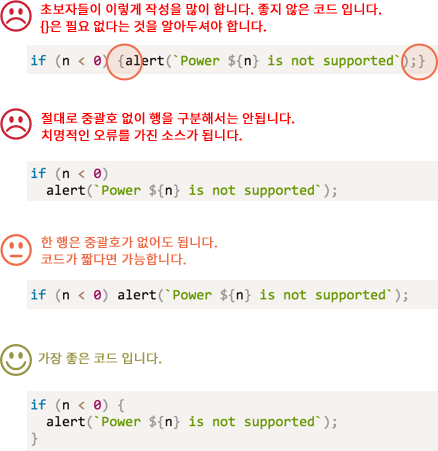

# 코딩 스타일

코드는 깨끗하고 읽기 쉽게 작성하는 것이 실질적으로 프로그래밍의 기술입니다.

복잡한 작업을 수행하고 사람이 읽을 수 있는 방식으로 코드를 작성합니다.

## 문법

다음은 몇 가지 규칙이 제안된 요약한 치트시트입니다. (아래에 자세한 내용 참조)


<!--
```js
function pow(x, n) {
  let result = 1;

  for (let i = 0; i < n; i++) {
    result *= x;
  }

  return result;
}

let x = prompt("x?", "");
let n = prompt("n?", "");

if (n < 0) {
  alert(`Power ${n} is not supported,
    please enter an integer number, greater than 0`);
} else {
  alert( pow(x, n) );
}
```

-->

위의 치트 시트에 기재된 규칙과 세세한 내용을 설명하겠습니다.

```warn header="Irony Detected"
꼭 해야만 하는 정해진 규칙이 아닙니다.
```

### 중괄호

대부분의 자바스크립트 프로젝트에서 중괄호는 "Egyptian" 스타일입니다. "Egyptian" 스타일은 새로운 키워드가 아닌 해당 키워드와 같은 행에 여는 중괄호로 작성되는 것입니다. 아래의 예시 코드에서 처럼 여는 중괄호 앞에는 공백 한 칸이 있어야 합니다.

예시 :

```js
if (condition) {
  // do this
  // ...and that
  // ...and that
}
```

단일 행 구조는 에지 케이스에서 중요합니다. 그렇다면 대괄호를 사용해야할까요? 그렇다면 어디에 대괄호를 사용할까요?

다음은 주석이 달린 코드 입니다. 코드를 보면 가독성을 판단할 수 있습니다.
<!--
```js no-beautify
if (n < 0) {alert(`Power ${n} is not supported`);}

if (n < 0) alert(`Power ${n} is not supported`);

if (n < 0)
  alert(`Power ${n} is not supported`);

if (n < 0) {
  alert(`Power ${n} is not supported`);
}
```
-->


요약 :

- 짧은 코드 작성을 위해서 한 행은 허용합니다. ex) `if (cond) return null`.
- 그러나 작성한 구문을 중괄호를 사용하여 행을 구분한 코드는 읽기 쉽습니다.

### 행 길이

가로로 긴 행의 코드를 읽는 것은 힘듭니다. 행을 분리하고 행의 길이를 제한하는 것이 가장 좋습니다.

최대 행의 길이는 팀 내에서 합의 해야 합니다. 일반적으로 80에서 120자입니다.

### 들여쓰기

2가지 타입의 들여쓰기가 있습니다.

- **가로 들여쓰기 : 2칸 또는 4칸의 공백**
    가로 들여쓰기는 2칸 또는 4칸의 공백을 사용하거나 "Tab"으로 적용합니다. 2칸 또는 4칸의 공백을 사용할지 "Tab"을 적용할지에 대한 논쟁은 오랫동안 이뤄져 왔습니다. 요즘은 공백을 좀 더 많이 사용하고 있습니다.

    공백이 "Tab"보다 유연한 구성을 허용한다는 한 가지 장점이 있습니다.

    예를 들어, 중괄호를 열 때 아래의 예시 코드처럼 인자를 정렬할 수 있습니다.

    ```js no-beautify
    show(parameters,
         aligned, // 왼쪽에서 5칸 공백
         one,
         after,
         another
      ) {
      // ...
    }
    ```

- **세로 들여쓰기 : 로직이 있는 블록 사이를 나눌 때 빈 행**

    단일 함수에서 자주 로직 블록으로 나눌 수 있습니다.
    아래의 예시 코드에서 변수의 초기화, 메인 반복문 그리고 결과를 반환하는 부분에서 세로로 구분할 수 있습니다.

    ```js
    function pow(x, n) {
      let result = 1;
      //              <--
      for (let i = 0; i < n; i++) {
        result *= x;
      }
      //              <--
      return result;
    }
    ```
    새로운 행을 추가하면 읽기 쉬운 코드를 작성할 수 있습니다. 세로로 들여쓰기가 없는 코드는 9줄을 초과해서는 안됩니다.

### 세미콜론

세미콜론은 구문을 건너띌 수 있는 경우에도 각각 구문 다음에 있어야 합니다.

세미콜론이 실제로 선택사항이고, 거의 사용하지 않는 언어도 있습니다. 자바스크립트에서는 줄 바꿈이 세미콜론으로 해석되지 않아 오류에 취약한 경우가 있습니다.

프로그래머로서 더욱 성장하게 되면 [StandardJS](https://standardjs.com/)처럼 세미콜론을 작성하지 않는 스타일을 선택할 수 있습니다. 그렇게 될 때까지 함정에 빠지지 않기 위해서 세미콜론을 사용하는 것이 좋습니다.

### 중첩 레벨

깊이 있는 코드들을 너무 많은 중첩하여 작성하지 마세요.

반복문에서 추가적인 중첩을 피해기 위해 ["continue"](info:while-for#continue)지시자를 사용하는 것이 좋습니다.

예를 들면 아래의 코드처럼 중첩된  `if` 조건문을 사용하는 것 대신

```js
for (let i = 0; i < 10; i++) {
  if (cond) {
    ... // <- one more nesting level
  }
}
```
아래의 코드를 사용할 수 있습니다.

```js
for (let i = 0; i < 10; i++) {
  if (!cond) *!*continue*/!*;
  ...  // <- no extra nesting level
}
```
이와 마찬가지로 `if/else`와 `return`을 사용하여 중첩을 피할 수 있습니다.

예를 들어, 아래의 2가지 구조는 동일합니다.

선택사항 1:

```js
function pow(x, n) {
  if (n < 0) {
    alert("Negative 'n' not supported");
  } else {
    let result = 1;

    for (let i = 0; i < n; i++) {
      result *= x;
    }

    return result;
  }  
}
```

선택사항 2:

```js
function pow(x, n) {
  if (n < 0) {
    alert("Negative 'n' not supported");
    return;
  }

  let result = 1;

  for (let i = 0; i < n; i++) {
    result *= x;
  }

  return result;
}
```

선택사항 2가 더 읽기 쉽습니다. 왜냐하면 에지 케이스에서 `n < 0`이 초기에 처리되기 때문입니다. 검사가 끝나면 추가 중첩을 하지 않고도 "main" 코드로 이동할 수 있습니다.

## 함수 배치

만약 "헬퍼" 함수와 이를 사용하는 코드를 작성한다면, 3가지 방법으로 함수를 구성할 수 있습니다.

1. 아래의 코드 처럼 함수를 사용하는 코드 위에 선언합니다.

    ```js
    // *!*function declarations*/!*
    function createElement() {
      ...
    }

    function setHandler(elem) {
      ...
    }

    function walkAround() {
      ...
    }

    // *!*the code which uses them*/!*
    let elem = createElement();
    setHandler(elem);
    walkAround();
    ```

2. 사용하는 코드가 먼저, 그다음 함수를 선언합니다.

    ```js
    // *!*the code which uses the functions*/!*
    let elem = createElement();
    setHandler(elem);
    walkAround();

    // --- *!*helper functions*/!* ---
    function createElement() {
      ...
    }

    function setHandler(elem) {
      ...
    }

    function walkAround() {
      ...
    }
    ```

3. 1,2 둘 다 섞습니다. 함수는 처음 사용된 곳에 선언됩니다.

대부분의 경우 두번째 방법을 많이 선호합니다.

왜냐하면 코드를 읽을 때, 먼저 코드가 무엇인지 알고 싶어하기 때문입니다. 만약 코드가 먼저 선언이 된다면, 해당 정보가 제공됩니다. 그러고 나면 함수를 읽을 필요는 없습니다. 그래서 함수 이름이 무엇을 하는지 알 수 있어야 합니다.

## 스타일 가이드

스타일 가이드는 "작성하는 방법"에 대해 '사용할 따옴표', '들여쓰기의 공백', '줄바꿈을 넣을 위치'와 같은 일반적인 규칙을 포함하고 있어야 합니다. 사소하게 포함해야할 규칙들이 많습니다.

팀의 모든 구성원이 동일한 스타일 가이드를 사용하면 팀원이 개별적으로 작성한 코드와 관계없이 코드가 동일하게 보입니다.

물론 팀은 항상 자신의 스타일 가이드를 작성할 수 있습니다. 대부분의 경우, 필요가 없습니다. 왜냐하면 잘 만들어 놓아진 스타일 가이드들이 존재하여 선택해서 사용할 수 있는 스타일 가이드들이 많습니다. 가장 잘된 것들을 하나 채택하여 사용하면 됩니다.

유명한 스타일들 :

- [Google JavaScript Style Guide](https://google.github.io/styleguide/javascriptguide.xml)
- [Airbnb JavaScript Style Guide](https://github.com/airbnb/javascript)
- [Idiomatic.JS](https://github.com/rwaldron/idiomatic.js)
- [StandardJS](https://standardjs.com/)
- 등등

초보자인 경우 이 장의 첫 번째에 있는 치트시트부터 시작하세요. 일단 마스터하면 다른 스타일 가이드들을 찾아서 일반적인 원칙들을 선택하고, 어떤 스타일이 좋은지 결정할 수 있습니다.

## 자동화된 린트

린트는 코드의 스타일을 자동으로 체크하고, 정의한 코드 스타일대로 리팩토링해줍니다.

린트의 가장 우수한 부분은 변수 또는 함수의 이름의 오류와 버그를 찾아내는 것입니다. 왜냐하면 이 기능으로 인해 특정 "코드 스타일"을 고집하지 않으려해도 린트 설치가 권장됩니다.

가장 잘 알려진 린트 툴들:

- [JSLint](http://www.jslint.com/) -- 린트들 중 가장 많이 사용
- [JSHint](http://www.jshint.com/) -- JSLint 보다 더 많은 환경 세팅 가능
- [ESLint](http://eslint.org/) -- 아마 린트들 중 가장 최신

이 린트툴들은 린트를 수행합니다. 책 저자는 [ESLint](http://eslint.org/)을 사용합니다.

대부분의 린트들은 많은 유명한 에디터와 함께 사용할 수 있습니다. 에디터에서 플러그인으로 사용할 수 있고 스타일을 환경 세팅할 수 있습니다.

예를 들어, ESLint의 경우 다음을 수행해야 합니다.

1. [Node.JS](https://nodejs.org/)를 설치합니다.
2. 명령어로 `npm install -g eslint` (npm은 자바스크립트 패키지 설치 프로그램입니다.)을 ESLint를 설치합니다.
3. 자바스크립트 프로젝트의 루트(프로젝트의 파일들이 모두 포함된 폴더)에 `.eslintrc` 파일 이름으로 환경 세팅 파일을 생성합니다.
4. ESLint와 함께 사용할 에디터의 플러그인 설치하고 활성화하세요. 다수의 에디터는 설치, 활성화 되어 있습니다.

`.eslintrc` 파일 작성의 예:

```js
{
  "extends": "eslint:recommended",
  "env": {
    "browser": true,
    "node": true,
    "es6": true
  },
  "rules": {
    "no-console": 0,
  },
  "indent": 2
}
```
`"extends"` 지시자는 설정이 "eslint : recommended"설정을 기반으로한다는 것을 나타냅니다. 그 후에는 직접 지정합니다. 

웹에서 스타일 규칙 세트들을 다운로드하여 대신 사용할 수도 있습니다. 더 많은 자세한 사항과 설치는 'http://eslint.org/docs/user-guide/getting-started'에서 볼 수 있습니다.

또한 IDE는 린트들이 내장되어 있어 편하지만 ESLint 변형을 할 수 없습니다.

## 요약

읽기 쉬운 코드를 작성하는 것을 목표로 모든 문법의 규칙 그리고 스타일 가이드의 참고 자료는 이 장에서 설명이 되어 있습니다. 그러나 모두 논쟁의 여지가 있습니다.

훨씬 "더 나은" 코드를 작성하는 것에 대한 생각을 할 때, 우리가 묻는 질문은 "코드를 읽기 쉽고,보다   이해하기 쉬운 코드를 만드는 이유"와 "오류를 방지하는데 도움이 되는 것은 무엇입니까?" 입니다. 이러한 것들이 코드 스타일을 선택하고 토론할 때 염두에 두어야 할 주요 사항입니다. 

인기있는 스타일 가이드를 읽으면 코드 스타일 동향 및 모범 사례에 대한 최신 아이디어를 최신으로 유지할 수 있습니다.