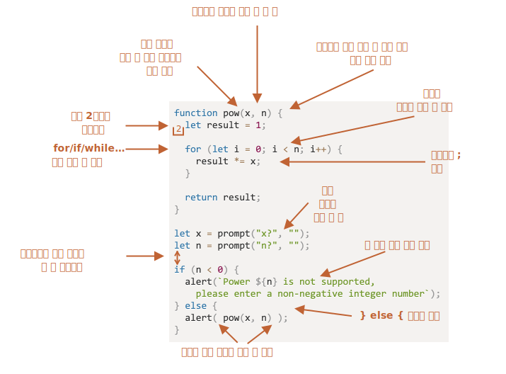

# 코딩 스타일

개발자는 가능한 한 간결하고 읽기 쉽게 코드를 작성해야 합니다.

복잡한 문제를 간결하고 사람이 읽기 쉬운 코드로 작성해 해결하는 것이야말로 진정한 프로그래밍 기술입니다. 좋은 코드 스타일은 이런 기술을 연마하는 데 큰 도움을 줍니다.

## 문법

몇 가지 추천할만한 규칙을 아래 치트 시트에 표시해보았습니다(자세한 설명은 아래를 참고).


<!--
```js
function pow(x, n) {
  let result = 1;

  for (let i = 0; i < n; i++) {
    result *= x;
  }

  return result;
}

let x = prompt("x?", "");
let n = prompt("n?", "");

if (n < 0) {
  alert(`Power ${n} is not supported,
    please enter a non-negative integer number`);
} else {
  alert( pow(x, n) );
}
```

-->

이제, 각 규칙과 규칙이 생긴 이유에 대해 자세히 알아봅시다.

```warn header="'무조건' 따라야 할 규칙은 없습니다."
본 튜토리얼에서 제안하고 있는 규칙 모두를 종교 신조마냥 무조건 따르지 않아도 됩니다. 스타일에 대한 선호에 따라 규칙을 따를 수도, 따르지 않을 수도 있습니다.
```

### 중괄호

대부분의 자바스크립트 프로젝트에서 여는 중괄호는 '이집션(Egyptian)' 스타일을 따라 새로운 줄이 아닌 상응하는 키워드와 같은 줄에 작성합니다. 여기에 더하여 여는 중괄호 앞엔 공백이 하나 있어야 합니다. 아래와 같이 말이죠.

```js
if (condition) {
  // 코드 1
  // 코드 2
  // ...코드 n...
}
```

`if (condition) doSomething()`과 같은 단 한 줄짜리 구문은 중요하게 다뤄야 할 에지 케이스입니다. 이런 예외상황에도 중괄호를 써야 할까요?

어떻게 코드를 작성해야 가독성이 좋을지 직접 판단해 보시라고 주석과 함께 몇 가지 예시를 만들어보았습니다.

1. 😠 초보 개발자들은 아래처럼 코드를 작성하곤 하는데, 중괄호가 필요하지 않기 때문에 추천하지 않습니다.
    ```js
    if (n < 0) *!*{*/!*alert(`Power ${n} is not supported`);*!*}*/!*
    ```
2. 😠 중괄호 없이 새로운 줄에 코드를 작성할 수도 있는데, 이렇게 하면 새로운 코드 라인을 추가할 때 에러가 발생합니다. 절대 이 방법은 쓰지 마세요.
    ```js
    if (n < 0)
      alert(`Power ${n} is not supported`);
    ```
3. 😏 코드가 짧다면 중괄호 없이 한 줄에 쓰는 방법도 괜찮습니다.
    ```js
    if (n < 0) alert(`Power ${n} is not supported`);
    ```
4. 😃 가장 추천하는 방법은 다음과 같습니다.
    ```js
    if (n < 0) {
      alert(`Power ${n} is not supported`);
    }
    ```

`if (cond) return null`처럼 코드가 간단하다면 세 번째 예시같이 한 줄에 몰아서 작성해도 괜찮습니다. 그렇지만 네 번째 예시처럼 코드 블록을 사용하는 방법이 가장 가독성이 좋으므로 이 방법을 추천합니다.

### 가로 길이

가로로 길게 늘어진 코드를 읽는 걸 좋아하는 개발자는 없습니다. 코드의 가로 길이가 길어진다면 여러 줄로 나눠 작성하는 게 좋습니다.

예시:
```js
// 백틱(`)을 사용하면 문자열을 여러 줄로 쉽게 나눌 수 있습니다.
let str = `
  Ecma International's TC39 is a group of JavaScript developers,
  implementers, academics, and more, collaborating with the community
  to maintain and evolve the definition of JavaScript.
`;
```

`if`문이라면 아래와 같이 작성할 수 있을겁니다.

```js
if (
  id === 123 &&
  moonPhase === 'Waning Gibbous' &&
  zodiacSign === 'Libra'
) {
  letTheSorceryBegin();
}
```

최대 가로 길이는 팀원들과 합의해 정하는게 좋습니다. 대개 80자나 120자로 제한하는 게 일반적입니다.

### 들여쓰기

들여쓰기에는 두 종류가 있습니다.

- **가로 들여쓰기: 스페이스 두 개 혹은 네 개를 사용해 만듦**

    가로 들여쓰기는 스페이스 두 개 혹은 네 개를 사용하거나 탭 키(`key:Tab`)를 이용해 만들 수 있습니다. 어떤 방법을 쓸지에 대한 논쟁은 오래전부터 있었는데, 요즘엔 탭 대신 스페이스를 이용하는 게 더 우위에 있는 것 같습니다.

    탭 대신 스페이스를 이용했을 때의 장점 중 하나는 들여쓰기 정도를 좀 더 유연하게 변경할 수 있다는 점입니다.

    아래 예시처럼 인수 모두의 위치를 여는 괄호와 맞출 수 있죠.

    ```js no-beautify
    show(parameters,
         aligned, // 스페이스 다섯 개를 이용해 들여쓰기 함
         one,
         after,
         another
      ) {
      // ...
    }
    ```

- **세로 들여쓰기: 논리 블록 사이에 넣어 코드를 분리해주는 새 줄**

    함수 하나에 논리 블록 여러 개가 들어갈 수 있습니다. 아래 예시에서 변수 선언, 반복문, 리턴문 사이에 세로 들여쓰기를 해주는 빈 줄을 넣어 코드를 분리해 보았습니다.

    ```js
    function pow(x, n) {
      let result = 1;
      //              <--
      for (let i = 0; i < n; i++) {
        result *= x;
      }
      //              <--
      return result;
    }
    ```

    이렇게 여분의 줄을 넣어주면 코드의 가독성이 좋아집니다. 읽기 쉬운 코드를 만들려면 세로 들여쓰기 없이 코드를 아홉 줄 이상 연속해서 쓰지 마세요.

### 세미콜론

자바스크립트 엔진에 의해 무시되더라도 모든 구문의 끝엔 세미콜론을 써주는 것이 좋습니다.

구문 끝에 세미콜론을 적는 게 완전히 선택사항인 언어가 몇몇 있는데 이런 언어들에선 세미콜론을 잘 쓰지 않습니다. 그러나 자바스크립트에선 줄 바꿈이 세미콜론으로 해석되지 않는 몇몇 상황이 있기 때문에 세미콜론을 생략하고 코딩하는 습관을 들이면 에러를 발생시키는 코드를 만들 수 있습니다. 자세한 사례는 <info:structure#semicolon> 챕터에서 살펴보세요.

경험이 많은 자바스크립트 개발자라면 [StandardJS](https://standardjs.com/)에서 제시하는 스타일 가이드처럼 세미콜론 없이 코드를 작성할 수도 있습니다. 초보 개발자라면 에러를 만들 확률을 줄이기 위해서라도 세미콜론을 사용하는 게 좋습니다.

### 중첩 레벨

가능하면 너무 깊은 중첩문은 사용하지 않도록 합시다.

반복문을 사용할 때 중첩문의 깊이가 깊어지면 [`continue`](info:while-for#continue) 지시자를 쓰는 게 좋은 대안이 될 수도 있습니다.

`if`문으로 조건을 처리하는 예시를 통해 이를 살펴봅시다.

```js
for (let i = 0; i < 10; i++) {
  if (cond) {
    ... // <- 중첩 레벨이 하나 더 늘어났습니다.
  }
}
```

위 코드는 `continue`를 써서 아래와 같이 바꿀 수 있습니다.

```js
for (let i = 0; i < 10; i++) {
  if (!cond) *!*continue*/!*;
  ...  // <- 추가 중첩 레벨이 추가되지 않습니다.
}
```

`if/else`와 `return`문을 조합하면 위 예시와 유사하게 중첩 레벨을 줄여 코드의 가독성을 높일 수 있습니다.

아래 두 예시는 동일하게 동작합니다.

예시 1:

```js
function pow(x, n) {
  if (n < 0) {
    alert("'n'은 음수가 될 수 없습니다.");
  } else {
    let result = 1;

    for (let i = 0; i < n; i++) {
      result *= x;
    }

    return result;
  }  
}
```

예시 2:

```js
function pow(x, n) {
  if (n < 0) {
    alert("'n'은 음수가 될 수 없습니다.");
    return;
  }

  let result = 1;

  for (let i = 0; i < n; i++) {
    result *= x;
  }

  return result;
}
```

`n < 0`인 '특별한 상황'을 앞에 두고, 그 안에 `return`문을 추가해주었더니 가독성이 훨씬 좋아졌습니다. 특별한 상황인지를 확인하고 조건을 통과하면 추가 중첩 없이 '주요' 코드 흐름으로 넘어가게 코드를 짰기 때문입니다.

## 함수의 위치

'헬퍼' 함수 여러 개를 만들어 사용하고 있다면 아래와 같은 방법을 사용해 코드 구조를 정돈할 수 있습니다. 

1. 헬퍼 함수를 사용하는 코드 *위*에서 헬퍼 함수를 모아 선언하기

    ```js
    // *!*함수 선언*/!*
    function createElement() {
      ...
    }

    function setHandler(elem) {
      ...
    }

    function walkAround() {
      ...
    }

    // *!*헬퍼 함수를 사용하는 코드*/!*
    let elem = createElement();
    setHandler(elem);
    walkAround();
    ```
2. 코드를 먼저, 함수는 그 다음에 선언하기

    ```js
    // *!*헬퍼 함수를 사용하는 코드*/!*
    let elem = createElement();
    setHandler(elem);
    walkAround();

    // --- *!*헬퍼 함수*/!* ---
    function createElement() {
      ...
    }

    function setHandler(elem) {
      ...
    }

    function walkAround() {
      ...
    }
    ```
3. 혼합: 코드 바로 위에서 필요한 헬퍼 함수 그때그때 선언하기

대개는 두 번째 방법으로 코드를 정돈하는 걸 선호합니다.

사람들은 코드를 이 코드가 '무엇을 하는지'를 생각하며 코드를 읽기 때문에 코드가 먼저 나오는 것이 자연스럽기 때문입니다. 이름만 보고도 헬퍼 함수의 역할을 쉽게 유추할 수 있게 헬퍼 함수 이름을 명명했다면 함수 본문을 읽을 필요도 없습니다.

## 스타일 가이드

코딩 스타일 가이드는 코드를 '어떻게 작성할지'에 대한 전반적인 규칙을 담은 문서로, 어떤 따옴표를 쓸지, 들여쓰기할 때 스페이스를 몇 개 사용할지, 최대 가로 길이는 몇까지 제한할지 등의 내용이 담겨있습니다.

팀원 전체가 동일한 스타일 가이드를 따라 코드를 작성하면, 누가 코드를 작성했나에 관계없이 동일한 스타일의 코드를 만들 수 있습니다.

팀원들이 모여 팀 전용 스타일 가이드를 만들 수도 있는데, 요즘엔 이미 작성된 가이드 중 하나를 선택해 팀의 가이드로 삼는 편입니다.

유명 스타일 가이드:

- [Google의 자바스크립트 스타일 가이드](https://google.github.io/styleguide/javascriptguide.xml)
- [Airbnb의 자바스크립트 스타일 가이드](https://github.com/airbnb/javascript)
- [Idiomatic.JS](https://github.com/rwaldron/idiomatic.js)
- [StandardJS](https://standardjs.com/)
- 기타 등등

초보 개발자라면 상단 치트 시트를 시작으로 본인만의 스타일을 가이드를 만들어 보시기 바랍니다. 유명 스타일 가이드 등을 살펴보며 아이디어를 얻고, 마음에 드는 규칙은 본인의 스타일 가이드에 반영해 보시기 바랍니다. 

## Linter

Linter라는 도구를 사용하면 내가 작성한 코드가 스타일 가이드를 준수하고 있는지를 자동으로 확인할 수 있고, 스타일 개선과 관련된 제안도 받을 수 있습니다.

이렇게 자동으로 스타일을 체크받다 보면, 변수나 함수 이름에 난 오타 등이 유발하는 버그를 미리 발견할 수 있어서 좋습니다. 아직 '코드 스타일'을 정하지 않았더라도 linter를 사용하면 버그를 예방할 수 있기 때문에 linter 사용을 권유 드립니다.

유명 linter:

- [JSLint](http://www.jslint.com/) -- 역사가 오래된 linter
- [JSHint](http://www.jshint.com/) -- JSLint보다 세팅이 좀 더 유연한 linter
- [ESLint](http://eslint.org/) -- 가장 최근에 나온 linter

위 linter 모두 훌륭한 기능을 제공합니다. 글쓴이는 [ESLint](http://eslint.org/)를 사용하고 있습니다.

대부분의 linter는 플러그인 형태로 유명 에디터와 통합해 사용할 수 있습니다. 원하는 스타일을 설정하는 것 역시 가능합니다.

ESLint를 사용한다고 가정했을 때 아래 절차를 따르면 에디터와 linter를 통합해 사용할 수 있습니다.

1. [Node.js](https://nodejs.org/)를 설치합니다.
2. npm(자바스크립트 패키지 매니저)을 사용해 다음 명령어로 ESLint를 설치합니다. `npm install -g eslint`
3. 현재 작성 중인 자바스크립트 프로젝트의 루트 폴더(프로젝트 관련 파일이 담긴 폴더)에 `.eslintrc`라는 설정 파일을 생성합니다.
4. 에디터에 ESLint 플러그인을 설치하거나 활성화합니다. 주요 에디터들은 모두 ESLint 플러그인을 지원합니다.

아래는 `.eslintrc` 파일의 예시입니다.

```js
{
  "extends": "eslint:recommended",
  "env": {
    "browser": true,
    "node": true,
    "es6": true
  },
  "rules": {
    "no-console": 0,
    "indent": ["warning", 2]
  }
}
```

위 예시에서 지시자 `"extends"`는 "eslint:recommended"를 기반으로 이를 확장해 스타일 가이드를 설정하겠다는 걸 의미합니다. 이렇게 세팅한 이후에 자신만의 스타일을 설정하면 됩니다.

스타일 규칙을 모아놓은 세트를 웹에서 다운로드해 이를 기반으로 스타일 가이드를 설정하는 것도 가능합니다. 설치 방법에 대한 자세한 내용은 <http://eslint.org/docs/user-guide/getting-started>에서 확인해 보시기 바랍니다.

몇몇 IDE에서는 자체 lint 도구가 있어 편리하긴 하지만 ESLint처럼 쉽게 설정을 변경하는 게 불가능하다는 단점이 있습니다.

## 요약

이 챕터에서 소개해 드린 문법 규칙과 스타일 가이드 관련 참고자료들은 코드 가독성을 높이기 위해 만들어졌습니다.

'더 좋은' 코드를 만들려면 "가독성이 좋고 이해하기 쉬운 코드를 만들려면 무엇을 해야 할까?"라는 질문과 "에러를 피하려면 어떤 일을 해야 할까?"라는 질문을 스스로에게 던져야 합니다. 어떤 코딩 스타일을 따를지 결정할 때와 이에 대한 논쟁을 할 땐 이런 질문을 기반으로 해야 하죠.

유명 스타일 가이드를 읽다 보면 코드 스타일에 관한 경향과 모범 사례에 대한 최신 정보를 유지할 수 있습니다.
