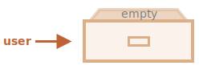

# 객체

<info:types> 챕터에서 배웠듯이, 자바스크립트에는 일곱 가지 데이터 타입이 있습니다. 그중 여섯 개의 타입은 오직 (문자열, 숫자 등) 하나만 담을 수 있으므로 "원시 타입(primitive type)"이라 부릅니다.

이와 달리, 객체는 다양한 데이터와 복잡한 개체들의 키 컬렉션을 저장할 수 있습니다. 객체는 자바스크립트의 거의 모든 면에 스며들어 있습니다. 그러므로 깊은 내용을 학습하기 전에 먼저 객체를 이해해야 합니다.

객체는 부가적인 *프로퍼티(properties)* 리스트와 함께 중괄호 `{…}`를 이용하여 만들 수 있습니다. 프로퍼티는 "키(key): 값(value)"의 쌍을 의미합니다. 여기서 `키`("프로퍼티 이름"으로도 불립니다)는 문자열이며, `값`으로는 무엇이든지 올 수 있습니다.

객체는 각각 이름이 적힌 파일을 보관하는 서랍장으로 비유할 수 있습니다. 모든 자료는 파일 안에서 키를 기준으로 분류되어 저장됩니다. 키를 이용하면 파일을 찾거나 추가/삭제하는 일이 쉽습니다.


빈 객체("빈 서랍장")는 두 방식 중 하나를 사용해 만들 수 있습니다.:

```js
let user = new Object(); // "객체 생성자" 문법
let user = {};  // "객체 리터럴" 문법
```



일반적으로, 중괄호 `{...}`를 이용해 객체를 만듭니다. 이 선언 방식을 *객체 리터럴*이라고 합니다.

## 리터럴과 프로퍼티

"키: 값" 쌍의 형태로 `{...}` 안에 프로퍼티를 직접 넣을 수 있습니다.

```js
let user = {     // 객체
  name: "John",  // "name" 키에 "John" 값을 저장
  age: 30        // "age" 키에 30 값을 저장
};
```

프로퍼티의 `":"` 왼쪽엔 ("이름" 또는 "식별자"라고도 불리는) 키가 있고, 오른쪽에는 값이 있습니다.

`user` 객체에는 두 프로퍼티가 있습니다.:

1. 첫 번째 프로퍼티엔 `"name"`이라는 이름과 `"John"`이라는 값이 있습니다.
2. 두 번째 프로퍼티엔 `"age"`라는 이름과 `30`이라는 값이 있습니다.

`user` 객체를 "name"과 "age"라는 이름표가 붙은 두 개의 파일이 담긴 서랍장이라고 생각할 수 있습니다.


서랍장에 언제든 파일을 추가, 삭제할수 있고, 파일을 꺼내 읽을 수도 있습니다.

마침표 표기법을 이용하면 프로퍼티 값에 접근할 수 있습니다.:

```js
// 객체의 프로퍼티 값 얻기
alert( user.name ); // John
alert( user.age ); // 30
```

프로퍼티 값엔 모든 데이터 타입이 허용됩니다. boolean 타입의 값을 가진 프로퍼티를 추가해봅시다.:

```js
user.isAdmin = true;
```


`delete` 연산자를 이용해 프로퍼티를 삭제할 수 있습니다.:

```js
delete user.age;
```


복수의 단어로 이루어진 프로퍼티 이름을 사용할 수도 있는데, 이때는 반드시 따옴표로 단어들을 묶어줘야 합니다.:

```js
let user = {
  name: "John",
  age: 30,
  "likes birds": true  // 여러 단어로 된 프로퍼티 이름은 따옴표로 묶어야합니다.
};
```


마지막 프로퍼티는 쉼표로 끝날 수도 있습니다.:
```js
let user = {
  name: "John",
  age: 30*!*,*/!*
}
```
이것을 "trailing(자국이 있는)" 또는 "hanging(매달리는)" 쉼표라고 부릅니다. 이 쉼표가 있으면 모든 줄이 유사한 모습을 갖게 되어 프로퍼티를 쉽게 추가/삭제/이동할 수 있습니다.

## 대괄호

여러 단어로 이루어진 프로퍼티 이름을 사용하면, 마침표 표기법을 사용할 수 없습니다.:

```js run
// 이 코드는 syntax 에러를 발생시킵니다.
user.likes birds = true
```

마침표는 키가 유효한 변수 식별자일 때만 사용할 수 있기 때문입니다. 스페이스를 포함한 다른 제약들이 없을 때 유효한 변수 식별자가 됩니다.

"대괄호 표기법"이라는 대안을 사용하면 키에 모든 문자열을 사용할 수 있습니다.:

```js run
let user = {};

// set
user["likes birds"] = true;

// get
alert(user["likes birds"]); // true

// delete
delete user["likes birds"];
```

이제 모든 것이 제대로 작동합니다. 대괄호 안의 문자열이 따옴표로 묶인다는 사실에 주의하세요(따옴표 타입은 상관없습니다).

대괄호 표기법을 사용하면 아래 코드에서처럼 -- 리터럴 문자열이 아니라 -- 변수 같은 모든 표현식의 결과를 프로퍼티 이름으로 사용할 수 있습니다.:

```js
let key = "likes birds";

// user["likes birds"] = true; 와 같습니다.
user[key] = true;
```

여기서 변수 `key`는 런타임에 계산되거나 사용자 입력값에 따라 변경할 수 있습니다. 프로퍼티에 접근할 때 변경된 key를 사용합니다. 이 방법은 상당한 유연성을 제공합니다.

예를 들어:

```js run
let user = {
  name: "John",
  age: 30
};

let key = prompt("What do you want to know about the user?", "name");

// 변수로 접근
alert( user[key] ); // John (if enter "name")
```

마침표 표기법은 이런 방식으로 사용할 수 없습니다.

```js run
let user = {
  name: "John",
  age: 30
};

let key = "name";
alert( user.key ) // undefined
```

### 계산된 프로퍼티(Computed properties)

객체 리터럴 안에 대괄호를 사용할 수 있습니다. 이를 *계산된 프로퍼티(computed properties)* 라고 부릅니다.

예시:

```js run
let fruit = prompt("Which fruit to buy?", "apple");

let bag = {
*!*
  [fruit]: 5, // fruit 변수로부터 프로퍼티 이름을 받아옵니다.
*/!*
};

alert( bag.apple ); // 만약 fruit="apple" 이라면 5를 보여줍니다.
```

계산된 프로퍼티의 의미는 단순합니다. `[fruit]`은 프로퍼티 이름을 `fruit`으로부터 가져와야 한다는 것을 의미합니다.

따라서, 만약 사용자가 프롬프트 대화상자에 `"apple"`을 입력했다면, `bag`은 `{apple: 5}`가 될 것입니다.

근본적으로 이와 같은 방식으로 실행됩니다.:
```js run
let fruit = prompt("Which fruit to buy?", "apple");
let bag = {};

// fruit 변수로부터 프로퍼티 이름을 가져옵니다.
bag[fruit] = 5;
```

...하지만 앞서 봤던 코드가 더 근사해 보이네요.

대괄호 안에 더욱 복잡한 표현식을 사용할 수 있습니다.:

```js
let fruit = 'apple';
let bag = {
  [fruit + 'Computers']: 5 // bag.appleComputers = 5
};
```

대괄호 표기법은 마침표 표기법보다 훨씬 더 강력합니다. 어느 프로퍼티 이름이나 변수도 사용할 수 있게 해줍니다. 하지만 작성하기에 더 번거로운 면이 있습니다.

그래서 프로퍼티 이름이 이미 정해져 있고 간단할 때는 마침표 표기법을 사용합니다. 더 복잡한 무언가가 필요하면 대괄호 표기법을 사용하면 됩니다.


````smart header="예약어를 프로퍼티 이름으로 사용할 수 있습니다."
변수 이름엔 "for", "let", "return" 등과 같은 자바스크립트 예약어를 사용할 수 없습니다.

하지만 객체 프로퍼티엔 이런 제약이 없습니다. 모든 이름이 가능합니다.:

```js run
let obj = {
  for: 1,
  let: 2,
  return: 3
};

alert( obj.for + obj.let + obj.return );  // 6
```

기본은 모든 이름을 허용하지만, 한 가지 예외사항이 있습니다. `"__proto__"`은 역사적인 이유로 특별한 취급을 받습니다. 예를 들어, 객체가 아닌 값에 이 이름을 사용할 수 없습니다.:

```js run
let obj = {};
obj.__proto__ = 5;
alert(obj.__proto__); // [object Object], 의도한 대로 작동하지 않습니다.
```

위 코드에서 볼 수 있듯이 할당한 원시값 `5`는 무시됩니다.

객체에 임의의 키-값 쌍을 저장하고 사용자 키를 변경할 수 있도록 허용하면, 버그를 만들어내거나 취약성의 원인으로 작용할 수있습니다.

사용자는 `__proto__`를 키로 지정할 수도 있는데, 이 할당 로직은 (위에서 봤듯이) 작동하지 않을 것입니다.

객체에서 `__proto__` 프로퍼티를 다루는 방법이 존재하는데, 이에 대해선 추후에 다룰 예정입니다. 그 전에 객체에 대해 더 알아야 할 필요가 있습니다.

문자열 이외에 다른 타입의 키를 지원하는 [Map](info:map-set-weakmap-weakset)이라는 자료구조도 존재하는데, 이에 대해선 <info:map-set-weakmap-weakset>에서 다루도록 하겠습니다.
````


## 프로퍼티 값 축약(Property value shorthand)

실제 코드에서는 프로퍼티 이름(키)에 대한 값으로 기존의 변수를 자주 사용합니다.

예를 들어:

```js run
function makeUser(name, age) {
  return {
    name: name,
    age: age
    // ...등등
  };
}

let user = makeUser("John", 30);
alert(user.name); // John
```

위 예제에서, 프로퍼티들은 변수와 같은 이름을 갖고 있습니다. 변수로 프로퍼티를 만드는 사례는 매우 흔한데, 이를 더 빠르게 할 수 있게 해주는 *프로퍼티 값 축약(property value shorthand)*이 있습니다.

다음과 같이 `name:name` 대신 `name`만 적으면 됩니다.:

```js
function makeUser(name, age) {
*!*
  return {
    name, // name: name 와 같습니다.
    age   // age: age 와 같습니다.
    // ...
  };
*/!*
}
```

한 객체 안에서 일반적인 표현과 축약 표현을 함께 사용할 수 있습니다.:

```js
let user = {
  name,  // name: name과 같습니다.
  age: 30
};
```

## 존재 확인

어느 프로퍼티에나 접근 가능하다는 것은 객체의 중요한 특징입니다. 프로퍼티가 존재하지 않더라도 에러가 발생하지 않습니다! 존재하지 않는 프로퍼티에 접근하면 `undefined`를 반환할 뿐이지요. 이를 이용하면 프로퍼티의 존재 여부를 테스트할 수 있습니다. 프로퍼티에 접근해보고 undefined인지 확인해보면 되니까요.:

```js run
let user = {};

alert( user.noSuchProperty === undefined ); // true는 "프로퍼티가 존재하지 않음"을 의미합니다.
```

프로퍼티의 존재를 확인하기 위해선 특별한 연산자인 `"in"`을 사용할 수도 있습니다.

문법은 다음과 같습니다.:
```js
"key" in object
```

예:

```js run
let user = { name: "John", age: 30 };

alert( "age" in user ); // true, user.age가 존재합니다.
alert( "blabla" in user ); // false, user.blabla가 존재하지 않습니다.
```

`in`의 왼쪽에는 *프로퍼티 이름*이 있어야 한다는 점에 주의하세요. 이 이름은 보통 따옴표로 묶인 문자열입니다.

따옴표를 생략하면, 그 이름을 가진 변수의 존재를 확인해보라는 의미가 됩니다. 예를 들어:

```js run
let user = { age: 30 };

let key = "age";
alert( *!*key*/!* in user ); // true, 변수 key에 저장된 값을 가져와서 프로퍼티의 존재를 확인합니다.
```

````smart header="`undefined` 값을 가진 프로퍼티에 \"in\" 사용하기"
일치를 확인하는 `"=== undefined"` 는 잘 작동합니다. 그러나 이것이 잘 작동하지 않는 특별한 경우도 있는데, 이 경우에 `"in"`은 올바르게 작동합니다.

It's when an object property exists, but stores `undefined`:

```js run
let obj = {
  test: undefined
};

alert( obj.test ); // undefined, 그런 프로퍼티가 존재하지 않는 걸까요?

alert( "test" in obj ); // true, 프로퍼티는 존재합니다!
```


위 코드에서, `obj.test` 프로퍼티는 엄밀히 말해서 존재합니다. 그래서 `in` 연산자가 올바르게 작동합니다.

보통 `undefined` 을 할당하는 경우는 많지 않아 이런 상황은 거의 일어나지 않습니다. "알려지지 않았거나(unknown)" "비어 있는(empty)" 값엔 주로 `null`을 사용합니다. 그래서 위 코드상의 `in` 연산자는 이국적인 손님과도 같습니다.
````

## "for..in" 반복문

객체의 모든 키를 탐색할 수 있는 특별한 반복문인 `for..in`가 있습니다. 이것은 이전에 배웠던 `for(;;)` 와는 완전히 다릅니다.

문법:

```js
for (key in object) {
  // 객체 프로퍼티 내 각 키에 대해 본문(body)을 실행합니다.
}
```

예를 들어, `user`의 모든 프로퍼티를 출력해봅시다.:

```js run
let user = {
  name: "John",
  age: 30,
  isAdmin: true
};

for (let key in user) {
  // keys
  alert( key );  // name, age, isAdmin
  // values for the keys
  alert( user[key] ); // John, 30, true
}
```

여기서 `let key`와 같이 모든 "for"문은 반복문 안에서 사용할 수 있는 변수를 선언할 수 있게 해줍니다.

Also, we could use another variable name here instead of `key`. For instance, `"for (let prop in obj)"` is also widely used.


### 객체의 정렬 방식

객체는 정렬되어 있을까요? 만약 객체에 반복문을 수행하면 프로퍼티가 더해진 순서대로 프로퍼티를 얻을 수 있을까요? 그리고 이 결과를 신뢰할 수 있을까요?

짧게 대답하자면 객체는 "특별한 방식으로 정렬되어 있다" 입니다. 다시 말해, 정수 프로퍼티는 정렬되어 있고, 다른 프로퍼티는 생성된 순서대로 나타납니다. 자세히 살펴보도록 합니다.

전화번호 코드가 담긴 객체가 있다고 해봅시다.:

```js run
let codes = {
  "49": "Germany",
  "41": "Switzerland",
  "44": "Great Britain",
  // ..,
  "1": "USA"
};

*!*
for (let code in codes) {
  alert(code); // 1, 41, 44, 49
}
*/!*
```

사용자에게 선택 목록을 제안하기 위해 이 객체를 사용할 수 있습니다. 독일인이 주 사용자인 사이트를 만들고 있다면 아마 `49`가 맨 앞에 오기를 원할 것입니다.

하지만 코드를 실행해 보면 예상과는 전히 다른 결과를 보게 됩니다.:

- USA (1)이 첫 번째로 등장합니다.
- 그 뒤로 Switzerland (41)가 등장하고 나머지가 뒤따릅니다.

전화번호 코드는 정수이기 때문에 오름차순으로 정렬되므로, `1, 41, 44, 49`와 같은 결과를 보게 됩니다.

````smart header="정수 프로퍼티? 그게 무엇인가요?"
"정수 프로퍼티"는 변함없이 숫자로부터 변환되거나 숫자로 변환될 수 있는 문자열을 의미합니다.

그래서 "49"는 정수 프로퍼티 이름이 될 수 있습니다. "49"를 정수로 변환하거나 변환한 정수를 다시 문자열로 바꿔도 여전히 같은 모습을 갖고 있기 때문입니다. 하지만 "+49"와 "1.2"는 다릅니다.:

```js run
// Math.trunc 는 소수부를 제거하는 내장 함수입니다
alert( String(Math.trunc(Number("49"))) ); // "49", 같습니다, 정수 프로퍼티입니다.
alert( String(Math.trunc(Number("+49"))) ); // "49", "+49"와 다릅니다 ⇒ 정수 프로퍼티가 아닙니다.
alert( String(Math.trunc(Number("1.2"))) ); // "1", "1.2"와 다릅니다 ⇒ 정수 프로퍼티가 아닙니다.
```
````

...반면에 프로퍼티 키가 정수가 아닌 경우는, 프로퍼티가 생성된 순서대로 나열됩니다. 예를 들어:

```js run
let user = {
  name: "John",
  surname: "Smith"
};
user.age = 25; // 프로퍼티를 하나 추가합니다.

*!*
// 정수 프로퍼티가 아닌 프로퍼티는 생성된 순서로 나열됩니다.
*/!*
for (let prop in user) {
  alert( prop ); // name, surname, age
}
```

따라서, 전화번호 코드와 관련된 문제를 해결하기 위해 코드가 정수가 안 되도록 속임수를 쓸 수 있습니다. 각 코드 앞에 `"+"`를 추가하는 것으로 말이죠.

Like this:

```js run
let codes = {
  "+49": "Germany",
  "+41": "Switzerland",
  "+44": "Great Britain",
  // ..,
  "+1": "USA"
};

for (let code in codes) {
  alert( +code ); // 49, 41, 44, 1
}
```

이제 코드는 의도한 대로 작동합니다.

## 참조에 의한 복사

객체와 원시 타입의 근본적인 차이 중 하나는 객체는 "참조에 의해" 저장되고 복사된다는 것입니다.

원시값: 문자열, 숫자, boolean(논리 자료형) -- 은 "온전한 값 자체로" 할당되고 복사됩니다.

예:

```js
let message = "Hello!";
let phrase = message;
```

코드를 실행하면, 두 개의 독립적인 변수가 만들어지고, 각 변수는 `"Hello!"`라는 문자열을 값으로 갖습니다.


객체는 이와 다릅니다.

**변수엔 객체 자체가 저장되는 것이 아니라, 객체의 "메모리상의 주소", 즉 객체에 대한 "참조값"이 저장됩니다.**

여기 객체를 나타내는 그림이 있습니다.:

```js
let user = {
  name: "John"
};
```


객체는 메모리의 어딘가에 저장되어 있습니다. 그리고 변수 `user`는 객체에 대한 참조값을 갖고 있습니다.

**객체 변수가 복사될 때 -- 즉, 객체의 참조값이 복사될 때, 그 객체는 복제되지 않습니다.**

객체를 서랍장에 비유하면, 변수는 서랍장을 열기 위한 열쇠라고 생각할 수 있습니다. 변수 복사는 열쇠를 복제하는 것이지, 서랍장 자체를 복제하지 않습니다.

예:

```js no-beautify
let user = { name: "John" };

let admin = user; // 참조를 복사합니다.
```

변수는 두개이고, 각 변수는 같은 객체에 대한 참조값을 갖습니다.:


서랍장에 접근하거나 서랍장의 내용물을 변경하기 위해 둘 중 아무 변수나 사용하면 됩니다.:

```js run
let user = { name: 'John' };

let admin = user;

*!*
admin.name = 'Pete'; // "admin" 참조값에 의해 변경됨
*/!*

alert(*!*user.name*/!*); // 'Pete', 변경사항을 "user" 참조값으로 확인
```

위 예제를 통해 객체는 오직 하나만 존재한다는 사실을 확인했습니다. 두 개의 키가 있는 서랍장이 있고, 서랍장을 열기 위해 하나의 키(`admin`)를 사용했습니다. 추후 다른 키(`user`)로 변경사항을 확인할 수 있습니다.

### 참조에 의한 비교

객체에 있어서 동등 연산자 `==` 와 일치 연산자 `===` 는 완전히 같은 방식으로 작동합니다.

**두 객체가 같은 객체일 때만 그들은 동등합니다.**

예를 들어, 두 변수가 같은 객체를 참조하면 그들은 동등합니다.:

```js run
let a = {};
let b = a; // 참조에 의한 복사

alert( a == b ); // true, 두 변수는 같은 객체를 참조합니다.
alert( a === b ); // true
```

여기서 독립된 두 객체는 둘 다 빈 객체일지라도 동등하지 않습니다.:

```js run
let a = {};
let b = {}; // 독립된 두 객체

alert( a == b ); // false
```

`obj1 > obj2`와 같은 비교나 원시값과의 비교 `obj == 5`에서 객체는 원시값으로 변환됩니다. 객체가 어떻게 원시 값으로 변환되는지에 대해선 곧 학습할 것입니다. 다만 이러한 비교가 필요한 경우는 거의 없으며, 보통 코딩 실수에 의한 결과로 이런 비교가 이뤄집니다.

### Const 객체

`const`로 선언된 객체는 *변경될 수 있습니다.*

예:

```js run
const user = {
  name: "John"
};

*!*
user.age = 25; // (*)
*/!*

alert(user.age); // 25
```

It might seem that the line `(*)` would cause an error, but no, there's totally no problem. That's because `const` fixes only value of `user` itself. And here `user` stores the reference to the same object all the time. The line `(*)` goes *inside* the object, it doesn't reassign `user`.

만약 `user`를 다른 어떤 것으로 재할당하려 하면 `const`가 에러를 발생시킬 것입니다. 예:

```js run
const user = {
  name: "John"
};

*!*
// 에러 (user를 재할당할 수 없습니다.)
*/!*
user = {
  name: "Pete"
};
```

...만약 변하지 않는 객체 프로퍼티를 만들고 싶다면 어떻게 해야 할까요? `user.age = 25`가 에러를 일으키도록 말이죠. 물론 가능합니다. <info:property-descriptors> 챕터에서 이에 대한 내용을 다루도록 하겠습니다.

## 복사와 병합, Object.assign

객체 변수를 복사하면 같은 객체에 대한 참조값이 하나 더 만들진다는 걸 배웠습니다.

그런데 만약 객체를 복제하고 싶다면 어떻게 해야 할까요? 독립적인 복사본인 복제 객체를 만들고 싶다면요?

할 수는 있습니다만, 조금 어렵습니다. 자바스크립트에는 이를 위한 내장 메서드가 없기 때문입니다. 사실, 복제가 필요한 일은 거의 없습니다. 대부분 참조에 의한 복사가 적절합니다.

그러나 정말 복제가 필요하다면, 새로운 객체를 만든 다음 기존 객체의 프로퍼티들을 순회하면서 원시 수준의 프로퍼티까지 복사하여 기존 객체 구조를 그대로 복제하면 됩니다.

이렇게 말이죠.:

```js run
let user = {
  name: "John",
  age: 30
};

*!*
let clone = {}; // 새로운 빈 객체

// 빈 객체에 모든 user 프로퍼티를 복사해 넣어봅시다.
for (let key in user) {
  clone[key] = user[key];
}
*/!*

// 이제 clone은 완전히 독립적인 복사본입니다.
clone.name = "Pete"; // clone의 데이터를 변경했습니다.

alert( user.name ); // 원본 객체에는 여전히 John이 있습니다.
```

[Object.assign](mdn:js/Object/assign)를 사용하는 방법도 있습니다.

문법은 다음과 같습니다.:

```js
Object.assign(dest, [src1, src2, src3...])
```

- 인수 `dest` 와 `src1, ..., srcN` (필요에 따라 얼마든지 올 수 있습니다)는 객체입니다.
- 모든 객체 `src1, ..., srcN` 의 프로퍼티를 `dest`에 복사합니다. 다시 말해, 두 번째 인수부터 할당된 모든 객체의 프로퍼티가 첫 번째 인수 객체로 복사됩니다. 복사 이후 `dest`를 반환합니다.

여러 객체를 하나의 객체로 병합하기 위해 이 메서드를 사용할 수 있습니다.:
```js
let user = { name: "John" };

let permissions1 = { canView: true };
let permissions2 = { canEdit: true };

*!*
// permissions1와 permissions2의 모든 프로퍼티를 user로 복사합니다.
Object.assign(user, permissions1, permissions2);
*/!*

// user = { name: "John", canView: true, canEdit: true }
```

만약 복사를 받는 객체 (`user`)가 이미 같은 이름의 프로퍼티를 갖고 있다면, 새로운 값으로 덮어 쓰입니다.:

```js
let user = { name: "John" };

// name을 덮어쓰고 isAdmin을 추가합니다.
Object.assign(user, { name: "Pete", isAdmin: true });

// user = { name: "Pete", isAdmin: true }
```

반복문 대신 `Object.assign`을 사용하면 복제를 간단히 할 수도 있습니다.

```js
let user = {
  name: "John",
  age: 30
};

*!*
let clone = Object.assign({}, user);
*/!*
```

이 코드는 `user`의 모든 프로퍼티를 빈 객체에 복사한 뒤 객체를 반환합니다. 반복문을 사용한 것과 같은 작업이지만 코드가 더 짧아집니다.

지금까진 `user`의 모든 프로퍼티가 원시값인 경우만 가정했습니다. 그러나 프로퍼티는 다른 객체에 대한 참조값일 수도 있습니다. 이 경우는 어떻게 해야 할까요?

아래와 같이 말이죠:
```js run
let user = {
  name: "John",
  sizes: {
    height: 182,
    width: 50
  }
};

alert( user.sizes.height ); // 182
```

이런 경우는 `clone.sizes = user.sizes` 로 복사하는 것만으론 충분하지 않습니다. `user.sizes` 는 객체이기 때문에 참조값이 복사가 됩니다. 그래서 `clone`과 `user`는 같은 sizes를 공유하게 됩니다.:

아래와 같이 말이죠:
```js run
let user = {
  name: "John",
  sizes: {
    height: 182,
    width: 50
  }
};

let clone = Object.assign({}, user);

alert( user.sizes === clone.sizes ); // true, 같은 객체입니다.

// user와 clone는 sizes를 공유합니다.
user.sizes.width++;       // 한 객체에서 프로퍼티를 변경합니다.
alert(clone.sizes.width); // 51, 다른 객체에서 변경 사항을 확인할 수 있습니다.
```

이 문제를 해결하려면, `user[key]`의 각 값을 검사하면서 만약 그 값이 객체인지를 확인하고, 객체라면 객체의 구조도 복사를 하는 반복문을 사용해야 합니다. 이 과정을 "깊은 복사(deep cloning)"라고 합니다.

위 사례를 비롯해 더 복잡한 케이스들을 처리하는 깊은 복사 표준 알고리즘 [Structured cloning algorithm](http://w3c.github.io/html/infrastructure.html#safe-passing-of-structured-data)이 있습니다. 자바스크립트 라이브러리 [lodash](https://lodash.com)의 [_.cloneDeep(obj)](https://lodash.com/docs#cloneDeep) 메서드를 사용하면 밑바닥부터 직접 구현하지 않고도 깊은 복사를 할 수 있습니다.


## 요약

객체는 특별한 기능이 있는 연관 배열입니다.

객체는 (키-값 쌍의) 프로퍼티을 저장합니다.:
- 프로퍼티 키는 문자열이나 심볼(Symbol)이어야 합니다 (보통 문자열을 사용합니다).
- 값은 어느 타입이나 가능합니다.

아래 방법으로 프로퍼티에 접근할 수 있습니다.:
- 마침표 표기법: `obj.property`.
- 대괄호 표기법 `obj["property"]`. 대괄호 표기법을 사용하면 `obj[varWithKey]`처럼 변수로부터 킷값을 가져올 수 있습니다.

Additional operators:
- To delete a property: `delete obj.prop`.
- To check if a property with the given key exists: `"key" in obj`.
- To iterate over an object: `for (let key in obj)` loop.

객체는 참조에 의해 할당되고 복사됩니다. 다시 말해, 변수는 "객체 값" 자체를 저장하지 않고 (메모리상의 주소인) "참조"를 저장합니다. 그러므로 객체 변수를 복사하거나 함수의 인자로 넘겨줄 때, 객체가 아닌 객체의 참조가 전달됩니다. 복사된 참조를 이용한 (프로퍼티 추가/삭제와 같은) 모든 작업은 하나의 객체에 수행됩니다.

"진정한 복사본" (복제) 을 만들려면 `Object.assign`이나  [_.cloneDeep(obj)](https://lodash.com/docs#cloneDeep)를 사용할 수 있습니다.

이 챕터에서 학습한 객체는 "순수 객체(plain object)" 또는 `객체(Object)`라고 합니다.

자바스크립트에는 이외에도 다양한 종류의 객체가 있습니다.:

- 정렬된 데이터 컬렉션을 저장하는 `Array`
- 날짜와 시간 정보를 저장하는 `Date`
- 에러 정보를 저장하는 `Error`
- ... 등등

각 개체마다 있는 특별한 기능은 추후 배을 예정입니다. 사람들은 종종 "Array 타입"이나 "Data 타입"이라는 용어를 쓸 때가 있습니다. 하지만 Array와 Data는 독립적인 타입이 아니라 "객체" 데이터 타입에 속합니다. 다양한 방식으로 객체를 확장해서 만들어 진 또 다른 객체인 것입니다.

자바스크립트에서 객체는 매우 강력합니다. 지금까진 객체라는 거대한 주제의 극히 일부만 다루었습니다. 튜토리얼의 뒤쪽에서 객체를 더 깊게 다루면서 더 많은 것을 학습하도록 하겠습니다.
