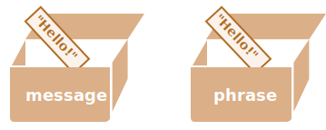
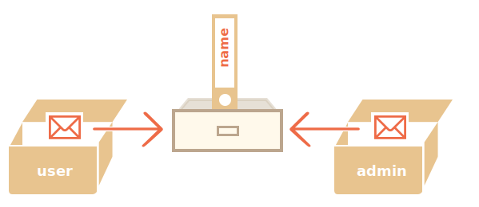

# 참조에 의한 객체 복사

객체와 원시 타입의 근본적인 차이 중 하나는 객체는 '참조에 의해(by reference)' 저장되고 복사된다는 것입니다.

원시값(문자열, 숫자, 불린 값)은 '값 그대로' 저장·할당되고 복사되는 반면에 말이죠.

값을 복사할 때 내부에서 어떤 일이 일어나는지 살펴보면 이해하기 쉽습니다.

먼저 문자열 같은 원시값부터 살펴봅시다.

아래에선 `message`의 복사본을 `phrase`에 넣습니다.

```js
let message = "Hello!";
let phrase = message;
```

예시를 실행하면 두 개의 독립된 변수에 각각 문자열 `"Hello!"`가 저장됩니다.



당연한 결과처럼 보이죠?

그런데 객체의 동작 방식은 이와 다릅니다.

**변수엔 객체가 그대로 저장되는 것이 아니라, 객체가 저장되어있는 '메모리 주소'인 객체에 대한 '참조 값'이 저장됩니다.**

그림을 통해 변수 user에 객체를 할당할 때 무슨 일이 일어나는지 알아봅시다.

```js
let user = {
  name: "John"
};
```

실제로는 메모리에 다음과 같이 저장됩니다.


객체는 메모리 어딘가(그림 오른쪽)에 저장되고, 변수 `user`(그림 왼쪽)엔 객체를 '참조'할 수 있는 값이 저장됩니다.

객체 변수 `user`는 객체 주소가 적힌 종이 한 장이라고 생각할 수 있습니다.

`user.name`처럼 객체를 대상으로 작업을 수행하면 자바스크립트 엔진은 그 주소로 이동해 실제 객체에 작업을 수행합니다.

이 점이 중요한 이유를 살펴봅시다.

**객체가 할당된 변수를 복사할 땐 객체의 참조 값이 복사되고 객체는 복사되지 않습니다.**

예시:

```js no-beautify
let user = { name: "John" };

let admin = user; // 참조값을 복사함
```

변수는 두 개이지만 각 변수엔 동일 객체에 대한 참조 값이 저장되죠.



따라서 객체에 접근하거나 객체를 조작할 땐 여러 변수를 사용할 수 있습니다.

```js run
let user = { name: 'John' };

let admin = user;

*!*
admin.name = 'Pete'; // 'admin' 참조 값에 의해 변경됨
*/!*

alert(*!*user.name*/!*); // 'Pete'가 출력됨. 'user' 참조 값을 이용해 변경사항을 확인함
```

객체를 서랍장에 비유하면, 변수는 서랍장을 열 수 있는 열쇠라고 할 수 있습니다. 서랍장은 하나뿐이지만, 이를 여는 열쇠는 두 개 있는 셈입니다. 그중 하나인 `admin`으로 서랍장을 열어 내용을 변경하면, 나중에 다른 열쇠인 `user`로 같은 서랍장을 열었을 때도 변경된 내용을 확인할 수 있습니다.

### 참조에 의한 비교

객체 비교 시 동등 연산자 `==`와 일치 연산자 `===`는 동일하게 동작합니다.

**비교 시 피연산자인 두 객체가 동일한 객체인 경우에 참을 반환하죠.**

두 변수가 같은 객체를 참조하는 예시를 살펴봅시다. 일치·동등 비교 모두에서 참이 반환됩니다.

예를 들어 아래 코드에서 `a`와 `b`는 같은 객체를 참조하므로 동등하다고 평가됩니다.

```js run
let a = {};
let b = a; // 참조에 의한 복사

alert( a == b ); // true, 두 변수는 같은 객체를 참조합니다.
alert( a === b ); // true
```

다른 예시를 살펴봅시다. 두 객체 모두 비어있다는 점에서 같아 보이지만, 독립된 객체이기 때문에 일치·동등 비교하면 거짓이 반환됩니다.

```js run
let a = {};
let b = {}; // 독립된 두 객체

alert( a == b ); // false
```

`obj1 > obj2` 같은 대소 비교나 `obj == 5` 같은 원시값과의 비교에선 객체가 원시형으로 변환됩니다. 객체가 어떻게 원시형으로 변하는지에 대해선 곧 학습할 예정인데, 이러한 비교(객체끼리의 대소 비교나 원시값과 객체를 비교하는 것)가 필요한 경우는 매우 드물긴 합니다. 대개 코딩 실수 때문에 이런 비교가 발생합니다.

````smart header="상수 객체는 수정될 수 있습니다."
객체가 참조로 저장된다는 사실 때문에 생기는 중요한 부수 효과가 있습니다. `const`로 선언된 객체도 *수정할 수 있습니다*.

예시:

```js run
const user = {
  name: "John"
};

*!*
user.name = "Pete"; // (*)
*/!*

alert(user.name); // Pete
```

`(*)`로 표시한 줄에서 오류가 발생할 것처럼 보일 수 있지만 그렇지 않습니다. `user`의 값은 상수이므로 항상 같은 객체를 참조해야 하지만, 그 객체의 프로퍼티는 자유롭게 변경할 수 있습니다.

다시 말해, `const user`는 `user=...`처럼 `user` 전체에 새 값을 대입하려고 할 때만 오류를 일으킵니다.

그렇지만 객체 프로퍼티까지 상수로 만들어야 한다면 완전히 다른 방법을 써야 합니다. 이 방법은 <info:property-descriptors> 챕터에서 다룹니다.
````

## 객체 복사, 병합과 Object.assign [#cloning-and-merging-object-assign]

객체가 할당된 변수를 복사하면 동일한 객체에 대한 참조 값이 하나 더 만들어진다는 걸 배웠습니다.

그런데 객체를 복제하고 싶다면 어떻게 해야 할까요? 기존에 있던 객체와 똑같으면서 독립적인 객체를 만들고 싶다면 말이죠.

방법은 있는데 자바스크립트는 객체 복제 내장 메서드를 지원하지 않기 때문에 조금 어렵습니다. 사실 객체를 복제해야 할 일은 거의 없습니다. 참조에 의한 복사로 해결 가능한 일이 대다수이죠.

정말 복제가 필요한 상황이라면 새로운 객체를 만든 다음 기존 객체의 프로퍼티들을 순회해 원시 수준까지 프로퍼티를 복사하면 됩니다.

아래와 같이 말이죠.

```js run
let user = {
  name: "John",
  age: 30
};

*!*
let clone = {}; // 새로운 빈 객체

// 빈 객체에 user 프로퍼티 전부를 복사해 넣습니다.
for (let key in user) {
  clone[key] = user[key];
}
*/!*

// 이제 clone은 완전히 독립적인 복제본이 되었습니다.
clone.name = "Pete"; // clone의 데이터를 변경합니다.

alert( user.name ); // 기존 객체에는 여전히 John이 있습니다.
```

[Object.assign](mdn:js/Object/assign)를 사용하는 방법도 있습니다.

문법과 동작 방식은 다음과 같습니다.

```js
Object.assign(dest, ...sources)
```

- 첫 번째 인수 `dest`는 목표로 하는 객체입니다.
- 이어지는 인수 `src1, ..., srcN`는 복사하고자 하는 객체입니다. `...`은 필요에 따라 얼마든지 많은 객체를 인수로 사용할 수 있다는 것을 나타냅니다.
- 객체 `src1, ..., srcN`의 프로퍼티를 `dest`에 복사합니다. `dest`를 제외한 인수(객체)의 프로퍼티 전부가 첫 번째 인수(객체)로 복사됩니다.
- 마지막으로 `dest`를 반환합니다.

`assign` 메서드를 사용해 여러 객체를 하나로 병합하는 예시를 살펴봅시다.
```js run
let user = { name: "John" };

let permissions1 = { canView: true };
let permissions2 = { canEdit: true };

*!*
// permissions1과 permissions2의 프로퍼티를 user로 복사합니다.
Object.assign(user, permissions1, permissions2);
*/!*

// 이제 user = { name: "John", canView: true, canEdit: true }
alert(user.name); // John
alert(user.canView); // true
alert(user.canEdit); // true
```

목표 객체(`user`)에 동일한 이름을 가진 프로퍼티가 있는 경우엔 기존 값이 덮어씌워 집니다.

```js run
let user = { name: "John" };

Object.assign(user, { name: "Pete" });

alert(user.name); // user = { name: "Pete" }
```

`Object.assign`을 사용하면 반복문 없이도 간단하게 객체를 복사할 수 있습니다.

```js run
let user = {
  name: "John",
  age: 30
};

*!*
let clone = Object.assign({}, user);
*/!*

alert(clone.name); // John
alert(clone.age); // 30
```

예시를 실행하면 `user`에 있는 모든 프로퍼티가 빈 객체에 복사되고, 그 객체가 반환됩니다.

객체를 복제하는 다른 방법도 있습니다. 예를 들어 튜토리얼 뒷부분에서 다룰 [스프레드 문법](info:rest-parameters-spread)을 사용하면 `clone = {...user}`처럼 객체를 복제할 수 있습니다.

## 중첩 객체 복사

지금까진 `user`의 모든 프로퍼티가 원시값인 경우만 가정했습니다. 그런데 프로퍼티는 다른 객체에 대한 참조 값일 수도 있습니다. 이 경우는 어떻게 해야 할까요?

아래와 같이 말이죠.
```js run
let user = {
  name: "John",
  sizes: {
    height: 182,
    width: 50
  }
};

alert( user.sizes.height ); // 182
```

`clone.sizes = user.sizes`로 프로퍼티를 복사하는 것만으론 객체를 복제할 수 없습니다. `user.sizes`는 객체이기 때문에 참조 값이 복사되기 때문입니다. `clone.sizes = user.sizes`로 프로퍼티를 복사하면 `clone`과 `user`는 같은 sizes를 공유하게 됩니다.

아래와 같이 말이죠.

```js run
let user = {
  name: "John",
  sizes: {
    height: 182,
    width: 50
  }
};

let clone = Object.assign({}, user);

alert( user.sizes === clone.sizes ); // true, 같은 객체입니다.

// user와 clone은 sizes를 공유합니다.
user.sizes.width = 60;    // 한 객체에서 프로퍼티를 변경합니다.
alert(clone.sizes.width); // 60, 다른 객체에서 변경 사항을 확인할 수 있습니다.
```

이 문제를 해결해 `user`와 `clone`을 진짜로 독립된 객체로 만들려면 `user[key]`의 각 값을 검사하면서, 그 값이 객체인 경우 객체의 구조도 복제하는 반복문을 사용해야 합니다. 이런 방식을 '깊은 복사(deep cloning)' 또는 '구조화 복사(structured cloning)'라고 합니다. 깊은 복사를 구현한 [structuredClone](https://developer.mozilla.org/en-US/docs/Web/API/structuredClone) 메서드가 있습니다.

### structuredClone

`structuredClone(object)`을 호출하면 중첩 프로퍼티까지 모두 포함해 `object`가 복제됩니다.

앞선 예시에 이 메서드를 적용해 봅시다.

```js run
let user = {
  name: "John",
  sizes: {
    height: 182,
    width: 50
  }
};

*!*
let clone = structuredClone(user);
*/!*

alert( user.sizes === clone.sizes ); // false, 서로 다른 객체입니다.

// 이제 user와 clone은 완전히 독립적입니다.
user.sizes.width = 60;    // 한 객체에서 프로퍼티를 변경합니다.
alert(clone.sizes.width); // 50, 다른 객체에는 영향을 주지 않습니다.
```

`structuredClone` 메서드는 객체, 배열, 원시값 등 대부분의 자료형을 복제할 수 있습니다.

객체 프로퍼티가 객체 자신을 직접 또는 여러 참조를 거쳐 참조하는 순환 참조도 지원합니다.

예시:

```js run
let user = {};
// 순환 참조를 만들어 봅시다.
// user.me는 user 자신을 참조합니다.
user.me = user;

let clone = structuredClone(user);
alert(clone.me === clone); // true
```

보시다시피 `clone.me`는 `user`가 아니라 `clone`을 참조합니다. 순환 참조도 올바르게 복제된 것입니다.

다만 `structuredClone`이 실패하는 경우도 있습니다.

예를 들어 객체에 함수 프로퍼티가 있으면 실패합니다.

```js run
// 에러가 발생합니다.
structuredClone({
  f: function() {}
});
```

함수 프로퍼티는 지원되지 않습니다.

이처럼 복잡한 경우를 처리하려면 여러 복제 방법을 조합하거나 직접 코드를 작성해야 할 수 있습니다. 바퀴를 다시 발명하지 않으려면 자바스크립트 라이브러리 [lodash](https://lodash.com)의 [_.cloneDeep(obj)](https://lodash.com/docs#cloneDeep) 같은 기존 구현을 사용할 수도 있습니다.

## 요약

객체는 참조에 의해 할당되고 복사됩니다. 변수엔 '객체' 자체가 아닌 메모리상의 주소인 '참조'가 저장됩니다. 따라서 객체가 할당된 변수를 복사하거나 함수의 인자로 넘길 땐 객체가 아닌 객체의 참조가 복사됩니다.

그리고 복사된 참조를 이용한 모든 작업(프로퍼티 추가·삭제 등)은 동일한 객체를 대상으로 이뤄집니다.

객체의 '진짜 복사본'(클론)을 만들려면 '얕은 복사(shallow copy)'를 가능하게 해주는 `Object.assign`을 사용하거나(중첩 객체는 참조로 복사됩니다), '깊은 복사' 함수인 `structuredClone` 혹은 [_.cloneDeep(obj)](https://lodash.com/docs#cloneDeep) 같은 기존 구현을 사용할 수 있습니다.
