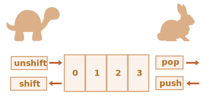

# 배열

키를 사용해 식별할 수 있는 값을 담은 컬렉션은 객체라는 자료구조를 이용해 저장하는데, 객체만으로도 다양한 작업을 할 수 있습니다.

그런데 개발을 진행하다 보면 첫 번째 요소, 두 번째 요소, 세 번째 요소 등과 같이 *순서가 있는 컬렉션*이 필요할 때가 생기곤 합니다. 사용자나 물건, HTML 요소 목록같이 일목요연하게 순서를 만들어 정렬하기 위해서 말이죠.

순서가 있는 컬렉션을 다뤄야 할 때 객체를 사용하면 순서와 관련된 메서드가 없어 그다지 편리하지 않습니다. 객체는 태생이 순서를 고려하지 않고 만들어진 자료구조이기 때문에 객체를 이용하면 새로운 프로퍼티를 기존 프로퍼티 '사이에' 끼워 넣는 것도 불가능합니다.

이럴 땐 순서가 있는 컬렉션을 저장할 때 쓰는 자료구조인 `배열`을 사용할 수 있습니다.

## 배열 선언

아래 두 문법을 사용하면 빈 배열을 만들 수 있습니다.

```js
let arr = new Array();
let arr = [];
```

대부분 두 번째 방법으로 배열을 선언하는데, 이때 대괄호 안에 초기 요소를 넣어주는 것도 가능합니다. 

```js
let fruits = ["사과", "오렌지", "자두"];
```

각 배열 요소엔 0부터 시작하는 숫자(인덱스)가 매겨져 있습니다. 이 숫자들은 배열 내 순서를 나타냅니다. 

배열 내 특정 요소를 얻고 싶다면 대괄호 안에 순서를 나타내는 숫자인 인덱스를 넣어주면 됩니다. 

```js run
let fruits = ["사과", "오렌지", "자두"];

alert( fruits[0] ); // 사과
alert( fruits[1] ); // 오렌지
alert( fruits[2] ); // 자두
```

같은 방법으로 요소를 수정할 수 있습니다.

```js
fruits[2] = '배'; // 배열이 ["사과", "오렌지", "배"]로 바뀜
```

새로운 요소를 배열에 추가하는 것도 가능합니다.

```js
fruits[3] = '레몬'; // 배열이 ["사과", "오렌지", "배", "레몬"]으로 바뀜
```

`length`를 사용하면 배열에 담긴 요소가 몇 개인지 알아낼 수 있습니다.  

```js run
let fruits = ["사과", "오렌지", "자두"];

alert( fruits.length ); // 3
```

`alert`를 사용해 요소 전체를 출력하는 것도 가능합니다.

```js run
let fruits = ["사과", "오렌지", "자두"];

alert( fruits ); // 사과,오렌지,자두
```

배열 요소의 자료형엔 제약이 없습니다.

예시:

```js run no-beautify
// 요소에 여러 가지 자료형이 섞여 있습니다.
let arr = [ '사과', { name: '이보라' }, true, function() { alert('안녕하세요.'); } ];

// 인덱스가 1인 요소(객체)의 name 프로퍼티를 출력합니다.
alert( arr[1].name ); // 이보라

// 인덱스가 3인 요소(함수)를 실행합니다.
arr[3](); // 안녕하세요.
```


````smart header="trailing 쉼표"
배열의 마지막 요소는 객체와 마찬가지로 쉼표로 끝날 수 있습니다.
```js
let fruits = [
  "사과",
  "오렌지",
  "자두"*!*,*/!*
];
```

trailing(길게 늘어지는) 쉼표를 사용하면 모든 줄의 생김새가 유사해지기 때문에 요소를 넣거나 빼기가 쉬워집니다.
````


## pop·push와 shift·unshift

[큐(queue)](https://en.wikipedia.org/wiki/Queue_(abstract_data_type))는 배열을 사용해 만들 수 있는 대표적인 자료구조로, 배열과 마찬가지로 순서가 있는 컬렉션을 저장하는 데 사용합니다. 큐에서 사용하는 주요 연산은 아래와 같습니다.

- `push` -- 맨 끝에 요소를 추가합니다.
- `shift` -- 제일 앞 요소를 꺼내 제거한 후 남아있는 요소들을 앞으로 밀어줍니다. 이렇게 하면 두 번째 요소가 첫 번째 요소가 됩니다.


배열엔 두 연산을 가능케 해주는 내장 메서드 `push`와 `pop`이 있습니다.

화면에 순차적으로 띄울 메시지를 비축해 놓을 자료 구조를 만들 때 큐를 사용하는 것처럼 큐는 실무에서 상당히 자주 쓰이는 자료구조입니다. 

배열은 큐 이외에 [스택(stack)](https://en.wikipedia.org/wiki/Stack_(abstract_data_type))이라 불리는 자료구조를 구현할 때도 쓰입니다.

스택에서 사용하는 연산은 아래와 같습니다.

- `push` -- 요소를 스택 끝에 집어넣습니다.
- `pop` -- 스택 끝 요소를 추출합니다.

스택은 이처럼 '한쪽 끝'에 요소를 더하거나 뺄 수 있게 해주는 자료구조입니다.

스택은 흔히 카드 한 벌과 비교됩니다. 쌓여있는 카드 맨 위에 새로운 카드를 더해주거나 빼는 것처럼 스택도 '한쪽 끝'에 요소를 집어넣거나 추출 할 수 있기 때문입니다.


스택을 사용하면 가장 나중에 집어넣은 요소가 먼저 나옵니다. 이런 특징을 줄여서 후입선출(Last-In-First-Out, LIFO)이라고 부릅니다. 반면 큐를 사용하면 먼저 집어넣은 요소가 먼저 나오기 때문에 큐는 선입선출(First-In-First-Out, FIFO) 자료구조라고 부릅니다.

자바스크립트 배열을 사용하면 큐와 스택 둘 다를 만들 수 있습니다. 이 자료구조들은 배열의 처음이나 끝에 요소를 더하거나 빼는 데 사용되죠.

이렇게 처음이나 끝에 요소를 더하거나 빼주는 연산을 제공하는 자료구조를 컴퓨터 과학 분야에선 [데큐(deque, Double Ended Queue)](https://en.wikipedia.org/wiki/Double-ended_queue)라고 부릅니다.

**아래는 배열 끝에 무언가를 해주는 메서드입니다.**

`pop`
: 배열 끝 요소를 제거하고, 제거한 요소를 반환합니다.

    ```js run
    let fruits = ["사과", "오렌지", "배"];

    alert( fruits.pop() ); // 배열에서 "배"를 제거하고 제거된 요소를 얼럿창에 띄웁니다.

    alert( fruits ); // 사과,오렌지
    ```

`push`
: 배열 끝에 요소를 추가합니다.

    ```js run
    let fruits = ["사과", "오렌지"];

    fruits.push("배");

    alert( fruits ); // 사과,오렌지,배
    ```

    `fruits.push(...)`를 호출하는 것은 `fruits[fruits.length] = ...`하는 것과 같은 효과를 보입니다.

**아래는 배열 앞에 무언가를 해주는 메서드입니다.**

`shift`
: 배열 앞 요소를 제거하고, 제거한 요소를 반환합니다.

    ```js run
    let fruits = ["사과", "오렌지", "배"];

    alert( fruits.shift() ); // 배열에서 "사과"를 제거하고 제거된 요소를 얼럿창에 띄웁니다.

    alert( fruits ); // 오렌지,배
    ```

`unshift`
: 배열 앞에 요소를 추가합니다.

    ```js run
    let fruits = ["오렌지", "배"];

    fruits.unshift('사과');

    alert( fruits ); // 사과,오렌지,배
    ```

`push`와 `unshift`는 요소 여러 개를 한 번에 더해줄 수도 있습니다.

```js run
let fruits = ["사과"];

fruits.push("오렌지", "배");
fruits.unshift("파인애플", "레몬");

// ["파인애플", "레몬", "사과", "오렌지", "배"]
alert( fruits );
```

## 배열의 내부 동작 원리

배열은 특별한 종류의 객체입니다. 배열 `arr`의 요소를 `arr[0]`처럼 대괄호를 사용해 접근하는 방식은 객체 문법에서 왔습니다. 다만 배열은 키가 숫자라는 점만 다릅니다.

숫자형 키를 사용함으로써 배열은 객체 기본 기능 이외에도 순서가 있는 컬렉션을 제어하게 해주는 특별한 메서드를 제공합니다. `length`라는 프로퍼티도 제공하죠. 그렇지만 어쨌든 배열의 본질은 객체입니다.

이렇게 배열은 자바스크립트의 일곱 가지 원시 자료형에 해당하지 않고, 원시 자료형이 아닌 객체형에 속하기 때문에 객체처럼 동작합니다.

예시를 하나 살펴봅시다. 배열은 객체와 마찬가지로 참조를 통해 복사됩니다.

```js run
let fruits = ["바나나"]

let arr = fruits; // 참조를 복사함(두 변수가 같은 객체를 참조)

alert( arr === fruits ); // true

arr.push("배"); // 참조를 이용해 배열을 수정합니다.

alert( fruits ); // 바나나,배 - 요소가 두 개가 되었습니다.
```

배열을 배열답게 만들어주는 것은 특수 내부 표현방식입니다. 자바스크립트 엔진은 아래쪽 그림에서처럼 배열의 요소를 인접한 메모리 공간에 차례로 저장해 연산 속도를 높입니다. 이 방법 이외에도 배열 관련 연산을 더 빠르게 해주는 최적화 기법은 다양합니다.

그런데 개발자가 배열을 '순서가 있는 자료의 컬렉션'처럼 다루지 않고 일반 객체처럼 다루면 이런 기법들이 제대로 동작하지 않습니다.

예시를 들어봅시다.

```js
let fruits = []; // 빈 배열을 하나 만듭니다.

fruits[99999] = 5; // 배열의 길이보다 훨씬 큰 숫자를 사용해 프로퍼티를 만듭니다.

fruits.age = 25; // 임의의 이름을 사용해 프로퍼티를 만듭니다.
```

배열은 객체이므로 예시처럼 원하는 프로퍼티를 추가해도 문제가 발생하지 않습니다.

그런데 이렇게 코드를 작성하면 자바스크립트 엔진이 배열을 일반 객체처럼 다루게 되어 배열을 다룰 때만 적용되는 최적화 기법이 동작하지 않아 배열 특유의 이점이 사라집니다.

잘못된 방법의 예는 다음과 같습니다.

- `arr.test = 5` 같이 숫자가 아닌 값을 프로퍼티 키로 사용하는 경우
- `arr[0]`과 `arr[1000]`만 추가하고 그사이에 아무런 요소도 없는 경우
- `arr[1000]`, `arr[999]`같이 요소를 역순으로 채우는 경우

배열은 *순서가 있는 자료*를 저장하는 용도로 만들어진 특수한 자료구조입니다. 배열 내장 메서드들은 이런 용도에 맞게 만들어졌죠. 자바스크립트 엔진은 이런 특성을 고려하여 배열을 신중하게 조정하고, 처리하므로 배열을 사용할 땐 이런 목적에 맞게 사용해 주시기 바랍니다. 임의의 키를 사용해야 한다면 배열보단 일반 객체 `{}`가 적합한 자료구조일 확률이 높습니다.

## 성능

`push`와 `pop`은 빠르지만 `shift`와 `unshift`는 느립니다.



배열 앞에 무언가를 해주는 메서드가 배열 끝에 무언가를 해주는 메서드보다 느린 이유를 실행 흐름을 살펴보면서 알아봅시다.

```js
fruits.shift(); // 배열 맨 앞의 요소를 빼줍니다.
```

`shift` 메서드를 호출한 것과 동일한 효과를 보려면 인덱스가 `0`인 요소를 제거하는 것만으론 충분하지 않습니다. 제거 대상이 아닌 나머지 요소들의 인덱스를 수정해 줘야 하죠.

`shift` 연산은 아래 3가지 동작을 모두 수행해야 이뤄집니다.

1. 인덱스가 `0`인 요소를 제거합니다.
2. 모든 요소를 왼쪽으로 이동시킵니다. 이때 인덱스 `1`은 `0`, `2`는 `1`로 변합니다.
3. `length` 프로퍼티 값을 갱신합니다.


그런데 **배열에 요소가 많으면 요소가 이동하는 데 걸리는 시간이 길고 메모리 관련 연산도 많아집니다.**

`unshift`를 실행했을 때도 이와 유사한 일이 일어납니다. 요소를 배열 앞에 추가하려면 일단 기존 요소들을 오른쪽으로 이동시켜야 하는데, 이때 인덱스도 바꿔줘야 합니다.

그렇다면 `push`나 `pop`은 어떨까요? 이 둘은 요소 이동을 수반하지 않습니다. `pop` 메서드로 요소를 끝에서 제거하려면 마지막 요소를 제거하고 `length` 프로퍼티의 값을 줄여주기만 하면 되죠.

`pop` 메서드를 호출하면 다음과 같은 동작이 일어납니다.

```js
fruits.pop(); // 배열 끝 요소 하나를 제거합니다.
```


**`pop` 메서드는 요소를 옮기지 않으므로 각 요소는 기존 인덱스를 그대로 유지합니다. 배열 끝에 무언가를 해주는 메서드의 실행 속도가 빠른 이유는 바로 여기에 있습니다.**

`push` 메서드를 쓸 때도 유사한 동작이 일어나므로 속도가 빠릅니다.

## 반복문

`for`문은 배열을 순회할 때 쓰는 가장 오래된 방법입니다. 순회시엔 인덱스를 사용합니다.

```js run
let arr = ["사과", "오렌지", "배"];

*!*
for (let i = 0; i < arr.length; i++) {
*/!*
  alert( arr[i] );
}
```

배열에 적용할 수 있는 또 다른 순회 문법으론 `for..of`가 있습니다.

```js run
let fruits = ["사과", "오렌지", "자두"];

// 배열 요소를 대상으로 반복 작업을 수행합니다.
for (let fruit of fruits) {
  alert( fruit );
}
```

`for..of`를 사용하면 현재 요소의 인덱스는 얻을 수 없고 값만 얻을 수 있습니다. 이 정도 기능이면 원하는 것을 충분히 구현할 수 있고 문법도 짧기 때문에 배열의 요소를 대상으로 반복 작업을 할 땐 `for..of`를 사용해 보시기 바랍니다.

배열은 객체형에 속하므로 `for..in`을 사용하는 것도 가능합니다.

```js run
let arr = ["사과", "오렌지", "배"];

*!*
for (let key in arr) {
*/!*
  alert( arr[key] ); // 사과, 오렌지, 배
}
```

그런데 `for..in`은 다음과 같은 특징을 지니기 때문에 배열에 `for..in`을 사용하면  문제가 발생하므로 되도록 다른 반복문을 사용하시길 바랍니다.

1. `for..in` 반복문은 *모든 프로퍼티*를 대상으로 순회합니다. 키가 숫자가 아닌 프로퍼티도 순회 대상에 포함됩니다.

    브라우저나 기타 호스트 환경에서 쓰이는 객체 중, *배열*과 유사한 형태를 보이는 '유사 배열(array-like)' 객체가 있습니다. 유사 배열 객체엔 배열처럼 `length` 프로퍼티도 있고 요소마다 인덱스도 붙어 있죠. 그런데 여기에 더하여 유사 배열 객체엔 배열과는 달리 키가 숫자형이 아닌 프로퍼티와 메서드가 있을 수 있습니다. 유사 배열 객체와 `for..in`을 함께 사용하면 이 모든 것을 대상으로 순회가 이뤄집니다. 따라서 '필요 없는' 프로퍼티들이 문제를 일으킬 가능성이 생깁니다.

2. `for..in` 반복문은 배열이 아니라 객체와 함께 사용할 때 최적화되어 있어서 배열에 사용하면 객체에 사용하는 것 대비 10~100배 정도 느립니다. `for..in` 반복문의 속도가 대체로 빠른 편이기 때문에 병목 지점에서만 문제가 되긴 합니다만, `for..in` 반복문을 사용할 땐 이런 차이를 알고 적절한 곳에 사용하시길 바랍니다.

그러니 배열엔 되도록 `for..in`를 쓰지 마세요.


## 'length' 프로퍼티

배열에 무언가 조작을 가하면 `length` 프로퍼티가 자동으로 갱신됩니다. `length` 프로퍼티는 배열 내 요소의 개수가 아니라 가장 큰 인덱스에 1을 더한 값입니다.

따라서 배열에 요소가 하나 있고, 이 요소의 인덱스가 아주 큰 정수라면 배열의 `length` 프로퍼티도 아주 커집니다.

```js run
let fruits = [];
fruits[123] = "사과";

alert( fruits.length ); // 124
```

배열을 이렇게 사용하지 않도록 합시다.

`length` 프로퍼티의 또 다른 독특한 특징 중 하나는 쓰기가 가능하다는 점입니다.

`length`의 값을 수동으로 증가시키면 아무 일도 일어나지 않습니다. 그런데 값을 감소시키면 배열이 잘립니다. 짧아진 배열은 다시 되돌릴 수 없습니다. 예시를 통해 이를 살펴봅시다.

```js run
let arr = [1, 2, 3, 4, 5];

arr.length = 2; // 요소 2개만 남기고 잘라봅시다.
alert( arr ); // [1, 2]

arr.length = 5; // 본래 길이로 되돌려 봅시다.
alert( arr[3] ); // undefined: 삭제된 기존 요소들이 복구되지 않습니다.
```

이런 특징을 이용하면 `arr.length = 0;`을 사용해 아주 간단하게 배열을 비울 수 있습니다. 


## new Array() [#new-array]

위에서도 잠시 언급했지만 `new Array()` 문법을 사용해도 배열을 만들 수 있습니다.

```js
let arr = *!*new Array*/!*("사과", "배", "기타");
```

대괄호 `[]`를 사용하면 더 짧은 문법으로 배열을 만들 수 있기 때문에 `new Array()`는 잘 사용되지 않는 편입니다. `new Array()`엔 다루기 까다로운 기능도 있어서 더욱더 그렇습니다.

숫자형 인수 하나를 넣어서 `new Array`를 호출하면 배열이 만들어지는데, 이 배열엔 *요소가 없는 반면 길이는 인수와 같아*집니다.

예시를 통해 `new Array()`의 이런 특징이 어떻게 실수를 유발할 수 있는지 알아봅시다.

```js run
let arr = new Array(2); // 이렇게 하면 배열 [2]가 만들어질까요?

alert( arr[0] ); // undefined가 출력됩니다. 요소가 하나도 없는 배열이 만들어졌네요.

alert( arr.length ); // 길이는 2입니다.
```

위 예시에서 확인해 본 것처럼 `new Array(number)`를 이용해 만든 배열의 요소는 모두 `undefined` 입니다.

이런 뜻밖의 상황을 마주치지 않기 위해 `new Array`의 기능을 잘 알지 않는 한 대부분의 개발자가 대괄호를 써서 배열을 만듭니다.

## 다차원 배열

배열 역시 배열의 요소가 될 수 있습니다. 이런 배열을 가리켜 다차원 배열(multidimensional array)이라 부릅니다. 다차원 배열은 행렬을 저장하는 용도로 쓰입니다.

```js run
let matrix = [
  [1, 2, 3],
  [4, 5, 6],
  [7, 8, 9]
];

alert( matrix[1][1] ); // 5, 중심에 있는 요소
```

## toString

배열엔 `toString` 메서드가 구현되어 있어 이를 호출하면 요소를 쉼표로 구분한 문자열이 반환됩니다.

예시:


```js run
let arr = [1, 2, 3];

alert( arr ); // 1,2,3
alert( String(arr) === '1,2,3' ); // true
```

아래 예시를 실행해 봅시다.

```js run
alert( [] + 1 ); // "1"
alert( [1] + 1 ); // "11"
alert( [1,2] + 1 ); // "1,21"
```

배열엔 `Symbol.toPrimitive`나 `valueOf` 메서드가 없습니다. 따라서 위 예시에선 문자열로의 형 변환이 일어나 `[]`는 빈 문자열, `[1]`은 문자열 `"1"`, `[1,2]`는 문자열 `"1,2"`로 변환됩니다.

이항 덧셈 연산자 `"+"`는 피연산자 중 하나가 문자열인 경우 나머지 피연산자도 문자열로 변환합니다. 따라서 위 예시는 아래 예시와 동일하게 동작합니다.

```js run
alert( "" + 1 ); // "1"
alert( "1" + 1 ); // "11"
alert( "1,2" + 1 ); // "1,21"
```

## 요약

배열은 특수한 형태의 객체로, 순서가 있는 자료를 저장하고 관리하는 용도에 최적화된 자료구조입니다.

- 선언 방법:

    ```js
    // 대괄호 (가장 많이 쓰이는 방법임)
    let arr = [item1, item2...];

    // new Array (잘 쓰이지 않음)
    let arr = new Array(item1, item2...);
    ```

    `new Array(number)`을 호출하면 길이가 `number`인 배열이 만들어지는데, 이 때 요소는 비어있습니다.

- `length` 프로퍼티는 배열의 길이를 나타내줍니다. 정확히는 숫자형 인덱스 중 가장 큰 값에 1을 더한 값입니다. 배열 메서드는 `length` 프로퍼티를 자동으로 조정해줍니다.
- `length` 값을 수동으로 줄이면 배열 끝이 잘립니다.

다음 연산을 사용하면 배열을 데큐처럼 사용할 수 있습니다.

- `push(...items)` -- `items`를 배열 끝에 더해줍니다.
- `pop()` -- 배열 끝 요소를 제거하고, 제거한 요소를 반환합니다.
- `shift()` -- 배열 처음 요소를 제거하고, 제거한 요소를 반환합니다.
- `unshift(...items)` -- `items`를 배열 처음에 더해줍니다.

아래 방법을 사용하면 모든 요소를 대상으로 반복 작업을 할 수 있습니다.
  - `for (let i=0; i<arr.length; i++)` -- 가장 빠른 방법이고 오래된 브라우저와도 호환됩니다.
  - `for (let item of arr)` -- 배열 요소에만 사용되는 모던한 문법입니다.
  - `for (let i in arr)` -- 배열엔 절대 사용하지 마세요.

<info:array-methods> 챕터에선 배열에 요소를 더하거나 빼기, 원하는 요소를 추출하기, 배열 정렬하기 등과 관련된 다양한 메서드를 학습할 예정입니다.
