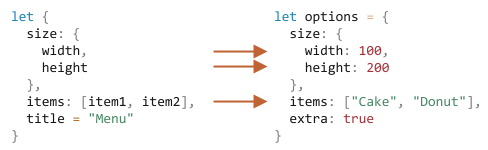

# 구조 분해 할당

`객체`와 `배열`은 자바스크립트에서 가장 많이 쓰이는 자료 구조입니다.

키를 가진 데이터 여러 개를 하나의 엔티티에 저장할 땐 객체를, 컬렉션에 데이터를 순서대로 저장할 땐 배열을 사용하죠.

개발을 하다 보면 함수에 객체나 배열을 전달해야 하는 경우가 생기곤 합니다. 가끔은 객체나 배열에 저장된 데이터 전체가 아닌 일부만 필요한 경우가 생기기도 하죠.

이럴 때 객체나 배열을 변수로 '분해'할 수 있게 해주는 특별한 문법인 *구조 분해 할당(destructuring assignment)* 을 사용할 수 있습니다. 이 외에도 함수의 매개변수가 많거나 매개변수 기본값이 필요한 경우 등에서 구조 분해(destructuring)는 그 진가를 발휘합니다.

## 배열 분해하기

배열이 어떻게 변수로 분해되는지 예제를 통해 살펴봅시다.

```js
// 이름과 성을 요소로 가진 배열
let arr = ["Bora", "Lee"]

*!*
// 구조 분해 할당을 이용해
// firstName엔 arr[0]을
// surname엔 arr[1]을 할당하였습니다.
let [firstName, surname] = arr;
*/!*

alert(firstName); // Bora
alert(surname);  // Lee
```

이제 인덱스를 이용해 배열에 접근하지 않고도 변수로 이름과 성을 사용할 수 있게 되었습니다.

아래 예시처럼 `split` 같은 반환 값이 배열인 메서드를 함께 활용해도 좋습니다.

```js
let [firstName, surname] = "Bora Lee".split(' ');
```

````smart header="'분해(destructuring)'는 '파괴(destructive)'를 의미하지 않습니다."
구조 분해 할당이란 명칭은 어떤 것을 복사한 이후에 변수로 '분해(destructurize)'해준다는 의미 때문에 붙여졌습니다. 이 과정에서 분해 대상은 수정 또는 파괴되지 않습니다.

배열의 요소를 직접 변수에 할당하는 것보다 코드 양이 줄어든다는 점만 다릅니다.
```js
// let [firstName, surname] = arr;
let firstName = arr[0];
let surname = arr[1];
```
````

````smart header="쉼표를 사용하여 요소 무시하기"
쉼표를 사용하면 필요하지 않은 배열 요소를 버릴 수 있습니다.

```js run
*!*
// 두 번째 요소는 필요하지 않음
let [firstName, , title] = ["Julius", "Caesar", "Consul", "of the Roman Republic"];
*/!*

alert( title ); // Consul
```

두 번째 요소는 생략되었지만, 세 번째 요소는 `title`이라는 변수에 할당된 것을 확인할 수 있습니다. 할당할 변수가 없기 때문에 네 번째 요소 역시 생략되었습니다.
````

````smart header="할당 연산자 우측엔 모든 이터러블이 올 수 있습니다."

배열뿐만 아니라 모든 이터러블(iterable, 반복 가능한 객체)에 구조 분해 할당을 적용할 수 있습니다.

```js
let [a, b, c] = "abc"; // ["a", "b", "c"]
let [one, two, three] = new Set([1, 2, 3]);
```

````


````smart header="할당 연산자 좌측엔 뭐든지 올 수 있습니다."

할당 연산자 좌측엔 '할당할 수 있는(assignables)' 것이라면 어떤 것이든 올 수 있습니다.

아래와 같이 객체 프로퍼티도 가능합니다.
```js run
let user = {};
[user.name, user.surname] = "Bora Lee".split(' ');

alert(user.name); // Bora
```

````

````smart header=".entries()로 반복하기"

[Object.entries(obj)](mdn:js/Object/entries)는 이전 챕터에서 학습한 바 있습니다.

이 메서드와 구조 분해를 조합하면 객체의 키와 값을 순회해 변수로 분해 할당할 수 있습니다.

```js run
let user = {
  name: "John",
  age: 30
};

// 객체의 키와 값 순회하기
*!*
for (let [key, value] of Object.entries(user)) {
*/!*
  alert(`${key}:${value}`); // name:John, age:30이 차례대로 출력
}
```

맵에도 물론 이 메서드를 활용할 수 있습니다.

```js run
let user = new Map();
user.set("name", "John");
user.set("age", "30");

*!*
for (let [key, value] of user) {
*/!*
  alert(`${key}:${value}`); // name:John, then age:30
}
```
````

```smart header="변수 교환 트릭"
두 변수에 저장된 값을 교환할 때 구조 분해 할당을 사용할 수 있습니다.

```js run
let guest = "Jane";
let admin = "Pete";

// 변수 guest엔 Pete, 변수 admin엔 Jane이 저장되도록 값을 교환함
[guest, admin] = [admin, guest];

alert(`${guest} ${admin}`); // Pete Jane(값 교환이 성공적으로 이뤄졌습니다!)
```

예시에선 임시 배열을 만들어 두 변수를 담고, 요소 순서를 교체해 배열을 분해하는 방식을 사용했습니다.

이 방식을 사용하면 두 개뿐만 아니라 그 이상의 변수에 담긴 값도 교환할 수 있습니다.


### '...'로 나머지 요소 가져오기

배열 앞쪽에 위치한 값 몇 개만 필요하고 그 이후 이어지는 나머지 값들은 한데 모아서 저장하고 싶을 때가 있습니다. 이럴 때는 점 세 개 `...`를 붙인 매개변수 하나를 추가하면 '나머지(rest)' 요소를 가져올 수 있습니다.

```js run
let [name1, name2, *!*...rest*/!*] = ["Julius", "Caesar", *!*"Consul", "of the Roman Republic"*/!*];

alert(name1); // Julius
alert(name2); // Caesar

*!*
// `rest`는 배열입니다.
alert(rest[0]); // Consul
alert(rest[1]); // of the Roman Republic
alert(rest.length); // 2
*/!*
```

`rest`는 나머지 배열 요소들이 저장된 새로운 배열이 됩니다. `rest` 대신에 다른 이름을 사용해도 되는데, 변수 앞의 점 세 개(`...`)와 변수가 가장 마지막에 위치해야 한다는 점은 지켜주시기 바랍니다.

### 기본값

할당하고자 하는 변수의 개수가 분해하고자 하는 배열의 길이보다 크더라도 에러가 발생하지 않습니다. 할당할 값이 없으면 undefined로 취급되기 때문입니다.

```js run
*!*
let [firstName, surname] = [];
*/!*

alert(firstName); // undefined
alert(surname); // undefined
```

`=`을 이용하면 할당할 값이 없을 때 기본으로 할당해 줄 값인 '기본값(default value)'을 설정할 수 있습니다.

```js run
*!*
// 기본값
let [name = "Guest", surname = "Anonymous"] = ["Julius"];
*/!*

alert(name);    // Julius (배열에서 받아온 값)
alert(surname); // Anonymous (기본값)
```

복잡한 표현식이나 함수 호출도 기본값이 될 수 있습니다. 이렇게 기본식으로 표현식이나 함수를 설정하면 할당할 값이 없을 때 표현식이 평가되거나 함수가 호출됩니다.

기본값으로 두 개의 `prompt` 함수를 할당한 예시를 살펴봅시다. 값이 제공되지 않았을 때만 함수가 호출되므로, `prompt`는 한 번만 호출됩니다.

```js run
// name의 prompt만 실행됨
let [surname = prompt('성을 입력하세요.'), name = prompt('이름을 입력하세요.')] = ["김"];

alert(surname); // 김 (배열에서 받아온 값)
alert(name);    // prompt에서 받아온 값
```


## 객체 분해하기

구조 분해 할당으로 객체도 분해할 수 있습니다.

기본 문법은 다음과 같습니다.

```js
let {var1, var2} = {var1:…, var2:…}
```

할당 연산자 우측엔 분해하고자 하는 객체를, 좌측엔 상응하는 객체 프로퍼티의 '패턴'을 넣습니다. 분해하려는 객체 프로퍼티의 키 목록을 패턴으로 사용하는 예시를 살펴봅시다.

예시:

```js run
let options = {
  title: "Menu",
  width: 100,
  height: 200
};

*!*
let {title, width, height} = options;
*/!*

alert(title);  // Menu
alert(width);  // 100
alert(height); // 200
```

프로퍼티 `options.title`과 `options.width`, `options.height`에 저장된 값이 상응하는 변수에 할당된 것을 확인할 수 있습니다. 참고로 순서는 중요하지 않습니다. 아래와 같이 작성해도 위 예시와 동일하게 동작합니다. 

```js
// let {...} 안의 순서가 바뀌어도 동일하게 동작함
let {height, width, title} = { title: "Menu", height: 200, width: 100 }
```

할당 연산자 좌측엔 좀 더 복잡한 패턴이 올 수도 있습니다. 분해하려는 객체의 프로퍼티와 변수의 연결을 원하는 대로 조정할 수도 있습니다.

객체 프로퍼티를 프로퍼티 키와 다른 이름을 가진 변수에 저장해봅시다. `options.width`를 `w`라는 변수에 저장하는 식으로 말이죠. 좌측 패턴에 콜론(:)을 사용하면 원하는 목표를 달성할 수 있습니다.

```js run
let options = {
  title: "Menu",
  width: 100,
  height: 200
};

*!*
// { 객체 프로퍼티: 목표 변수 }
let {width: w, height: h, title} = options;
*/!*

// width -> w
// height -> h
// title -> title

alert(title);  // Menu
alert(w);      // 100
alert(h);      // 200
```

콜론은 '분해하려는 객체의 프로퍼티: 목표 변수'와 같은 형태로 사용합니다. 위 예시에선 프로퍼티 `width`를 변수 `w`에, 프로퍼티 `height`를 변수 `h`에 저장했습니다. 프로퍼티 `title`은 동일한 이름을 가진 변수 `title`에 저장됩니다. 

프로퍼티가 없는 경우를 대비하여 `=`을 사용해 기본값을 설정하는 것도 가능합니다. 아래와 같이 말이죠.

```js run
let options = {
  title: "Menu"
};

*!*
let {width = 100, height = 200, title} = options;
*/!*

alert(title);  // Menu
alert(width);  // 100
alert(height); // 200
```

배열 혹은 함수의 매개변수에서 했던 것처럼 객체에도 표현식이나 함수 호출을 기본값으로 할당할 수 있습니다. 물론 표현식이나 함수는 값이 제공되지 않았을 때 평가 혹은 실행되겠죠.

아래 예시를 실행하면 width 값만 물어보고 title 값은 물어보지 않습니다.

```js run
let options = {
  title: "Menu"
};

*!*
let {width = prompt("width?"), title = prompt("title?")} = options;
*/!*

alert(title);  // Menu
alert(width);  // prompt 창에 입력한 값
```

콜론과 할당 연산자를 동시에 사용할 수도 있습니다.

```js run
let options = {
  title: "Menu"
};

*!*
let {width: w = 100, height: h = 200, title} = options;
*/!*

alert(title);  // Menu
alert(w);      // 100
alert(h);      // 200
```

프로퍼티가 많은 복잡한 객체에서 원하는 정보만 뽑아오는 것도 가능합니다. 

```js run
let options = {
  title: "Menu",
  width: 100,
  height: 200
};

// title만 변수로 뽑아내기
let { title } = options;

alert(title); // Menu
```

### 나머지 패턴 '...'

분해하려는 객체의 프로퍼티 개수가 할당하려는 변수의 개수보다 많다면 어떨까요? '나머지'를 어딘가에 할당하면 되지 않겠냐는 생각이 들지 않으시나요?

나머지 패턴(rest pattern)을 사용하면 배열에서 했던 것처럼 나머지 프로퍼티를 어딘가에 할당하는 게 가능합니다. 참고로 모던 브라우저는 나머지 패턴을 지원하지만, IE를 비롯한 몇몇 구식 브라우저는 나머지 패턴을 지원하지 않으므로 주의해서 사용해야 합니다. 물론 바벨(Babel)을 이용하면 되지만요.

나머지 패턴은 예시를 살펴봅시다.

```js run
let options = {
  title: "Menu",
  height: 200,
  width: 100
};

*!*
// title = 이름이 title인 프로퍼티
// rest = 나머지 프로퍼티들
let {title, ...rest} = options;
*/!*

// title엔 "Menu", rest엔 {height: 200, width: 100}이 할당됩니다.
alert(rest.height);  // 200
alert(rest.width);   // 100
```

````smart header="`let` 없이 사용하기"
지금까진 할당 연산 `let {…} = {…}` 안에서 변수들을 선언하였습니다. `let`으로 새로운 변수를 선언하지 않고 기존에 있던 변수에 분해한 값을 할당할 수도 있는데, 이때는 주의할 점이 있습니다.

잘못된 코드:
```js run
let title, width, height;

// SyntaxError: Unexpected token '=' 이라는 에러가 아랫줄에서 발생합니다.
{title, width, height} = {title: "Menu", width: 200, height: 100};
```

자바스크립트는 표현식 안에 있지 않으면서 주요 코드 흐름 상에 있는 `{...}`를 코드 블록으로 인식합니다. 코드 블록의 본래 용도는 아래와 같이 문(statement)을 묶는 것입니다.

```js run
{
  // 코드 블록
  let message = "Hello";
  // ...
  alert( message );
}
```

위쪽 예시에선 구조 분해 할당을 위해 사용한 `{...}`를 자바스크립트가 코드 블록으로 인식해서 에러가 발생하였습니다.

에러를 해결하려면 할당문을 괄호`(...)`로 감싸 자바스크립트가 `{...}`를 코드 블록이 아닌 표현식으로 해석면 됩니다.

```js run
let title, width, height;

// 에러가 발생하지 않습니다.
*!*(*/!*{title, width, height} = {title: "Menu", width: 200, height: 100}*!*)*/!*;

alert( title ); // Menu
```
````

## 중첩 구조 분해

객체나 배열이 다른 객체나 배열을 포함하는 경우, 좀 더 복잡한 패턴을 사용하면 중첩 배열이나 객체의 정보를 추출할 수 있습니다. 이를 중첩 구조 분해(nested destructuring)라고 부릅니다.

아래 예시에서 객체 `options`의 `size` 프로퍼티 값은 또 다른 객체입니다. `items` 프로퍼티는 배열을 값으로 가지고 있습니다. 대입 연산자 좌측의 패턴은 정보를 추출하려는 객체 `options`와 같은 구조를 갖추고 있습니다.

```js run
let options = {
  size: {
    width: 100,
    height: 200
  },
  items: ["Cake", "Donut"],
  extra: true
};

// 코드를 여러 줄에 걸쳐 작성해 의도하는 바를 명확히 드러냄
let {
  size: { // size는 여기,
    width,
    height
  },
  items: [item1, item2], // items는 여기에 할당함
  title = "Menu" // 분해하려는 객체에 title 프로퍼티가 없으므로 기본값을 사용함
} = options;

alert(title);  // Menu
alert(width);  // 100
alert(height); // 200
alert(item1);  // Cake
alert(item2);  // Donut
```

`extra`(할당 연산자 좌측의 패턴에는 없음)를 제외한 `options` 객체의 모든 프로퍼티가 상응하는 변수에 할당되었습니다.



변수 `width`, `height`, `item1`, `item2`엔 원하는 값이, `title`엔 기본값이 저장되었네요.

그런데 위 예시에서 `size`와 `items` 전용 변수는 없다는 점에 유의하시기 바랍니다. 전용 변수 대신 우리는 `size`와 `items` 안의 정보를 변수에 할당하였습니다.

## 똑똑한 함수 매개변수

함수에 매개변수가 많은데 이중 상당수는 선택적으로 쓰이는 경우가 종종 있습니다. 사용자 인터페이스와 연관된 함수에서 이런 상황을 자주 볼 수 있죠. 메뉴 생성에 관여하는 함수가 있다고 해 봅시다. 메뉴엔 너비, 높이, 제목, 항목 리스트 등이 필요하기 때문에 이 정보는 매개변수로 받습니다.

먼저 리팩토링 전의 메뉴 생성 함수를 살펴보겠습니다.

```js
function showMenu(title = "Untitled", width = 200, height = 100, items = []) {
  // ...
}
```

이렇게 함수를 작성하면 넘겨주는 인수의 순서가 틀려 문제가 발생할 수 있습니다. 문서화가 잘 되어있다면 IDE가 순서를 틀리지 않게 도움을 주긴 하겠지만 말이죠. 이 외에도 대부분의 매개변수에 기본값이 설정되어 있어 굳이 인수를 넘겨주지 않아도 되는 경우에 문제가 발생합니다.

아래 코드를 살펴보시죠. 어떤 느낌이 드시나요?

```js
// 기본값을 사용해도 괜찮은 경우 아래와 같이 undefined를 여러 개 넘겨줘야 합니다.
showMenu("My Menu", undefined, undefined, ["Item1", "Item2"])
```

꽤 지저분해 보이네요. 매개변수가 많아질수록 가독성은 더 떨어질 겁니다.

구조 분해는 이럴 때 구세주가 됩니다.

매개변수 모두를 객체에 모아 함수에 전달해, 함수가 전달받은 객체를 분해하여 변수에 할당하고 원하는 작업을 수행할 수 있도록 함수를 리팩토링해 봅시다.

```js run
// 함수에 전달할 객체
let options = {
  title: "My menu",
  items: ["Item1", "Item2"]
};

// 똑똑한 함수는 전달받은 객체를 분해해 변수에 즉시 할당함
function showMenu(*!*{title = "Untitled", width = 200, height = 100, items = []}*/!*) {
  // title, items – 객체 options에서 가져옴
  // width, height – 기본값
  alert( `${title} ${width} ${height}` ); // My Menu 200 100
  alert( items ); // Item1, Item2
}

showMenu(options);
```

중첩 객체와 콜론을 조합하면 좀 더 복잡한 구조 분해도 가능합니다.

```js run
let options = {
  title: "My menu",
  items: ["Item1", "Item2"]
};

*!*
function showMenu({
  title = "Untitled",
  width: w = 100,  // width는 w에,
  height: h = 200, // height는 h에,
  items: [item1, item2] // items의 첫 번째 요소는 item1에, 두 번째 요소는 item2에 할당함
}) {
*/!*
  alert( `${title} ${w} ${h}` ); // My Menu 100 200
  alert( item1 ); // Item1
  alert( item2 ); // Item2
}

showMenu(options);
```

이렇게 똑똑한 함수 매개변수 문법은 구조 분해 할당 문법과 동일합니다.
```js
function({
  incomingProperty: varName = defaultValue
  ...
})
```

매개변수로 전달된 객체의 프로퍼티 `incomingProperty`는 `varName`에 할당되겠죠. 만약 값이 없다면 `defaultValue`가 기본값으로 사용될 겁니다.

참고로 이렇게 함수 매개변수를 구조 분해할 땐, 반드시 인수가 전달된다고 가정되고 사용된다는 점에 유의하시기 바랍니다. 모든 인수에 기본값을 할당해 주려면 빈 객체를 명시적으로 전달해야 합니다.

```js
showMenu({}); // 모든 인수에 기본값이 할당됩니다.

showMenu(); // 에러가 발생할 수 있습니다.
```

이 문제를 예방하려면 빈 객체 `{}`를 인수 전체의 기본값으로 만들면 됩니다.

```js run
function showMenu({ title = "Menu", width = 100, height = 200 }*!* = {}*/!*) {
  alert( `${title} ${width} ${height}` );
}

showMenu(); // Menu 100 200
```

이렇게 인수 객체의 기본값을 빈 객체 `{}`로 설정하면 어떤 경우든 분해할 것이 생겨서 함수에 인수를 하나도 전달하지 않아도 에러가 발생하지 않습니다.

## 요약

- 구조 분해 할당을 사용하면 객체나 배열을 변수로 연결할 수 있습니다.
- 객체 분해하기:
    ```js
    let {prop : varName = default, ...rest} = object
    ```

    object의 프로퍼티 `prop`의 값은 변수 `varName`에 할당되는데, object에 prop이 없으면 `default`가 `varName`에 할당됩니다.

    연결할 변수가 없는 나머지 프로퍼티들은 객체 `rest`에 복사됩니다.

- 배열 분해하기:

    ```js
    let [item1 = default, item2, ...rest] = array
    ```

    array의 첫 번째 요소는 `item1`에, 두 번째 요소는 변수 `item2`에 할당되고, 이어지는 나머지 요소들은 배열 `rest` 저장됩니다.

- 할당 연산자 좌측의 패턴과 우측의 구조가 같으면 중첩 배열이나 객체가 있는 복잡한 구조에서도 원하는 데이터를 뽑아낼 수 있습니다.
