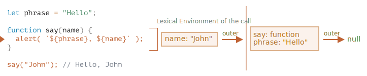
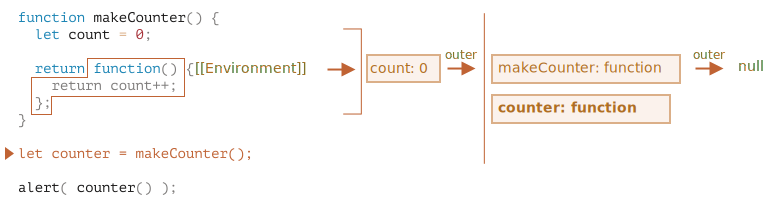
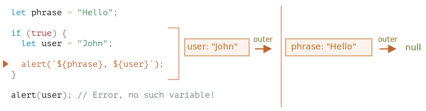

# 클로저

자바스크립트는 함수 지향 언어입니다. 이런 특징은 개발자에게 많은 자유도를 줍니다. 함수를 동적으로 생성할 수 있고, 다른 변수에 함수를 복사할 수 있으며, 함수를 다른 함수의 인수로 전달할 수 있고, 함수가 생성된 곳이 아닌 다른 곳에서 함수를 호출할 수도 있기 때문입니다.

함수 내부에서 함수 외부에 있는 변수에 접근할 수 있다는 사실은 앞서 학습해서 알고 계실 겁니다. 이 기능은 꽤 자주 사용됩니다.

그런데 만약 함수 내부에서 접근하려는 외부 변수가 변경되면 어떤 일이 발생할까요? 함수는 변경된 최신 값을 가져올까요, 아니면 함수 생성 시점에 있었던 기존 값을 가져올까요?

함수가 코드 내 다른 위치에서 호출되는 경우라면요? 새로운 위치를 기준으로 외부 변수를 가져올까요?

외부 변수 접근에 대해선 언어마다 동작하는 방식이 다릅니다. 이번 챕터에선 자바스크립트의 동작 방식에 대해서 다루도록 하겠습니다.

## 몇 가지 질문

먼저 두 가지 상황을 가정하면서 시작하도록 하겠습니다. 이후 자바스크립트 내부 동작 원리를 하나씩 파헤치면서, 상황마다 어떤 일이 일어날지 알아보겠습니다. 이 과정이 끝나면 더 복잡한 상황에 대처할 수 있을 겁니다.

1. 함수 `sayHi` 내부에서 외부 변수 `name`을 사용하고 있습니다. 아래 예시를 실행하면 어떤 값이 출력될까요?

    ```js
    let name = "John";

    function sayHi() {
      alert("Hi, " + name);
    }

    name = "Pete";

    *!*
    sayHi(); // "John"이 출력될까요, 아니면 "Pete"가 출력될까요?
    */!*
    ```

   이런 상황은 브라우저, 서버 환경을 가리지 않고 자주 발생합니다. 사용자의 동작이나 네트워크 요청이 발생한 이후에 함수가 실행되도록 하는 경우가 많은데, 이 경우 함수는 함수 생성 시점보다 한참 뒤에 실행되기 때문입니다.
   
   질문을 다시 정리해 봅시다. 함수는 최신 변경 값을 가져올까요?


2. 함수 `makeWorker`는 새로운 함수를 만들고 반환합니다. 반환되는 함수는 제삼의 장소에서 호출될 수 있습니다. 이때, 함수는 생성된 곳을 기준으로 외부 변수를 가져올까요, 호출된 곳을 기준으로 외부 변수를 가져올까요? 아니면 두 경우 모두 가능할까요?

    ```js
    function makeWorker() {
      let name = "Pete";

      return function() {
        alert(name);
      };
    }

    let name = "John";

    // 새로운 함수를 만듭니다.
    let work = makeWorker();

    // 호출!
    *!*
    work(); // 함수가 생성된 곳을 기준으로 외부 변수를 가져와 "Pete"를 출력해줄까요? 아니면 호출된 곳을 기준으로 외부 변수를 가져와 "John"을 출력할까요?
    */!*
    ```


## 렉시컬 환경

답을 찾으려면 먼저 '변수'의 실체에 대해 알아야 합니다.

자바스크립트에선 실행 중인 함수, 실행 중인 코드 블록 `{...}`, 실행 중인 스크립트 전체는 *렉시컬 환경(Lexical Environment)* 이라 불리는 숨김 내부 연관 객체를 갖습니다.

렉시컬 환경은 두 부분으로 구성됩니다.

1. *환경 레코드(Environment Record)* -- 모든 지역 변수를 프로퍼티로 저장하고 있는 객체. `this`가 참조하는 값 등의 정보도 저장됩니다.
2. *외부 렉시컬 환경(Outer Lexical Environment)* 에 대한 참조 -- 외부 코드와 연관되어 있습니다.

**'변수'는 특수 내부 객체인 `환경 레코드`의 프로퍼티에 불과합니다. '변수를 가져오거나 변경'하는 행위는 '환경 레코드의 프로퍼티를 가져오거나 변경'하는 행위와 동일합니다.**

아래 예시엔 렉시컬 환경이 하나만 존재합니다.


이렇게 스크립트 전체와 관련된 렉시컬 환경을 전역 렉시컬 환경(global Lexical Environment)이라고 부릅니다.

그림에서 네모 상자는 변수가 저장되는 환경 레코드를 나타내고, 붉은 화살표는 외부 참조(outer reference)를 나타냅니다. 전역 렉시컬 환경은 외부 참조를 갖지 않기 때문에 화살표가 'null'을 가리키는 걸 확인할 수 있습니다.

아래 그림은 변수를 정의하고 그 변수에 값을 할당할 때 어떤 일이 일어나는지 보여줍니다.


우측의 네모 상자들은 코드가 한 줄, 한 줄 실행될 때마다 전역 렉시컬 환경이 어떻게 변화하는지 보여줍니다.

1. 스크립트가 시작할 땐 렉시컬 환경이 비어 있습니다(empty).
2. `let phrase`로 변수를 정의합니다. 값을 할당하기 전이기 때문에 `undefined`가 저장됩니다.
3. `phrase`에 값이 할당됩니다.
4. `phrase`의 값이 변경됩니다.

아직까진 어려운 게 없어 보이네요.

지금까지 배운 내용을 요약해 보겠습니다.

- 변수는 특수 내부 객체인 환경 레코드의 프로퍼티입니다. 환경 레코드는 현재 실행 중인 함수와 코드 블록, 스크립트와 연관되어 있습니다. 
- 변수를 변경하면 환경 레코드의 프로퍼티가 변경됩니다.

### 함수 선언

지금까진 변수를 중심으로 내부 변화를 살펴보았습니다. 이젠 함수, 특히 함수 선언 방식으로 함수를 정의한 경우를 예시로 내부 변화를 살펴보겠습니다.

**`let`으로 정의한 변수와는 달리, 함수 선언 방식으로 정의한 함수는 실행 흐름이 함수에 도달할 때가 아닌 렉시컬 환경이 만들어질 때 초기화됩니다.**

스크립트 최상위 수준에서 함수 선언 방식으로 정의한 함수라면 스크립트가 시작되는 순간에 초기화가 완료되죠.

이런 이유 때문에 함수 선언 방식으로 정의한 함수는 함수가 정의되기도 전에 호출할 수 있습니다.

`say`는 함수 선언방식으로 정의한 함수이기 때문에 실행이 시작된 시점의 렉시컬 환경은 비어 있지 않습니다(아래 그림 참고). 실행 흐름이 지속되면서 `let`으로 정의한 변수 `phrase`가 프로퍼티에 추가되고, 할당 값은 프로퍼티의 값으로 추가됩니다.


### 내부 렉시컬 환경과 외부 렉시컬 환경

이제 함수 내부에서 외부 변수에 접근하려 할 때 어떤 일이 일어나는지 알아봅시다.

함수 `say()`는 외부 변수 `phrase`를 사용하는데, 내부에서 구체적으로 무슨 일이 일어나는지 알아보겠습니다.

함수가 실행되면 새로운 렉시컬 환경이 자동으로 생성되고 여기에 지역변수와 함수의 매개변수가 저장됩니다.

따라서 `say("John")`을 호출하면 아래와 같은 내부 변화가 일어납니다(현재 실행 흐름은 붉은색 화살표로 나타낸 줄에 멈춰있는 상황입니다).

<!--
    ```js
    let phrase = "Hello";

    function say(name) {
     alert( `${phrase}, ${name}` );
    }

    say("John"); // Hello, John
    ```-->



보시는 바와 같이 함수가 호출 중일 때는 두 개의 렉시컬 환경이 만들어집니다. 호출 중인 함수를 위한 내부 렉시컬 환경과 이 렉시컬 환경이 가리키는 외부(전역) 렉시컬 환경이 만들어지죠.

- 내부 렉시컬 환경은 현재 실행 중인 함수인 `say`에 상응합니다.

    내부 렉시컬 환경은 함수의 인자인 `name`을 프로퍼티로 갖습니다. `say("John")`을 호출했기 때문에 프로퍼티 `name`의 값은 `"John"`이 됩니다.
- 외부 렉시컬 환경은 전역 렉시컬 환경입니다.

    전역 렉시컬 환경은 변수 `phrase`와 함수 `say`를 프로퍼티로 갖습니다.

그리고 내부 렉시컬 환경은 `외부` 렉시컬 환경을 참조합니다.

**코드에서 변수에 접근할 때는 먼저 내부 렉시컬 환경을 검색 범위로 잡고 변수에 상응하는 프로퍼티가 내부 렉시컬 환경에 있는지 찾습니다. 이때 원하는 대상을 찾지 못하면 검색 범위를 내부 렉시컬 환경이 참조하는 외부 렉시컬 환경으로 확장합니다. 이 과정은 검색 범위가 전역 렉시컬 환경으로 확장될 때까지 반복됩니다.**

전역 렉시컬 환경에 도달할 때까지 변수에 상응하는 프로퍼티를 찾지 못하면 엄격 모드에선 에러가 발생합니다. 참고로 정의되지 않은 변수에 `user = "John"`같이 값을 할당하려고 하면 비 엄격 모드에선 새로운 전역 변수 `user`가 만들어지는데, 이는 하위 호환성을 위해 존재하는 기능입니다.

예시와 그림을 보면서 검색이 어떻게 진행되는지 살펴봅시다.

- `say` 내부의 `alert`에서 `name`에 접근하려고 하면, 먼저 함수의 렉시컬 환경(내부 렉시컬 환경)을 살펴봅니다. 변수 `name`에 상응하는 프로퍼티가 내부 렉시컬 환경에 있네요!
- `say` 내부의 `alert`에서 `phrase`에 접근하려고 했는데, `phrase`에 상응하는 프로퍼티가 내부 렉시컬 환경엔 없네요. 검색 범위를 내부 렉시컬 환경이 참조하는 렉시컬 환경(외부 렉시컬 환경)으로 넓혀 `phrase`에 상응하는 프로퍼티가 있는지 찾아봅시다. 해당 프로퍼티가 외부 렉시컬 환경엔 있네요!


이제 이 챕터를 시작할 때 가정했던 2가지 상황 중, 첫 번째 상황의 답을 찾았습니다.

**함수는 현재 실행 중인 위치를 기준으로 외부 변숫값을 얻기 때문에 최신 값을 사용합니다.**

기존 변숫값은 어디에도 저장되지 않기 때문에 이런 결과가 도출됩니다. 함수 내부에서 변수를 사용할 때, 함수 렉시컬 환경(내부 렉시컬 환경)에 변수에 상응하는 프로퍼티가 있으면 해당 프로퍼티의 값을 사용하고, 상응하는 프로퍼티가 없으면 외부 렉시컬 환경에서 값을 찾습니다.

따라서 첫 번째 상황에선 `Pete`가 출력됩니다.

```js run
let name = "John";

function sayHi() {
  alert("Hi, " + name);
}

name = "Pete"; // (*)

*!*
sayHi(); // Pete
*/!*
```


위 코드의 실행 흐름은 아래와 같습니다.

1. 전역 렉시컬 환경에 `name : "John"`이 저장됩니다.
2. `(*)`로 표시한 줄에서 전역 변수 `name`의 값이 변경되고, 전역 렉시컬 환경 역시 `name : "Pete"`로 변경됩니다.
3. `sayHi()`가 호출되면, 외부에서 `name` 값을 가져옵니다. 이 예제에선 함수 렉시컬 환경의 외부 렉시컬 환경이 전역 렉시컬 환경이므로 전역 렉시컬 환경에 저장된 값인 `"Pete"`가 얼럿 창에 출력됩니다.


```smart header="호출 하나에 렉시컬 환경 하나"
함수가 실행될 때마다 새로운 렉시컬 환경이 만들어진다는 점을 꼭 기억하시길 바랍니다.

특정 함수를 이곳저곳에서 여러 번 호출해도 마찬가지입니다. 새롭게 만들어진 함수 렉시컬 환경엔 함수가 실행될 때 전달받은 매개변수와 함수 내 지역변수에 대한 정보가 저장됩니다. 
```

```smart header="렉시컬 환경은 수정할 수 없습니다."
'렉시컬 환경'은 자바스크립트 동작 원리를 설명할 때 사용되는 [명세서](https://tc39.es/ecma262/#sec-lexical-environments) 전용 가상 객체입니다. 따라서 렉시컬 환경 객체에 직접 접근하거나 조작하는 것은 불가능합니다. 자바스크립트 엔진은 명세서에 언급된 사항을 준수하면서 엔진 고유의 방법을 사용해 렉시컬 환경을 최적화합니다. 사용하지 않는 변수를 버려 메모리를 절약하거나 기타 내부 트릭을 써서 말이죠.
```


## 중첩 함수

함수 내부에 있는 함수는 '중첩(nested)' 함수라고 부릅니다.

자바스크립트에선 중첩 함수를 쉽게 만들 수 있고 사용도 자유롭습니다.

중첩함수는 다음과 같이 코드를 정리하는 데 사용되곤 합니다.

```js
function sayHiBye(firstName, lastName) {

  // 헬퍼(helper) 중첩 함수
  function getFullName() {
    return firstName + " " + lastName;
  }

  alert( "Hello, " + getFullName() );
  alert( "Bye, " + getFullName() );

}
```

위 예시에서 외부 변수에 접근해 이름 전체를 반환해주는 *중첩* 함수 `getFullName()`은 편의상 만든 함수입니다. 이렇게 자바스크립트에선 중첩 함수가 흔하게 사용됩니다.

한편, 외부 함수가 메서드가 있는 객체를 생성하는 경우, 중첩함수는 해당 객체의 프로퍼티 형태로 반환될 수 있습니다. 물론 중첩 함수를 함수 그 자체로 반환하는 것도 가능합니다. 이렇게 반환된 중첩함수는 어디서 쓰이느냐에 상관없이 일반 함수와 마찬가지로 외부 변수에 접근할 수 있습니다.

아래 예시에선 익명 중첩 함수가 [생성자(constructor) 함수](info:constructor-new) `User`가 만든 객체의 메서드에 할당되고 있습니다.

```js run
// 생성자 함수가 새로운 객체를 반환함
function User(name) {

  // 중첩 함수를 객체 메서드에 할당함
  this.sayHi = function() {
    alert(name);
  };
}

let user = new User("John");
user.sayHi(); // 메서드 'sayHi'에서 외부 변수 'name'에 접근함
```

아래 예시와 같이 숫자를 세주는 간단한 익명 중첩 함수를 만들고, 함수 자체를 반환하는 것도 가능합니다.

```js run
function makeCounter() {
  let count = 0;

  return function() {
    return count++; // 중첩 함수 본문에서 외부 변수 'count'에 접근함
  };
}

let counter = makeCounter();

alert( counter() ); // 0
alert( counter() ); // 1
alert( counter() ); // 2
```

함수 `makeCounter`를 좀 더 살펴봅시다. `makeCounter`를 실행하면 숫자를 세주는 카운터(counter) 함수가 반환됩니다. 보고 계시는 예시 코드 자체는 상당히 단순하지만, 여기에 약간의 변형을 가하면 [난수 생성기](https://en.wikipedia.org/wiki/Pseudorandom_number_generator)와 같은 실용성 있는 함수를 만들 수 있습니다.

이젠 어떤 방식으로 카운터가 동작하는지 알아보겠습니다.

내부 함수가 실행되면 `count++`에서 사용하는 변수인 `count`를 안쪽부터 시작해 바깥쪽으로 나아가면서 찾게 됩니다. 검색 영역이 아래 그림처럼 점차 확장되죠.


1. 중첩 함수의 지역 변수
2. 외부 함수의 변수
3. 영역은 전역 변수를 만날 때까지 계속 확장됩니다.

`count`는 `두 번째` 단계에서 찾을 수 있습니다. 그런데 외부 변수가 수정될 땐, 해당 변수가 발견된 렉시컬 환경에서 수정이 이뤄집니다. 따라서 코드 `count++`는 외부 변수를 발견한 렉시컬 환경에서 외부변수를 증가시킵니다. 결론적으로 `let count = 1`을 실행한 것과 같은 효과를 보죠.

여기서 두 가지 의문이 생길 수 있습니다.

1. `makeCounter` 본문 밖에서 `count` 함수를 초기화할 수는 없을까요? 위 예시에서 `alert`를 호출한 이후에 초기화하는 것 같이 말이죠.
2. `makeCounter()`를 여러 번 호출하면 반환되는 `카운터` 함수도 당연히 많아질 텐데, 이 함수들은 서로 독립적일까요? 아니면 같은 `count` 변수를 공유할까요?

답을 보기 전에, 잠시 혼자 생각해 볼 시간을 가지시길 바랍니다.

...

충분히 생각해 보셨나요?

좋습니다. 답을 살펴봅시다.

1. 초기화할 수 없습니다. `count`는 함수의 지역 변수이기 때문에, 외부에서 접근할 수 없습니다.
2. `makeCounter()`를 호출할 때마다 새로운 함수 렉시컬 환경이 만들어지고, 변수 `count`는 해당 렉시컬 환경에 속하게 됩니다. 따라서 각 `counter` 함수는 독립적입니다.

예시를 통해 이를 확인해 봅시다.

```js run
function makeCounter() {
  let count = 0;
  return function() {
    return count++;
  };
}

let counter1 = makeCounter();
let counter2 = makeCounter();

alert( counter1() ); // 0
alert( counter1() ); // 1

alert( counter2() ); // 0 (count2와 count1은 각자의 렉시컬 환경을 갖습니다.)
```


이제 외부 변수를 참조하는 중첩 함수가 어떻게 동작하는지 이해하셨죠? 여기까지 학습한 내용만 알아두어도 대부분의 상황에서 코드의 동작을 예상할 수 있습니다. 그런데 지금까진 설명을 간결하게 하려고 명세서에 언급된 몇 가지 세부사항은 다루지 않고 넘어갔습니다. 다음 절부턴 지금까지 생략해 왔던 부분에 대해 이야기해보겠습니다.

## Environment 자세히 알아보기

지금부턴 함수 `makeCounter`를 한줄 한줄 실행하면서 내부에서 어떤 일이 일어나는지 알아보겠습니다. 이 과정을 거치고 나면 자바스크립트 내부에서 어떤 일이 일어나는지 상세히 알 수 있습니다.

그리고 간결한 설명을 위해 지금까진 언급하지 않았었던 `[[Environment]]` 프로퍼티도 다루도록 하겠습니다.

1. 스크립트가 막 시작했을 땐, 오로지 전역 렉시컬 환경 하나만 존재합니다.

    

    이때 전역 렉시컬 환경엔 함수 선언문으로 정의한 함수인 `makeCounter`만 있습니다. 참고로 아직 `makeCounter`를 실행한 상황은 아닙니다.
   
    그런데 **모든 함수는 함수가 "정의된 순간(on birth)"의 렉시컬 환경을 참조하는 숨김 프로퍼티인 [[Environment]]를 갖습니다.** `[[Environment]]` 프로퍼티 덕분에 함수는 자신이 어디서 만들어졌는지를 아는 거죠.
   
    예시에서 `makeCounter`는 전역 렉시컬 환경에서 만들어졌기 때문에 `makeCounter`의 `[[Environment]]` 프로퍼티는 전역 렉시컬 환경을 참조합니다.
   
    정리해 보도록 하겠습니다. 함수가 정의된 순간의 렉시컬 환경에 대한 정보는 함수에 "각인" 됩니다. `[[Environment]]`는 이 정보를 참조하는 함수의 숨김 프로퍼티입니다.

2. 새로운 전역 변수 `counter`가 선언되고, `counter`엔 `makeCounter()`를 호출한 결과가 할당됩니다(예시 최하단 붉은 글씨). 아래 그림은 실행 흐름이 함수 `makeCounter()`의 본문 첫 줄에 있는 순간을 표현하고 있습니다.

    

    `makeCounter()`을 호출하는 순간, 함수의 인수와 변수가 저장되는 새로운 함수 렉시컬 환경이 만들어집니다.

    여타 렉시컬 환경과 마찬가지로 새 렉시컬 환경도 두 부분으로 구성됩니다.
    1. 지역 변수를 저장하는 환경 레코드. 여기선 유일한 지역변수 `count`가 저장됩니다(정확히는 `let count`가 실행될 때 저장됨).
    2. 외부 렉시컬 환경에 대한 참조. 함수의 `[[Environment]]` 프로퍼티에 이 참조 정보가 저장됩니다. 위 예시에선 함수 `makeCounter`의 `[[Environment]]`는 전역 렉시컬 환경을 참조하게 됩니다.

    이제 렉시컬 환경은 전역 렉시컬 환경과 현재 호출 중인 `makeCounter`를 위한 렉시컬 환경, 두 개가 되었습니다. 그리고 `makeCounter` 함수의 렉시컬 환경은 전역 렉시컬 환경을 참조하고 있습니다.

3. `makeCounter()`를 실행하는 동안, 중첩 함수 하나가 만들어집니다.

    중첩함수가 함수 선언문으로 만들어졌는지, 함수 표현식으로 만들어졌는지 아닌지는 중요하지 않습니다. 생성 방식에 상관없이 모든 함수는 생성되는 시점의 렉시컬 환경을 참조하는 `[[Environment]]` 프로퍼티를 가집니다. 예제의 익명 함수 역시 새로운 `[[Environment]]` 프로퍼티를 갖게 됩니다.
    
    새로운 중첩 익명 함수의 `[[Environment]]`는 `makeCounter()`의 렉시컬 환경에서 만들어졌기 때문에 `makeCounter()` 생성 시 만들어진 렉시컬 환경을 참조합니다.

    

    지금 단계에선 내부 함수(중첩 함수)는 만들어졌지만, 아직 호출은 하지 않았다는 점에 유의하시기 바랍니다. `function() { return count++; }`의 본문는 아직 실행 전입니다.

4. 실행이 이어지면서 `makeCounter()`에 대한 호출이 종료되고, 반환 값(익명 중첩 함수)이 전역 변수 `counter`에 할당됩니다.

    

    내부 중첩 함수의 바디는 `return count ++`라는 코드 한 줄로만 이루어져 있는데, 이 코드는 `counter`를 호출할 때 실행됩니다.

5. `counter()`를 호출하면 새로운 렉시컬 환경이 만들어지는데, 익명 중첩 함수엔 지역 변수가 없기 때문에 이 렉시컬 환경은 비어있게 됩니다. 그런데 `counter`의 `[[Environment]]`는 `counter`의 `외부` 렉시컬 환경을 참조하기 때문에, `counter()에서 `makeCounter()`가 호출될 때 만들어진 렉시컬 환경에 저장된 변수에 접근할 수 있게 됩니다.

    

   이제 변수 `count`는 자신의 렉시컬 환경(비어있음), `makeCounter()`를 호출할 때 만들어진 렉시컬 환경 순서로 검색됩니다. 그리고 변수 `count`는 `makeCounter()`를 호출할 때 만들어진 렉시컬 환경에서 발견되죠.

    여기서 잠깐 메모리 관리가 어떻게 이뤄지는지 알아봅시다. `makeCounter()` 호출은 이미 끝났지만, 내부 중첩 함수의 `[[Environment]]`가 여전히 `makeCounter()`의 렉시컬 환경을 참조하고 있기 때문에, `makeCounter()` 호출 시 생성된 렉시컬 환경은 여전히 메모리에 남아있게 됩니다.

    렉시컬 환경 객체는 자신을 참조하는 것이 하나라도 남아 있다면 대개 메모리에서 제거되지 않습니다. 자신을 참조하는 것이 없을 때 메모리에서 지워집니다.

6. `counter()`를 호출하면 `count` 값이 반환될 뿐만 아니라 값도 증가합니다. 그런데 위에서 배운 바와 같이 변숫값 수정은 변수가 발견된 '그 자리에서' 이뤄지므로, `count`의 값은 `count`가 발견된 렉시컬 환경에서 수정됩니다.

    

7. `counter()`를 다시 호출해도 위와 같은 과정이 반복됩니다.

이제 두 번째 상황에 대한 답을 찾았습니다.

아래 코드에서 함수 `work()`는 함수가 만들어졌을 때의 렉시컬 환경을 기준으로, 점차 영역을 확대해 나가면서 `name`을 검색합니다.


따라서 `Pete`가 출력됩니다.

`makeWorker()`에 `let name`이 없었다면 검색 영역이 전역 렉시컬 환경까지 확대되어 전역 변수 `name`의 값 `"John"`이 출력되었을 겁니다.

```smart header="클로저"
'클로저(closure)'는 개발자라면 필수로 알아야 하는 프로그래밍 용어입니다.

[클로저](https://en.wikipedia.org/wiki/Closure_(computer_programming))는 외부 변수를 기억하고 액세스할 수 있는 함수입니다. 몇몇 언어에서는 클로저를 구현하는 게 불가능하거나 특수한 방식으로 함수를 작성해야 클로저를 만들 수 있습니다. 하지만 자바스크립트에선 모든 함수가 자연스럽게 클로저가 됩니다(예외가 하나 있는데, 이에 대해선 <info:new-function>에서 다루도록 하겠습니다).

요점을 정리해 봅시다. 자바스크립트의 함수는 숨김 프로퍼티인 `[[Environment]]`를 이용해 자신이 어디서 만들어졌는지 알 수 있습니다. 또한, 자바스크립트 함수는 외부 변수에 접근할 수 있습니다.

채용 인터뷰에서 "클로저가 무엇입니까?"라는 질문을 받으면, 클로저의 정의를 말하고 자바스크립트에선 모든 함수가 클로저라고 이야기하면 될 것 같습니다. 그리고 `[[Environment]]` 프로퍼티와 렉시컬 환경이 어떤 방식으로 동작하는지에 대한 설명을 덧붙이면 됩니다.
```

## 코드 블록, 반복문, 즉시 실행 함수

지금까진 함수를 기준으로 렉시컬 환경의 동작 방식에 대해 알아보았습니다. 그런데 렉시컬 환경은 모든 코드 블록 `{...}`에 존재합니다.

렉시컬 환경은 코드 블록이 실행될 때 만들어지고, 블록 내 지역 변수를 포함합니다. 몇 가지 예시를 살펴봅시다.

### if

아래 예시에서 변수 `user`는 `if` 블록 안에만 존재합니다.

<!--
    ```js run
    let phrase = "Hello";

    if (true) {
        let user = "John";

        alert(`${phrase}, ${user}`); // Hello, John
    }

    alert(user); // Error, can't see such variable!
    ```-->



실행이 `if` 블록에 도달하면 'if 전용' 렉시컬 환경이 새롭게 만들어집니다.

if의 렉시컬 환경은 외부 렉시컬 환경을 참조하기 때문에, 이를 통해 `phrase`를 찾을 수 있습니다. 그러나 `if` 블록 안에서 선언한 모든 변수와 함수 표현식은 해당 렉시컬 환경에 있어서 외부에서 볼 수 없습니다.

따라서 `if` 블록이 끝나면 그 아래의 코드 `alert`는 `user`를 볼 수 없으므로 오류가 발생합니다.

### for, while 반복문

for 반복문의 경우, 반복마다 별도의 렉시컬 환경이 만들어집니다. `for(let ...)`에서 선언한 변수 역시, 해당 반복의 렉시컬 환경에 국한됩니다.

```js run
for (let i = 0; i < 10; i++) {
  // 각 반복은 독립된 렉시컬 환경을 갖습니다.
  // {i: value}
}

alert(i); // Error, i is not defined
```

`let i`는 블록 `{...}`의 바깥에 있는 것처럼 보이지만, `for` 문법은 조금 특별하다는 점에 주의하셔야 합니다. 반복문의 반복 각각은 자신만의 렉시컬 환경을 갖고, 이 렉시컬 환경에 `i`가 저장됩니다.

`if`문과 마찬가지로, 반복문이 끝난 후에는 `i`를 볼 수 없습니다.

### 코드 블록

코드를 블록 `{...}`으로 감싸면, 변수를 '지역 스코프'에 격리할 수 있습니다.

브라우저 환경에선 `type="module"`인 스크립트를 제외하고 모든 스크립트가 동일한 전역 공간을 공유하기 때문에, 한 스크립트에서 만든 전역 변수를 다른 스크립트에서 공유할 수 있습니다. 그런데 이렇게 두 개의 스크립트가 동시에 같은 이름을 가진 전역 변수를 사용하게 되면 예상치 못하게 변수가 덮어써 지는 문제가 발생합니다.

사용 빈도가 높은 단어로 변수 이름을 지을 때, 스크립트 작성자 간 합의가 되지 않은 경우 이런 문제가 발생할 수 있습니다.

코드 블록을 사용하여 스크립트 전체 혹은 스크립트의 일부를 격리하면 이런 충돌상황을 피할 수 있습니다.

```js run
{
  // 외부에서 접근이 불가능한 지역변수를 만듦

  let message = "Hello";

  alert(message); // Hello
}

alert(message); // Error: message is not defined
```

블록 바깥의 코드(혹은 다른 스크립트에 있는 코드)는 블록 내 변수에 접근할 수 없습니다. 블록이 자체 렉시컬 환경을 형성하기 때문입니다.

### 즉시 실행 함수 표현식

과거의 자바스크립트는 블록 레벨 렉시컬 환경을 지원하지 않았습니다.

따라서 개발자들은 스코프 충돌을 방지하기 위해 무언가를 발명해야만 했습니다. 그때 만들어진 것이 '즉시 실행 함수 표현식(immediately-invoked function expressions)'입니다. 즉시 실행 함수 표현식은 IIFE라고 부르기도 합니다.

근래에는 자주 사용하지 않지만 오래된 스크립트에서 즉시 실행 함수 표현식을 만날 수 있기 때문에, 즉시 실행 함수 표현식이 무엇인지 알아 둘 필요가 있습니다.

IIFE는 다음과 같이 생겼습니다.

```js run
(function() {

  let message = "Hello";

  alert(message); // Hello

})();
```

함수 표현식이 만들어지고 바로 호출되면서, 해당 함수가 바로 실행되었습니다. 그리고 이 함수는 자신만의 변수를 갖게 됩니다.

즉시 실행 함수를 만들 땐, 함수 표현식을 괄호로 둘러쌓아 `(function {...})`와 같은 형태로 만듭니다. 이렇게 괄호로 둘러싸지 않으면 에러가 발생합니다. 자바스크립트는 `"function"`이라는 키워드를 만나면 함수 선언문이 시작될 것이라 이해하는데, 함수 선언문으로 함수를 만들 땐 반드시 함수의 이름이 있어야 하기 때문입니다. 

```js run
// 함수를 선언과 동시에 실행하려고 함
function() { // <-- Error: Function statements require a function name

  let message = "Hello";

  alert(message); // Hello

}();
```

"그럼 이름을 넣으면 되는 거 아닌가?"라고 생각해 이름을 넣어도 에러가 발생합니다. 자바스크립트는 함수 선언문으로 정의한 함수를 정의와 동시에 바로 호출하는 것을 허용하지 않기 때문입니다.

```js run
// 맨 아래의 괄호 때문에 문법 에러가 발생합니다.
function go() {

}(); // <-- 함수 선언문은 즉시 호출할 수 없습니다.
```

함수를 괄호로 감싸면 자바스크립트가 함수를 함수 선언문이 아닌 표현식으로 인식하도록 속일 수 있습니다. 함수 표현식은 이름이 없어도 괜찮고, 즉시 호출하는 것도 가능합니다.

괄호를 사용하는 것 이외에도, 자바스크립트가 함수 표현식이라고 인식하게 해주는 다른 방법들이 존재합니다.

```js run
// IIFE를 만드는 방법

(function() {
  alert("함수를 괄호로 둘러싸기");
}*!*)*/!*();

(function() {
  alert("전체를 괄호로 둘러싸기");
}()*!*)*/!*;

*!*!*/!*function() {
  alert("표현식 앞에 비트 NOT 연산자 붙이기");
}();

*!*+*/!*function() {
  alert("표현식 앞에 단항 덧셈 연산자 붙이기");
}();
```

위와 같은 방법을 사용하면 함수 표현식처럼 인식되어 바로 실행이 가능합니다. 그런데 모던 자바스크립트에선 이렇게 코드를 작성할 필요가 전혀 없다는 점을 알고 계시길 바랍니다.

## 가비지 컬렉션

렉시컬 환경은 보통, 함수 실행 후 정리되고 삭제됩니다. 예를 들어 살펴보겠습니다.

```js
function f() {
  let value1 = 123;
  let value2 = 456;
}

f();
```

여기서 두 변수는 렉시컬 환경의 프로퍼티입니다. 그런데 `f()`가 종료되면 렉시컬 환경에 도달할 수 없으므로, 두 변수는 해당 렉시컬 환경과 함께 메모리에서 삭제됩니다.

그런데 `f`가 끝나도 도달 가능한 중첩 함수가 있으면 이 중첩함수는 외부 렉시컬 환경을 참조하는 `[[Environment]]` 프로퍼티를 갖기 때문에, `f()`는 종료되어도 여전히 메모리에서 살아남습니다(도달 가능하기 때문). 

```js
function f() {
  let value = 123;

  function g() { alert(value); }

*!*
  return g;
*/!*
}

let func = f(); // func는 g의 참조값을 얻음
// 따라서 func는 메모리에 남고, func가 참조하는 외부 렉시컬 환경 역시 메모리에 유지됨
```

`f()`를 여러 번 호출하고 그 결과가 어딘가에 저장되는 경우, 렉시컬 환경 각각 모두가 메모리에 유지된다는 점에 유의하시기 바랍니다. 아래 예시를 실행하면 3개의 렉시컬 환경이 만들어지는데, 각 렉시컬 환경은 메모리에서 삭제되지 않습니다.

```js
function f() {
  let value = Math.random();

  return function() { alert(value); };
}

// 배열 안의 세 함수는 각각 f()를 호출할 때 생성된
// 렉시컬 환경과 연관 관계를 맺습니다.
let arr = [f(), f(), f()];
```

렉시컬 환경 객체는 다른 객체와 마찬가지로 도달할 수 없을 때 메모리에서 삭제됩니다. 해당 렉시컬 환경 객체를 참조하는 중첩 함수가 하나라도 있으면 사라지지 않죠.

아래 코드와 같이 `g`가 도달할 수 없는 상태가 되고 난 후에야, 중첩 함수를 감싸는 렉시컬 환경(그리고 그 안의 변수인 `value`)이 메모리에서 제거됩니다.

```js
function f() {
  let value = 123;

  function g() { alert(value); }

  return g;
}

let g = f(); // g가 살아있는 동안엔
// 연관되는 렉시컬 환경은 살아있습니다.

g = null; // 도달할 수 없는 상태가 되었으므로 메모리에서 삭제됩니다.
```

### 최적화 프로세스

앞에서 보았듯이, 함수가 살아있는 동안엔 이론상으론 모든 외부 변수가 메모리에 유지됩니다.

그러나 실제로는 자바스크립트 엔진이 이를 최적화하려고 합니다. 자바스크립트 엔진은 변수 사용을 분석하고 외부 변수가 사용되지 않는다고 판단되면 이를 메모리에서 제거합니다. 

**디버깅 시, 최적화 과정에서 제거된 변수를 사용할 수 없다는 점이 V8 (Chrome, Opera) 엔진의 주요 부작용입니다.**

Chrome 브라우저에서 개발자 도구를 열고 아래의 코드를 실행해봅시다.

일시 중지된 곳에서 콘솔을 열고 `alert(value)`를 입력해 보죠.

```js run
function f() {
  let value = Math.random();

  function g() {
    debugger; // 이 시점에서 콘솔에 alert(value);를 입력하면 "value is not defined"가 출력됩니다.
  }

  return g;
}

let g = f();
g();
```

보다시피 정의되지 않은 변수라는 에러가 출력됩니다. 이론상으로는 이 변수에 접근할 수 있어야 하지만 최적화 과정에서 외부 변수도 함께 최적화 대상이 되어서 이런 에러가 발생했습니다.

최적화는 흥미로운 디버깅 이슈를 발생시킬 수 있습니다(원인을 찾는 데 많은 시간을 허비하지 않을 때야 재밌겠지만 말이죠). 발생할 수 있는 상황 중 하나를 여기서 소개해 드리도록 하겠습니다. 의도한 변수 대신 같은 이름을 가진 다른 외부 변수가 출력되는 걸 확인해 보시죠.

```js run global
let value = "Surprise!";

function f() {
  let value = "the closest value";

  function g() {
    debugger; // 콘솔에 alert(value);를 입력하면 Surprise!가 출력됩니다.
  }

  return g;
}

let g = f();
g();
```

```warn header="다시 만나요!"
Chrome이나 Opera를 사용해 디버깅 하는 경우, V8의 최적화에 대한 내용을 알아두는 게 좋습니다. 조만간 이런 상황을 만나게 될 확률이 아주 높으니까요.

이런 동작 방식은 버그는 아닙니다. V8의 특별한 기능이죠. 언젠간 이 기능이 바뀔지도 모릅니다. 기능이 바뀌었는지 궁금하다면 언제라도 이 페이지로 돌아와 위의 예제를 실행해 봅시다.
```
