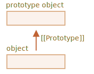
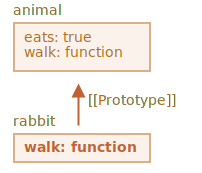

# 프로토타입 상속

우리는 종종 프로그래밍을 하다 보면 확장을 하기를 원합니다. 

예를 들어, 메서드와 속성을 가지고 있는 `user`라는 객체를 가지고 있다고 해 봅시다. 그리고 우리는 이 객체에 살짝 변화를 주면서 `admin`과 `guest`를 추가하고 싶다고 해 봅시다. 우리는 메서드를 복사/구현하는 것이 아니라 `user`가 가지고 있는 것을 재사용하고 싶을 것입니다. 이 위에 새로운 객체를 만드는 것이죠. 

*원형 상속 Prototypal inheritance*은 바로 그것을 돕는 언어 특징입니다. 

## [[Prototype]]

자바스크립트에서, 객체는 `[[Prototype]]`이라는 숨겨진 속성을 가지고 있습니다(specification에 명명되어 있듯이). 이 속성은 `null`이거나 다른 객체를 참조하고 있습니다. 그 객체가 바로 "원형"이라 불리는 객체입니다. 



The prototype is a little bit "magical". When we want to read a property from `object`, and it's missing, JavaScript automatically takes it from the prototype. In programming, such thing is called "prototypal inheritance". Many cool language features and programming techniques are based on it.

The property `[[Prototype]]` is internal and hidden, but there are many ways to set it.

One of them is to use `__proto__`, like this:

```js run
let animal = {
  eats: true
};
let rabbit = {
  jumps: true
};

*!*
rabbit.__proto__ = animal;
*/!*
```

```smart header="`__proto__` is a historical getter/setter for `[[Prototype]]`"
`__proto__`가 `[[Prototype]]`과 *같지 않다*는 것을 기억해 두세요. `__proto__` 그것의 getter/setter입니다.

It exists for historical reasons, in modern language it is replaced with functions `Object.getPrototypeOf/Object.setPrototypeOf` that also get/set the prototype. We'll study the reasons for that and these functions later.

By the specification, `__proto__` must only be supported by browsers, but in fact all environments including server-side support it. For now, as `__proto__` notation is a little bit more intuitively obvious, we'll use it in the examples.
```

만약 우리가 `rabbit` 속성을 찾는다면, 그리고 그게 없다면, 자바스크립트는 자동으로 `animal`에서 그것을 찾을 것입니다.

예를 들어:

```js run
let animal = {
  eats: true
};
let rabbit = {
  jumps: true
};

*!*
rabbit.__proto__ = animal; // (*)
*/!*

// we can find both properties in rabbit now:
*!*
alert( rabbit.eats ); // true (**)
*/!*
alert( rabbit.jumps ); // true
```

여기`(*)`가 표시된 줄에서 `animal`을 `rabbit`의 원형으로 설정하고 있습니다.

이후, `alert`가 `(**)`에서 `rabbit.eats`속성을 읽으려 할 때, `rabbit`에서 읽지 않습니다. 즉, 자바스크립트는 `[[Prototype]]`을 따라가서 참조하고 `animal`에서 해당 속성을 찾아냅니다(이때 아래서부터 찾습니다).


이것을 "`animal`은 `rabbit`의 원형이다"라고 하거나 "`rabbit`은 `animal`으로 부터 원형 상속을 한다."라고 할 수 있습니다.

그래서 만약 `animal`이 많은 유용한 객체와 메서드를 가지고 있다면, `rabbit`에서 자동으로 사용할 수 있게 됩니다. 그런 속성들을 "상속됐다"라고 표현하죠.

만약 우리가 `animal`에 어떤 메서드를 가지고 있다면, `rabbit`에서도 호출할 수 있습니다.

```js run
let animal = {
  eats: true,
*!*
  walk() {
    alert("Animal walk");
  }
*/!*
};

let rabbit = {
  jumps: true,
  __proto__: animal
};

// walk is taken from the prototype
*!*
rabbit.walk(); // Animal walk
*/!*
```

그 메서드는 자동으로 원형에서 가져옵니다. 다음을 보시죠.


이러한 원형 체인은 더 길어질 수 있습니다.

```js run
let animal = {
  eats: true,
  walk() {
    alert("Animal walk");
  }
};

let rabbit = {
  jumps: true,
*!*
  __proto__: animal
*/!*
};

let longEar = {
  earLength: 10,
*!*
  __proto__: rabbit
*/!*
};

// walk는 원형 체인으로부터 얻어옵니다.
longEar.walk(); // Animal walk
alert(longEar.jumps); // true (from rabbit)
```


단지 여기에는 2개의 제약이 있습니다.

1. 참조는 이 순환에 들어가지 않습니다. 만약 우리가 `__proto__`를 원형 체인 순환에 할당하려고 한다면 에러를 던집니다.
2. `__proto__`의 값은 `null`이거나 객체입니다. 이외의 다른 자료형은 무시됩니다.

또한 당연할지 모르지만, 오직 하나의 `[[Portotype]]`만 있을 수 있습니다. 객체는 두 개의 다른 객체로부터 상속받지 않을 테니까요.

## Writing doesn't use prototype

원형은 오직 속성들을 읽는 데 사용합니다.

getter/setter가 아닌 데이터 속성들을 쓰고/지우는 명령들은 객체에 직접 적용할 수 있습니다.

아래 예제에서는, `walk`메서드를 `rabbit`에 할당하고 있습니다:

```js run
let animal = {
  eats: true,
  walk() {
    /* this method won't be used by rabbit */  
  }
};

let rabbit = {
  __proto__: animal
};

*!*
rabbit.walk = function() {
  alert("Rabbit! Bounce-bounce!");
};
*/!*

rabbit.walk(); // Rabbit! Bounce-bounce!
```

이제 부터, `rabbit.walk()`을 호출하면 메서드를 사용하지 않고 즉시 객체에서 찾고 실행할 것입니다. 



Accessor properties are an exception, as assignment is handled by a setter function. So writing to such a property is actually the same as calling a function.

예를 들어, 아래 코드에서 `admin.fullName`속성을 보시면:

```js run
let user = {
  name: "John",
  surname: "Smith",

  set fullName(value) {
    [this.name, this.surname] = value.split(" ");
  },

  get fullName() {
    return `${this.name} ${this.surname}`;
  }
};

let admin = {
  __proto__: user,
  isAdmin: true
};

alert(admin.fullName); // John Smith (*)

// setter triggers!
admin.fullName = "Alice Cooper"; // (**)
```

여기 `(*)`라인의 `admin.fullName`속성은 `user`원형에서 getter를 가지고 있습니다, 그래서 호출된 것이죠. 그리고 `(**)`라인의 속성은 setter를 원형에 가지고 있습니다. 그렇기 때문에 호출된 것입니다.

## "this" 값

위의 예제에서 흥미로운 질문을 던질 수 있습니다: `set fullName(valuie)`에서 `this`는 어떤 값을 가지고 있는가? `this.name`과 `this.surname`은 어디에 코딩되어있는가? `user` 또는 `admin`?

답은 간단합니다. `this`는 원형에 의해 전혀 영향을 받지 않습니다.

**그 메서드가 어디서 호출되는지는 중요하지 않습니다. 객체에서 호출되든 이 객체의 원형에서 호출되든. 메서드 호출에서는, `this`는 언제나 `.`연산 앞에 있는 객체를 가리킵니다.**

그래서, setter는 `admin.fullName=`를 호출해서 `admin`을 `this`로 사용합니다. `user`가 아니고요.

That is actually a super-important thing, because we may have a big object with many methods and inherit from it. Then inherited objects can run its methods, and they will modify the state of these objects, not the big one.

예를 들어, 여기 `animal`가 "메서드 저장소"라고 해보죠, 그리고 `rabbit`은 이것을 사용합니다.

`rabbit.sleep()`호출은 `this.isSleeping`을 `rabbit`객체에 설정할 것입니다.

```js run
// animal has methods
let animal = {
  walk() {
    if (!this.isSleeping) {
      alert(`I walk`);
    }
  },
  sleep() {
    this.isSleeping = true;
  }
};

let rabbit = {
  name: "White Rabbit",
  __proto__: animal
};

// modifies rabbit.isSleeping
rabbit.sleep();

alert(rabbit.isSleeping); // true
alert(animal.isSleeping); // undefined (no such property in the prototype)
```

결과입니다: 


If we had other objects like `bird`, `snake` etc inheriting from `animal`, they would also gain access to methods of `animal`. But `this` in each method call would be the corresponding object, evaluated at the call-time (before dot), not `animal`. So when we write data into `this`, it is stored into these objects.

결과적으로, 메서드는 공유되지만, 객체의 상태는 아닙니다.

## for..in loop

The `for..in` loops over inherited properties too.

For instance:

```js run
let animal = {
  eats: true
};

let rabbit = {
  jumps: true,
  __proto__: animal
};

*!*
// Object.keys only return own keys
alert(Object.keys(rabbit)); // jumps
*/!*

*!*
// for..in loops over both own and inherited keys
for(let prop in rabbit) alert(prop); // jumps, then eats
*/!*
```

If that's not what we want, and we'd like to exclude inherited properties, there's a built-in method [obj.hasOwnProperty(key)](mdn:js/Object/hasOwnProperty): it returns `true` if `obj` has its own (not inherited) property named `key`.

So we can filter out inherited properties (or do something else with them):

```js run
let animal = {
  eats: true
};

let rabbit = {
  jumps: true,
  __proto__: animal
};

for(let prop in rabbit) {
  let isOwn = rabbit.hasOwnProperty(prop);

  if (isOwn) {
    alert(`Our: ${prop}`); // Our: jumps
  } else {
    alert(`Inherited: ${prop}`); // Inherited: eats
  }
}
```

Here we have the following inheritance chain: `rabbit` inherits from `animal`, that inherits from `Object.prototype` (because `animal` is a literal object `{...}`, so it's by default), and then `null` above it:


Note, there's one funny thing. Where is the method `rabbit.hasOwnProperty` coming from? We did not define it. Looking at the chain we can see that the method is provided by `Object.prototype.hasOwnProperty`. In other words, it's inherited.

...But why does `hasOwnProperty` not appear in the `for..in` loop like `eats` and `jumps` do, if `for..in` lists inherited properties?

The answer is simple: it's not enumerable. Just like all other properties of `Object.prototype`, it has `enumerable:false` flag. And `for..in` only lists enumerable properties. That's why it and the rest of the `Object.prototype` properties are not listed.

```smart header="Almost all other key/value-getting methods ignore inherited properties"
Almost all other key/value-getting methods, such as `Object.keys`, `Object.values` and so on ignore inherited properties.

They only operate on the object itself. Properties from the prototype are *not* taken into account.
```

## Summary

- In JavaScript, all objects have a hidden `[[Prototype]]` property that's either another object or `null`.
- We can use `obj.__proto__` to access it (a historical getter/setter, there are other ways, to be covered soon).
- The object referenced by `[[Prototype]]` is called a "prototype".
- If we want to read a property of `obj` or call a method, and it doesn't exist, then JavaScript tries to find it in the prototype.
- Write/delete operations act directly on the object, they don't use the prototype (assuming it's a data property, not a setter).
- If we call `obj.method()`, and the `method` is taken from the prototype, `this` still references `obj`. So methods always work with the current object even if they are inherited.
- The `for..in` loop iterates over both its own and its inherited properties. All other key/value-getting methods only operate on the object itself.
