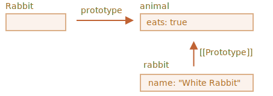

# 함수의 prototype 프로퍼티

`new F()`와 같은 생성자 함수를 이용하면 새로운 객체를 만들 수 있다는 걸 앞서 배운 바 있습니다.

`F.prototype`이 객체라면 `new` 연산자는 `F.prototype`을 사용해 새롭게 생성된 객체의 [[Prototype]]을 설정합니다.

```smart
자바스크립트가 처음 만들어졌을 땐 프로토타입 기반 상속이 주요 기능 중 하나였습니다.

그런데 과거엔 프로로타입에 직접 접근할 방법이 없었습니다. 그나마 믿고 사용할 수 있었던 방법은 이번 챕터에서 설명할 생성자 함수의 `"prototype"` 프로퍼티를 이용하는 방법뿐이었죠. 많은 스크립트가 아직 이 방법을 사용하는 이유가 여기에 있습니다.
```

`F.prototype`에서 `"prototype"`은 `F`에 정의된 일반 프로퍼티라는 점에 주의해 주시기 바랍니다. 앞서 배웠던 '프로토타입' 객체와 같아 보이지만 `F.prototype`에서 `"prototype"`은 이름만 같은 일반 프로퍼티입니다.   

예시:

```js run
let animal = {
  eats: true
};

function Rabbit(name) {
  this.name = name;
}

*!*
Rabbit.prototype = animal;
*/!*

let rabbit = new Rabbit("White Rabbit"); //  rabbit.__proto__ == animal

alert( rabbit.eats ); // true
```

`Rabbit.prototype = animal`은 "`new Rabbit`이 생성되었을 때, 이것의 `[[Prototype]]`을 `animal`로 할당하라."라는 것을 의미합니다.

이를 그림으로 나타내봅시다.



그림에서 가로 화살표는 일반 프로퍼티인 `"prototype"`을, 세로 화살표는 `[[Prototype]]`을 나타냅니다. 세로 화살표는 `rabbit`이 `animal`을 상속받았다는 것을 의미합니다.

```smart header="`F.prototype`은 `new F`이 호출될 때만 사용됩니다."
`F.prototype` 프로퍼티는 `new F`가 호출될 때만 사용되어 새롭게 만들어진 객체의 `[[Prototype]]`을 할당해줍니다. 이 작업 이후엔 `F.prototype`과 새로운 객체의 연관 관계가 사라집니다. `F.prototype`는 '한 번만 쓸 수 있는 선물'이라고 생각하시면 됩니다.

새로운 객체가 만들어진 이후에 `F.prototype` 프로퍼티가 바뀐다면(`F.prototype = <another object>`) `new F`로 만들어지는 새로운 객체는 또 다른 객체를 `[[Prototype]]`으로 갖게 됩니다. 다만, 기존에 있던 객체의 `[[Prototype]]`은 그대로 유지됩니다.
```

## 함수의 prototype 프로퍼티와 constructor 프로퍼티

개발자가 특별히 할당하지 않더라도 모든 함수는 "prototype" 프로퍼티를 갖습니다.

기본 프로퍼티인 `"prototype"`은 `constructor` 프로퍼티 하나만 있는 객체를 가리키는데, `constructor` 프로퍼티는 함수 자신을 가리킵니다.

이 관계를 코드와 그림으로 나타내면 다음과 같습니다.

```js
function Rabbit() {}

/* 기본 prototype
Rabbit.prototype = { constructor: Rabbit };
*/
```


아래 코드를 실행해 이를 확인해봅시다.

```js run
function Rabbit() {}
// 기본 prototype:
// Rabbit.prototype = { constructor: Rabbit }

alert( Rabbit.prototype.constructor == Rabbit ); // true
```

특별한 조작을 가하지 않았다면 `Rabbit`을 구현한 객체 모두에서 `[[Prototype]]`을 거쳐 `constructor` 프로퍼티를 사용할 수 있습니다.

```js run
function Rabbit() {}
// 기본 prototype:
// Rabbit.prototype = { constructor: Rabbit }

let rabbit = new Rabbit(); // {constructor: Rabbit}에서 상속

alert(rabbit.constructor == Rabbit); // true (프로토타입을 거쳐 접근함)
```


`constructor` 프로퍼티를 사용하면 기존에 있던 객체의 `constructor`를 사용해 새로운 객체를 만들 수 있습니다.    

아래와 같이 말이죠.

```js run
function Rabbit(name) {
  this.name = name;
  alert(name);
}

let rabbit = new Rabbit("White Rabbit");

*!*
let rabbit2 = new rabbit.constructor("Black Rabbit");
*/!*
```

객체가 있는데 이 객체를 만들 때 어떤 생성자가 사용되었는지 알 수 없는 경우(예: 객체가 서드 파티 라이브러리에서 온 경우), 이 방식법을 유용하게 쓸 수 있습니다.

어느 방식을 사용해 객체를 만들든 `"constructor"`에서 가장 중요한 점은 다음과 같습니다.

**자바스크립트는 알맞은 `"constructor"` 값을 보장하지 않습니다.**

함수에 기본으로 `"prototype"` 값이 설정되긴 하지만 그게 전부 입니다. `"constructor"`에 벌어지는 일 모두는 전적으로 개발자에게 달려있습니다.

함수의 기본 `"prototype"` 값을 다른 객체로 바꾸면 이 객체엔 `"constructor"`가 없을 겁니다.

예시:

```js run
function Rabbit() {}
Rabbit.prototype = {
  jumps: true
};

let rabbit = new Rabbit();
*!*
alert(rabbit.constructor === Rabbit); // false
*/!*
```

이런 상황을 방지하고 알맞은 `constructor`를 유지하려면 `"prototype"` 전체를 덮어쓰지 말고 기본 `"prototype"`에 원하는 프로퍼티를 추가/제거해야 합니다.

```js
function Rabbit() {}

// Rabbit.prototype 전체를 덮어쓰지 말고
// 원하는 프로퍼티는 그냥 추가하세요.
Rabbit.prototype.jumps = true
// 이렇게 하면 기본 Rabbit.prototype.constructor가 유지됩니다.
```

`constructor` 프로퍼티를 수동으로 다시 만들어주는 것도 대안이 될 수 있습니다.  

```js
Rabbit.prototype = {
  jumps: true,
*!*
  constructor: Rabbit
*/!*
};

// 수동으로 추가해 주었기 때문에 알맞은 constructor가 유지됩니다.
```


## 요약

이번 챕터에선 생성자 함수를 이용해 만든 객체에 `[[Prototype]]`을 설정해 주는 방법에 대해 간략히 알아보았습니다. 이 방법을 기반으로 하는 고급 프로그래밍 패턴에 대해선 추후 학습할 예정입니다. 

몇 가지 사항만 명확하게 이해하고 있으면 지금까지 배운 것들은 복잡하지 않습니다.

- `F.prototype` 프로퍼티(`[[prototype]]`과는 다름)는 `new F()`를 호출할 때 만들어지는 새로운 객체의 `[[Prototype]]`을 설정합니다.
- `F.prototype`의 값은 객체나 null만 가능합니다. 다른 값은 무시됩니다.
- 지금까지 배운 내용은 생성자 함수에 `"prototype"`를 설정하고, 이 생성자 함수를 `new`를 사용해 호출할 때만 적용됩니다.

일반 객체에 `"prototype"` 프로퍼티를 사용하면 아무런 일이 일어나지 않습니다.
```js
let user = {
  name: "John",
  prototype: "Bla-bla" // 마술은 일어나지 않습니다.
};
```

모든 함수는 기본적으로 `F.prototype = { constructor : F }`를 가지고 있으므로 함수의 `"constructor"` 프로퍼티를 사용하면 객체의 생성자를 얻을 수 있습니다.
