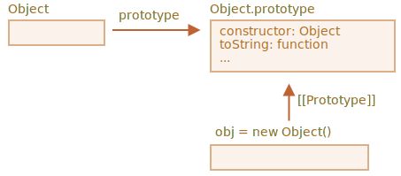

# 네이티브 프로토타입

`prototype` 프로퍼티는 자바스크립트 내에서 널리 이용됩니다. 모든 내장 생성자 함수에서 사용됩니다.

첫 번째로 자세히 살펴본 다음 어떻게 내장 객체에 새 기능을 추가하여 프로토타입 프로퍼티를 사용하는지 알아보겠습니다.

## Object.prototype

빈 객체를 표현한다고 생각해 봅시다.

```js run
let obj = {};
alert( obj ); // "[object Object]" ?
```

`"[object Object]"` 문자열을 생성하는 코드는 어디에 있나요? 이는 내장 `toString` 메서드 입니다. 하지만 어디에 있을까요? `obj`는 비어 있습니다!

`obj = {}`의 줄임법은 `obj = new Object()`와 같습니다. 여기서 `Object`는 큰 객체에 `toString`메서드와 다른 메서드으로 큰 객체를 참조하는 자체 프로토타입을 가진 내장 객체 생성자 함수입니다.

어떤 일이 벌어지는지 보겠습니다.


`new Object()`를 호출하거나 실제 객체 `{...}`가 생성되었다고 할 때 객체의 `[Prototype]`은 이전 챕터에서 얘기한 룰에 따라서 `Object.prototype`으로 설정됩니다.



따라서 `obj.toString()`이 호출될 때 메서드는 `Object.prototype`으로부터 가져옵니다.

예제를 확인해 봅시다.

```js run
let obj = {};

alert(obj.__proto__ === Object.prototype); // true
// obj.toString === obj.__proto__.toString == Object.prototype.toString
```

`Object.prototype`위의 체인에는 더 이상`[[Prototype]]`이 없는 점을 알아두세요.

```js run
alert(Object.prototype.__proto__); // null
```

## 다른 내장 프로토타입

`Array`, `Date`, `Function`을 포함한 다른 내장 객체들 또한 메서드를 프로토타입 안에 유지합니다.

예를 들면 배열`[1, 2, 3]` 을 생성할 때 기본 `new Array()` 생성자는 내부적으로 사용됩니다. 그래서 `Array.prototype`이 프로토타입이 되고 메서드를 제공하게 됩니다. 이는 상당히 메모리 효율적입니다.

구체적으로 모든 내장 프로토타입은 `Object.prototype`을 가장 위에 가집니다. 이 때문에 몇몇 사람들은 "모든 것은 객체로부터 온다"라고 말합니다.

여기 전체적인 3개의 내장객체에 대한 그림이 있습니다.


프로토타입을 각각 확인해 봅시다.

```js run
let arr = [1, 2, 3];

// Array.prototype으로부터 상속되었나?
alert( arr.__proto__ === Array.prototype ); // true

// 그럼 Object.prototype부터?
alert( arr.__proto__.__proto__ === Object.prototype ); // true

// 그리고 가장 위의 null값
alert( arr.__proto__.__proto__.__proto__ ); // null
```

몇몇 프로토타입의 메서드가 중복이 될 수도 있습니다. 예를 들어 `Array.prototype`은 쉼표를 통해 구분된 요소들을 나열하는 자기 자신의 `toString`를 가집니다.

```js run
let arr = [1, 2, 3]
alert(arr); // 1,2,3 <-- Array.prototype.toString 의 결과
```

전에 보았던 대로, `Object.prototype` 또한 `toString`을 가지고 있습니다. 그러나 `Array.prototype`이 체인에 더 가깝기 때문에 Array의 toString이 사용되었습니다.


Chrome 개발자 콘솔과 같은 브라우저 툴 내에서는 상속을 보여줍니다.(`console.dir`는 아마 내장 객체를 사용하기 위해 필요합니다.)


다른 내장 객체들 또한 같은 방법으로 동작합니다. 심지어 내장 `Function`의 객체 함수 생성자와 메서드(`call`/`apply` 등등)들도  `Fuction.prototype`으로 부터 가져옵니다. 함수 또한 자기 자신의`toString`를 가지고 있습니다.

```js run
function f() {}

alert(f.__proto__ == Function.prototype); // true
alert(f.__proto__.__proto__ == Object.prototype); // true, inherit from objects
```

## 원시값

가장 복잡한 것은 문자열, 숫자 그리고 불값과 함께 생깁니다.

기억하다시피 이것들은 객체가 아닙니다. 그러나 그들의 프로퍼티에 접근하려고 시도한다면 내장 생성자 `String`, `Number`, `Boolean`을 사용하는 임시 래퍼 객체가 생성되며 메서드를 제공하고 사라집니다.

이러한 객체들은 눈에 보이지 않게 생성되고 대부분의 엔진은 이를 최적화합니다. 명세서에도 이처럼 묘사됩니다. 객체들의 메서드는 `String.prototype`, `Number.prototype`, `Boolean.prototype`처럼 사용할 수 있는 프로토타입 안에 존재합니다.

```warn header="`null`과 `undefined`의 값은 객체 래퍼를 가지지 않습니다."
특수한 값인 `null`과 `undefined`는 다른 것과는 거리가 있습니다. 객체 래퍼가 없기 때문에 메서드와 프로퍼티를 이용할 수 없습니다. 그리고 해당하는 프로퍼티도 존재하지 않습니다.
```

## 네이티브 프로토타입 변경[#native-prototype-change]

네이티브 프로토타입은 변경될 수 있습니다. 예를 들어 메서드를 `String.prototype`에 추가한다면 모든 문자열에서 `String.prototype`을 사용할 수 있습니다.

```js run
String.prototype.show = function() {
  alert(this);
};

"BOOM!".show(); // BOOM!
```

개발과정 도중 사용자의 편의에 따른 새로운 내장 메서드를 생성할 수 있습니다. 또한 새로운 내장 메서드를 네이티브 프로토타입에 추가할 수도 있습니다. 그러나 일반적으로 좋지 않은 아이디어입니다.

```warn
프로토타입은 전체에 영향을 미칩니다. 그래서 충돌이 쉽게 일어나는데 두 개의 라이브러리에서 `String.prototype.show` 메서드를 추가할 때 하나의 라이브러리에서 다른 하나의 라이브러리의 메서드를 덮어쓰게 됩니다.

그래서 일반적으로 네이티브 프로토타입을 수정하는 것은 좋지 않은 아이디어입니다.
```

**모던 프로그래밍에서는 오직 한 경우에만 네이티브 프로토타입 변경을 허용하고 있는데 바로 폴리필링입니다.**

폴리필링은 자바스크립트 명세서에 존재하는 메서드에 대한 대체재를 만드는 데 사용하는데 현재의 자바스크립트 엔진에서는 아직 지원하지 않습니다.

따라서 폴리필링을 수동으로 실행하며 내장 프로토타입과 함께 값을 가져옵니다.

예시:

```js run
if (!String.prototype.repeat) { // 해당 메서드가 존재하지 않는다면
  // 프로토타입을 추가

  String.prototype.repeat = function(n) {
    // string을 n회 반복

    // 사실 코드는 이거보다 조금 더 복잡합니다.
    // 모든 알고리즘은 명세서 안에 있습니다.
    // 그런데도 이 불완전한 폴리필은 종종 사용되기 충분합니다.
    return new Array(n + 1).join(this);
  };
}

alert( "La".repeat(3) ); // LaLaLa
```


## 프로토타입으로부터 빌리기

<info:call-apply-decorators#method-borrowing>에서는 메서드 빌리기에 관하여 얘기하였습니다.

이는 메서드를 하나의 객체로부터 가져온 다음 다른 객체에 복사하는 것입니다.

몇몇 네이티브 프로토타입의 메서드들은 자주 사용됩니다.

예를 들어 객체와 같은 배열을 만든다고 하면 아마 `Array` 메서드를 객체에 복사해야 합니다. 

예시

```js run
let obj = {
  0: "Hello",
  1: "world!",
  length: 2,
};

*!*
obj.join = Array.prototype.join;
*/!*

alert( obj.join(',') ); // Hello,world!
```

코드는 정상작동 합니다. 왜냐하면,내장 `join`메서드의 내장 알고리즘은 단지 인덱스의 일치 여부만 케어하며 `length` 프로퍼티는 객체가 실제로 배열에 존재하는지 체크하지 않습니다. 그리고 수많은 내장 메서드들도 또한 이와 같습니다.

다른 가능성은 `obj.__proto__`를 `Array.prototype`에 상속시키는 것입니다. 그래서 모든 `Array`메서드가 자동으로 `obj`에서 사용 가능하게 하는 것입니다. 
 
 `obj`가 이미 다른 객체로부터 상속받았다면 위 방법은 불가능합니다. 오직 한 번에 하나의 객체로부터 상속 가능함을 기억해 두세요.

메서드 빌리기는 유연하여 필요에 따라 함수적 기능을 섞는 것을 다른 객체로부터 가능하게 합니다.

## 요약

- 모든 내장 객체는 같은 패턴을 따릅니다.
    - 메서드는 프로토타입에 저장됩니다(`Array.prototype`, `Object.prototype`, `Date.prototype` 등).
    - 객체 스스로는 단지 데이터만 저장합니다(배열의 아이템, 객체의 프로퍼티, 날짜).
- 원시값 또한 객체 래퍼의 프로토타입 안에 `Number.prototype`, `String.prototype`, `Boolean.prototype`과 같은 메서드를 저장합니다. `undefined` 와 `null` 값만 객체 래퍼를 가지지 않습니다. 
- 내장 프로토타입은 수정 가능하며 새로운 메서드와 함께 값을 가져올 수 있습니다. 그러나 내장 프로토타입을 변경하는 것을 추천하진 않습니다. 아마 새로운 표준을 추가하려고 할 때 만 가능합니다. 그러나 이는 자바스크립트 엔진 메서드에서는 아직 지원하지 않습니다.
