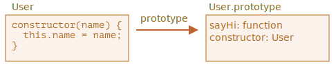

# 클래스와 기본 문법

```quote author="위키백과"
클래스(class)는 객체 지향 프로그래밍(OOP)에서 특정 객체를 생성하기 위해 변수와 메소드를 정의하는 일종의 틀로, 객체를 정의하기 위한 상태(멤버 변수)와 메서드(함수)로 구성된다.
```

실무에선 사용자나 물건같이 동일한 종류의 객체를 여러 개 생성해야 하는 경우가 잦습니다.

이럴 때 <info:constructor-new>에서 배운 `new function`를 사용할 수 있습니다.

여기에 더하여 모던 자바스크립트에 도입된 `클래스`라는 문법을 사용하면 객체 지향 프로그래밍에서 사용되는 다양한 기능을 자바스크립트에서도 사용할 수 있습니다.

## 기본 문법

클래스는 다음과 같은 기본 문법을 사용해 만들 수 있습니다.
```js
class MyClass {
  // 다양한 메서드
  constructor() { ... }
  method1() { ... }
  method2() { ... }
  method3() { ... }
  ...
}
```

이렇게 클래스를 만들고, `new MyClass()`를 호출하면 위 예시에서 정의한 메서드가 들어있는 객체가 생성됩니다.

객체의 기본 상태를 설정해주는 생성자 메서드 `constructor()`는 `new`에 의해 자동으로 호출되므로, 특별한 절차 없이 객체를 초기화 할 수 있습니다.

예시:

```js run
class User {

  constructor(name) {
    this.name = name;
  }

  sayHi() {
    alert(this.name);
  }

}

// 사용법:
let user = new User("John");
user.sayHi();
```

`new User("John")`를 호출하면 아래와 같은 일이 일어납니다.
1. 새로운 객체가 생성됩니다.
2. `constructor`가 자동으로 실행됩니다. 위 예시에선 이때 인수 `"John"`이 `this.name`에 할당됩니다.

`user.sayHi()`와 같은 객체 메서드를 호출할 수 있는 이유가 바로 이런 과정 때문입니다.


```warn header="클래스 메서드 사이엔 쉼표가 없습니다."
초보 개발자는 클래스 메서드 사이에 쉼표를 넣는 실수를 저지르곤 합니다. 이렇게 쉼표를 넣게 되면 문법 에러가 발생합니다.

클래스와 관련된 표기법은 객체 리터럴 표기법과 차이가 있음에 유의하시기 바랍니다. 클래스에선 메서드 사이에 쉼표를 넣지 않아도 됩니다.
```

## 클래스란?

이 시점에서 "`클래스`가 정확히 뭔가요?"라는 의문이 생기실 겁니다. 클래스는 이 글을 읽고 계신 여러분의 생각처럼 자바스크립트 차원에서 새롭게 창안 한 개체(entity)가 아닙니다.

클래스가 보여주는 다양한 마법의 원리를 하나씩 알아보며 클래스가 정확히 무엇인지 알아봅시다. 이 과정을 거치고 나면 자바스크립트의 복잡한 기능을 이해할 수 있게 됩니다.

자바스크립트에서 클래스는 함수의 한 종류입니다.

코드를 통해 이를 확인해봅시다.

```js run
class User {
  constructor(name) { this.name = name; }
  sayHi() { alert(this.name); }
}

// User가 함수라는 증거
*!*
alert(typeof User); // function
*/!*
```

`class User {...}`라는 문법 구조가 진짜 하는 일은 다음과 같습니다.

1. 클래스 선언의 결과로 `User`라는 이름을 가진 함수가 만들어집니다. 함수 본문의 코드는 생성자 메서드 `constructor`에서 가져옵니다(생성자 메서드가 없다면 함수 본문이 비어진 채로 함수가 만들어집니다).
2. `sayHi`같은 클래스 내에서 정의한 메서드를 `User.prototype`에 저장합니다.

`new User`를 호출해 객체를 만들고, 객체의 메서드를 호출하면 <info:function-prototype>챕터에서 설명한 것처럼 해당 메서드를 프로토타입에서 가져옵니다. 이 과정이 있기 때문에 객체에서 클래스 메서드에 접근할 수 있습니다.

`class User` 선언의 결과를 그림으로 나타내면 아래와 같습니다.



아래 코드를 실행해 보면서 지금까지 설명한 것들을 다시 확인해봅시다.

```js run
class User {
  constructor(name) { this.name = name; }
  sayHi() { alert(this.name); }
}

// 클래스는 함수입니다.
alert(typeof User); // function

// 정확히는 생성자 메서드와 동일합니다.
alert(User === User.prototype.constructor); // true

// 클래스 내부에서 정의한 메서드는 User.prototype에 저장됩니다.
alert(User.prototype.sayHi); // alert(this.name);

// 이 예시에서 프로토타입에는 메서드 두 개만 있습니다.
alert(Object.getOwnPropertyNames(User.prototype)); // constructor, sayHi
```

## 클래스는 단순한 편의 문법이 아닙니다.

어떤 사람들은 `class`라는 키워드 없이도 클래스 역할을 하는 함수를 선언할 수 있어서 `클래스`는 '편의 문법(syntax sugar, 기존 문법을 편리하게 읽기 위해 만든 문법으로, 기존 문법과 기능은 동일함)'에 불과하다고 이야기합니다.

```js run
// 순수 함수만으로 class User와 동일한 기능을 하는 코드를 만들어보겠습니다.

// 1. 생성자 함수를 만듭니다.
function User(name) {
  this.name = name;
}
// 모든 함수의 프로토타입은 constructor 프로퍼티를 기본으로 갖고 있으므로
// constructor 프로퍼티를 명시적으로 만들 필요가 없습니다.

// 2. prototype 프로퍼티에 메서드를 추가합니다.
User.prototype.sayHi = function() {
  alert(this.name);
};

// 사용법:
let user = new User("John");
user.sayHi();
```

위 예시처럼 순수 함수로 클래스 역할을 하는 함수를 선언하는 방법과 `class` 키워드를 사용하는 방법의 결과는 거의 같습니다. `class`를 사용하는 방법이 단순한 편의 문법이라고 생각하는 이유가 여기에 있습니다. 

그럼에도 불구하고, 두 방법에는 다음과 같은 중요한 차이점 몇 가지가 있습니다.

1. `class`로 만든 함수엔 수동으로 만든 함수와는 달리 특수한 내부 프로퍼티인 `[[FunctionKind]]:"classConstructor"`가 이름표처럼 붙습니다.

    여기에 더하여 일반 함수와 달리 클래스 생성자는 반드시 `new`와 함께 호출해야 합니다.

    ```js run
    class User {
      constructor() {}
    }

    alert(typeof User); // function
    User(); // Error: Class constructor User cannot be invoked without 'new'
    ```

    대부분의 자바스크립트 엔진이 클래스 생성자를 문자열로 표현할 때 'class...'로 시작하는 문자열로 표현한다는 점 역시 다릅니다.

    ```js run
    class User {
      constructor() {}
    }

    alert(User); // class User { ... }
    ```

2. 클래스 메서드는 열거형이 아닙니다(non-enumerable).
    클래스의 `"prototype"` 프로퍼티에 추가된 모든 메서드의 `enumerable` 플래그는 `false`입니다.

    `for..in`으로 객체를 순회할 때, 메서드는 순회 대상에서 제외하고자 하는 경우가 많으므로 이 특징은 도움이 됩니다.

3. 클래스는 항상 `엄격 모드`로 실행됩니다(`use strict`).
    클래스 생성자 안의 모든 코드엔 자동으로 엄격 모드가 적용됩니다.

이 외에도 `class`를 사용하면 다양한 기능이 따라오는데, 이에 대해선 추후에 다루도록 하겠습니다. 

## 클래스 표현식

함수와 마찬가지로 클래스도 또 다른 표현식 내부에서 정의, 전달, 반환, 할당될 수 있습니다. 

아래는 클래스 표현식에 대한 예시입니다.

```js
let User = class {
  sayHi() {
    alert("Hello");
  }
};
```

기명 함수 표현식(Named Function Expression)과 유사하게 클래스 표현식도 이름을 붙일 수 있습니다.

클래스 표현식에 이름을 붙이면, 이 이름은 오직 클래스 내부에서만 사용할 수 있습니다.

```js run
// 기명 클래스 표현식(Named Class Expression)
// (명세서엔 없는 용어이지만, 기명 함수 표현식과 유사하게 동작합니다.)
let User = class *!*MyClass*/!* {
  sayHi() {
    alert(MyClass); // MyClass라는 이름은 오직 클래스 안에서만 사용할 수 있습니다.
  }
};

new User().sayHi(); // 제대로 동작합니다(MyClass의 정의를 보여줌).

alert(MyClass); // 에러가 발생합니다. MyClass는 클래스 밖에서 사용할 수 없습니다.
```


아래와 같이 '필요에 따라' 클래스를 동적으로 생성하는 것도 가능합니다.

```js run
function makeClass(phrase) {
  // 클래스를 선언하고 이를 반환함
  return class {
    sayHi() {
      alert(phrase);
    };
  };
}

// 새로운 클래스를 만듦
let User = makeClass("Hello");

new User().sayHi(); // Hello
```


## getter,setter를 비롯한 기타 단축 구문

리터럴 표기법을 사용해 만든 객체처럼 클래스도 getter나 setter, 계산된 프로퍼티(computed property)를 포함할 수 있습니다.

아래 예시에선 `get`과`set`을 이용해 `user.name`에 값을 할당하고 있습니다.

```js run
class User {

  constructor(name) {
    // setter를 활성화합니다.
    this.name = name;
  }

*!*
  get name() {
*/!*
    return this._name;
  }

*!*
  set name(value) {
*/!*
    if (value.length < 4) {
      alert("이름이 너무 짧습니다.");
      return;
    }
    this._name = value;
  }

}

let user = new User("John");
alert(user.name); // John

user = new User(""); // 이름이 너무 짧습니다.
```

클래스를 선언하면 아래와 같이 `User.prototype`에 getter와 setter가 만들어지므로 get과 set을 사용할 수 있습니다.

```js
Object.defineProperties(User.prototype, {
  name: {
    get() {
      return this._name
    },
    set(name) {
      // ...
    }
  }
});
```

아래 예시와 같이 대괄호 `[...]`를 이용한 계산된 프로퍼티도 사용할 수 있습니다.

```js run
class User {

*!*
  ['say' + 'Hi']() {
*/!*
    alert("Hello");
  }

}

new User().sayHi();
```

## 클래스 프로퍼티

```warn header="구식 브라우저는 폴리필이 필요할 수 있습니다."
클래스 레벨의 프로퍼티는 근래에 더해진 기능입니다.
```

위 예시의 `User`엔 메서드 하나만 있는데, 프로퍼티를 더해 봅시다.

```js run
class User {
*!*
  name = "Anonymous";
*/!*

  sayHi() {
    alert(`Hello, ${this.name}!`);
  }
}

new User().sayHi();
```

프로퍼티 `name`은 `User.prototype`에 있지 않습니다. 대신 생성자를 호출하기 전, `new`에 의해 생성됩니다. `name`은 객체 자체의 프로퍼티입니다.

## 요약

아래와 같은 기본문법을 사용해 클래스를 만들 수 있습니다.

```js
class MyClass {
  prop = value; // 프로퍼티

  constructor(...) { // 생성자 메서드
    // ...
  }

  method(...) {} // 메서드

  get something(...) {} // getter 메서드
  set something(...) {} // setter 메서드

  [Symbol.iterator]() {} // 계산된 이름(computed name)을 사용해 만드는 메서드 (심볼도 가능)
  // ...
}
```

`MyClass`는 `constructor`의 코드를 본문으로 갖는 함수입니다. `MyClass`에서 정의한 일반 메서드나 getter, setter는 `MyClass.prototype`에 쓰여집니다.

이어지는 챕터에선 상속을 비롯한 클래스의 다양한 기능에 대해 알아보겠습니다.
