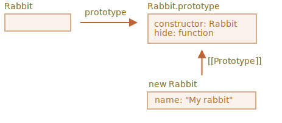

# 클래스 상속

두 개의 클래스가 있다고 가정해 보겠습니다.

`Animal`:

```js
class Animal {
  constructor(name) {
    this.speed = 0;
    this.name = name;
  }
  run(speed) {
    this.speed += speed;
    alert(`${this.name} runs with speed ${this.speed}.`);
  }
  stop() {
    this.speed = 0;
    alert(`${this.name} stands still.`);
  }
}

let animal = new Animal("My animal");
```


...그리고 `Rabbit`:

```js
class Rabbit {
  constructor(name) {
    this.name = name;
  }
  hide() {
    alert(`${this.name} hides!`);
  }
}

let rabbit = new Rabbit("My rabbit");
```




현재 위의 예시 클래스들은 완전히 독립적입니다.

그런데 `Rabbit`을 `Animal`의 연장선에 놓고 싶다고 한다면. 자세히 설명하자면, rabbits는 Animal 클래스를 기반으로 두고 있고, `Animal` 클래스의 메서드들과 독립적인 메서드들로 구성되게 하고 싶다고 해보죠.

다른 클래스로부터 상속받으려면, `"extends"`를 사용해서 braces `{..}`전에 부모 클래스를 명시해야 합니다.

아래 코드는 `Rabbit`이 `Animal`을 상속하는 방법을 보여주고 있습니다.

```js run
class Animal {
  constructor(name) {
    this.speed = 0;
    this.name = name;
  }
  run(speed) {
    this.speed += speed;
    alert(`${this.name} runs with speed ${this.speed}.`);
  }
  stop() {
    this.speed = 0;
    alert(`${this.name} stands still.`);
  }
}

// "extends Animal"를 사용해서 Animal로 부터 상속 받습니다
*!*
class Rabbit extends Animal {
*/!*
  hide() {
    alert(`${this.name} hides!`);
  }
}

let rabbit = new Rabbit("White Rabbit");

rabbit.run(5); // 하얀토끼는 스피드 5로 달립니다.
rabbit.hide(); // 하얀토끼는 숨었습니다!
```

이제 `Rabbit` 코드는 `Animal`의 생성자를 사용함으로써 더 짧아졌고 Animal 클래스에서 정의된 `run` 메서드를 사용할 수 있습니다. 

내부적으로, `extends` 키워드는 `[[Prototype]]` 참고하는 것을 `Rabbit.prototype`에서 `Animal.prototype`으로 추가합니다.


그래서 만약에 `Rabbit.prototype` 안에서 메서드를 찾을 수 없으면, 자바스크립트는 `Animal.prototype`에서 가져옵니다.

<info:native-prototypes> 챕터에서 살펴봤듯이, 자바스크립트는 내장 객체를 위해 같은 프로토타입을 상속합니다. 예를 들면, `Date.prototype.[[Prototype]]` 은 `Object.prototype` 이기 때문에 dates는 일반적인 객체의 메서드인 것이죠.

````smart header="`extends` 이후에 어떠한 표현형식이든 가능합니다"
클래스 문법은 오직 클래스만 정의할 수 있게 하는 것이 아니라 `extends` 후에 어떠한 표현 식이든 추가할 수 있습니다.

예를 들면, 아래의 함수처럼 부모 클래스를 생성한다고 해보겠습니다.

```js run
function f(phrase) {
  return class {
    sayHi() { alert(phrase) }
  }
}

*!*
class User extends f("Hello") {}
*/!*

new User().sayHi(); // Hello
```
위의 예제에서 `class User` 는 `f("Hello")`의 결과를 상속합니다.

이런 방법은 함수를 사용하여 다양한 조건에 따라 클래스를 생성하고 상속이 요구되는 고급 프로그래밍 패턴을 사용할 때 유용합니다.

## 메서드 오버라이딩

이제 더 자세히 배워보겠습니다. 지금까지는 `Rabbit`이 `stop`메서드를 상속하고 `Animal`에서 온 `stop`메서드는 `this.speed = 0`으로 설정했었습니다.

만약에 독립적인 `stop`메서드를 `Rabbit` 안에 정의할 수 있다면 다음과 같을 것입니다.

```js
class Rabbit extends Animal {
  stop() {
    // ...여기에 정의될 메서드가 rabbit.stop() 으로 호출될 것입니다.
  }
}
```

...그러나 일반적으로 부모 메서드를 완전히 대체하기보다는 그 위에 기능을 추가하거나 수정하거나 확장하는 것이 좋습니다. 메서드에서 무언가를 수행하지만 처리 전후 또는 처리 중에 부모 메서드를 호출하기 때문이죠.

이것을 위해 클래스들은 `"super"`라는 키워드를 제공합니다.

- `super.method(...)` 는 부모 클래스의 메서드를 호출합니다.
- `super(...)` 는 부모의 생성자를 호출합니다. (상속받는 생성자의 안에서만 사용해야 합니다).

예를 들어 아래의 rabbit에서 stop 되었을 때 어떻게 자동으로 hide를 호출하는지 알아보겠습니다.

```js run
class Animal {

  constructor(name) {
    this.speed = 0;
    this.name = name;
  }

  run(speed) {
    this.speed += speed;
    alert(`${this.name} runs with speed ${this.speed}.`);
  }

  stop() {
    this.speed = 0;
    alert(`${this.name} stands still.`);
  }

}

class Rabbit extends Animal {
  hide() {
    alert(`${this.name} hides!`);
  }

*!*
  stop() {
    super.stop(); // 부모의 stop을 호출합니다.
    this.hide(); // 그리고 hide 메서드를 실행합니다.
  }
*/!*
}

let rabbit = new Rabbit("White Rabbit");

rabbit.run(5); // 하얀 토끼는 스피드 5로 달립니다.
rabbit.stop(); // 하얀 토끼는 그대로 서 있습니다. 그리고 숨었습니다!
```

여기서 `Rabbit`은 부모 클래스로부터 `super.stop()`메서드를 호출하는 `stop` 메서드를 가지고 있습니다. 

````smart header="화살표 함수는 `super`가 없습니다"
<info:arrow-functions> 챕터에서 언급했듯이, 화살표 함수는 `super`를 가지고 있지 않습니다.

만약에 부모 함수에 접근 가능하다면 외부의 함수에서 가져온 것일 것입니다. 아래 예제를 보면 알 수 있습니다.
```js
class Rabbit extends Animal {
  stop() {
    setTimeout(() => super.stop(), 1000); // 부모의 stop을 1초 후에 호출합니다
  }
}
```

화살표 함수 안의 `super`는 `stop()` 안에서 쓰인 것과 같아서 의도한 대로 동작할 것입니다. 그런데 만약에 "정규" 함수를 여기에 정의한다면, 에러가 발생할 것입니다.

```js
// 예상하지 못한 super
setTimeout(function() { super.stop() }, 1000);
```


## 생성자 오버라이딩

생성자를 오버라이딩 하는 데에는 기술이 조금 필요합니다.

아직은 `Rabbit` 은 자신만의 `생성자(contructor)`를 가지고 있지 않았습니다.

[자바스크립트 명세서](https://tc39.github.io/ecma262/#sec-runtime-semantics-classdefinitionevaluation)에 따르면 만약 클래스가 다른 클래스를 확장하고 생성된 클래스가 `생성자`를 가지고 있지 않다면, "비어있는" `생성자`를 생성합니다.

```js
class Rabbit extends Animal {
  // 자신의 생성자가 없는 상속받는 클래스를 생성합니다.
*!*
  constructor(...args) {
    super(...args);
  }
*/!*
}
```

위에 예시에서처럼 해당 클래스의 생성자를 명시하지 않을 때는 기본적으로 부모의 `생성자`를 모든 인수와 함께 전달합니다.

이제 `Rabbit`에 특수한 생성자를 추가해 보겠습니다. 생성자에서 `earLength`를 정의하고 `name`을 추가할 것입니다.

```js run
class Animal {
  constructor(name) {
    this.speed = 0;
    this.name = name;
  }
  // ...
}

class Rabbit extends Animal {

*!*
  constructor(name, earLength) {
    this.speed = 0;
    this.name = name;
    this.earLength = earLength;
  }
*/!*

  // ...
}

*!*
// 아래의 코드는 동작하지 않습니다!
let rabbit = new Rabbit("White Rabbit", 10); // 에러: 정의되지 않음..
*/!*
```

이런! 에러가 발생합니다. 이제 rabbits를 생성할 수 없네요. 무엇이 잘못된 것일까요?

간단히 설명하자면 상속받은 클래스들 안의 생성자는 `this`를 사용하기 전에 `super(...)`를 반드시 호출해야 합니다.

...그런데 왜 그래야 할까요? 무슨 일이 일어나고 있는 걸까요? 결국, 이런 요구사항은 뭔가 이상해 보입니다.

당연히 super를 반드시 호출해야 하는 상황을 설명할 수 있습니다. 자세히 보면 무슨 일이 일어나는지 이해할 수 있을 것입니다.

자바스크립트에서는 "상속하는 클래스의 생성자 함수"와 다른 모든 클래스 사이에는 구분이 있습니다. 상속 클래스에서 상응하는 생성자 함수는 특별한 내부 속성 `[[ConstructorKind]]:"derived"` 로 레이블이 지정되어 있습니다. 하지만 일반적으로 상위 메소드를 완전히 대체하기보다는 그 위에 기능을 추가하거나 수정하거나 확장하는 것이 좋습니다. 메서드에서 무언가를 수행하는 것처럼 보이지만, 처리 전후 또는 처리 중에 부모 메서드를 호출하기 때문이죠.

다른 점은 다음과 같습니다.

- 일반 생성자가 실행되면 빈 객체를 `this`로 만들고 계속 진행합니다.
- 그러나 파생된 생성자가 실행될 때는 파생되지 않습니다. 부모 생성자가 이러한 작업을 수행할 것으로 기대합니다.

그래서 만약 생성자를 생성한다면, `super`를 호출해야 합니다. 그렇지 않으면 `this`를 빈 객체로 생성할 것이기 때문입니다. 그래서 오류가 발생한 것입니다.

`Rabbit`이 작동하려면, 다음과 같이 `this`를 사용하기 전에 `super()`를 호출해야 합니다.

```js run
class Animal {

  constructor(name) {
    this.speed = 0;
    this.name = name;
  }

  // ...
}

class Rabbit extends Animal {

  constructor(name, earLength) {
*!*
    super(name);
*/!*
    this.earLength = earLength;
  }

  // ...
}

*!*
// now fine
let rabbit = new Rabbit("White Rabbit", 10);
alert(rabbit.name); // White Rabbit
alert(rabbit.earLength); // 10
*/!*
```


## Super: internals, [[HomeObject]]

super의 숨겨진 부분을 조금 더 깊숙이 들어가 보겠습니다. 흥미로운 것들을 보게 될 것입니다.

먼저 지금까지 배운 모든 것에서, `super`가 전혀 작동하지 않는다는 것을 명심하세요!

실제 기술적으로 어떻게 super가 작동 할 수 있는지 스스로 답해보세요. 객체 메서드가 실행되면 현재 객체를 `this` 로 가져옵니다. `super.method()` 를 호출하면 현재 객체의 프로토타입에서 `method` 를 가져와야합니다.

작업은 단순해 보일 수도 있지만 그렇지 않습니다. 엔진은 현재 객체 `this`를 알고 있음으로, 부모 `method` 를 `this .__ proto __. method`로 얻을 수 있을것 같지만 불행히도 이러한 "간단한" 해결책은 효과가 없습니다.

여기에 어떠한 문제가 있는지 설명해 보겠습니다. 클래스가 없으면 단순성을 위해 일반 오브젝트를 사용합니다.

아래 `rabbit .__ proto__ = animal` 예시를 보면, `rabbit.eat ()`에서`this .__ proto__`를 사용하여`animal.eat ()`를 호출하는 것을 시도합니다.

```js run
let animal = {
  name: "Animal",
  eat() {
    alert(`${this.name} eats.`);
  }
};

let rabbit = {
  __proto__: animal,
  name: "Rabbit",
  eat() {
*!*
    // super.eat() 이 작동할 방법일 것입니다
    this.__proto__.eat.call(this); // (*)
*/!*
  }
};

rabbit.eat(); // Rabbit eats.
```

`(*)`줄에서는 prototype (`animal`)에서`eat`을 가져와서 현재 객체의 컨텍스트에서 호출합니다. 간단한`this .__ proto __. eat ()`은 현재 객체가 아니라 프로토타입의 맥락에서 부모의 `eat` 을 실행할 것이기 때문에 `.call (this)`이 중요하게 사용되었습니다.

그래서 위의 코드는 실제 의도 한 대로 작동합니다. `경고` 문구가 올바르게 출력됩니다.

이제 하나의 객체를 체인에 추가해 봅시다. 상황이 어떻게 잘못되는지 볼 수 있습니다.

```js run
let animal = {
  name: "Animal",
  eat() {
    alert(`${this.name} eats.`);
  }
};

let rabbit = {
  __proto__: animal,
  eat() {
    // ...rabbit-style 로 바운싱해서 부모(animal)의 메서드를 호출
    this.__proto__.eat.call(this); // (*)
  }
};

let longEar = {
  __proto__: rabbit,
  eat() {
    // ...long ears 에서 부모(rabbit)의 메서드를 호출
    this.__proto__.eat.call(this); // (**)
  }
};

*!*
longEar.eat(); // 에러: 최대 호출 스택 크기를 초과했습니다.
*/!*
```

코드가 이제는 작동하지 않습니다! `longEar.eat ()`를 호출하는 동안 오류를 볼 수 있습니다.

정확하게 보이지 않을 수도 있습니다만 `longEar.eat ()` 호출을 추적하면 그 이유를 알 수 있습니다. `(*)` 와 `(**)` 두 줄에서 `this`의 값은 현재 객체 (`longEar`)입니다. 이것은 필수입니다. 그래서 모든 객체 메서드는 현재의 객체를 프로토타입이나 무언가가 아닌 `this`로 얻습니다.

그래서`(*)`와`(**)`두 줄에서 `this .__ proto__` 의 값은 정확히 `rabbit`으로 동일합니다. 그래서 둘 다 무한 루프속에서 `rabbit.eat`을 호출하려고 합니다.

아래 그림에서 무슨 일이 일어나고 있는지 이해를 도와줄 것입니다.


1. `longEar.eat ()` 내부에서 `(**)` 는 `this = longEar` 를 가지고 있는 `rabbit.eat` 을 호출합니다.
    ```js
    // longEar.eat() 내부에서는 this = longEar 입니다
    this.__proto__.eat.call(this) // (**)
    // 위의 코드는 다음과 같고
    longEar.__proto__.eat.call(this)
    // longEar의 prototype은 rabbit이므로 이렇게 되는 것을 의미합니다
    rabbit.eat.call(this);
    ```
2. 그런 다음`rabbit.eat`의`(*)`줄에서 더 위 단계에 호출을 전달하려고 합니다. 그러나 `this = longEar` 이므로 `this .__ proto __. eat` 은 다시 `rabbit.eat` 입니다!

    ```js
    // rabbit.eat() 내부에서 다시 this = longEar 입니다
    this.__proto__.eat.call(this) // (*)
    // 다음과 같고
    longEar.__proto__.eat.call(this)
    // 또는 (또다시) 이렇게 됩니다
    rabbit.eat.call(this);
    ```

3. ...그래서 `rabbit.eat` 은 더는 올라가서 호출할 수가 없어 스스로들 부르기 때문에 무한 루프가 됩니다.

이런 문제는 `this`를 독립적으로 사용해서는 해결할 수 없습니다.

### `[[HomeObject]]`

해결책을 제공하기 위해 자바스크립트는 함수를 위한 `[[HomeObject]]`라는 하나의 특별한 내부 속성을 추가합니다.

함수가 클래스 나 객체 메서드로 지정되면, 그것의 [[HomeObject]] 속성은 그 객체가 됩니다.

그런 다음 `super` 는 [[HomeObject]] 를 사용하여 부모 프로토타입과 그 메소드를 결정합니다.

먼저 일반 객체로 어떻게 작동하는지 살펴보겠습니다.

```js run
let animal = {
  name: "Animal",
  eat() {         // animal.eat.[[HomeObject]] == animal
    alert(`${this.name} eats.`);
  }
};

let rabbit = {
  __proto__: animal,
  name: "Rabbit",
  eat() {         // rabbit.eat.[[HomeObject]] == rabbit
    super.eat();
  }
};

let longEar = {
  __proto__: rabbit,
  name: "Long Ear",
  eat() {         // longEar.eat.[[HomeObject]] == longEar
    super.eat();
  }
};

*!*
// 올바르게 작동합니다
longEar.eat();  // Long Ear eats.
*/!*
```

`[[HomeObject]]`의 메커니즘 때문에 의도한 대로 작동합니다. `longEar.eat` 과 같은 메서드는 그것의 [[HomeObject]] 를 알고 프로토타입으로부터 부모 메서드를 취합니다. `this`를 사용하지 않고도 말이죠.

### "자유"롭지 않은 메서드

이전에 알려진 것처럼 일반적으로 함수는 "자유"이며 자바스크립트의 객체에 바인딩 되지 않습니다. 그래서 함수들은 객체 간에 복사될 수 있고 또 다른 `this` 로 호출될 수 있습니다.

`[[HomeObject]]`의 존재는 메서드가 객체를 기억하기 때문에 위와 같은 원리를 위반합니다. `[[HomeObject]]`는 변경할 수 없음으로 함수와 객체 간의 유대감은 영원합니다.

`[[HomeObject]]`가 사용되는 언어의 유일한 장소는 `super` 입니다. 따라서 메서드가 `super` 를 사용하지 않는다면, 여전히 함수들을 자유롭게 다룰 수 있고 객체들 사이에서 복사 할 수 있습니다. 하지만 `super`로도 상황이 잘못될 수 있습니다.

다음은 잘못된 `super`의 사용예시입니다.

```js run
let animal = {
  sayHi() {
    console.log(`I'm an animal`);
  }
};

// rabbit inherits from animal
let rabbit = {
  __proto__: animal,
  sayHi() {
    super.sayHi();
  }
};

let plant = {
  sayHi() {
    console.log("I'm a plant");
  }
};

// tree inherits from plant
let tree = {
  __proto__: plant,
*!*
  sayHi: rabbit.sayHi // (*)
*/!*
};

*!*
tree.sayHi();  // I'm an animal (?!?)
*/!*
```

`tree.sayHi()`를 호출하면 "I'm an animal"을 출력합니다. 이것은 확실히 잘못된 결과입니다.

잘못된 결과가 나온 이유는 간단합니다.
- `(*)` 줄에서 `tree.sayHi` 메소드는`rabbit` 에서 복사되었습니다. 어쩌면 단지 코드 중복을 피하고 싶었던 걸까요?
- 그래서 tree 객체의 `[[HomeObject]]`는 rabbit 안에 만들어졌기 때문에 `rabbit`입니다. `[[HomeObject]]`를 ​​변경할 방법은 없습니다.
- `tree.sayHi()` 의 코드는 `super.sayHi()` 를 내부에 가지고 있습니다. `rabbit`에서 부모객체인 `animal` 에서 가져온 것이죠.


### 메서드는 함수의 프로퍼티가 아닙니다

`[[HomeObject]]`는 클래스와 일반 객체 모두에서 메서드에 대해 정의됩니다. 그러나 객체의 경우, 메서드는 `method ()` 처럼 정확히 지정되어야 합니다. 예를 들면 `"메서드: function () "`같이 말이죠.

이러한 차이는 필수는 아니지만, 자바스크립트에서는 중요합니다.

아래 예제에서는 비 메서드 구문을 사용하여 비교해 보겠습니다. `[[HomeObject]]`프로퍼티로 설정되지 않고 상속되지 않습니다.

```js run
let animal = {
  eat: function() { // 짧은 문법으로는 eat() {...} 이 되어야 합니다
    // ...
  }
};

let rabbit = {
  __proto__: animal,
  eat: function() {
    super.eat();
  }
};

*!*
rabbit.eat();  // super 호출 에러 (왜냐하면 [[HomeObject]]가 없기 때문입니다)
*/!*
```

## 요약

1. 클래스를 확장하는 법: `class Child extends Parent`
    - 이 문법은 `Child.prototype.__proto__`이 `Parent.prototype`되는 것을 의미하기 때문에 매서드들이 상속된다.
2. 생성자를 오버라이딩 할 때는
    - 부모의 생성자를 `super()`로 `this`가 사용되기 전에 `자식`의 생성자 안에서 호출해야 한다.
3. 다른 메서드를 오버라이딩 할 때는
    - `부모`의 메서드를 호출할 때 `super.method()`로 `자식` 안에서 사용할 수 있다.  
4. Internals
    - 메서드는 내부 `[[HomeObject]]` 프로퍼티에 그것의 클래스와 오브젝트를 기억한다. `[[HomeObject]]`는 어떻게 `super`가 부모 메서드들을 호출할 수 있게 하는가에 대한 문제를 해결하는 방법이다.
    - 그래서 메서드를 `super`와 함께 한 객체에서 다른 객체로 복사하는 것은 안전하지 않다.

또한,
- 화살표 함수들은 자신의 `this`나 `super`를 가지고 있지 않다. 그래서 주변 컨텍스트에 영향 없이 투명하게 사용할 수 있다.
