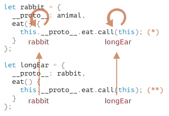

# 클래스 상속

클래스 상속을 사용하면 클래스를 다른 클래스로 확장할 수 있습니다.

기존에 존재하던 기능을 토대로 새로운 기능을 만들 수 있죠.

## 'extends' 키워드 

먼저, 클래스 `Animal`을 만들어보겠습니다.

```js
class Animal {
  constructor(name) {
    this.speed = 0;
    this.name = name;
  }
  run(speed) {
    this.speed += speed;
    alert(`${this.name} 은/는 속도 ${this.speed}로 달립니다.`);
  }
  stop() {
    this.speed = 0;
    alert(`${this.name} 이/가 멈췄습니다.`);
  }
}

let animal = new Animal("동물");
```

객체 `animal`과  클래스 `Animal`의 관계를 그림으로 나타내면 다음과 같습니다.


또 다른 `class Rabbit`을 만들어보겠습니다.

토끼는 동물이므로 클래스 `Rabbit`은 동물 관련 메서드가 담긴 `Animal`을 확장해서 만들어야 합니다. 이렇게 해야만 토끼가 동물이 할 수 있는 '일반적인' 동작을 수행할 수 있습니다.

클래스 확장 문법 `class Child extends Parent`를 사용해 클래스를 확장해 보겠습니다.

`Animal`을 상속받는 `class Rabbit`를 만들어봅시다.

```js
*!*
class Rabbit extends Animal {
*/!*
  hide() {
    alert(`${this.name} 이/가 숨었습니다!`);
  }
}

let rabbit = new Rabbit("흰 토끼");

rabbit.run(5); // 흰 토끼 은/는 속도 5로 달립니다.
rabbit.hide(); // 흰 토끼 이/가 숨었습니다!
```

클래스 `Rabbit`을 사용해 만든 객체는 `rabbit.hide()`같은 `Rabbit`에 정의된 메서드에도 접근할 수 있고, `rabbit.run()`같은 `Animal`에 정의된 메서드에도 접근할 수 있습니다.

`extends` 키워드는 프로토타입을 기반으로 동작합니다(프로토타입은 오래되었지만 여러 곳에서 사용되고 있는 자바스크립트 핵심 동작 원리입니다). `extends`는 `Rabbit.prototype.[[Prototype]]`을 `Animal.prototype`으로 설정합니다. 따라서 `Rabbit.prototype`에서 메서드를 찾지 못하면 `Animal.prototype`에서 메서드를 가져옵니다.


`rabbit.run` 메서드를 찾기 위해 엔진은 다음 절차를 따라 메서드의 존재를 확인합니다(그림을 아래서 위로 읽어보세요).
1. 객체 `rabbit`에 `run`이 있나 확인합니다(`rabbit`엔 `run`이 없습니다).
2. `rabbit`의 프로토타입인 `Rabbit.prototype`에 메서드가 있나 확인합니다(`hide`는 있는데 `run`은 없네요).
3. `Rabbit.prototype`의 프로토타입인 `Animal.prototype`(`extends`를 통해 관계가 만들어짐)에 메서드가 있나 확인합니다. 드디어 메서드 `run`을 찾았습니다.

<info:native-prototypes>에서 알아본 바와 같이 자바스크립트의 내장 객체는 프로토타입을 기반으로 상속 관계를 맺습니다. `Date.prototype.[[Prototype]]`이 `Object.prototype`인 것처럼 말이죠. 

````smart header="`extends` 뒤에는 모든 표현식이 올 수 있습니다."
클래스 문법은 클래스를 명시해줄 뿐만 아니라 `extends` 뒤에 어떤 표현식이 오든 이를 처리해줍니다.

아래 예시와 같이 `extends` 뒤에서 부모 클래스를 만들어주는 함수를 호출할 수도 있습니다.

```js run
function f(phrase) {
  return class {
    sayHi() { alert(phrase) }
  }
}

*!*
class User extends f("Hello") {}
*/!*

new User().sayHi(); // Hello
```
여기서 `class User`는 `f("Hello")`의 결과를 상속받습니다.

이 방법은 조건에 따라 다른 클래스를 상속받고 싶을 때 유용합니다(고급 프로그래밍 패턴). 조건에 따라 다른 클래스를 반환하는 함수를 만들고, 함수 호출 결과를 상속받게 해주면 되죠.
````

## 메서드 오버라이딩

이제 한발 더 나아가, 메서드를 오버라이딩 해봅시다. 특별한 사항이 없으면 `class Animal`에 있는 메서드는 '그대로' `class Rabbit`에 상속됩니다. 

그런데 `Rabbit`에서 `stop()` 등의 자체 메서드를 정의하면, 상속받은 메서드가 아닌 자체 메서드가 사용됩니다.

```js
class Rabbit extends Animal {
  stop() {
    // rabbit.stop()을 호출할 때 
    // Animal의 stop()이 아닌, 이 메서드가 사용됨 
  }
}
```

개발을 하다 보면 부모 메서드 전체를 교체하지 않고, 부모 메서드를 토대로 일부 기능만 변경하고 싶을 때가 생깁니다. 부모 메서드의 기능을 확장하고 싶을 때도 있죠. 이럴 때, 커스텀 메서드를 만들어 작업해야 하는데, 커스텀 메서드를 호출하기 전, 후나 커스텀 메서드 중간에서 부모 메서드를 호출해야 합니다.

클래스의 `"super"` 키워드는 이럴 때 사용합니다.

- `super.method(...)` --  부모클래스에 정의된 메서드, `method`를 호출함
- `super(...)` -- 부모 생성자를 호출함(자식 생성자 내부에서만 사용 가능)

토끼가 멈추면 자동으로 숨도록 하는 코드를 만들어봅시다.

```js run
class Animal {

  constructor(name) {
    this.speed = 0;
    this.name = name;
  }

  run(speed) {
    this.speed += speed;
    alert(`${this.name} 은/는 속도 ${this.speed}로 달립니다.`);
  }

  stop() {
    this.speed = 0;
    alert(`${this.name} 이/가 멈췄습니다.`);
  }

}

class Rabbit extends Animal {
  hide() {
    alert(`${this.name} 이/가 숨었습니다!`);
  }

*!*
  stop() {
    super.stop(); // 부모 클래스의 stop을 호출해 멈추고,
    this.hide(); // 숨습니다.
  }
*/!*
}

let rabbit = new Rabbit("흰 토끼");

rabbit.run(5); // 흰 토끼 은/는 속도 5로 달립니다.
rabbit.stop(); // 흰 토끼 이/가 멈췄습니다. 흰 토끼 이/가 숨었습니다!
```

이제 `Rabbit`에서 정의한 메서드 `stop`은 실행 중간에 부모 클래스에 정의된 메서드인 `super.stop()`을 호출할 수 있습니다.

````smart header="화살표 함수는 `super`가 없습니다."
<info:arrow-functions>에서 살펴본 바와 같이, 화살표 함수는 `super`를 갖지 않습니다.

`super`에 접근하면, 아래 예시와 같이 `super`를 외부 함수에서 가져옵니다.
```js
class Rabbit extends Animal {
  stop() {
    setTimeout(() => super.stop(), 1000); // 1초 후에 부모 stop을 호출합니다.
  }
}
```

화살표 함수의 `super`는 `stop()`의 `super`와 같기 때문에 위 예시는 의도한 대로 동작합니다. `setTimeout`안에서 '일반' 함수를 사용했다면 에러가 발생했을 겁니다.

```js
// Unexpected super
setTimeout(function() { super.stop() }, 1000);
```
````


## 생성자 오버라이딩

생성자 오버라이딩은 좀 더 까다롭습니다.

지금까진 `Rabbit`에 자체 `constructor`가 없었습니다.

[명세서](https://tc39.github.io/ecma262/#sec-runtime-semantics-classdefinitionevaluation)에 따르면, 클래스가 다른 클래스를 상속받고 있으며 `constructor`가 없는 경우엔 아래처럼 '비어있는' `constructor`가 만들어집니다.

```js
class Rabbit extends Animal {
  // 자체 생성자가 없는 상속 클래스를 위해 생성됨
*!*
  constructor(...args) {
    super(...args);
  }
*/!*
}
```

위 예시에서 알 수 있듯이, 생성자는 기본적으로 부모 `constructor`를 호출합니다. 부모 `constructor`에 인수도 모두 전달되죠. 상속 클래스에 자체 생성자가 없으면 이 일은 자동으로 발생합니다.

이제 `Rabbit`에 커스텀 생성자를 추가해보겠습니다. 커스텀 생성자는 `name`과  `earLength`를 명시합니다.

```js run
class Animal {
  constructor(name) {
    this.speed = 0;
    this.name = name;
  }
  // ...
}

class Rabbit extends Animal {

*!*
  constructor(name, earLength) {
    this.speed = 0;
    this.name = name;
    this.earLength = earLength;
  }
*/!*

  // ...
}

*!*
// 동작하지 않습니다!
let rabbit = new Rabbit("흰 토끼", 10); // Error: this is not defined.
*/!*
```

아이코! 에러가 발생하네요. 토끼를 만들 수 없습니다. 무엇이 잘못된 걸까요?

상속 클래스의 생성자는 반드시 `super(...)`를 호출해야 하는데, 위 예시에선 `super(...)`를 호출하지 않아 에러가 발생했습니다. `super(...)`는 `this`를 사용하기 전에 호출해야 한다는 점도 잊지 마셔야 합니다.

그런데 왜 이런 작업을 해야 하는 걸까요? 따라야 하는 요구사항이 이상해 보이기까지 하는데 말이죠.

물론 여기에도 이유가 있습니다. 이유를 살펴보며 상속 클래스의 생성자가 호출될 때 어떤 일이 일어나는지 알아봅시다.

자바스크립트는 '상속 클래스의 생성자 함수'와 그렇지 않은 클래스의 생성자 함수를 구분합니다. 상속 클래스의 생성자 함수엔 특수 내부 프로퍼티인 `[[ConstructorKind]]:"derived"`가 이름표처럼 붙습니다.

차이는 다음과 같습니다.

- 일반 생성자가 실행되면, 빈 객체가 만들어지고 `this`에 이 객체를 할당합니다.
- 반면, 상속 클래스의 생성자가 실행되면, 위와 같은 일이 일어나지 않습니다. 속 클래스의 생성자는 빈 객체를 만들고 `this`에 이 객체를 할당하는 일은 부모 클래스의 생성자가 처리해주길 기대합니다.

이런 차이 때문에 상속 클래스에서 커스텀 생성자를 만들 땐 `super`를 반드시 호출해야 합니다. 그렇지 않으면 `this`가 될 객체가 만들어지지 않습니다. 당연히 에러가 발생하겠죠.

`Rabbit`의 생성자가 제대로 동작하게 하려면, 아래 예시와 같이 `super()`를 호출해야 합니다. `super()`는 `this`를 사용하기 전에 호출해주세요.

```js run
class Animal {

  constructor(name) {
    this.speed = 0;
    this.name = name;
  }

  // ...
}

class Rabbit extends Animal {

  constructor(name, earLength) {
*!*
    super(name);
*/!*
    this.earLength = earLength;
  }

  // ...
}

*!*
// 이제 에러 없이 동작합니다.
let rabbit = new Rabbit("흰 토끼", 10);
alert(rabbit.name); // 흰 토끼
alert(rabbit.earLength); // 10
*/!*
```


## Super: internals, [[HomeObject]]

```warn header="Advanced information"
If you're reading the tutorial for the first time - this section may be skipped.

It's about the internal mechanisms behind inheritance and `super`.
```

Let's get a little deeper under the hood of `super`. We'll see some interesting things along the way.

First to say, from all that we've learned till now, it's impossible for `super` to work at all!

Yeah, indeed, let's ask ourselves, how it should technically work? When an object method runs, it gets the current object as `this`. If we call `super.method()` then, the engine needs to get the `method` from the prototype of the current object. But how?

The task may seem simple, but it isn't. The engine knows the current object `this`, so it could get the parent `method` as `this.__proto__.method`. Unfortunately, such a "naive" solution won't work.

Let's demonstrate the problem. Without classes, using plain objects for the sake of simplicity.

You may skip this part and go below to the `[[HomeObject]]` subsection if you don't want to know the details. That won't harm. Or read on if you're interested in understanding things in-depth.

In the example below, `rabbit.__proto__ = animal`. Now let's try: in `rabbit.eat()` we'll call `animal.eat()`, using `this.__proto__`:

```js run
let animal = {
  name: "Animal",
  eat() {
    alert(`${this.name} eats.`);
  }
};

let rabbit = {
  __proto__: animal,
  name: "Rabbit",
  eat() {
*!*
    // that's how super.eat() could presumably work
    this.__proto__.eat.call(this); // (*)
*/!*
  }
};

rabbit.eat(); // Rabbit eats.
```

At the line `(*)` we take `eat` from the prototype (`animal`) and call it in the context of the current object. Please note that `.call(this)` is important here, because a simple `this.__proto__.eat()` would execute parent `eat` in the context of the prototype, not the current object.

And in the code above it actually works as intended: we have the correct `alert`.

Now let's add one more object to the chain. We'll see how things break:

```js run
let animal = {
  name: "Animal",
  eat() {
    alert(`${this.name} eats.`);
  }
};

let rabbit = {
  __proto__: animal,
  eat() {
    // ...bounce around rabbit-style and call parent (animal) method
    this.__proto__.eat.call(this); // (*)
  }
};

let longEar = {
  __proto__: rabbit,
  eat() {
    // ...do something with long ears and call parent (rabbit) method
    this.__proto__.eat.call(this); // (**)
  }
};

*!*
longEar.eat(); // Error: Maximum call stack size exceeded
*/!*
```

The code doesn't work anymore! We can see the error trying to call `longEar.eat()`.

It may be not that obvious, but if we trace `longEar.eat()` call, then we can see why. In both lines `(*)` and `(**)` the value of `this` is the current object (`longEar`). That's essential: all object methods get the current object as `this`, not a prototype or something.

So, in both lines `(*)` and `(**)` the value of `this.__proto__` is exactly the same: `rabbit`. They both call `rabbit.eat` without going up the chain in the endless loop.

Here's the picture of what happens:



1. Inside `longEar.eat()`, the line `(**)` calls `rabbit.eat` providing it with `this=longEar`.
    ```js
    // inside longEar.eat() we have this = longEar
    this.__proto__.eat.call(this) // (**)
    // becomes
    longEar.__proto__.eat.call(this)
    // that is
    rabbit.eat.call(this);
    ```
2. Then in the line `(*)` of `rabbit.eat`, we'd like to pass the call even higher in the chain, but `this=longEar`, so `this.__proto__.eat` is again `rabbit.eat`!

    ```js
    // inside rabbit.eat() we also have this = longEar
    this.__proto__.eat.call(this) // (*)
    // becomes
    longEar.__proto__.eat.call(this)
    // or (again)
    rabbit.eat.call(this);
    ```

3. ...So `rabbit.eat` calls itself in the endless loop, because it can't ascend any further.

The problem can't be solved by using `this` alone.

### `[[HomeObject]]`

To provide the solution, JavaScript adds one more special internal property for functions: `[[HomeObject]]`.

When a function is specified as a class or object method, its `[[HomeObject]]` property becomes that object.

Then `super` uses it to resolve the parent prototype and its methods.

Let's see how it works, first with plain objects:

```js run
let animal = {
  name: "Animal",
  eat() {         // animal.eat.[[HomeObject]] == animal
    alert(`${this.name} eats.`);
  }
};

let rabbit = {
  __proto__: animal,
  name: "Rabbit",
  eat() {         // rabbit.eat.[[HomeObject]] == rabbit
    super.eat();
  }
};

let longEar = {
  __proto__: rabbit,
  name: "Long Ear",
  eat() {         // longEar.eat.[[HomeObject]] == longEar
    super.eat();
  }
};

*!*
// works correctly
longEar.eat();  // Long Ear eats.
*/!*
```

It works as intended, due to `[[HomeObject]]` mechanics. A method, such as `longEar.eat`, knows its `[[HomeObject]]` and takes the parent method from its prototype. Without any use of `this`.

### Methods are not "free"

As we've known before, generally functions are "free", not bound to objects in JavaScript. So they can be copied between objects and called with another `this`.

The very existance of `[[HomeObject]]` violates that principle, because methods remember their objects. `[[HomeObject]]` can't be changed, so this bond is forever.

The only place in the language where `[[HomeObject]]` is used -- is `super`. So, if a method does not use `super`, then we can still consider it free and copy between objects. But with `super` things may go wrong.

Here's the demo of a wrong `super` result after copying:

```js run
let animal = {
  sayHi() {
    console.log(`I'm an animal`);
  }
};

// rabbit inherits from animal
let rabbit = {
  __proto__: animal,
  sayHi() {
    super.sayHi();
  }
};

let plant = {
  sayHi() {
    console.log("I'm a plant");
  }
};

// tree inherits from plant
let tree = {
  __proto__: plant,
*!*
  sayHi: rabbit.sayHi // (*)
*/!*
};

*!*
tree.sayHi();  // I'm an animal (?!?)
*/!*
```

A call to `tree.sayHi()` shows "I'm an animal". Definitevely wrong.

The reason is simple:
- In the line `(*)`, the method `tree.sayHi` was copied from `rabbit`. Maybe we just wanted to avoid code duplication?
- Its `[[HomeObject]]` is `rabbit`, as it was created in `rabbit`. There's no way to change `[[HomeObject]]`.
- The code of `tree.sayHi()` has `super.sayHi()` inside. It goes up from `rabbit` and takes the method from `animal`.

Here's the diagram of what happens:


### Methods, not function properties

`[[HomeObject]]` is defined for methods both in classes and in plain objects. But for objects, methods must be specified exactly as `method()`, not as `"method: function()"`.

The difference may be non-essential for us, but it's important for JavaScript.

In the example below a non-method syntax is used for comparison. `[[HomeObject]]` property is not set and the inheritance doesn't work:

```js run
let animal = {
  eat: function() { // intentially writing like this instead of eat() {...
    // ...
  }
};

let rabbit = {
  __proto__: animal,
  eat: function() {
    super.eat();
  }
};

*!*
rabbit.eat();  // Error calling super (because there's no [[HomeObject]])
*/!*
```

## 요약

1. 클래스 확장하기: `class Child extends Parent`
    - `Child.prototype.__proto__`가 `Parent.prototype`이 되므로 메서드 전체가 상속됩니다.
2. 생성자 오버라이딩:
    - `this`를 사용하기 전에 `Child` 생성자 안에서 `super()`로 부모 생성자를 반드시 호출해야 합니다.
3. 메서드 오버라이딩:
    - `Child`에 정의된 메서드에서 `super.method()`를 사용해 `Parent`에 정의된 메서드를 사용할 수 있습니다.
4. Internals:
    - Methods remember their class/object in the internal `[[HomeObject]]` property. That's how `super` resolves parent methods.
    - So it's not safe to copy a method with `super` from one object to another.

추가 사항:
- 화살표 함수는 `this`나 `super`를 갖지 않으므로 주변 컨텍스트에 잘 들어맞습니다.
