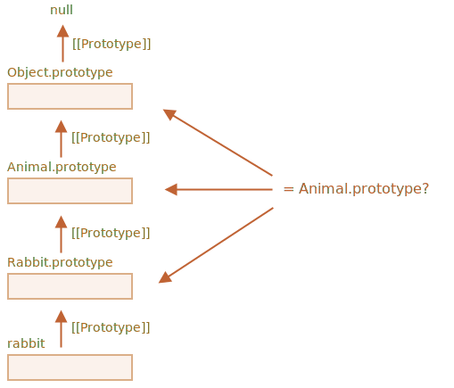

# 'instanceof'로 클래스 확인하기

`instanceof` 연산자를 사용하면 객체가 특정 클래스에 속하는지 아닌지를 확인할 수 있습니다. `instanceof`는 상속 관계도 확인해줍니다.

확인 기능은 다양한 곳에서 쓰이는데, 이번 챕터에선 `instanceof`를 사용해 인수의 타입에 따라 이를 다르게 처리하는 *다형적인(polymorphic)* 함수를 만드는데 사용해보겠습니다.

## instanceof 연산자 [#ref-instanceof]

문법은 아래와 같습니다.
```js
obj instanceof Class
```

`obj`가 `Class`에 속하거나 `Class`를 상속받는 클래스에 속하면 `true`가 반환됩니다.

예시:

```js run
class Rabbit {}
let rabbit = new Rabbit();

// rabbit이 클래스 Rabbit의 객체인가요?
*!*
alert( rabbit instanceof Rabbit ); // true
*/!*
```

`instanceof`는 생성자 함수에서도 사용할 수 있습니다.

```js run
*!*
// 클래스가 아닌 생성자 함수
function Rabbit() {}
*/!*

alert( new Rabbit() instanceof Rabbit ); // true
```

`Array` 같은 내장 클래스에도 사용할 수 있습니다.

```js run
let arr = [1, 2, 3];
alert( arr instanceof Array ); // true
alert( arr instanceof Object ); // true
```

위 예시에서 `arr`은 클래스 `Object`에도 속한다는 점에 주목해주시기 바랍니다. `Array`는 프로토타입 기반으로 `Object`를 상속받습니다.

`instanceof` 연산자는 보통, 프로토타입 체인을 거슬러 올라가며 인스턴스 여부나 상속 여부를 확인합니다. 그런데 정적 메서드 `Symbol.hasInstance`을 사용하면 직접 확인 로직을 설정할 수도 있습니다.

`obj instanceof Class`은 대략 아래와 같은 알고리즘으로 동작합니다.

1. 클래스에 정적 메서드 `Symbol.hasInstance`가 구현되어 있으면, `obj instanceof Class`문이 실행될 때, `Class[Symbol.hasInstance](obj)`가 호출됩니다. 호출 결과는 `true`나 `false`이어야 합니다. 이런 규칙을 기반으로 `instanceof`의 동작을 커스터마이징 할 수 있습니다.

    예시:

    ```js run
    // canEat 프로퍼티가 있으면 animal이라고 판단할 수 있도록
    // instanceOf의 로직을 직접 설정합니다.
    class Animal {
      static [Symbol.hasInstance](obj) {
        if (obj.canEat) return true;
      }
    }

    let obj = { canEat: true };

    alert(obj instanceof Animal); // true, Animal[Symbol.hasInstance](obj)가 호출됨
    ```

2. 그런데, 대부분의 클래스엔 `Symbol.hasInstance`가 구현되어있지 않습니다. 이럴 땐 일반적인 로직이 사용됩니다. `obj instanceOf Class`는 `Class.prototype`이 `obj` 프로토타입 체인 상의 프로토타입 중 하나와 일치하는지 확인합니다.

    비교는 차례 차례 진행됩니다.
    ```js
    obj.__proto__ === Class.prototype?
    obj.__proto__.__proto__ === Class.prototype?
    obj.__proto__.__proto__.__proto__ === Class.prototype?
    ...
    // 이 중 하나라도 true라면 true를 반환합니다.
    // 그렇지 않고 체인의 끝에 도달하면 false를 반환합니다.
    ```

   위 예시에서 `rabbit.__proto__ === Rabbit.prototype`가 `true`이기 때문에 `instanceof`는 `true`를 반환합니다.

    상속받은 클래스를 사용하는 경우엔 두 번째 단계에서 일치 여부가 확인됩니다.

    ```js run
    class Animal {}
    class Rabbit extends Animal {}

    let rabbit = new Rabbit();
    *!*
    alert(rabbit instanceof Animal); // true
    */!*

    // rabbit.__proto__ === Rabbit.prototype
    *!*
    // rabbit.__proto__.__proto__ === Animal.prototype (일치!)
    */!*
    ```

아래 그림은 `rabbit instanceof Animal`을 실행했을 때 `Animal.prototype`과 비교되는 대상들을 보여줍니다.



한편, `objA`가 `objB`의 프로토타입 체인 상 어딘가에 있으면 `true`를 반환해주는 메서드, [objA.isPrototypeOf(objB)](mdn:js/object/isPrototypeOf)도 있습니다. `obj instanceof Class`는 `Class.prototype.isPrototypeOf(obj)`와 동일합니다.

`isPrototypeOf`는 `Class` 생성자를 제외하고 포함 여부를 검사하는 점이 조금 특이합니다. 검사 시, 프로토타입 체인과 `Class.prototype`만 고려합니다.

`isPrototypeOf`의 이런 특징은 객체 생성 후 `prototype` 프로퍼티가 변경되는 경우 특이한 결과를 초래하기도 합니다. 아래와 같이 말이죠.

예시:

```js run
function Rabbit() {}
let rabbit = new Rabbit();

// 프로토타입이 변경됨
Rabbit.prototype = {};

// 더 이상 Rabbit이 아닙니다!
*!*
alert( rabbit instanceof Rabbit ); // false
*/!*
```

## 보너스: 타입 확인을 위한 Object.prototype.toString

일반 객체를 문자열로 변화하면 `[object Object]`가 된다는 것을 알고 계실 겁니다.

```js run
let obj = {};

alert(obj); // [object Object]
alert(obj.toString()); // 같은 결과가 출력됨
```

이렇게 `[object Object]`가 되는 이유는 `toString`의 구현방식 때문입니다. 그런데 `toString`엔 `toString`을 더 강력하게 만들어주는 기능이 숨겨져 있습니다. `toString`의 숨겨진 기능을 사용하면 확장 `typeof`, `instanceof`의 대안을 만들 수 있습니다.

아직 감이 안 잡히시겠지만, 구체적으로 설명하겠습니다.

[명세서](https://tc39.github.io/ecma262/#sec-object.prototype.tostring)에 따르면, 객체에서 내장 `toString`을 추출하는 게 가능합니다. 이렇게 추출한 메서드는 모든 값을 대상으로 실행할 수 있습니다. 호출 결과는 값에 따라 달라집니다.

- 숫자형 -- `[object Number]`
- 불린형 -- `[object Boolean]`
- `null` --  `[object Null]`
- `undefined` -- `[object Undefined]`
- 배열 -- `[object Array]`
- 그외 -- 커스터마이징 가능

예시:

```js run
// 편의를 위해 toString 메서드를 변수에 복사함
let objectToString = Object.prototype.toString;

// 아래 변수의 타입은 무엇일까요?
let arr = [];

alert( objectToString.call(arr) ); // [object *!*Array*/!*]
```

[](info:call-apply-decorators) 챕터에서 설명한 [call](mdn:js/function/call)을 사용해 컨텍스트를 `this=arr`로 설정하고 함수 `objectToString`를 실행하였습니다.

`toString` 알고리즘은 내부적으로 `this`를 검사하고 상응하는 결과를 반환합니다. 예시를 더 살펴봅시다.

```js run
let s = Object.prototype.toString;

alert( s.call(123) ); // [object Number]
alert( s.call(null) ); // [object Null]
alert( s.call(alert) ); // [object Function]
```

### Symbol.toStringTag

특수 객체 프로퍼티 `Symbol.toStringTag`를 사용하면 `toString`의 동작을 커스터마이징 할 수 있습니다. 

예시:

```js run
let user = {
  [Symbol.toStringTag]: "User"
};

alert( {}.toString.call(user) ); // [object User]
```

대부분의 호스트 환경은 자체 객체에 이와 유사한 프로퍼티를 구현해 놓고 있습니다. 브라우저 관련 예시 몇 가지를 살펴봅시다.

```js run
// 특정 호스트 환경의 객체와 클래스에 구현된 toStringTag
alert( window[Symbol.toStringTag]); // Window
alert( XMLHttpRequest.prototype[Symbol.toStringTag] ); // XMLHttpRequest

alert( {}.toString.call(window) ); // [object Window]
alert( {}.toString.call(new XMLHttpRequest()) ); // [object XMLHttpRequest]
```

실행 결과에서 보듯이 호스트 환경 고유 객체의 `Symbol.toStringTag` 값은 `[object ...]`로 쌓여진 값과 동일합니다.

이처럼 'typeof' 연산자의 강력한 변형들(`toString`과 `toStringTag` - 옮긴이)은 원시 자료형뿐만 아니라 내장 객체에도 사용할 수 있습니다. 그리고 커스터마이징까지 가능합니다. 

내장 객체의 타입 확인을 넘어서 타입을 문자열 형태로 받고 싶다면 `instanceof` 대신, `{}.toString.call`을 사용할 수 있습니다.

## 요약

지금까지 배운 타입 확인 메서드를 요약하면 다음과 같습니다.

|               | 동작 대상      |  반환값      |
|---------------|-------------|---------------|
| `typeof`      | 원시형  |  문자열       |
| `{}.toString` | 원시형, 내장 객체, `Symbol.toStringTag`가 있는 객체   |       문자열 |
| `instanceof`  | 객체     |  true나 false   |

예시에서 보았듯이 `{}.toString`은 `typeof`보다 '기능이 더' 많습니다.

`instanceof` 연산자는 계층구조를 가진 클래스를 다룰 때나 클래스의 상속 여부를 확인하고자 할 때 그 진가를 발휘합니다.
