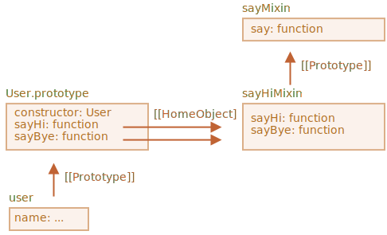

# 믹스인

자바스크립트는 단일상속만을 허용하는 언어입니다. 객체엔 단 하나의 `[[Prototype]]`만 있을 수 있고, 클래스는 클래스 하나만 상속받을 수 있습니다.

그런데 가끔 이런 제약이 한계처럼 느껴질 때가 있습니다. 예시를 들어봅시다. 클래스 `StreetSweeper`(도시의 거리를 청소하는 차량 - 옮긴이)와 클래스 `Bicycle`이 있는데, 이 둘을 섞어 `StreetSweepingBicycle`를 만들고 싶다고 해봅시다.

또는 클래스 `User`와 이벤트를 생성해주는 코드가 담긴 클래스 `EventEmitter`가 있는데, `EventEmitter`의 기능을 `User`에 추가해 사용자가 이벤트를 내뿜을 수 있게(emit) 해주고 싶다고 해봅시다.

이럴 때 믹스인이라 불리는 개념을 사용하면 도움이 됩니다.

Wikipedia에선 [믹스인(mixin)](https://en.wikipedia.org/wiki/Mixin)을 다른 클래스를 상속받을 필요 없이 이들 클래스에 구현되어있는 메서드를 담고 있는 클래스라고 정의합니다.  

다시 말해서 *믹스인*은 특정 행동을 실행해주는 메서드를 제공하는데 단독으로 쓰이지 않고 다른 클래스에 행동을 더해주는 용도로 사용됩니다.

## 믹스인 예시

자바스크립트에서 믹스인을 구현할 수 있는 가장 쉬운 방법은 유용한 메서드 여러 개가 담긴 객체를 하나 만드는 것입니다. 이렇게 하면 다수의 메서드를 원하는 클래스의 프로토타입에 쉽게 병합할 수 있습니다.

아래 예시의 믹스인 `sayHiMixin`은 `User`에게 '언어 능력'을 부여해줍니다.

```js run
*!*
// 믹스인
*/!*
let sayHiMixin = {
  sayHi() {
    alert(`Hello ${this.name}`);
  },
  sayBye() {
    alert(`Bye ${this.name}`);
  }
};

*!*
// 사용법:
*/!*
class User {
  constructor(name) {
    this.name = name;
  }
}

// 메서드 복사
Object.assign(User.prototype, sayHiMixin);

// 이제 User가 인사를 할 수 있습니다.
new User("Dude").sayHi(); // Hello Dude!
```

상속 없이 메서드만 간단히 복사했습니다. 믹스인을 활용하면 `User`가 아래 예시처럼 다른 클래스를 상속받는 동시에, 믹스인에 구현된 추가 메서드도 사용할 수 있습니다. 

```js
class User extends Person {
  // ...
}

Object.assign(User.prototype, sayHiMixin);
```

믹스인 안에서 믹스인 상속을 사용하는 것도 가능합니다.

아래 예시에서 `sayHiMixin`은 `sayMixin`을 상속받습니다.

```js run
let sayMixin = {
  say(phrase) {
    alert(phrase);
  }
};

let sayHiMixin = {
  __proto__: sayMixin, // (Object.create를 사용해 프로토타입을 설정할 수도 있습니다.)

  sayHi() {
    *!*
    // 부모 메서드 호출
    */!*
    super.say(`Hello ${this.name}`); // (*)
  },
  sayBye() {
    super.say(`Bye ${this.name}`); // (*)
  }
};

class User {
  constructor(name) {
    this.name = name;
  }
}

// 메서드 복사
Object.assign(User.prototype, sayHiMixin);

// 이제 User가 인사를 할 수 있습니다.
new User("Dude").sayHi(); // Hello Dude!
```

`sayHiMixin`에서 부모 메서드 `super.say()`를 호출하면(`(*)`로 표시한 줄) 클래스가 아닌 `sayHiMixin`의 프로토타입에서 메서드를 찾는다는 점에 주목해주시기 바랍니다.

그림의 우측을 봅시다.



이는 `sayHi`와 `sayBye`가 생성된 곳이 `sayHiMixin`이기 때문입니다. 따라서 메서드를 복사했더라도, 이 메서드들의 내부 프로퍼티인 `[[HomeObject]]`는 위 그림처럼 `sayHiMixin`을 참조합니다.

메서드의 `super`가 `[[HomeObject]].[[Prototype]]`내에서 부모 메서드를 찾기 때문에, 메서드는 `User.[[Prototype]]`이 아닌 `sayHiMixin.[[Prototype]]`을 검색합니다. 

## 이벤트 믹스인

실제로 사용할 수 있는 믹스인을 만들어봅시다.

상당수 브라우저 객체는 이벤트를 생성이라는 중요한 기능을 가지고 있습니다. 이벤트는 정보를 필요로 하는 곳에 '정보를 널리 알리는(broadcast)' 훌륭한 수단입니다. 아래 예시에선 클래스나 객체에 이벤트 관련 함수를 쉽게 추가할 수 있도록 해주는 믹스인을 만들어 보겠습니다.

- 믹스인은 뭔가 중요한 일이 발생했을 때 '이벤트를 생성하는' 메서드, `.trigger(name, [...data])`를 제공합니다. 인수 `name`은 이벤트 이름이고, 뒤따르는 선택 인수는 이벤트 데이터 정보를 담습니다.
- 메서드 `.on(name, handler)`은 `name`에 해당하는 이벤트에 리스너로 `handler` 함수를 추가합니다. `.on()`은 이벤트(`name`)가 트리거 될 때 호출되고, `.trigger` 호출에서 인수를 얻습니다.
- 메서드 `.off(name, handler)`는 `handler` 리스너를 제거합니다.

믹스인을 추가하면, 사용자가 로그인할 때 객체 `user`가 `"login"`이라는 이벤트를 생성할 수 있게 됩니다. 또 다른 객체 `calendar`는 `user`가 생성한 이벤트인 `"login"`을 듣고 사용자에 맞는 달력을 보여줄 수 있겠죠.

메뉴의 항목을 선택했을 때 객체 `menu`가 `"select"`라는 이벤트를 생성하고, 다른 객체는 `"select"`에 반응하는 이벤트 핸들러를 할당할 수도 있을 겁니다. 이벤트 믹스인은 이런 용도로 활용 가능합니다.

이벤트 믹스인을 구현해봅시다.

```js run
let eventMixin = {
  /**
   *  이벤트 구독
   *  사용패턴: menu.on('select', function(item) { ... }
  */
  on(eventName, handler) {
    if (!this._eventHandlers) this._eventHandlers = {};
    if (!this._eventHandlers[eventName]) {
      this._eventHandlers[eventName] = [];
    }
    this._eventHandlers[eventName].push(handler);
  },

  /**
   *  구독 취소
   *  사용패턴: menu.off('select', handler)
   */
  off(eventName, handler) {
    let handlers = this._eventHandlers && this._eventHandlers[eventName];
    if (!handlers) return;
    for (let i = 0; i < handlers.length; i++) {
      if (handlers[i] === handler) {
        handlers.splice(i--, 1);
      }
    }
  },

  /**
   *  주어진 이름과 데이터를 기반으로 이벤트 생성
   *  사용패턴: this.trigger('select', data1, data2);
   */
  trigger(eventName, ...args) {
    if (!this._eventHandlers || !this._eventHandlers[eventName]) {
      return; // no handlers for that event name
    }

    // 핸들러 호출
    this._eventHandlers[eventName].forEach(handler => handler.apply(this, args));
  }
};
```


- `.on(eventName, handler)` -- `eventName`에 해당하는 이벤트가 발생하면 실행시킬 함수 `handler`를 할당합니다. 한 이벤트에 대응하는 핸들러가 여러 개 있을 때, 프로퍼티 `_eventHandlers`는 핸들러가 담긴 배열을 저장합니다. 여기선 핸들러가 배열에 추가만 됩니다.
- `.off(eventName, handler)` -- 핸들러 리스트에서 `handler`를 제거합니다.
- `.trigger(eventName, ...args)` -- 이벤트를 생성합니다. `_eventHandlers[eventName]`에 있는 모든 핸들러가 `...args`와 함께 호출됩니다. 

사용법:

```js run
// 클래스 생성
class Menu {
  choose(value) {
    this.trigger("select", value);
  }
}
// 이벤트 관련 메서드가 구현된 믹스인 추가
Object.assign(Menu.prototype, eventMixin);

let menu = new Menu();

// 메뉴 항목을 선택할 때 호출될 핸들러 추가
*!*
menu.on("select", value => alert(`선택된 값: ${value}`));
*/!*

// 이벤트가 트리거 되면 핸들러가 실행되어 얼럿창이 뜸
// 얼럿창 메시지: Value selected: 123
menu.choose("123");
```

이제 `menu.on(...)`을 사용해 메뉴 선택이라는 정보를 들을 수 있게 되었고, 이에 반응하는 코드를 추가할 수 있게 되었습니다.

그리고 믹스인 `eventMixin`을 사용하면 이런 동작을 상속 체이닝에 끼어들지 않고도 원하는 클래스에 모두에 추가할 수 있습니다.

## 요약

*믹스인* 은 객체 지향 언어에서 범용적으로 쓰이는 용어로, 다른 클래스들의 메서드 조합을 포함하는 클래스를 의미합니다.

몇몇 언어는 다중상속을 허용합니다. 자바스크립트는 다중상속을 지원하지 않는데, 믹스인을 사용하면 메서드를 복사해 프로토타입에 구현할 수 있습니다.

이벤트 믹스인 예시에서 본 것처럼, 믹스인은 이벤트 핸들링 등의 행동을 추가하여 클래스를 확장하는 용도로 사용할 수 있습니다.

mixin이 실수로 기존 클래스 메서드를 덮어쓰면 충돌이 발생할 수 있습니다. 따라서 mixin을 만들 땐 충돌이 발생하지 않도록 메서드 이름을 신중하게 정하셔야 합니다. 
