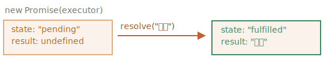
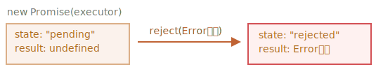

# 프라미스

탑 가수인 당신이 밤·낮으로 다음 싱글 앨범이 언제 나오는지 물어보는 팬들을 상대해야 한다고 가정해 봅시다. 

당신은 앨범이 출시되면 팬들이 자동으로 소식을 받아볼 수 있도록 해, 일의 부하를 덜 겁니다. 구독 리스트를 하나 만들어 팬들에게 이를 전달하며 여기에 이메일 주소를 적게 해, 앨범이 준비되면 리스트에 자신의 메일을 적은 팬들은 즉시 소식을 받아볼 수 있게 하면 되죠. 이렇게 해 놓으면 녹음 스튜디오에 화재가 발생해서 출시 예정인 앨범이 취소되는 불상사가 발생해도 소식을 팬들에게 전달 할 수 있습니다.

이제 모두가 행복해졌습니다. 밤낮으로 질문을 하는 팬이 사라졌고, 팬들은 앨범 출시를 놓치지 않을 수 있게 되었으니까요.

이 비유는 코드를 짜면서 자주 만나게 되는 상황을 실제 일어날 법한 일로 바꾼 것입니다. 바로 아래 같은 상황 말이죠.

1. '제작 코드(producing code)'에선 원격에서 스크립트를 불러오는 것 같은 시간이 걸리는 일을 합니다. 위 비유에선 '가수'가 제작 코드에 해당합니다.
2. '소비 코드(consuming code)'는 '제작 코드'의 결과를 원합니다. 여러 함수(소비 코드)가 제작 코드의 결과를 활용하고 싶어 할 수 있습니다. 위 비유에서, 제작 코드는 '팬'입니다.
3. *프라미스(promise)* 는 '제작 코드'와 '소비 코드'를 연결해 주는 특별한 자바스크립트 객체입니다. 위 비유에선 '구독 리스트'가 프라미스죠. '제작 코드'는 시간이 얼마나 걸리든 상관없이 약속한 결과를 만들어 냅니다. '프라미스'는 결과가 준비되었을 때, 모든 소비 코드가 결과를 사용할 수 있도록 합니다.

자바스크립트 프라미스는 구독 리스트보다 훨씬 복잡하기 때문에, 위 비유가 완벽하게 들어맞지는 않습니다. 프라미스엔 추가 기능과 한계도 있죠. 하지만 일단 이 비유를 이용해 프라미스를 학습해보도록 합시다.

`promise` 객체는 아래와 같은 문법으로 만들 수 있습니다.

```js
let promise = new Promise(function(resolve, reject) {
  // executor (제작 코드, "가수")
});
```

`new Promise`에 전달되는 함수는 *executor(실행자, 실행 함수)* 라고 불립니다. executor 함수는 `new Promise`가 만들어질 때 자동으로 실행됩니다. executor는 결과를 최종적으로 만들어내는 제작 코드를 포함하고 있습니다. 위 비유에서 '가수'가 바로 executor입니다.

executor의 인수 `resolve`와 `reject`는 자바스크립트가 자체적으로 제공하는 콜백입니다. 개발자는 executor 안에만 코드를 작성하면 됩니다.

executor는 결과 즉시 얻든, 늦게 얻든 상관없이 아래 콜백 중 하나를 반드시 호출해야 합니다.

- `resolve(value)` — 일이 성공적으로 끝난 경우 결과를 나타내는 `value`와 함께 호출
- `reject(error)` — 에러가 발생한 경우 에러 객체를 나타내는 `error`와 함께 호출

요약하면 다음과 같습니다. executor는 자동으로 실행되는데 여기서 원하는 일을 처리하고 처리가 끝나면 `resolve`나 `reject`를 호출해야 한다.

`new Promise` 생성자가 반환하는 `promise` 객체는 다음과 같은 내부 프로퍼티를 갖습니다.

- `state` — 처음엔 `"pending"`(보류)이었다 `resolve`가 호출되면 `"fulfilled"`, `reject`가 호출되면 `"rejected"`로 변합니다.
- `result` — 처음엔 `undefined`이었다, `resolve(value)`가 호출되면 `value`로, `reject(error)`가 호출되면 `error`로 변합니다.

따라서 executor는 `promise`를 둘 중 하나의 상태로 변경시킵니다.


'팬들'이 어떻게 이 변화를 구독할 수 있는지에 대해선 조금 후에 살펴보겠습니다.

`promise` 생성자와 간단한 executor 함수로 만든 예시를 살펴봅시다. executor 함수는 `setTimeout`을 이용해 약간의 시간이 걸리도록 구현해 보았습니다.

```js run
let promise = new Promise(function(resolve, reject) {
  // 프라미스가 만들어질 때 executor 함수는 자동으로 실행됩니다.

  // 1초 뒤에 일이 성공적으로 끝났다는 신호와 함께, result가 'done'이 됩니다.
  setTimeout(() => *!*resolve("done")*/!*, 1000);
});
```

위 예시를 실행하면 두 가지를 알 수 있습니다.

1. executor는 `new Promise`에 의해 자동으로 그리고 즉각적으로 호출됩니다.
2. executor는 인자로 `resolve`와 `reject` 함수를 받습니다. 이 함수들은 자바스크립트 엔진이 미리 정의한 함수이므로, 개발자가 따로 만들 필요가 없습니다. 다만, `resolve`나 `reject` 중 하나를 반드시 호출해야 합니다.

    '처리'가 시작 된지 1초 후, executor는 결과를 만들기 위해 `resolve("done")`를 호출합니다. 이는 `promise` 객체의 상태를 다음과 같이 변화시킵니다.

    

위 예시는 성공적으로 일이 처리되었음을 나타내는 "fulfilled promise(약속이 이행된 프라미스)"를 나타내는 예시입니다.

이번에는 executor가 에러와 함께 약속한 작업을 거부하는 경우에 대해 살펴봅시다.

```js
let promise = new Promise(function(resolve, reject) {
  // 1초 뒤에 에러와 함께 실행이 종료되었다는 신호를 보냅니다.
  setTimeout(() => *!*reject(new Error("에러 발생!"))*/!*, 1000);
});
```

`reject(...)`를 호출하자 `promise` 객체의 상태가 `"rejected"`로 변합니다.



지금까지 배운 내용을 요약해 봅시다. executor는 보통 시간이 걸리는 일을 수행합니다. 일이 끝나면 `resolve`나 `reject` 함수를 호출하는데, 이때 프라미스 객체의 상태가 변화합니다.

이행(resolved)되거나 거부(rejected)된 상태의 프라미스는 '처리된(settled)' 프라미스라고 부르는데, 이는 '대기(pending)'상태의 프라미스와 반대입니다.

````smart header="성공 혹은 에러"
executor는 `resolve`나 `reject` 중 하나를 반드시 호출해야 합니다. 이때 변경된 상태는 변경이 불가능합니다.

`resolve`와 `reject`를 더 호출해도 무시됩니다.

```js
let promise = new Promise(function(resolve, reject) {
*!*
  resolve("done");
*/!*

  reject(new Error("…")); // 무시됨
  setTimeout(() => resolve("…")); // 무시됨
});
```

executor에 의해 끝난 일은 하나의 결과 혹은 에러만 가질 수 있습니다.

여기에 더하여, `resolve`나 `reject`는 인수를 하나만 받고(혹은 아무것도 받지 않음) 그 이외의 인수는 무시합니다.
````

```smart header="`Error` 객체와 함께 거부하기"
무언가 잘 못 된 경우, executor는 `reject`를 호출해야만 합니다. 이때 인수는 `resolve`와 마찬가지로 어떤 타입도 가능하지만 `Error` 객체(또는 `Error`를 상속받은 객체)를 사용할 것을 추천합니다. 이유는 뒤에서 설명하겠습니다.
```

````smart header="`resolve`/`reject` 함수 즉시 호출하기"
executor는 대게 무언가를 비동기적으로 수행하고, 약간의 시간이 지난 후에 `resolve`/`reject`를 호출하는데, 꼭 이렇게 할 필요는 없습니다. 아래와 같이 `resolve`나 `reject`를 즉시 호출할 수도 있습니다.

```js
let promise = new Promise(function(resolve, reject) {
  // 일을 끝마치는 데 시간이 들지 않음
  resolve(123); // 결과(123)를 즉시 resolve에 전달함
});
```

어떤 일을 시작했는데 알고 보니 일이 이미 끝나 저장까지 되어있는 경우, 이렇게 처리할 수 있을 겁니다.

이 경우, 이행(resolved) 상태의 프라미스를 즉시 갖게 됩니다.
````

```smart header="`state`와 `result`는 내부에 있습니다."
프라미스 객체의 `state`, `result` 프로퍼티는 내부 프로퍼티이므로 개발자가 직접 접근할 수 없습니다. `.then`/`.catch`/`.finally` 메서드를 사용하면 접근 가능한데, 아래에서 이 메서드에 대해 살펴보도록 하겠습니다.
```

## 소비자: then, catch, finally

프라미스 객체는 executor('제작 코드' 혹은 '가수')와 결과나 에러를 받을 소비 함수('팬')를 이어주는 역할을 합니다. 소비함수는 `.then`, `.catch`, `.finally 메서드를 사용해 등록(구독)됩니다.

### then

`.then`은 프라미스에서 가장 중요하고 기본적인 메서드입니다.

문법은 다음과 같습니다.

```js
promise.then(
  function(result) { *!*/* 결과(result)를 다룹니다 */*/!* },
  function(error) { *!*/* 에러(error)를 다룹니다 */*/!* }
);
```

`.then`의 첫 번째 인수는 프라미스가 이행되었을 때(resolved) 실행되는 함수이고, 여기서 실행 결과(result)를 받습니다.

`.then`의 두 번째 인수는 프라미스가 거부되었을 때(rejected) 실행되는 함수이고, 여기서 에러(error)를 받습니다.

아래 예시는 성공적으로 이행(resolve)된 프라미스에 어떻게 반응하는지 보여줍니다.

```js run
let promise = new Promise(function(resolve, reject) {
  setTimeout(() => resolve("done!"), 1000);
});

// resolve 함수는 .then의 첫 번째 함수(인수)를 실행합니다.
promise.then(
*!*
  result => alert(result), // 1초 후 "done!"을 출력
*/!*
  error => alert(error) // 실행되지 않음
);
```

첫 번째 함수가 실행되었습니다.

프라미스가 거부(reject)된 경우에는 아래와 같이 두 번째 함수가 실행됩니다.

```js run
let promise = new Promise(function(resolve, reject) {
  setTimeout(() => reject(new Error("에러 발생!")), 1000);
});

// reject 함수는 .then의 두 번째 함수를 실행합니다.
promise.then(
  result => alert(result), // 실행되지 않음
*!*
  error => alert(error) // 1초 후 "Error: 에러 발생!"를 출력
*/!*
);
```

작업이 성공적으로 처리된 경우만 다루고 싶다면, `.then`에 인수를 하나만 전달하면 됩니다.

```js run
let promise = new Promise(resolve => {
  setTimeout(() => resolve("done!"), 1000);
});

*!*
promise.then(alert); // 1초 뒤 "done!" 출력
*/!*
```

### catch

에러가 발생한 경우만 다루고 싶다면, `.then(null, errorHandlingFunction)`같이 `null`을 첫 번째 인수로 전달하면 됩니다. `.catch(errorHandlingFunction)`를 써도 되는데, `.catch`는 `.then`에 `null`을 전달하는 것과 동일하게 작동합니다.


```js run
let promise = new Promise((resolve, reject) => {
  setTimeout(() => reject(new Error("에러 발생!")), 1000);
});

*!*
// .catch(f)는 promise.then(null, f)과 동일하게 작동합니다
promise.catch(alert); // 1초 뒤 "Error: 에러 발생!" 출력
*/!*
```

`.catch(f)`는 문법이 간결하다는 점만 빼고 `.then(null,f)`과 완벽하게 동일합니다.

### finally

`try {...} catch {...}`에 finally 절이 있는 것처럼, 프라미스에도 `finally`가 있습니다.

프라미스가 처리되면(이행이나 거부상태) `f`가 항상 실행된다는 점에서 `.finally(f)` 호출은 `.then(f, f)`과 유사합니다.

쓸모가 없어진 로딩 인디케이터(loading indicators)를 멈추는 경우같이, 결과가 어떻든 마무리가 필요한 경우에 `finally`를 유용하게 쓸 수 있습니다.

사용법은 아래와 같습니다.

```js
new Promise((resolve, reject) => {
  /* 시간이 걸리는 어떤 일을 수행하고, 그 후 resolve/reject를 호출함 */
})
*!*
  // 성공, 실패 여부와 상관없이, 프라미스가 처리되면 실행됨
  .finally(() => 로딩 인디케이터 중지)
*/!*
  .then(result => result와 err 보여줌 => error 보여줌)
```

그런데 finally는 `.then(f, f)`과 완전히 같진 않습니다. 차이점은 다음과 같습니다.

1. `finally` 핸들러엔 인수가 없습니다. `finally`에선 프라미스가 이행되었는지, 거부되었는지 알 수 없습니다. `finally`에선 절차를 마무리하는 '보편적' 동작을 수행하기 때문에, 성공/실패 여부를 몰라도 됩니다.
2. `finally` 핸들러는 다음 핸들러에 결과(result)와 에러(error)를 전달합니다.

    result가 `finally`를 거쳐 `then`까지 전달되는 것을 확인해봅시다.
    ```js run
    new Promise((resolve, reject) => {
      setTimeout(() => resolve("result"), 2000)
    })
      .finally(() => alert("Promise ready"))
      .then(result => alert(result)); // <-- .then에서 result를 다룸
    ```

    프라미스에서 에러가 발생하고 이 에러가 `finally`를 거쳐 `catch`까지 전될되는 것을 살펴봅시다.

    ```js run
    new Promise((resolve, reject) => {
      throw new Error("에러 발생!");
    })
      .finally(() => alert("Promise ready"))
      .catch(err => alert(err)); // <-- .catch에서 에러 객체를 다룸
    ```  

    `finally`는 프라미스 결과를 처리하기 위해 만든 게 아니므로, 이런 특징은 아주 유용합니다. 프라미스 결과는 `finally`를 통과해서 전달됩니다.

    프라미스 체이닝과 핸들러 간 결과 전달에 대해선 다음 챕터에서 더 이야기 나누도록 하겠습니다.

3. `.finally(f)`는 함수 `f`를 중복해서 쓸 필요가 없기 때문에 `.then(f, f)`보다 문법 측면에서 더 편리합니다.

````smart header="처리된 프라미스의 핸들러는 즉각 실행됩니다."
프라미스가 대기 상태일 때, `.then/catch/finally` 핸들러는 프라미스가 처리되길 기다립니다. 반면, 프라미스가 이미 처리상태라면 핸들러가 즉각 실행됩니다.

```js run
// 아래 프라미스는 생성과 동시에 이행됩니다.
let promise = new Promise(resolve => resolve("done!"));

promise.then(alert); // done! (바로 출력됨)
```
````

이제, 실질적인 예제와 함께 프라미스를 이용해 어떻게 비동기 코드를 작성하는지 알아봅시다.

## 예시 : loadScript [#loadscript]

이전 챕터에서 스크립트 로딩에 사용되는 함수, `loadScript` 함수를 작성해 보았습니다.

복습 차원에서 콜백 기반으로 작성한 함수를 다시 살펴봅시다.

```js
function loadScript(src, callback) {
  let script = document.createElement('script');
  script.src = src;

  script.onload = () => callback(null, script);
  script.onerror = () => callback(new Error(`${src}를 불러오는 도중에 에러가 발생함`));

  document.head.append(script);
}
```

프라미스를 이용해 함수를 다시 작성해 봅시다.

새롭게 작성한 함수 `loadScript`엔 콜백 함수가 필요하지 않습니다. 대신, 이 함수는 스크립트 로딩이 완전히 끝났을 때 이행되는 프라미스 객체를 만들고, 이를 반환합니다. 외부 코드에선 `.then`을 이용해 핸들러(구독 함수)를 더할 수 있습니다.

```js run
function loadScript(src) {  
  return new Promise(function(resolve, reject) {
    let script = document.createElement('script');
    script.src = src;

    script.onload = () => resolve(script);
    script.onerror = () => reject(new Error(`${src}를 불러오는 도중에 에러가 발생함`));

    document.head.append(script);
  });
}
```

사용법: 

```js run
let promise = loadScript("https://cdnjs.cloudflare.com/ajax/libs/lodash.js/4.17.11/lodash.js");

promise.then(
  script => alert(`${script.src}을 불러왔습니다!`),
  error => alert(`Error: ${error.message}`)
);

promise.then(script => alert('또다른 핸들러...'));
```

프라미스를 사용한 코드가 콜백 기반 패턴 코드보다 더 나은 점을 정리하면 다음과 같습니다.


| 프라미스 | 콜백 |
|----------|-----------|
| 프라미스를 이용하면 흐름이 자연스럽습니다. `loadScript(script)`로 스크립트를 읽고, 결과에 따라 그다음(`.then`)에 무엇을 할지에 대한 코드를 작성하면 되죠. | `loadScript(script, callback)`를 호출할 때, 함께 호출할 `callback` 함수가 준비되어 있어야 합니다. `loadScript`를 호출하기 *이전*에 호출 결과로 무엇을 할지 미리 알고 있어야 하죠.|
| 프라미스에 원하는 만큼 `.then`을 호출할 수 있습니다. `.then`을 호출하는 것은 새로운 '팬'(새로운 구독 함수)을 '구독 리스트'에 추가하는 것과 같습니다. 자세한 내용은 [](info:promise-chaining)에서 다루도록 하겠습니다. | 콜백은 하나만 가능합니다. |

프라미스를 사용하면 흐름이 자연스럽고 유연한 코드를 작성할 수 있습니다. 이 외에도 더 많은 장점이 있는데, 다음 챕터에서 더 살펴보도록 하겠습니다.
