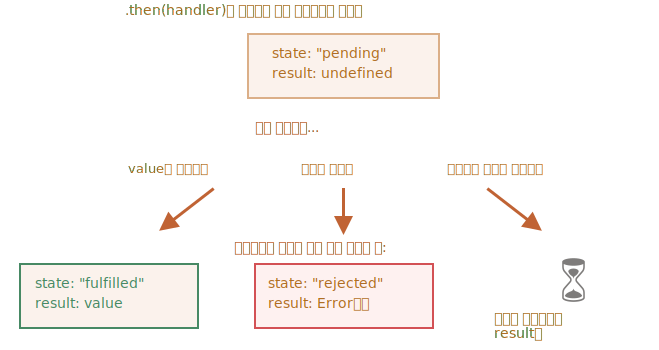

# 프라미스 체이닝

<info:callbacks>에서 언급한 문제를 다시 집어봅시다. 스크립트를 불러오는 것과 같이 순차적으로 처리해야 하는 비동기 작업이 여러 개 있다고 가정해 봅시다. 이런 상황을 어떻게 하면 코드로 잘 풀어낼 수 있을까요?

프라미스를 사용하면 여러 가지 해결책을 만들 수 있습니다.

이번 챕터에선 프라미스 체이닝(promise chaining)을 이용한 비동기 처리에 대해 다루도록 하겠습니다.

프라미스 체이닝은 아래와 같이 생겼습니다.

```js run
new Promise(function(resolve, reject) {

  setTimeout(() => resolve(1), 1000); // (*)

}).then(function(result) { // (**)

  alert(result); // 1
  return result * 2;

}).then(function(result) { // (***)

  alert(result); // 2
  return result * 2;

}).then(function(result) {

  alert(result); // 4
  return result * 2;

});
```

프라미스 체이닝은 `result`가 `.then` 핸들러의 체인(사슬)을 통해 전달된다는 점에서 착안한 아이디어입니다.

위 예시는 아래와 같은 순서로 실행됩니다.
1. 1초 후 최초 프라미스가 이행됩니다, -- `(*)`
2. 이후 `.then` 핸들러가 호출됩니다. --`(**)`
3. 2에서 반환한 값은 다음 `.then` 핸들러에 전달됩니다. -- `(***)`
4. 이런 과정이 계속 이어집니다.

`result`가 핸들러 체인을 따라 전달되므로, `alert` 창엔 `1`, `2`, `4`가 순서대로 출력됩니다.


이렇게 프라미스 체이닝이 가능한 이유는 `promise.then`을 호출하면 프라미스가 반환되기 때문입니다. 프라미스가 반환되기 때문에 `.then`을 호출할 수 있습니다.

핸들러가 값을 반환할 땐, 이 값이 프라미스의 `result`가 됩니다. 따라서 다음 `.then`은 이 값을 이용해 호출됩니다.  

**초보자는 프라미스 하나에 `.then`을 여러 개 추가한 후, 이를 체이닝이라고 착각합니다. 하지만 이는 체이닝이 아닙니다.**

예시:
```js run
let promise = new Promise(function(resolve, reject) {
  setTimeout(() => resolve(1), 1000);
});

promise.then(function(result) {
  alert(result); // 1
  return result * 2;
});

promise.then(function(result) {
  alert(result); // 1
  return result * 2;
});

promise.then(function(result) {
  alert(result); // 1
  return result * 2;
});
```

위 예시에선 프라미스 하나에 여러 개의 핸들러를 등록했습니다. 이 핸들러들은 `result`를 순차적으로 전달하지 않고, 독립적으로 처리합니다.

그림으로 표현하면 다음과 같습니다(프라미스 체이닝을 묘사한 위 그림과 비교해 보세요).


동일한 프라미스에 등록된 `.then` 전체는 동일한 결과(프라미스의 `result`)를 받습니다. 따라서 위 예시를 실행하면 얼럿 창엔 전부 `1`이 출력됩니다.

이런 식으로 한 프라미스에 여러 개의 핸들러를 등록해서 사용하는 경우는 거의 없습니다. 프라미스 체이닝이 더 많이 쓰이죠.

## 프라미스 반환하기

`.then(handler)`에 사용된 핸들러가 프라미스를 생성하거나 반환하는 경우도 있습니다.

이런 경우에 이어지는 핸들러는 프라미스가 처리될 때까지 기다리다가 처리가 완료되면 그 결과를 받습니다.

예시:

```js run
new Promise(function(resolve, reject) {

  setTimeout(() => resolve(1), 1000);

}).then(function(result) {

  alert(result); // 1

*!*
  return new Promise((resolve, reject) => { // (*)
    setTimeout(() => resolve(result * 2), 1000);
  });
*/!*

}).then(function(result) { // (**)

  alert(result); // 2

  return new Promise((resolve, reject) => {
    setTimeout(() => resolve(result * 2), 1000);
  });

}).then(function(result) {

  alert(result); // 4

});
```

예시에서 첫 번째 `.then`은 `1`을 출력하고 `new Promise(…)`를 반환(`(*)`)합니다.   
1초 후 이 프라미스가 이행되고 그 결과(`resolve`의 인수인 `result * 2`)는 두 번째 `.then`으로 전달됩니다. 두 번째 핸들러(`(**)`)는 `2`를 출력하고 동일한 과정을 반복합니다.

따라서 얼럿 창엔 이전 예시와 동일하게 1, 2, 4가 차례대로 출력됩니다. 다만 얼럿 창 사이에 1초의 딜레이가 생깁니다.

이렇게 프라미스를 반환하는 것도 비동기 작업 체인을 만들 수 있게 합니다.

## 예제: loadScript

위에서 배운 기능을 사용해 [이전 챕터](info:promise-basics#loadscript)에서 프라미스를 사용해 정의한 `loadScript`(스크립트를 순차적으로 불러줌)를 다시 작성해봅시다.

```js run
loadScript("/article/promise-chaining/one.js")
  .then(function(script) {
    return loadScript("/article/promise-chaining/two.js");
  })
  .then(function(script) {
    return loadScript("/article/promise-chaining/three.js");
  })
  .then(function(script) {
    // 불러온 스크립트 안에 정의된 함수를 호출해
    // 실제로 스크립트들이 정상적으로 로드되었는지 확인합니다.
    one();
    two();
    three();
  });
```

화살표 함수를 사용해 코드를 줄이는 것도 가능합니다.

```js run
loadScript("/article/promise-chaining/one.js")
  .then(script => loadScript("/article/promise-chaining/two.js"))
  .then(script => loadScript("/article/promise-chaining/three.js"))
  .then(script => {
    // 스크립트를 정상적으로 불러왔기 때문에, 스크립트 내의 함수를 호출할 수 있습니다.
    one();
    two();
    three();
  });
```


`loadScript`를 호출할 때마다 프라미스가 반환되고 다음 `.then`은 이 프라미스가 이행되었을 때 실행됩니다. 이후에 다음 스크립트를 로딩하기 위한 초기화가 진행됩니다. 스크립트는 이런 과정을 거쳐 순차적으로 로드됩니다.

체인에 더 많은 비동기 동작을 추가할 수도 있습니다. 추가 작업이 많아져도 코드가 오른쪽으로 길어지지 않고, 아래로만 증가한다는 점에 주목해 주시기 바랍니다. '멸망'의 피라미드가 만들어지지 않습니다.

한편, 아래와 같이 각 `loadScript`에 `.then`을 바로 붙일 수도 있습니다.

```js run
loadScript("/article/promise-chaining/one.js").then(script1 => {
  loadScript("/article/promise-chaining/two.js").then(script2 => {
    loadScript("/article/promise-chaining/three.js").then(script3 => {
      // 여기서 script1, script2, script3에 정의된 함수를 사용할 수 있습니다.
      one();
      two();
      three();
    });
  });
});
```

이렇게 `.then`을 바로 붙여도 동일한 동작(스크립트 세 개를 순차적으로 불러오는 작업)을 수행합니다. 하지만 코드가 '오른쪽으로' 길어졌네요. 콜백에서 언급한 문제와 동일한 문제가 발생했습니다.  

프라미스를 이제 막 배우기 시작해 체이닝에 대해 잘 모른다면 위와같이 코드를 작성할 수 있습니다. 그러나 대게 체이닝이 선호됩니다.

중첩 함수에서 외부 스코프에 접근할 수 있기 때문에 `.then`을 바로 쓰는 게 괜찮은 경우도 있습니다. 위 예제에서 가장 깊은 곳에 있는 중첩 콜백은  `script1`, `script2`, `script3` 안에 있는 변수 모두에 접근할 수 있습니다. 이런 예외 상황이 있다는 정도만 알아두도록 합시다. 


````smart header="thenable"
핸들러는 프라미스가 아닌 `thenable`이라 불리는 객체를 반환하기도 합니다. 메서드 `.then`을 가진 객체는 모두 `thenable`객체라고 부르는데, 이 객체는 프라미스와 같은 방식으로 처리됩니다.  

'thenable' 객체에 대한 아이디어는 서드파티 라이브러리가 '프라미스와 호환 가능한' 자체 객체를 구현할 수 있다는 점에서 나왔습니다. 이 객체들엔 자체 확장 메서드가 구현되어 있겠지만, `.then`이 있기 때문에 네이티브 프라미스와도 호환 가능합니다.

아래는 thenable 객체에 대한 예시입니다.

```js run
class Thenable {
  constructor(num) {
    this.num = num;
  }
  then(resolve, reject) {
    alert(resolve); // function() { 네이티브 코드 }
    // 1초 후 this.num*2와 함께 이행됨
    setTimeout(() => resolve(this.num * 2), 1000); // (**)
  }
}

new Promise(resolve => resolve(1))
  .then(result => {
*!*
    return new Thenable(result); // (*)
*/!*
  })
  .then(alert); // 1000밀리 초 후 2를 보여줌
```

자바스크립트는 `(*)`로 표시한 줄에서 `.then` 핸들러가 반환한 객체를 확인합니다. 이 객체에 호출 가능한 메서드 `then`이 있으면 `then`이 호출됩니다. `then`은 `resolve`와 `reject`라는 네이티브 함수를 인수로 받고(executor과 유사함), 둘 중 하나가 호출될 때까지 기다립니다. 위 예시에서 `resolve(2)`는 1초 후에 호출됩니다(`(**)`). 호출 후 결과는 체인을 따라 아래로 전달됩니다.

이런 식으로 구현하면 `Promise`를 상속받지 않고도 커스텀 객체를 사용해 프라미스 체이닝을 만들 수 있습니다.
````


## fetch와 체이닝 함께 응용하기

프론트 단에선, 네트워크 요청 시 프라미스를 자주 사용합니다. 이에 관련된 예시를 살펴봅시다. 

예시에선 메서드 [fetch](info:fetch)를 사용해 원격 서버에서 사용자 정보를 가져오겠습니다. `fetch`엔 다양한 선택 매개변수가 있는데 자세한 내용은  [별도의 챕터](info:fetch)에서 다루기로 하고, 여기선 기본 문법만 사용해 보겠습니다.

```js
let promise = fetch(url);
```

위 코드는 `url`에 네트워크 요청을 보내고 프라미스를 반환합니다.  

를 실행하면 `url`에 네트워크 요청이 가고 프라미스가 반환됩니다. 원격 서버가 헤더와 함께 응답을 보내면, 프라미스는 `response` 객체와 함께 이행됩니다. 그런데 *response 전체가 완전히 다운로드되기 전*에 이행 상태가 되어버리죠.  

응답 전체를 읽으려면 메서드 `response.text()`를 호출해야 합니다. `response.text()`는 원격 서버에서 전송한 텍스트 전체가 다운로드되면, 이 텍스트를 `result` 값으로 갖는 이행된 프라미스를 반환합니다.

아래 코드를 실행하면 `user.json`에 요청을 보내고, 서버에서 해당 텍스트를 불러옵니다.

```js run
fetch('/article/promise-chaining/user.json')
  // 원격 서버가 응답하면 .then 아래 코드가 실행됩니다.
  .then(function(response) {
    // response.text()는 응답 텍스트 전체가 다운로드되면
    // 응답 텍스트를 새로운 이행 프라미스를 만들고, 이를 반환합니다.
    return response.text();
  })
  .then(function(text) {
    // 원격에서 받아온 파일의 내용
    alert(text); // {"name": "iliakan", isAdmin: true}
  });
```

그런데 메서드 `response.json()` 를 쓰면 원격에서 받아온 데이터를 읽고, JSON으로 파싱할 수 있습니다. 예시엔 이 메서드가 더 적합하므로 기존에 작성한 코드를 약간 변경해 보겠습니다.

화살표 함수도 함께 써서 코드를 간결하게 해보겠습니다.

```js run
// 위 코드와 동일한 기능을 하지만, response.json()은 원격 서버에서 불러온 내용을 JSON으로 변경해줍니다.
fetch('/article/promise-chaining/user.json')
  .then(response => response.json())
  .then(user => alert(user.name)); // iliakan, got user name
```

불러온 사용자 정보를 가지고 무언가를 더 해보겠습니다.

GitHub에 요청을 보내 사용자 프로필을 불러오고 아바타를 출력해 보는 것같이 말이죠.

```js run
// user.json에 요청을 보냅니다.
fetch('/article/promise-chaining/user.json')
  // 응답받은 내용을 json으로 불러옵니다.
  .then(response => response.json())
  // GitHub에 요청을 보냅니다.
  .then(user => fetch(`https://api.github.com/users/${user.name}`))
  // 응답받은 내용을 json 형태로 불러옵니다.
  .then(response => response.json())
  // 3초간 아바타 이미지(githubUser.avatar_url)를 보여줍니다.
  .then(githubUser => {
    let img = document.createElement('img');
    img.src = githubUser.avatar_url;
    img.className = "promise-avatar-example";
    document.body.append(img);

    setTimeout(() => img.remove(), 3000); // (*)
  });
```

코드는 주석에 적은 대로 잘 동작합니다. 그런데 위 코드엔 프로미스를 다루는데 서툰 개발자가 자주 저지르는 잠재적 문제가 내재돼 있습니다.

`(*)`로 표시한 줄을 봅시다. 만약 아바타가 잠깐 보였다가 사라진 *이후에* 무언가를 하고 싶으면 어떻게 해야 할까요? 사용자 정보를 수정할 수 있게 해주는 폼을 보여주는 것 같은 작업을 추가하는 경우같이 말이죠. 지금으로선 방법이 없습니다.

체인을 확장할 수 있도록 만들려면, 아바타가 사라질 때 이행 프라미스를 반환해 줘야 합니다.

아래와 같이 말이죠.

```js run
fetch('/article/promise-chaining/user.json')
  .then(response => response.json())
  .then(user => fetch(`https://api.github.com/users/${user.name}`))
  .then(response => response.json())
*!*
  .then(githubUser => new Promise(function(resolve, reject) { // (*)
*/!*
    let img = document.createElement('img');
    img.src = githubUser.avatar_url;
    img.className = "promise-avatar-example";
    document.body.append(img);

    setTimeout(() => {
      img.remove();
*!*
      resolve(githubUser); // (**)
*/!*
    }, 3000);
  }))
  // 3초 후 동작함
  .then(githubUser => alert(`Finished showing ${githubUser.name}`));
```

`(*)`로 표시한 곳의 `.then` 핸들러는 이제 `setTimeout`안의 `resolve(githubUser)`를 호출했을 때(`(**)`) 만 처리상태가 되는 `new Promise`를 반환합니다.

체인의 다음 `.then`은 이를 기다리죠.

비동기 동작은 항상 프라미스를 반환하도록 하는 것이 좋습니다.

지금은 체인을 확장할 계획이 없더라도 이렇게 구현해 놓으면 나중에 체인 확장이 필요한 경우 손쉽게 체인을 확장할 수 있습니다.

이제 코드를 재사용 가능한 함수 단위로 분리해 마무리하겠습니다.

```js run
function loadJson(url) {
  return fetch(url)
    .then(response => response.json());
}

function loadGithubUser(name) {
  return fetch(`https://api.github.com/users/${name}`)
    .then(response => response.json());
}

function showAvatar(githubUser) {
  return new Promise(function(resolve, reject) {
    let img = document.createElement('img');
    img.src = githubUser.avatar_url;
    img.className = "promise-avatar-example";
    document.body.append(img);

    setTimeout(() => {
      img.remove();
      resolve(githubUser);
    }, 3000);
  });
}

// 함수를 이용하여 다시 동일 작업 수행
loadJson('/article/promise-chaining/user.json')
  .then(user => loadGithubUser(user.name))
  .then(showAvatar)
  .then(githubUser => alert(`Finished showing ${githubUser.name}`));
  // ...
```

## 요약

`.then` 또는 `catch/finally` 핸들러(어떤 경우도 상관없음)가 프라미스를 반환하면, 나머지 체인은 프라미스가 처리될 때까지 대기합니다. 처리가 완료되면 프라미스의 `result`(값 또는 에러)가 다음 체인으로 전달됩니다.

이를 그림으로 나타내면 아래와 같습니다.


