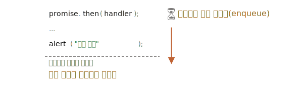

# 마이크로태스크

프라미스 핸들러 `.then/catch/finally`는 항상 비동기적으로 실행됩니다.

프라미스가 즉시 이행되더라도 `.then/catch/finally` *아래*에 있는 코드는 이 핸들러들이 실행되기 전에 실행됩니다.

예시:

```js run
let promise = Promise.resolve();

promise.then(() => alert("프라미스 성공!"));

alert("코드 종료"); // 이 얼럿 창이 가장 먼저 나타납니다.
```

예시를 실행하면 `코드 종료`가 먼저, `프라미스 성공!`이 나중에 출력되는 것을 볼 수 있습니다.

프라미스는 즉시 이행상태가 되었는데도 말이죠. 뭔가 이상하네요.

왜 `.then`이 나중에 트리거 되었을까요? 그 이유에 대해 알아봅시다.

## 마이크로태스크 큐

비동기 작업을 처리하려면 적절한 관리가 필요합니다. 이를 위해 표준에선 `PromiseJobs`라는 내부 큐(internal queue)를 명시합니다. V8 엔진에선 이를 '마이크로태스크 큐(microtask queue)'라고 부르기 때문에 이 용어가 좀 더 선호됩니다.

[명세서](https://tc39.github.io/ecma262/#sec-jobs-and-job-queues)의 설명을 살펴봅시다.

- 마이크로태스크 큐는 먼저 들어온 작업을 먼저 실행합니다(FIFO, first-in-first-out).
- 실행할 것이 아무것도 남아있지 않을 때만 큐에 있는 작업이 실행되기 시작합니다.

요약하자면, 어떤 프라미스가 준비되었을 때, 이 프라미스의 `.then/catch/finally` 핸들러가 큐에 들어간다고 생각하시면 됩니다. 이때 핸들러들은 여전히 실행되지 않습니다. 현재 코드에서 자유로운 상태가 되었을 때에서야 자바스크립트 엔진은 큐에서 작업을 꺼내 실행합니다.

위 예시에서 '코드 종료'가 먼저 출력되는 이유가 여기에 있습니다.



프라미스 핸들러는 항상 내부 큐를 통과하게 됩니다.

`.then/catch/finally`가 여러 개 있어서 체인이 만들어진 경우엔 모든 핸들러가 각각 비동기로 실행됩니다. 각 핸들러는 먼저 큐에 들어갔다가 현재 코드가 완료되고, 큐에 있는 이전 핸들러의 실행이 완료되었을 때 실행됩니다.

**그런데 실행 순서가 중요해서 `코드 종료`를 `프라미스 성공!`보다 나중에 출력되게 하려면 어떻게 해야 할까요?** 

방법은 아주 쉽습니다. `.then`을 사용해 큐에 넣으면 됩니다.

```js run
Promise.resolve()
  .then(() => alert("프라미스 성공!"))
  .then(() => alert("코드 종료"));
```

이제 의도한 대로 순서가 변경되었습니다.

## 처리되지 못한 거부

이전 챕터,  <info:promise-error-handling>에서 학습한 `unhandledrejection` 이벤트를 기억하고 계시나요?

이제 자바스크립트 엔진이 어떻게 처리되지 못한 거부(unhandled rejection)를 찾는지 정확히 알 수 있습니다. 

**'처리되지 못한 거부'는 마이크로태스크 큐 끝에서 프라미스 에러가 처리되지 못할 때 발생합니다.**

정상적인 경우라면 에러가 생길 것을 대비하여 프라미스 체인에 `.catch`를 추가해 에러를 처리합니다.

```js run
let promise = Promise.reject(new Error("프라미스 실패!"));
*!*
promise.catch(err => alert('잡았다!'));
*/!*

// 에러가 잘 처리되었으므로 실행되지 않습니다.
window.addEventListener('unhandledrejection', event => alert(event.reason));
```

그런데 `.catch`를 추가해주는 걸 잊은 경우, 마이크로태스크 큐가 빈 이후에 엔진은 `unhandledrejection` 이벤트를 트리거 합니다.

```js run
let promise = Promise.reject(new Error("프라미스 실패!"));

// 프라미스 실패!
window.addEventListener('unhandledrejection', event => alert(event.reason));
```

그런데 만약 아래와 같이 에러를 나중에 처리하면 어떤 일이 생길까요?

```js run
let promise = Promise.reject(new Error("프라미스 실패!"));
*!*
setTimeout(() => promise.catch(err => alert('잡았다!')), 1000);
*/!*

// Error: 프라미스 실패!
window.addEventListener('unhandledrejection', event => alert(event.reason));
```

예시를 실행하면 `프라미스 실패!`가 먼저, `잡았다!`가 나중에 출력되는 걸 확인할 수 있습니다. 

마이크로태스크 큐에 대해 몰랐다면 "에러를 잡았는데도 왜 `unhandledrejection` 핸들러가 실행되는 거지?"라는 의문을 가졌을 겁니다.

이제 우리는 마이크로태스크 큐에 있는 작업 모두가 완료되었을 때 `unhandledrejection`이 실행된다는 것을 알기 때문에 이런 의문을 품지 않을 겁니다. 엔진은 프라미스를 검사하고 이 중 하나라도 '거부(rejected)' 상태이면 `unhandledrejection` 핸들러를 트리거 하기 때문입니다. 

위 예시에서 `setTimeout`에 의해 추가된 `.catch`는 트리거 되긴 하는데, `unhandledrejection`이 만들어진 이후에 트리거 되므로 `.catch`가 있어도 `프라미스 실패!`가 출력됩니다.

## 요약

모든 프라미스 동작은 내부 '마이크로태스크 큐'(V8 용어)라고도 불리는 '프라미스 잡(promise job)' 큐에 들어가서 처리되기 때문에 프라미스 핸들링은 항상 비동기로 처리됩니다.

따라서 `.then/catch/finally` 핸들러는 항상 현재 코드가 종료되고 난 후에 호출됩니다.

어떤 코드 조각을 `.then/catch/finally`가 호출된 이후에 실행하고 싶다면 `.then`을 체인에 추가하고 이 안에 코드 조각을 넣으면 됩니다.

브라우저와 Node.js를 포함하는 대부분의 자바스크립트 엔진에선, 마이크로태스크가 '이벤트 루프(event loop)'와 '매크로태스크(macrotask)'와 깊은 연관 관계를 맺습니다. 이 둘은 프라미스와는 직접적인 연관성이 없기 때문에, <info:event-loop> 챕터에서 따로 다루도록 하겠습니다.
