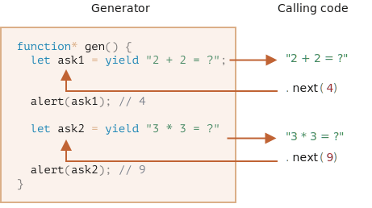

# 제너레이터

일반 함수는 하나의 값(혹은 0개의 값)만을 반환합니다.

하지만 제너레이터(generator)를 사용하면 여러 개의 값을 필요에 따라 하나씩 반환(yield)할 수 있습니다. 제너레이터와 [이터러블 객체](info:iterable)를 함께 사용하면 손쉽게 데이터 스트림을 만들 수 있습니다.

## 제너레이터 함수

제너레이터를 만들려면 '제너레이터 함수'라 불리는 특별한 문법 구조, `function*`이 필요합니다.

예시:

```js
function* generateSequence() {
  yield 1;
  yield 2;
  return 3;
}
```

제너레이터 함수는 일반 함수와 동작 방식이 다릅니다. 제너레이터 함수를 호출하면 코드가 실행되지 않고, 대신 실행을 처리하는 특별 객체, '제너레이터 객체'가 반환됩니다.

예시를 살펴봅시다.

```js run
function* generateSequence() {
  yield 1;
  yield 2;
  return 3;
}

// '제너레이터 함수'는 '제너레이터 객체'를 생성합니다.
let generator = generateSequence();
*!*
alert(generator); // [object Generator]
*/!*
```

함수 본문 코드는 아직 실행되지 않았습니다.


`next()`는 제너레이터의 주요 메서드입니다. `next()`를 호출하면 가장 가까운 `yield <value>`문을 만날 때까지 실행이 지속됩니다(`value`를 생략할 수도 있는데, 이 경우엔 `undefined`가 됩니다). 이후, `yield <value>`문을 만나면 실행이 멈추고 산출하고자 하는 값인 `value`가 바깥 코드에 반환됩니다(yield는 '생산하다, 산출하다'라는 뜻을 가짐 - 옮긴이).

`next()`는 항상 아래 두 프로퍼티를 가진 객체를 반환합니다.
- `value`: 산출 값
- `done`: 함수 코드 실행이 끝났으면 `true`, 아니라면 `false`

제너레이터를 만들고 첫 번째 산출 값을 받는 예시를 살펴봅시다. 

```js run
function* generateSequence() {
  yield 1;
  yield 2;
  return 3;
}

let generator = generateSequence();

*!*
let one = generator.next();
*/!*

alert(JSON.stringify(one)); // {value: 1, done: false}
```

현재로서는 첫 번째 값만 받았으므로 함수 실행은 두 번째 줄에서 멈췄습니다.


`generator.next()`를 다시 호출해봅시다. 실행이 재개되고 다음 `yield`를 반환합니다.

```js
let two = generator.next();

alert(JSON.stringify(two)); // {value: 2, done: false}
```


`generator.next()`를 또 호출하면 실행은 `return`문에 다다르고 함수가 종료됩니다.

```js
let three = generator.next();

alert(JSON.stringify(three)); // {value: 3, *!*done: true*/!*}
```


이제 제너레이터가 종료되었습니다. 마지막 결과인 `value:3`과 `done:true`를 통해 이를 확인할 수 있습니다. 

제너레이터가 종료되었기 때문에 지금 상태에선 `generator.next()`를 호출해도 아무 소용이 없습니다. `generator.next()`를 여러번 호출해도 객체 `{done: true}`가 반환될 뿐입니다.

```smart header="`function* f(…)`가 맞나요 아니면 `function *f(…)`가 맞나요?"
둘 다 맞습니다.

그런데 `*`는 제너레이터 `함수`를 나타내므로 대개는 첫 번째 문법이 선호됩니다. `*`는 종류를 나타내는 것이지 이름을 나타내는 것이 아니기 때문입니다. 그러므로 `*`는 `function`에 붙이도록 합시다.  
```

## 제너레이터와 이터러블

`next()` 메서드를 보면서 짐작하셨듯이, 제너레이터는 [이터러블](info:iterable) 입니다.

따라서 `for..of` 반복문을 사용해 값을 얻을 수 있습니다.

```js run
function* generateSequence() {
  yield 1;
  yield 2;
  return 3;
}

let generator = generateSequence();

for(let value of generator) {
  alert(value); // 1, 2가 출력됨
}
```

`.next().value`을 호출하는 것 보다 나아 보이네요.

그런데 주의할 점이 있습니다. 위 예시를 실행하면 `1`과 `2`만 출력되고 `3`은 출력되지 않습니다.

이유는 `for..of` 이터레이션이 `done: true`일 때 마지막 `value`를 무시하기 때문입니다. 그러므로 `for..of`를 사용했을 때 모든 값이 출력되길 원한다면 `yield`로 값을 반환해야 합니다. 

```js run
function* generateSequence() {
  yield 1;
  yield 2;
*!*
  yield 3;
*/!*
}

let generator = generateSequence();

for(let value of generator) {
  alert(value); // 1, 2, 3
}
```

제너레이터는 이터러블 객체이므로 제너레이터에도 전개 연산자(`...`) 같은 관련 기능을 사용할 수 있습니다.

```js run
function* generateSequence() {
  yield 1;
  yield 2;
  yield 3;
}

let sequence = [0, ...generateSequence()];

alert(sequence); // 0, 1, 2, 3
```

위 예시에서 `...generateSequence()`는 반복 가능한 제너레이터 객체를 배열 요소로 바꿔줍니다. 전개 연산자에 대한 자세한 설명은 [](info:rest-parameters-spread-operator#spread-operator)에서 볼 수 있습니다.

## 이터러블 대신 제너레이터 사용하기

[](info:iterable)를 다룬 챕터에서 `from..to` 사이에 있는 값을 반환하는 반복 가능 객체, `range`를 만들어 보았습니다.

코드를 상기해 봅시다.

```js run
let range = {
  from: 1,
  to: 5,

  // for..of 최초 호출 시, Symbol.iterator가 호출됩니다.
  [Symbol.iterator]() {
    // Symbol.iterator는 이터레이터 객체를 반환합니다.
    // for..of는 반환된 이터레이터 객체만을 대상으로 동작하는데, 이때 다음 값도 정해집니다.
    return {
      current: this.from,
      last: this.to,

      // for..of 반복문에 의해 각 이터레이션마다 next()가 호출됩니다.
      next() {
        // next()는 객체 형태의 값, {done:.., value :...}을 반환해야 합니다.
        if (this.current <= this.last) {
          return { done: false, value: this.current++ };
        } else {
          return { done: true };
        }
      }
    };
  }
};

// 객체 range를 대상으로 하는 이터레이션은 range.from과 range.to 사이의 숫자를 출력합니다.
alert([...range]); // 1,2,3,4,5
```

`Symbol.iterator` 대신 제너레이터 함수를 사용하면, 제너레이터 함수로 반복이 가능합니다.

같은 `range`이지만, 좀 더 압축된 `range`를 살펴봅시다.

```js run
let range = {
  from: 1,
  to: 5,

  *[Symbol.iterator]() { // [Symbol.iterator]: function*()를 짧게 줄임
    for(let value = this.from; value <= this.to; value++) {
      yield value;
    }
  }
};

alert( [...range] ); // 1, 2, 3, 4, 5
```

`range[Symbol.iterator]()`는 제너레이터를 반환하고, 제너레이터 메서드는 `for..of`가 동작하는데 필요한 사항(아래 설명)을 충족시키므로 예시가 잘 동작합니다.
- `.next()` 메서드가 있음
- 반환 값의 형태는 `{value: ..., done: true/false}`이어야 함

이렇게 이터러블 객체 대신 제너레이터를 사용할 수 있는 것은 우연이 아닙니다. 제너레이터는 이터레이터를 어떻게 하면 쉽게 구현할지를 염두에 두며 자바스크립트에 추가되었습니다.

제너레이터를 사용해 구현한 예시는 이터러블을 사용해 구현한 기존 예시보다 훨씬 간결합니다. 그리고 동일한 기능을 제공합니다.

```smart header="제너레이터는 무한한 값을 만들 수도 있습니다."
위 예시에선 유한한 연속 값을 생성했지만, 값을 끊임없이 생성하는 제너레이터를 만드는 것도 가능합니다. 끊임없는 의사 난수를 생성하는 것처럼 말이죠. 

끊임없는 값을 생성하는 제너레이터를 만들었다면 당연히 `for..of` 안에 `break`나 `return`이 있어야 합니다. 그렇지 않으면 무한 반복문이 되어서 스크립트가 멈춥니다.
```

## 제너레이터 컴포지션

제너레이터 컴포지션(generator composition)은 제너레이터 안에 제너레이터를 '임베딩(embedding, composing)'할 수 있게 해주는 제너레이터의 특별 기능입니다.

먼저, 연속된 숫자를 생성하는 제너레이터 함수를 만들어보겠습니다.

```js
function* generateSequence(start, end) {
  for (let i = start; i <= end; i++) yield i;
}
```

그리고 이 함수를 기반으로 좀 더 복잡한 값을 연속해서 생성하는 함수를 만들어봅시다. 값 생성 규칙은 다음과 같습니다.  
- 처음엔 숫자 `0`부터 `9`까지를 생성합니다(문자 코드 48부터 57까지),
- 이어서 알파벳 대문자 `A`부터 `Z`까지를 생성합니다(문자 코드 65부터 90까지).
- 이어서 알파벳 소문자 `a`부터 `z`까지를 생성합니다(문자 코드 97부터 122까지).

이런 규칙을 충족하는 연속 값은 비밀번호를 만들 때 응용할 수 있습니다(물론 특수 문자도 추가 할 수 있습니다). 

일반 함수로는 여러 개의 함수를 만들고 그 호출 결과를 어딘가에 저장한 후 다시 그 결과들을 조합해야 원하는 기능을 구현할 수 있습니다.

하지만 제너레이터의 특수 문법 `yield*`를 사용하면 제너레이터를 다른 제너레이터에 '끼워 넣을 수' 있습니다.

컴포지션을 적용한 제너레이터는 다음과 같습니다.

```js run
function* generateSequence(start, end) {
  for (let i = start; i <= end; i++) yield i;
}

function* generatePasswordCodes() {

*!*
  // 0..9
  yield* generateSequence(48, 57);

  // A..Z
  yield* generateSequence(65, 90);

  // a..z
  yield* generateSequence(97, 122);
*/!*

}

let str = '';

for(let code of generatePasswordCodes()) {
  str += String.fromCharCode(code);
}

alert(str); // 0..9A..Za..z
```

`yield*` 지시자는 실행을 다른 제너레이터에 *위임합니다(delegate)*. 여기서 '위임'은 `yield* gen`이 제너레이터 `gen`을 대상으로 반복을 수행하고, 산출 값들을 바깥으로 전달한다는 것을 의미합니다. 마치 외부 제너레이터에 의해 값이 산출된 것처럼 말이죠.

중첩 제너레이터(`generateSequence`)의 코드를 직접 써줘도 결과는 같습니다.

```js run
function* generateSequence(start, end) {
  for (let i = start; i <= end; i++) yield i;
}

function* generateAlphaNum() {

*!*
  // yield* generateSequence(48, 57);
  for (let i = 48; i <= 57; i++) yield i;

  // yield* generateSequence(65, 90);
  for (let i = 65; i <= 90; i++) yield i;

  // yield* generateSequence(97, 122);
  for (let i = 97; i <= 122; i++) yield i;
*/!*

}

let str = '';

for(let code of generateAlphaNum()) {
  str += String.fromCharCode(code);
}

alert(str); // 0..9A..Za..z
```

제너레이터 컴포지션을 사용하면 한 제너레이터의 흐름을 자연스럽게 다른 제너레이터에 삽입할 수 있습니다. 제너레이터 컴포지션을 사용하면 중간 결과 저장 용도의 추가 메모리가 필요하지 않습니다.

## 'yield'를 사용해 제너레이터 안/밖으로 정보 교환하기

지금까지 배운 제너레이터는 값을 생성해주는 특수 문법을 가진 이터러블 객체와 유사했습니다. 그런데 사실 제너레이터는 더 강력하고 유연한 기능을 제공합니다. 

`yield`가 양방향 길과 같은 역할을 하기 때문입니다. `yield`는 결과를 바깥으로 전달할 뿐만 아니라 값을 제너레이터 안으로 전달하기까지 합니다.

값을 안, 밖으로 전달하려면 `generator.next(arg)`를 호출해야 합니다. 이때 인수 `arg`는 `yield`의 결과가 됩니다.

예시를 살펴봅시다.

```js run
function* gen() {
*!*
  // 질문을 제너레이터 밖 코드에 던지고 답을 기다립니다.
  let result = yield "2 + 2 = ?"; // (*)
*/!*

  alert(result);
}

let generator = gen();

let question = generator.next().value; // <-- yield는 value를 반환합니다.

generator.next(4); // --> 결과를 제너레이터 안으로 전달합니다.
```


1. `generator.next()`를 처음 호출할 땐 항상 인수가 없어야 합니다. `generator.next()`를 호출하면 실행이 시작되고 첫 번째 `yield "2+2=?"`의 결과가 반환됩니다. 이 시점에는 제너레이터가 `(*)`로 표시한 줄에서 실행을 잠시 멈춥니다
2. 그 후, 위 그림에서 보듯이 `yield`의 결과가 제너레이터를 호출하는 외부 코드에 있는 변수, `question`에 할당됩니다. 
3. 마지막 줄, `generator.next(4)`에서 제너레이터가 다시 시작되고 `4`는 `result`에 할당됩니다(`let result = 4`).

외부 코드에선 `next(4)`를 즉시 호출하지 않고 있다는 점에 주목해 주시기 바랍니다. 제너레이터가 기다려주기 때문에 호출을 나중에 해도 문제가 되지 않습니다.  

예시:

```js
// 일정 시간이 지난 후 제너레이터가 다시 시작됨
setTimeout(() => generator.next(4), 1000);
```

일반 함수와 다르게 제너레이터와 외부 호출 코드는 `next/yield`를 이용해 결과를 전달 및 교환합니다.

또 하나의 예시를 살펴보며 이 과정을 자세히 알아보겠습니다.

```js run
function* gen() {
  let ask1 = yield "2 + 2 = ?";

  alert(ask1); // 4

  let ask2 = yield "3 * 3 = ?"

  alert(ask2); // 9
}

let generator = gen();

alert( generator.next().value ); // "2 + 2 = ?"

alert( generator.next(4).value ); // "3 * 3 = ?"

alert( generator.next(9).done ); // true
```

실행 흐름을 나타낸 그림은 다음과 같습니다.



1. 제너레이터 객체가 만들어지고 첫 번째 `.next()`가 호출되면, 실행이 시작되고 첫 번째 `yield`에 다다릅니다.
2. 산출 값은 바깥 코드로 반환됩니다.
3. 두 번째 `.next(4)`는 첫 번째 `yield`의 결과가 될 `4`를 제너레이터 안으로 전달합니다. 그리고 다시 실행이 이어집니다.
4. 실행 흐름이 두 번째 `yield`에 다다르고, 산출 값(`"3 * 3 = ?"`)이 제너레이터 호출 결과가 됩니다.
5. 세 번째 `next(9)`는 두 번째 `yield`의 결과가 될 `9`를 제너레이터 안으로 전달합니다. 그리고 다시 실행이 이어지는데, `done: true`이므로 제너레이터 함수는 종료됩니다.

마치 '핑퐁 게임' 같아 보이네요. 첫 번째 `next()`를 제외한 각 `next(value)`는 현재 `yield`의 결과가 될 값을 제너레이터 안에 전달합니다. 그리고 다음 `yield`의 결과로 되돌아옵니다.

## generator.throw

여러 가지 예시를 통해 살펴보았듯이 외부 코드는 `yield`의 결과가 될 값을 제너레이터 안에 전달하기도 합니다.

그런데 외부 코드가 에러를 만들거나 던질 수도 있습니다. 에러는 결과의 한 종류이기 때문에 이는 자연스러운 현상입니다. 

에러를 `yield` 안으로 전달하려면 `generator.throw(err)`를 호출해야 합니다. `generator.throw(err)`를 호출하게 되면 `err`는 `yield`가 있는 줄로 던져집니다.

`"2 + 2 = ?"`의 산출 값이 에러를 발생시키는 경우를 살펴봅시다.

```js run
function* gen() {
  try {
    let result = yield "2 + 2 = ?"; // (1)

    alert("위에서 에러가 던져졌기 때문에 실행 흐름은 여기까지 다다르지 못합니다.");
  } catch(e) {
    alert(e); // 에러 출력
  }
}

let generator = gen();

let question = generator.next().value;

*!*
generator.throw(new Error("데이터베이스에서 답을 찾지 못했습니다.")); // (2)
*/!*
```

`(2)`에서 제너레이터 안으로 던진 에러는 `yield`와 함께 라인 `(1)`에서 예외를 만듭니다. 예외는 `try..catch`에서 잡히고, 관련 정보가 얼럿창에 출력됩니다.

제너레이터 안에서 예외를 처리하지 않았다면 예외는 여타 예외와 마찬가지로 제너레이터 호출 코드(외부 코드)로 '떨어져 나옵니다'.

`generator.throw`(라인 `(2)`)에서 제너레이터를 호출하고 있으므로 아래와 같이 에러를 여기서 잡아도 됩니다.

```js run
function* generate() {
  let result = yield "2 + 2 = ?"; // Error in this line
}

let generator = generate();

let question = generator.next().value;

*!*
try {
  generator.throw(new Error("데이터베이스에서 답을 찾지 못했습니다."));
} catch(e) {
  alert(e); // 에러 출력
}
*/!*
```

이렇게 제너레이터 바깥에서 에러를 잡지 못하면 에러는 제너레이터 호출 코드 바깥으로 떨어져 나갑니다. 여기서도 에러를 잡지 못하면 스크립트가 죽겠죠.

## 요약

- 제너레이터는 제너레이터 함수 `function* f(…) {…}`을 사용해 만듭니다.
- `yield` 연산자는 제너레이터 안에 있어야 합니다.
- `next/yield` 호출을 사용하면 외부 코드와 제너레이터 간에 결과를 교환할 수 있습니다.

모던 자바스크립트에서는 제너레이터를 잘 사용하지 않습니다. 그러나 제너레이터를 사용하면 실행 중에도 제너레이터 호출 코드와 데이터를 교환할 수 있기 때문에 유용하게 사용되는 경우가 종종 있습니다. 그리고 제너레이터를 사용하면 이터러블 객체를 쉽게 만들 수 있다는 장점도 있습니다.

다음 챕터에서 배울 비동기 제너레이터(asnyc generator)를 사용하면 비동기적으로 생성된 데이터 스트림을 손쉽게 읽을 수 있다는 장점도 있습니다.

웹 프로그래밍에선 데이터 스트림을 다뤄야 하는 경우가 많은데, 제너레이터는 이 경우에 자주 사용됩니다.
