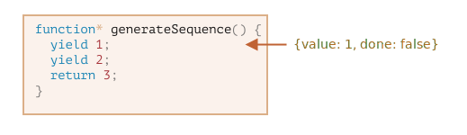

# 제너레이터

일반 함수는 하나의 단일 값(또는 없음)만 반환합니다.

제너레이터(generator)는 필요에 따라 여러 값을 차례로 반환("yield") 할 수 있습니다. 이것은 [iterable(이터러블)](info:itarables)과 함께 사용했을 때 잘 동작하여 데이터 스트림을 쉽게 생성할 수 있습니다.

## 제너레이터 함수

제너레이터를 만드려면 특별한 함수 구문인 `function*`, 이른바 "제너레이터 함수"가 필요합니다.

제너레이터 함수는 다음과 같이 생겼습니다.

```js
function* generateSequence() {
  yield 1;
  yield 2;
  return 3;
}
```

제너레이터 함수는 일반 함수와 다르게 작동합니다. 제너레이터 함수가 호출되면 코드가 실행되지 않습니다. 대신 "제너레이터 객체"라는 특수 객체를 반환하여 실행을 관리합니다.

여기를 보세요.

```js run
function* generateSequence() {
  yield 1;
  yield 2;
  return 3;
}

// "제너레이터 함수"는 "제너레이터 객체"를 생성합니다.
let generator = generateSequence();
*!*
alert(generator); // [object Generator]
*/!*
```

아직 함수 코드가 실행되지 않았습니다.


제너레이터의 주요 메서드는 `next()`입니다. 메서드가 호출되면 가장 가까운 `yield<value>`문까지 실행합니다.(`value`는 생략될 수 있어 생략된 경우 'value'는 `undefined`입니다.) 그 후 함수 실행이 잠시 멈추고 산출된 `value`가 외부 코드로 반환됩니다.

`next()`의 결과는 항상 두 가지 속성을 가진 객체입니다.
- `value`: 산출된 값
- `done`: 함수 코드가 끝났을 경우 `true`, 그렇지 않은 경우 `false`

예를 들어 여기서 제너레이터를 생성하고 첫 번째 산출값을 얻습니다.

```js run
function* generateSequence() {
  yield 1;
  yield 2;
  return 3;
}

let generator = generateSequence();

*!*
let one = generator.next();
*/!*

alert(JSON.stringify(one)); // {value: 1, done: false}
```

현재는 첫 번째 값만을 얻었고 함수 실행은 두 번째 줄에 있습니다.



`generator.next()`를 다시 호출해봅시다. 코드 실행을 재개하고 다음 `yield`를 반환합니다.

```js
let two = generator.next();

alert(JSON.stringify(two)); // {value: 2, done: false}
```


그리고 세 번째 호출하면 실행은 함수가 끝나는 `return`문에 도달합니다.

```js
let three = generator.next();

alert(JSON.stringify(three)); // {value: 3, *!*done: true*/!*}
```


이제 제너레이터가 끝났습니다. `done:true`에서 끝난 것을 확인하고 `value:3`을 최종 결과로 처리해야합니다.

`generator.next()`라는 새로운 호출은 더 이상 의미가 없습니다. 새로운 호출을 하면 동일한 객체 `{done:true}`를 반환합니다.

```
smart header="`function* f(…)` 또는 `function *f(…)`?"
두 문법 모두 맞습니다.

일반적으로 첫 번째 문법이 선호되지만 별표 `*`가 제너레이터 함수임을 의미하여 함수의 이름이 아닌 종류를 묘사하므로 `function` 키워드를 사용해야합니다.
```

## 제너레이터는 이터러블입니다.

이미 `next()` 메서드를 보며 짐작했겠지만 제너레이터는 [iterable](info:iterable)입니다.

`for..of`로 반복하여 값을 얻을 수 있습니다.

```js run
function* generateSequence() {
  yield 1;
  yield 2;
  return 3;
}

let generator = generateSequence();

for(let value of generator) {
  alert(value); // 1, then 2
}
```

`.next().value`를 호출하는 것보다 훨씬 좋습니다. 그렇죠?

그러나 위의 예는 `1`, `2`를 보여준다는 것에 유의하세요. 그게 전부입니다. `3`을 보여주지 않습니다!

`for..of` 반복은 `done:true`일 때 마지막 `value`를 무시하기 때문입니다. 따라서 모든 결과를 `for..of`로 보여주려면 결과를 `yield`로 반환해야합니다.

```js run
function* generateSequence() {
  yield 1;
  yield 2;
*!*
  yield 3;
*/!*
}

let generator = generateSequence();

for(let value of generator) {
  alert(value); // 1, then 2, then 3
}
```

제너레이터는 이터러블이므로 모든 관련 기능(예: 스프레드 연산자 `...`)를 호출할 수 있습니다.

```js run
function* generateSequence() {
  yield 1;
  yield 2;
  yield 3;
}

let sequence = [0, ...generateSequence()];

alert(sequence); // 0, 1, 2, 3
```

위의 코드에서 `...generateSequence()`는 이터러블 제너레이터 객체를 항목의 배열로 변환합니다. ([](info:rest-parameters-spread-operator#spread-operator) 장에서 스프레드 연산자에 대해 자세히 알아보세요.)

## 이터러블을 위한 제너레이터 사용

조금 전 [](info:iterable) 장에서 `from..to` 값을 반환하는 이터러블 `range` 객체를 만들었습니다.

여기 코드를 기억해보세요.

```js run
let range = {
  from: 1,
  to: 5,

// for..of range는 처음에 Symbol.iterator 메서드를 한 번 호출합니다.
  [Symbol.iterator]() {
    // Symbol.iterator는 이터레이터 객체를 반환합니다.
    // 이후 for..of는 반환된 이터레이터 객체만을 대상으로 동작하는데, 이때 다음 값도 정해집니다.
    return {
      current: this.from,
      last: this.to,

      // for..of 반복문에 의해 반복마다 next()가 호출됩니다.
      next() {
        // next()는 값을 객체 {done:.., value :...}형태로 반환해야 합니다.
        if (this.current <= this.last) {
          return { done: false, value: this.current++ };
        } else {
          return { done: true };
        }
      }
    };
  }
};

// range에 대한 반복은 range에서 range까지의 숫자를 반환합니다. 
alert([...range]); // 1,2,3,4,5
```

`Symbol.iterator`로 제공함으로써 반복을 위한 제너레이터 함수를 사용할 수 있습니다.

다음은 동일한 `range`이지만 훨씬 더 간단합니다.

```js run
let range = {
  from: 1,
  to: 5,

  *[Symbol.iterator]() { // [Symbol.iterator]의 약자: function*()
    for(let value = this.from; value <= this.to; value++) {
      yield value;
    }
  }
};

alert( [...range] ); // 1,2,3,4,5
```

이제 `range[Symbol.iterator]()`가 제너레이터를 반환하고 제너레이터 메서드는 `for..of`의 결과와 정확히 일치하기 때문에 작동합니다.
- Symbol.iterator는 `.next ()` 메소드를 갖고 있습니다
- Symbol.iterator는 `{value : ..., done : true / false}` 형식으로 값을 반환합니다.

물론 우연의 일치는 아닙니다. 제너레이터는 반복문을 보다 쉽게 구현하기 위해 이터레이터를 염두에 두고 JavaScript 언어에 추가되었습니다.

제너레이터가 있는 변형은 원래 반복 가능한 `range` 코드보다 훨씬 간결하며 동일한 기능을 유지합니다.

```smart header = "제너레이터는 영원히 값을 생성 할 수 있습니다"
위의 예제에서 유한 시퀀스를 생성했지만 값을 영원히 생성하는 제너레이터를 만들 수도 있습니다. 예를 들어 끝없는 일련의 의사 난수와 같은 것 말입니다.

의사 난수 생성기는 반드시 값을 영원히 생성하는 제너레이터에게 `for..of`안에 `break'(또는 `return`) 사용을 요구할 것입니다. 그렇지 않으면 반복문은 영원히 반복될 것입니다.
```

##제너레이터 구성

제너레이터 구성은 제너레이터의 특별한 기능으로 제너레이터를 서로 투명하게 "포함" 할 수 있습니다.

예를 들어 일련의 숫자를 생성하는 함수가 있습니다.

```js
function* generateSequence(start, end) {
  for (let i = start; i <= end; i++) yield i;
}
```

이제 더 복잡한 시퀀스를 생성하기 위해 수를 재사용하려 합니다.
- 먼저 숫자 `0..9`(문자 코드 48..57)가 생성됩니다.
- 그 뒤에 알파벳 대문자`A..Z` (문자 코드 65..90)가 붙습니다.
- 그 뒤에 알파벳 소문자 `a..z` (문자 코드 97..122)가 붙습니다.

이렇게 만들어진 시퀀스는 이 시퀀스에서 문자를 선택하여 암호를 생성하는데 이용할 수 있지만(구문 문자도 추가할 수 있음), 시퀀스를 먼저 생성하세요.

일반 함수에서는 여러 다른 함수의 결과를 조합하기 위해 시퀀스를 호출하고 결과를 저장 한 다음 끝에 결합합니다.

제너레이터의 경우 한 제너레이터를 다른 제너레이터에 "포함(구성)"하는 특별한 `yield*` 구문이 있습니다.

구성된 제너레이터 :

```js run
function* generateSequence(start, end) {
  for (let i = start; i <= end; i++) yield i;
}

function* generatePasswordCodes() {

*!*
  // 0..9
  yield* generateSequence(48, 57);

  // A..Z
  yield* generateSequence(65, 90);

  // a..z
  yield* generateSequence(97, 122);
*/!*

}

let str = '';

for(let code of generatePasswordCodes()) {
  str += String.fromCharCode(code);
}

alert(str); // 0..9A..Za..z
```

`yield*` 지시어는 실행을 다른 제너레이터로 *위임*합니다. 이 용어는 `yield* gen`이 제너레이터 `gen`을 반복하고 외부의 'yield'를 투명하게 전달함을 의미합니다. 마치 외부 제너레이터에 의해 값이 산출된 것처럼 말입니다.

위 실행의 결과는 중첩된 제너레이터에서 코드를 인라인(inlined)하는 것과 같습니다.

```js run
function* generateSequence(start, end) {
  for (let i = start; i <= end; i++) yield i;
}

function* generateAlphaNum() {

*!*
  // yield* generateSequence(48, 57);
  for (let i = 48; i <= 57; i++) yield i;

  // yield* generateSequence(65, 90);
  for (let i = 65; i <= 90; i++) yield i;

  // yield* generateSequence(97, 122);
  for (let i = 97; i <= 122; i++) yield i;
*/!*

}

let str = '';

for(let code of generateAlphaNum()) {
  str += String.fromCharCode(code);
}

alert(str); // 0..9A..Za..z
```

제너레이터 구성은 한 제너레이터의 흐름을 다른 제너레이터에 삽입하는 자연스러운 방법입니다. 중간 결과를 저장하기 위해 추가 메모리를 사용하지 않습니다.

## "yield"는 양방향 도로입니다.

이 시점까지 제너레이터는 값을 생성하기 위한 특수 구문이 있는 이터러블 객체와 유사했습니다. 그러나 실제로 제너레이터는 훨씬 더 강력하고 유연합니다.

그 이유는 `yield`가 양방향 도로이기 때문입니다. 'yield'는 결과를 외부로 반환할 뿐만 아니라 제너레이터 내부의 값을 전달할 수도 있습니다.

그렇게 하려면 인자와 함께 `generator.next(arg)`를 호출해야합니다. 그 인자는 `yield`의 결과가 됩니다.

예시를 봅시다.

```js run
function* gen() {
*!*
  // 질문을 외부 코드로 전달하고 회신을 기다리세요.
  let result = yield "2 + 2 = ?"; // (*)
*/!*

  alert(result);
}

let generator = gen();

let question = generator.next().value; // <-- yield는 값을 반환합니다.

generator.next(4); // --> 결과를 제너레이터에 전달합니다.
```


1. 첫 번째 호출 `generator.next()`는 항상 인수가 없습니다. 실행을 시작하고 첫 번째 `yield "2 + 2 = ?`의 결과를 반환합니다. 이 시점에서 제너레이터는 실행을 일시 멈춥니다.(여전히 해당 라인에 있습니다.)
2. 그 후 위의 그림에서와 같이 `yield`의 결과가 호출 코드의 `question` 변수에 들어갑니다.
3. `generator.next(4)`에서 제너레이터가 재개되고 결과로 `4`가 나타납니다. `let result = 4`.

외부 코드는 즉시 `next(4)`를 호출 할 필요가 없습니다. 시간이 걸릴 수 있지만 제너레이터가 대기할 것이기 때문에 문제가 되지는 않습니다.

예시 :

```js
// 얼마 후 제너레이터를 재개합니다.
setTimeout(() => generator.next(4), 1000);
```

보다시피 일반 함수와는 다르게 제너레이터와 호출 코드는 `next/yield`에 값을 전달함으로써 결과를 교환 할 수 있습니다.

보다 명확하게 하기 위해 더 많은 호출이 있는 또 다른 예가 있습니다.

```js run
function* gen() {
  let ask1 = yield "2 + 2 = ?";

  alert(ask1); // 4

  let ask2 = yield "3 * 3 = ?"

  alert(ask2); // 9
}

let generator = gen();

alert( generator.next().value ); // "2 + 2 = ?"

alert( generator.next(4).value ); // "3 * 3 = ?"

alert( generator.next(9).done ); // true
```

실행 사진:


1. 첫 번째 `.next()`는 실행을 시작합니다 ... '.next()'는 첫 번째 `yield`에 도달합니다.
2. 'yield'의 결과가 외부 코드로 반환됩니다.
3. 두 번째 `.next(4)`는 첫번째 `yield`의 결과인 `4`를 제너레이터로 다시 전달하고 실행을 재개합니다.
4. 실행이 두 번째 `yield`에 도달하면 그 값은 제너레이터 호출의 결과가 됩니다.
5. 세 번째 `next(9)`는 두 번째 `yield`의 결과인 `9`를 제너레이터로 전달하고 함수의 끝에 도달한 실행을 재개하므로 `done : true`입니다.

 이 과정은 "핑퐁" 게임과 같습니다. 각 `next(value)`(첫 번째 값 제외)은 현재 `yield`의 결과가 되는 값을 제너레이터에 전달하고, 다음 `yield`의 결과를 다시 얻습니다.

## generator.throw

위 예제에서 봤듯이, 외부 코드는 `yield`의 결과로 제너레이터에 값을 전달할 수 있습니다.

하지만 전달하는 과정에서 에러를 접할(던질) 수도 있습니다. 에러는 일종의 결과이기 때문에 자연스럽습니다.

`yield`에 에러를 전달하려면 `generator.throw(err)`를 호출해야합니다. 이 경우 `err`는 해당 `yield`와 같은 줄에서 던져집니다.

예를 들어 여기에서 `"2 + 2 = ?"`의 'yield'은 오류를 초래합니다.

```js run
function* gen() {
  try {
    let result = yield "2 + 2 = ?"; // (1)

    alert("The execution does not reach here, because the exception is thrown above");
  } catch(e) {
    alert(e); // shows the error
  }
}

let generator = gen();

let question = generator.next().value;

*!*
generator.throw(new Error("The answer is not found in my database")); // (2)
*/!*
```

`(2)`줄에서 제너레이터로 던져진 에러는 `(1)`줄에서 `yield`와 함께 예외로 던져집니다. 위의 예에서 `try..catch`문이 던져진 에러를 잡아 보여줍니다.

우리가 그것을 잡지 않으면 예외와 마찬가지로 제너레이터가 호출 코드로 "떨어집니다".

호출 코드의 현재 줄은 `(2)`로 표시된 `generator.throw`가 있는 줄입니다. 'generator.throw'는 다음과 같이 잡을 수 있습니다.

```js run
function* generate() {
  let result = yield "2 + 2 = ?"; // 이 부분에서 에러가 발생합니다.
}

let generator = generate();

let question = generator.next().value;

*!*
try {
  generator.throw(new Error("내 데이터베이스에서 답을 찾을 수 없음"));
} catch(e) {
  alert(e); // 에러를 보여줍니다.
}
*/!*
```

에러를 잡지 않으면 평소처럼 외부 호출 코드(있는 경우)로 에러를 던져 넘어가고 던진 에러가 잡히지 않으면 스크립트를 종료합니다.

## 요약

- 제너레이터는 제너레이터 함수 `function* f(…) {…}`로 생성됩니다.
- 내부 제너레이터 (만)에는 `yield` 연산자가 있습니다.
- 외부 코드와 제너레이터는 `next/yield` 호출을 통해 결과를 교환 할 수 있습니다.

현대의 JavaScript에서 제너레이터는 거의 사용되지 않습니다. 하지만 실행 중 호출 코드와 데이터를 교환하는 기능이 매우 독특하기 때문에 때때로 편리합니다. 그리고 제너레이터는 iterable 객체를 만들기에 좋습니다.

다음 장에서는 `for await ... of` 루프에서 비동기 적으로 생성 된 데이터 스트림 (예 : 네트워크를 통한 페이지 매김 패치)을 읽는 데 사용되는 비동기 제너레이터를 학습합니다.

웹 프로그래밍에서는 종종 스트리밍 데이터로 작업하기 때문에 제너레이터의 매우 중요한 또 다른 사용 사례입니다.
