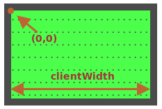

공은 `position:absolute`를 가지고 있습니다. 이는 `left/top` 좌표가 가장 가까운 위치 요소로부터 측정된다는 의미이며, 그것을 `#field`라고 부릅니다. (왜냐하면 필드는 `position:relative` 속성을 가지고 있으니까요.)

좌표는 필드의 좌측 상단 코너의 내부로부터 시작합니다.



내부 필드의 너비, 높이는 `clientWidth/clientHeight`입니다. 그래서 필드의 중앙은 `(clientWidth/2, clientHeight/2)`)의 좌표를 가집니다.

…그러나 우리가 `ball.style.left/top`을 중앙 좌표와 같은 값으로 설정한다면 공의 전체가 아닌 공의 좌측 상단 꼭짓점이 중앙에 오게 될 것입니다.

```js
ball.style.left = Math.round(field.clientWidth / 2) + 'px';
ball.style.top = Math.round(field.clientHeight / 2) + 'px';
```

한 번 어떻게 보이는지 살펴봅시다.

[iframe height=180 src="ball-half"]

공의 중앙을 필드의 중앙에 정렬하기 위해서는, 우리는 공을 공의 너비의 절반만큼 왼쪽으로, 높이의 절반만큼 위쪽으로 움직여야 합니다.

```js
ball.style.left = Math.round(field.clientWidth / 2 - ball.offsetWidth / 2) + 'px';
ball.style.top = Math.round(field.clientHeight / 2 - ball.offsetHeight / 2) + 'px';
```

이제 공이 중앙에 위치하게 됐습니다.

````warn header="주의점: 함정이 있습니다!"

코드는 ``가 너비와 높이를 가지고 있지 않을 때 제대로 작동하지 않습니다.

```html

```
````

브라우저가 태그 혹은 CSS로부터 이미지의 너비와 높이를 알지 못할 때, 이미지 로딩이 끝날 때까지 똑같이 이미지의 크기를 `0`으로 취급합니다.

그래서 이미지가 불러와 질 때까지 `ball.offsetWidth`값은 `0`이 될 것입니다. 해당 코드에서는 잘못된 좌표를 불러오게 될 것입니다.

첫 번째 불러오기 이후, 브라우저는 보통 이미지를 캐시에 저장할 것이고 즉시 사이즈를 갖게 됩니다. 그러나 `ball.offsetWidth`의 값은 처음으로 불러와 진 `0`이 되겠죠.

``에 `너비, 높이`를 추가함으로써 고쳐야 합니다.

```html

```

…혹은 CSS에서 이미지의 사이즈를 줘야합니다.

```css
#ball {
  width: 40px;
  height: 40px;
}
```
