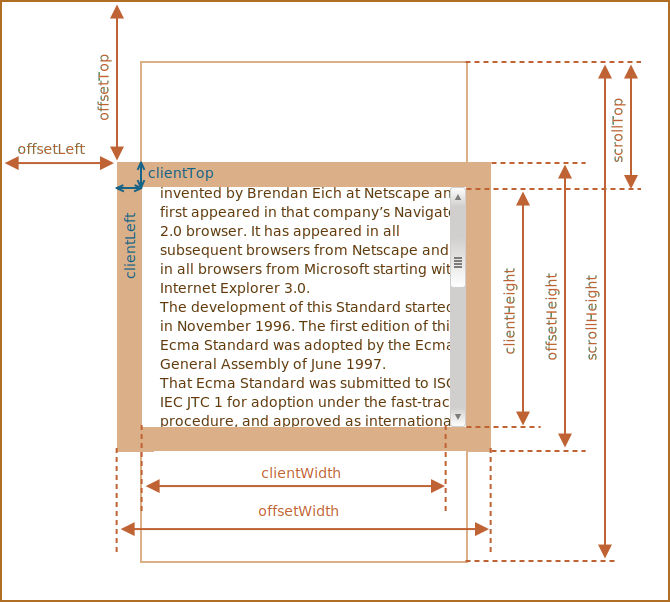

# 요소 사이즈와 스크롤

자바스크립트는 요소의 너비, 높이와 같은 기하 정보를 알려주는 다양한 프로퍼티를 지원합니다.

이런 프로퍼티들은 요소를 움직이거나 특정 좌표에 위치시킬 때 사용됩니다.

## 샘플 요소

프로퍼티 사용법을 알아보기 위해 아래와 같은 샘플 요소를 사용할 예정입니다.

```html no-beautify
<div id="example">
  ...텍스트...
</div>
<style>
  #example {
    width: 300px;
    height: 200px;
    border: 25px solid #E8C48F;
    padding: 20px;              
    overflow: auto;             
  }
</style>
```

`example`이라는 id가 붙은 이 요소는 border와 padding, 스크롤바 갖습니다. 기하 관련 기능을 테스트 하기 위해 적절한 조합이죠. margin은 요소 자체에 포함되지 않고, 관련 특수 프로퍼티가 없기 때문에 CSS 프로퍼티에 추가하지 않았습니다.

요소의 생김새는 다음과 같습니다.


[샌드박스](sandbox:metric)를 열면 요소를 직접 확인해 볼 수 있습니다.

```smart header="스크롤바를 잊지 마세요."
샘플로 사용하게 될 요소는 스크롤 바가 있는 가장 복잡한 상황을 나타냅니다. 모든 브라우저가 그런 건 아니지만 몇몇 브라우저는 콘텐츠 영역 너비('content width'로 표시한 영역) 일부를 빌려 스크롤바를 위치시킵니다.

스크롤바가 없었다면 content width는 `300px`이 되었을 겁니다. 그런데 스크롤바의 너비가 `16px`이기 때문에 content width는 `284px`(300 - 16)가 됩니다(스크롤바 너비는 브라우저나 디바이스마다 다릅니다). 개발자는 요소를 다룰 때 스크롤바가 차지하는 공간을 항상 염두하고 있어야 합니다. 스크롤바가 없다면 계산이 쉬웠겠지만, 연습을 위해 샘플 요소에 스크롤바를 필수적으로 포함시켰습니다.
```

```smart header="`padding-bottom` 영역으로 텍스트가 넘칠 수 있습니다."
패딩은 대개 비어있습니다. 그런데 요소 내 텍스트가 길어 넘치게 될 경우엔 브라우저가 이 텍스트들을 `padding-bottom`에도 표시하게 됩니다. 이는 정상적인 동작입니다.
```

## 기하 프로퍼티

기하 프로퍼티(geometry property)를 그림으로 나타내면 다음과 같습니다.



기하 프로퍼티의 값은 숫자인데 그 단위는 '픽셀'입니다. 기하 프로퍼티는 픽셀 단위로 측정된다고 보시면 됩니다.

이제 요소 제일 밖부터 시작해 기하 프로퍼티를 하나씩 살펴보도록 합시다.

## offsetParent와 offsetLeft, offsetTop

잘 쓰이는 프로퍼티는 아니지만 가장 바깥에 있는 기하 프로퍼티이므로 offsetParent와 offsetLeft, offsetTop부터 알아보겠습니다(offset은 요소가 화면에서 차지하는 영역 전체 크기를 나타냅니다 - 옮긴이).

`offsetParent` 프로퍼티는 해당 요소를 렌더링할 때, 좌표 계산에 사용되는 가장 가까운 조상 요소(the closest positioned ancestor element)의 참조를 반환합니다.

CSS `position` 프로퍼티가 설정되어있는 조상 요소가 없는 경우엔 가장 가까운 조상 `<td>`나 `<th>`, 혹은 `<table>`, 아니면 `<body>`가 반환되기 때문에 `offsetParent`에 의해 반환되는 가장 가까운 조상 요소는 아래 셋 중 하나에 속하게 됩니다.

1. CSS `position` 프로퍼티가 `absolute`나 `relative`, `fixed`, `sticky`인 가장 가까운 조상 요소
2. `<td>`나 `<th>`, 혹은 `<table>`
3. `<body>`

`offsetLeft`, `offsetTop` 프로퍼티는 `offsetParent`를 기준으로 각각 요소가 오른쪽으로, 아래쪽으로 얼마나 떨어져 있는지를 나타냅니다.

예시를 살펴봅시다. 안쪽에 있는 `<div>`의 `offsetParent`는 `<main>`이고 `offsetLeft`와 `offsetTop`은 각각 `180`입니다.

```html run height=10
<main style="position: relative" id="main">
  <article>
    <div id="example" style="position: absolute; left: 180px; top: 180px">...</div>
  </article>
</main>
<script>
  alert(example.offsetParent.id); // main
  alert(example.offsetLeft); // 180 (문자열 '180px'이 아닌 숫자가 반환됩니다.)
  alert(example.offsetTop); // 180
</script>
```


다음과 같은 경우에 `offsetParent`는 `null`입니다.

1. 화면에 보이지 않는 요소(CSS `display` 프로퍼티가 `none`이거나 문서 내에 있지 않은 요소)
2. `<body>`와 `<html>`
3. `position` 프로퍼티가 `fixed`인 요소

## offsetWidth와 offsetHeight

이제 본격적으로 요소 자체에 집중해 봅시다.

`offsetWidth`와 `offsetHeight`는 가장 간단한 프로퍼티입니다. 두 프로퍼티는 각각 요소 '전체'가 차지하는 너비와 높이 정보를 제공합니다. '전체'이기 때문에 테두리 역시 포함됩니다.


샘플 요소를 대상으로 `offsetWidth`와 `offsetHeight`를 계산하면 다음과 같습니다.

- `offsetWidth = 390` -- 안쪽 너비(콘텐츠 너비 + 스크롤바)에 패딩(`2 * 20px`)과 테두리(`2 * 25px`)를 더한 값
- `offsetHeight = 290` -- 전체 높이

````smart header="화면에 표시되지 않는 요소의 기하 프로퍼티는 0 또는 null입니다."
기하 프로퍼티는 오직 보이는 요소(displayed element)를 대상으로 계산됩니다.

따라서 요소(혹은 이 요소의 조상 요소 중 어떤 것이든)의 CSS `display` 프로퍼티가 `none`이거나 문서 내에 해당 요소가 없는 경우, 모든 기하 프로퍼티 값은 0이 됩니다(`offsetParent` 프로퍼티의 값은 `null`).

요소를 만들긴 했지만 아직 문서에 삽입하기 전이라던가, 새롭게 만든 요소의 `display` 프로퍼티가 `none`이면 기하 프로퍼티 값은 0, `offsetParent` 프로퍼티의 값은 `null`이 되는 것이죠.

이런 특징을 이용하면 요소의 숨김 상태 여부를 아래와 같은 방법을 사용해 확인할 수 있습니다.

```js
function isHidden(elem) {
  return !elem.offsetWidth && !elem.offsetHeight;
}
```

그런데 위 함수 `isHidden`은 요소가 화면에 있긴 하지만 사이즈가 0일 때(비어있는 `<div>` 등)도 `true`를 반환하기 때문에 주의해서 사용해야 합니다.
````

## clientTop과 clientLeft

요소 내엔 테두리(border)가 있습니다.

테두리 두께는 `clientTop`과 `clientLeft`를 사용해 측정할 수 있습니다.

샘플 예시의 프로퍼티 값은 다음과 같습니다.

- `clientLeft = 25` -- 왼쪽 테두리 너비
- `clientTop = 25` -- 위쪽 테두리 높이


그런데 사실 이 두 프로퍼티는 테두리의 너비, 높이와 정확히 일치하진 않습니다. 정확히는 테두리 바깥쪽을 기준으로 하는 요소 안쪽의 상대 좌표를 나타냅니다.

조금 헷갈릴 수 있으니 자세히 설명해보겠습니다.

두 프로퍼티의 차이는 운영 체제 언어가 아랍어나 히브리어처럼 오른쪽에서 왼쪽으로 글이 전개되는 언어로 세팅되어 있을 때 드러납니다. 이때는 스크롤바가 오른쪽이 아닌 왼쪽에 나타나게 되는데, 그럼 `clientLeft`에 스크롤바의 너비가 포함됩니다.

따라서 `clientLeft`가 `25`가 아닌 스크롤바 너비를 포함한 `41(25 + 16)`이 됩니다.

히브리어 예시를 그림으로 직접 살펴봅시다.


## clientWidth와 clientHeight

clientWidth와 clientHeight 프로퍼티는 테두리 안에 있는 영역의 사이즈 정보를 제공합니다.

여기엔 콘텐츠 너비에 더불어 패딩이 포함되는데, 스크롤바 너비는 포함되지 않습니다.


그림에서 `clientHeight`로 표시된 부분을 먼저 살펴봅시다.

수평 스크롤바가 없기 때문에 `clientHeight`는 테두리 안쪽에 있는 영역 전체를 더한 값이 됩니다. 높이 `200px`에 위, 아래 패딩(`2 * 20px`)을 더한 값인 `240px`이 되는 것이죠.

이제 `clientWidth`를 계산해 봅시다. `clientWidth`를 계산할 때 주의할 점은 수직 스크롤바가 차지하는 너비 `16px` 때문에 콘텐츠 너비는 `300px`이 아닌 `284px`이 된다는 점입니다. 따라서 `clientWidth`는 콘텐츠 너비 `284px`에 왼쪽, 오른쪽 패딩(`2 * 20px`)을 더한 값인 `324px`가 됩니다.

**패딩이 없었다면 `clientWidth`와 `clientHeight`는 테두리와 스크롤바 안쪽에 있는 콘텐츠 영역의 너비, 높이와 정확히 일치했을 겁니다.**


따라서 패딩이 없는 경우엔 `clientWidth`와 `clientHeight`를 사용해 콘텐츠 영역 크기를 구할 수 있습니다.

## scrollWidth와 scrollHeight

`scrollWidth`와 `scrollHeight` 프로퍼티는 `clientWidth`와 `clientHeight` 유사한데, 스크롤바에 의해 감춰져 있는 숨겨진 영역도 포함한다는 점에서 차이가 있습니다.


그림을 살펴봅시다.

- `scrollWidth = 324` -- 수평 스크롤바가 없기 때문에 안쪽 영역 전체를 나타내는 `clientWidth`와 동일합니다.
- `scrollHeight = 723` -- 수직 스크롤바에 가려진 부분을 포함하는 콘텐츠 영역 안쪽 전체의 높이입니다.

`scrollWidth`와 `scrollHeight`는 요소 크기를 콘텐츠가 차지하는 만큼 늘리고자 할 때 사용할 수 있습니다.

예시:

```js
// 콘텐츠가 차지하는 높이만큼 요소 높이를 늘
element.style.height = `${element.scrollHeight}px`;
```

```online
버튼을 눌러 직접 요소 크기를 확장해 봅시다.

<div id="element" style="width:300px;height:200px; padding: 0;overflow: auto; border:1px solid black;">text text text text text text text text text text text text text text text text text text text text text text text text text text text text text text text text text text text text text text text text text text text text text text text text text text text text text text text text text text text text text text text text text text text text text text text text text text text text text text text text text text text text text text text text text text text text text text text text text text text text text text text text text text text text text text text text text text text text text text text text text text text text text text text text text text text text text text text text text text text text</div>

<button style="padding:0" onclick="element.style.height = `${element.scrollHeight}px`">element.style.height = `${element.scrollHeight}px`</button>
```

## scrollLeft와 scrollTop

`scrollLeft`와 `scrollTop` 프로퍼티는 수평 스크롤이 오른쪽, 수직 스크롤이 아래로 움직임에 따라 가려진 영역의 너비와 높이를 나타냅니다.

수직 스크롤바를 아래로 조금 내린 경우를 가정한 아래 그림을 살펴봅시다. `scrollHeight`에서 `scrollTop`이 얼마만큼의 영역을 차지하는지를 살펴볼 수 있습니다.


즉 `scrollTop`은 '수직 스크롤 바에 의해 가려져 보이지 않는' 위쪽 콘텐츠의 높이라고 이해하시면 됩니다.

````smart header="`scrollLeft`와 `scrollTop`은 수정할 수 있습니다."
대부분의 기하 프로퍼티는 읽기전용이지만 `scrollLeft`와 `scrollTop`은 변경이 가능합니다. 스크립트를 사용해 프로퍼티를 수정하면 자동으로 요소 내 스크롤이 움직이죠.

```online
요소를 클릭하면 스크롤바가 `10px` 아래로 내려가도록 `elem.scrollTop += 10`을 스크립트에 추가해 놓았습니다.

<div onclick="this.scrollTop+=10" style="cursor:pointer;border:1px solid black;width:100px;height:80px;overflow:auto">여기를<br>클릭<br>1<br>2<br>3<br>4<br>5<br>6<br>7<br>8<br>9</div>
```

이런 특징을 이용하면 `scrollTop`을 `0`이나 `1e9`같이 아주 큰 숫자로 설정해 스크롤 바를 최상단이나 최하단으로 옮길 수 있습니다.
````

## CSS를 사용해 너비와 높이를 얻지 마세요

지금까지 요소 너비와 높이, 요소 포지셔닝 관련 거리를 구하는 데 사용되는 다양한 기하프로퍼티에 대해 알아보았습니다.

그런데 우리는 앞서 `getComputedStyle`를 사용해 CSS가 적용된 요소의 높이와 너비를 구할 수 있다는 것을 <info:styles-and-classes> 챕터에서 알아본 바 있습니다.

그렇다면 왜 `getComputedStyle`를 사용해 요소 너비와 높이를 얻지 말라고 하는 걸까요?

```js run
let elem = document.body;

alert( getComputedStyle(elem).width ); // CSS가 적용된 elem의 너비
```

`getComputedStyle`가 아닌 기하 프로퍼티를 사용해 너비와 높이 정보를 얻어야 하는 데는 다음과 같은 이유가 있습니다.

1. CSS `width`와 `height`는 다른 CSS 프로퍼티의 영향을 받습니다. 요소의 너비와 높이 계산 방법을 '지정'하는 `box-sizing`이 이런 프로퍼티의 대표적인 예이죠. `box-sizing`을 변경하면 `getComputedStyle`로 구한 값이 부정확 할 수 있습니다.
2. CSS `width`와 `height`는 `auto`일 수 있습니다. 인라인 요소(inline element)가 이런 경우에 속합니다.

    ```html run
    <span id="elem">안녕하세!</span>

    <script>
    *!*
      alert( getComputedStyle(elem).width ); // auto
    */!*
    </script>
    ```

    CSS 관점에서 보면 `width:auto`는 전혀 이상할 것 없어 보입니다. 그런데 자바스크립트 입장에선 정확한 `px`값이 있어야 계산을 할 수 있기 때문에 auto라는 값은 쓸모가 없습니다.

이외에도 다른 한 가지 이유가 더 있습니다. 바로 스크롤바입니다. 스크롤바가 없으면 정상 동작하는데, 스크롤바가 생기면 의도한 대로 동작하지 않는 코드들이 있습니다. 이런 일은 스크롤바가 콘텐츠 영역을 차지하는 몇몇 브라우저에서 발생합니다. 이런 브라우저들에선 콘텐츠가 실제 차지하는 영역이 CSS로 설정한 너비보다 *좁은데*, `clientWidth`와 `clientHeight`는 이를 고려해 클라이언트 요소가 차지하는 공간을 잽니다.

그런데 `getComputedStyle(elem).width`를 사용하면 상황이 달라집니다. Chrome 같은 브라우저는 스크롤바 너비를 제외한 진짜 내부 너비를 반환하는데 Firefox 같은 브라우저는 스크롤바를 무시하고 CSS로 설정한 너비를 반환합니다. 이런 브라우저 간 차이 때문에 `getComputedStyle`이 아닌 기하 프로퍼티를 사용해야 합니다.

```online
스크롤바가 차지하는 영역을 따로 두는 브라우저(Windows에서 돌아가는 대부분의 브라우저)에서 아래 예시를 실행하면 300px이 아닌 다른 값이 출력되는 것을 확인할 수 있습니다.

[iframe src="cssWidthScroll" link border=1]

텍스트가 들어있는 위 요소의 CSS엔 `width:300px`가 설정되어 있는 상태입니다.

Windows가 설치된 데스크톱 PC의 Firefox, Chrome, Edge 브라우저는 모두 스크롤바 영역을 따로 떼어놓습니다. 그런데 Windows 이외의 OS가 설치된 PC의 Firefox에서 예시를 실행하면 `300px`이 출력되는 것을 확인할 수 있습니다. 다른 브라우저들은 '진짜' 너비를 출력하는 반면 Firefox는 CSS로 설정한 너비를 출력하기 때문입니다.
```

`getComputedStyle`과 기하 프로퍼티의 차이는 자바스크립트를 사용해 `getComputedStyle(...).width`로 값을 얻고자 할 때만 발생합니다. 눈으로 봤을 땐 전혀 문제가 없으니 이 점에 유의하시기 바랍니다.

## 요약

요소는 다음과 같은 기하 프로퍼티를 지원합니다.

- `offsetParent` -- 위치 계산에 사용되는 가장 가까운 조상 요소나 `td`, `th`, `table`, `body`
- `offsetLeft`와 `offsetTop` -- `offsetParent` 기준으로 요소가 각각 오른쪽, 아래쪽으로 얼마나 떨어져 있는지를 나타내는 값
- `offsetWidth`와 `offsetHeight` -- 테두리를 포함 요소 '전체'가 차지하는 너비와 높이
- `clientLeft`와 `clientTop` -- 요소 제일 밖을 감싸는 영역과 요소 안(콘텐츠 + 패딩)을 감싸는 영역 사이의 거리를 나타냄. 대부분의 경우 왼쪽, 위쪽 테두리 두께와 일치하지만, 오른쪽에서 왼쪽으로 글을 쓰는 언어가 세팅된 OS에선 `clientLeft`에 스크롤바 두께가 포함됨
- `clientWidth`와 `clientHeight` -- 콘텐츠와 패딩을 포함한 영역의 너비와 높이로, 스크롤바는 포함되지 않음
- `scrollWidth`와 `scrollHeight` -- `clientWidth`, `clientHeight` 같이 콘텐츠와 패딩을 포함한 영역의 너비와 높이를 나타내는데, 스크롤바에 의해 숨겨진 콘텐츠 영역까지 포함됨
- `scrollLeft`와 `scrollTop` -- 스크롤바가 오른쪽, 아래로 움직임에 따라 가려지게 되는 요소 콘텐츠의 너비와 높이

스크롤바를 움직일 수 있게 해주는 `scrollLeft`와 `scrollTop`을 제외한 모든 프로퍼티는 읽기 전용입니다.
