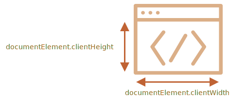

# 윈도우 크기와 스크롤

브라우저 윈도우 너비와 높이는 어떻게 찾을 수 있을까요? 스크롤 된 부분을 포함한 문서 전체의 너비와 높이는 어떻게 얻을 수 있을까요? 자바스크립트를 이용한 페이지 스크롤은 어떻게 할 수 있을까요?

대부분, `<html>` 태그에 해당하는 문서의 루트 요소인 `document.documentElement`를 사용할 수 있습니다. 그리고 이 때, 중요하게 고려해야 할 추가적인 메소드와 특성도 있습니다.

## 윈도우 너비·높이

윈도우 너비·높이를 구하기 위해서 `document.documentElement`의 `clientWidth·clientHeight`를 사용할 수 있습니다.



```online
예를 들어 아래 버튼은 윈도우 높이를 보여줍니다.

<button onclick="alert(document.documentElement.clientHeight)">alert(document.documentElement.clientHeight)</button>
```

````warn header="`window.innerWidth·Height`은 안됩니다."
브라우저는 `clientWidth·clientHeight`외에도 `window.innerWidth·innerHeight` 프로퍼티도 제공합니다. `window.innerWidth·innerHeight`만으로 원하는 작업은 충분히 가능할 것 같습니다. 그런데 왜 `window.innerWidth·innerHeight`를 사용하지 말라고 할까요?

스크롤 바가 있고 스크롤 바가 공간을 어느 정도 차지하는 경우 `clientWidth·clientHeight`는 스크롤 바 공간이 없는 너비·높이를 제공합니다. (스크롤 바 공간을 제외합니다) 다시 말하면, `clientWidth·clientHeight`는 문서에서 보이는 부분의 너비·높이를 반환하고, 콘텐츠에 사용할 수 있습니다.

그리고 `window.innerWidth·innerHeight`는 스크롤 바를 포함하고 있습니다.

스크롤 바가 있고 스크롤 바가 공간을 어느 정도 차지한다면 아래 두 줄은 다른 값을 보여줍니다.
```js run
alert( window.innerWidth ); // 전체 창 너비
alert( document.documentElement.clientWidth ); // 창 너비에서 스크롤 바를 뺀 너비
```

대부분 *사용 가능한* 창 너비값은 무언가를 그리거나 배치하기 위해 필요합니다. 즉, 스크롤 바가 있으면 `documentElement.clientHeight·Width`를 반드시 사용해야만 합니다.
````

```warn header="`DOCTYPE`은 중요합니다."
참고: 최상위 기하 프로퍼티는 HTML 내부에 `<!DOCTYPE HTML>`이 선언되지 않은 경우 약간 다르게 동작할 수 있습니다. 의도한 대로 동작하지 않을 수 있습니다.

모던 HTML에서는 항상 `DOCTYPE`을 써야 합니다.
```

## 문서의 너비·높이

이론적으로 문서의 루트 요소가 `document.documentElement`이고 `document.documentElement`가 모든 콘텐츠를 둘러싸므로, 문서 전체 크기를 `document.documentElement.scrollWidth·scrollHeight`를 통해 측정할 수 있습니다.

그러나 페이지 전체로 봤을 때, `document.documentElement.scrollWidth·scrollHeight` 프로퍼티는 의도대로 동작하지 않을 수 있습니다. Chrome·Safari·Opera 브라우저에서는 스크롤이 없는 경우 `documentElement.scrollHeight`의 값은 `documentElement.clientHeight`값보다 작을 수 있습니다! 말도 안 되는 소리 같네요. 이상하죠?

정확한 문서 전체 높이 값을 얻으려면 아래 프로퍼티 중 최댓값을 얻어와야 합니다.

```js run
let scrollHeight = Math.max(
  document.body.scrollHeight, document.documentElement.scrollHeight,
  document.body.offsetHeight, document.documentElement.offsetHeight,
  document.body.clientHeight, document.documentElement.clientHeight
);

alert('스크롤 된 부분이 포함된 전체 문서 높이: ' + scrollHeight);
```

왜 그럴까요? 묻지 않는 것이 좋습니다. '똑똑한' 로직이 아닌 이 모순은 오래전부터 시작되었습니다.

## 현재 스크롤 값 가져오기 [#page-scroll]

DOM 요소의 현재 스크롤 상태는 `elem.scrollLeft·scrollTop`가 가지고 있습니다.

대부분의 브라우저에서 문서의 스크롤은 `document.documentElement.scrollLeft·Top`로 작동합니다. 단, Safari와 같은 오래된 WebKit 기반의 브라우저는 `document.documentElement` 대신`document.body`를 사용해야 합니다. (bug [5991](https://bugs.webkit.org/show_bug.cgi?id=5991))

다행히도 이 특징을 기억할 필요는 전혀 없습니다. 왜냐하면 스크롤은 `window.pageXOffset·pageYOffset`라는 특별한 프로퍼티를 사용할 수 있기 때문입니다.

```js run
alert('위쪽에서부터 현재 스크롤까지: ' + window.pageYOffset);
alert('왼쪽에서부터 현재 스크롤까지: ' + window.pageXOffset);
```

`window.pageXOffset·pageYOffset` 프로퍼티는 읽기 전용입니다.

## 스크롤링: scrollTo, scrollBy, scrollIntoView [#window-scroll]

```warn header="중요"
자바스크립트에서는 페이지를 스크롤하기 위해 문서 객체 모델(Document Object Model, DOM)을 완전히 빌드해야 합니다.

예를 들어 스크립트의 `<head>` 부분에서 페이지 스크롤을 시도한다면, 스크롤은 동작하지 않습니다.
```

일반적인 요소들은 `scrollTop·scrollLeft` 값을 변경함으로써 스크롤이 가능합니다.

`document.documentElement.scrollTop·Left`를 사용해 페이지에 대해서도 동일한 작업을 수행할 수 있습니다. (`document.documentElement.scrollTop·Left`를 대신해 `document.body.scrollTop·Left`을 사용해야 하는 Safari는 제외합니다)

대안으로 특수한 메소드인 [window.scrollBy(x,y)](mdn:api/Window/scrollBy)와 [window.scrollTo(pageX,pageY)](mdn:api/Window/scrollTo)라는 더 간단하고 보편적인 해답도 있습니다.

- `scrollBy(x,y)` 메소드는 *현재 위치를 기점으로* 페이지를 스크롤 합니다. 예를 들어 `scrollBy(0,10)`는 페이지를 `10px`만큼 아래로 스크롤 합니다.

    ```online
    아래 버튼은 `10px`만큼 아래쪽으로 스크롤 하는 것을 보여줍니다.

    <button onclick="window.scrollBy(0,10)">window.scrollBy(0,10)</button>
    ```
- `scrollTo(pageX,pageY)` 메소드는 *좌표의 절대 값까지* 페이지를 스크롤 하여 보이는 부분 왼쪽 윗 모서리가 좌표 `(pageX, pageY)`가 되도록 페이지를 스크롤 합니다. `scrollTo(pageX,pageY)`는 `scrollLeft·scrollTop`을 설정하는 것과 같습니다.

    맨 처음으로 스크롤 하려면 `scrollTo(0,0)`을 이용하면 됩니다.

    ```online
    <button onclick="window.scrollTo(0,0)">window.scrollTo(0,0)</button>
    ```

이 메소드는 모든 브라우저에서 같은 방식으로 동작합니다.

## scrollIntoView

완벽함을 위해 한 가지 메소드를 더 다뤄보겠습니다:  [elem.scrollIntoView(top)](mdn:api/Element/scrollIntoView).

`elem.scrollIntoView(top)`를 호출하는 것은 `해당 요소`를 보이게 하고자 페이지를 스크롤 합니다. 그것은 하나의 인자값만 가지고 있습니다:

- 만약 `top=true`라면 (이것이 기본 설정입니다), 윈도우 위쪽에 `해당 요소`가 나타나도록 페이지가 스크롤됩니다. 요소의 위쪽 모서리는 윈도우 상단과 나란히 정렬됩니다.
- 만약 `top=false`라면, 아래쪽에 `해당 요소`가 나타나도록 페이지가 스크롤됩니다. 요소의 아래쪽 모서리는 윈도우 하단과 나란히 정렬됩니다.

```online
아래 버튼은 윈도우 상단에 요소가 보이도록 페이지를 스크롤 합니다:

<button onclick="this.scrollIntoView()">this.scrollIntoView()</button>

그리고 아래 버튼은 요소가 하단에 보이도록 페이지를 스크롤 합니다:

<button onclick="this.scrollIntoView(false)">this.scrollIntoView(false)</button>
```

## 스크롤 금지하기

때때로 문서를 '스크롤 금지'하는 것이 필요합니다. 예를 들어 즉시 대응이 필요한 많은 양의 메세지를 문서에서 커버해야 하며, 방문자는 문서가 아닌 즉시 대응이 필요한 많은 양의 메시지를 조작할 필요가 있는 경우입니다.

문서의 스크롤을 금지하고자 `document.body.style.overflow = "hidden"`을 설정하는 것만으로도 충분합니다. 페이지는 현재 스크롤에서 고정될 것입니다.

```online
실습해보세요.

<button onclick="document.body.style.overflow = 'hidden'">document.body.style.overflow = 'hidden'</button>

<button onclick="document.body.style.overflow = ''">document.body.style.overflow = ''</button>

첫 번째 버튼은 스크롤을 금지하고, 두 번째 버튼은 스크롤을 다시 작동시킵니다.
```

동일한 기법을 사용하여 `document.body`뿐만 아니라 다른 요소에 대한 스크롤도 금지할 수 있습니다.

`document.body.style.overflow = "hidden"` 메소드의 단점은 스크롤 바가 사라진다는 것입니다. 스크롤 바가 공간을 차지했다면, 스크롤 바가 있던 공간은 자유로워지고, 콘텐츠들은 스크롤 바의 공간을 채우기 위해 "점프합니다".

좀 이상해 보이지만 스크롤 금지 전과 후에 `clientWidth`를 비교했을 때, `clientWidth`가 증가했다면 (스크롤 바는 사라짐) 스크롤 바 대신에 콘텐츠의 너비를 똑같이 유지하기 위해 `document.body`에 `padding`을 더하면 됩니다.

## 요약

기하:

- 문서에서 보이는 부분의 너비·높이(콘텐츠 영역의 너비·높이): `document.documentElement.clientWidth·Height`
- 스크롤 된 부분이 있는 전체 문서의 너비·높이:

    ```js
    let scrollHeight = Math.max(
      document.body.scrollHeight, document.documentElement.scrollHeight,
      document.body.offsetHeight, document.documentElement.offsetHeight,
      document.body.clientHeight, document.documentElement.clientHeight
    );
    ```

스크롤링:

- 현재 스크롤 읽어오기: `window.pageYOffset·pageXOffset`.
- 현재 스크롤 변경하기:

    - `window.scrollTo(pageX,pageY)` -- 좌표의 절댓값
    - `window.scrollBy(x,y)` -- 현재 위치를 기준으로 스크롤
    - `elem.scrollIntoView(top)` -- `해당 요소`가 보이게 스크롤 함(창의 위·아래와 나란히 정렬시킴).