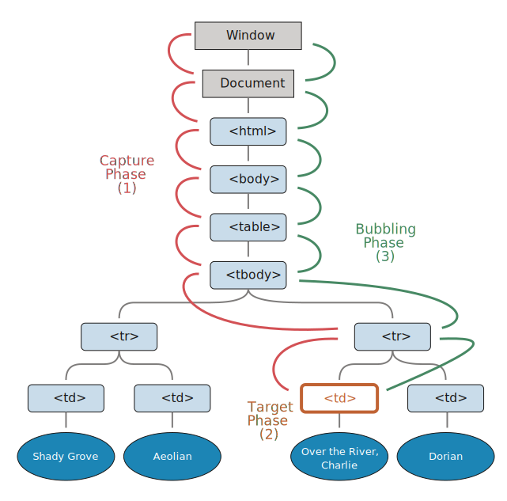

# 버블링과 캡처링

먼저 코드부터 살펴봅시다.

아래 핸들러는 `<div>`에 할당되어 있지만, `<em>` 이나 `<code>`같은 중첩태그(nested tag)를 클릭해도 동작합니다:

```html autorun height=60
<div onclick="alert('The handler!')">
  <em>If you click on <code>EM</code>, the handler on <code>DIV</code> runs.</em>
</div>
```

이상하지 않나요? `<em>`을 클릭했는데 왜 `<div>`에 할당한 핸들러가 동작하는 걸까요? 

## 버블링

버블링 원리는 간단합니다.

**한 요소에 이벤트가 발생하면, 이 요소에 할당된 핸들러가 동작합니다. 그다음 그 부모 요소의 핸들러가 동작하고, 이 과정이 반복되면서 가장 최상단의 조상 요소를 만날 때까지 각 요소에 할당된 핸들러가 작동합니다.**

3개의 요소가 중첩된 구조 `FORM > DIV > P`를 살펴봅시다. 요소마다 각자의 핸들러가 할당되어 있습니다:

```html run autorun
<style>
  body * {
    margin: 10px;
    border: 1px solid blue;
  }
</style>

<form onclick="alert('form')">FORM
  <div onclick="alert('div')">DIV
    <p onclick="alert('p')">P</p>
  </div>
</form>
```

가장 안쪽의 `<p>`를 클릭하면 :
1. `<p>`에 할당된 `onclick` 핸들러가 동작합니다.
2. 그다음은 바깥의 `<div>`에 할당된 핸들러가 동작합니다.
3. 다음은 그 바깥의 `<form>`에 할당된 핸들러가 동작합니다.
4. 트리를 거슬러 올라가면서 `document` 객체를 만날 때까지, 각 요소에 할당된 `onclick` 핸들러가 동작합니다.


이런 동작 방식 때문에 `<p>` 요소를 클릭하면 3개의 alert 창을 볼 수 있는것 입니다. `p` -> `div` -> `form` 순서로 말이죠.

이런 흐름을 "이벤트 버블링(bubbling)"이라고 부릅니다. 이벤트가 제일 깊은 곳에 있는 요소에서 시작해 부모 요소를 거슬러 흐르는 모양이 마치 물속 거품(bubble)과 닮았기 때문입니다.

```warn header="*거의* 모든 이벤트는 버블링 됩니다."
위 문장에서 키워드는 "거의" 입니다.

`focus` 이벤트와 같이, 버블링 되지 않는 몇 가지 이벤트가 있습니다. 이런 이벤트가 많은건 아닙니다. 하지만, 대부분 이벤트는 버블링 됩니다.  
```

## event.target

부모 요소의 핸들러는 이벤트가 정확히 어디서 발생했는지 등에 대한 자세한 정보를 얻을 수 있습니다.

**이벤트를 발생시킨 가장 안쪽의 요소는 *타깃(target)* 요소라고 불리고, `event.target`으로 참조할 수 있습니다.**

`this` (=`event.currentTarget`) 와는 다르다는 점에 주의해야 합니다:

- `event.target` -- 은 실제 이벤트를 발생시킨 "타깃" 요소이고, 버블링이 일어나도 변하지 않습니다.
- `this` -- 는 "현재(current)" 요소로, 현재 실행 중인 핸들러가 할당된 요소를 참조합니다.

예시코드를 살펴봅시다. 핸들러는 `form.onclick` 하나밖에 없는 상황입니다. 하지만 form 안의 모든 요소에 있는 클릭 이벤트를 "잡아내고 있습니다(catch)". 클릭 이벤트가 어디서 발생했든 상관없이, `<form>`요소까지 이벤트가 버블링 되어 핸들러를 실행시키기 때문입니다.

`form.onclick` 핸들러에서:

- `this` (`=event.currentTarget`)는 `<form>` 요소를 참조합니다. `<form>` 요소에 있는 핸들러가 동작했기 때문입니다.
- `event.target` 은 form 안쪽에 있는 실제 클릭한 요소를 참조합니다.

확인해 봅시다:

[codetabs height=220 src="bubble-target"]

`<form>` 요소를 정확히 클릭했을 때는 `event.target`과 `this`가 같습니다.

## 버블링 중단하기

이벤트 버블링은 타깃 이벤트에서 시작해서 `<html>` 요소를 거쳐 `document` 객체를 만날 때까지 각 노드에서 모두 발생합니다. 몇몇 이벤트는 `window` 객체까지 거슬러 올라가기도 합니다. 이 과정에서 모든 핸들러가 호출됩니다.

하지만 이벤트를 완전히 처리하고 난 후 버블링을 중단하도록 핸들러에게 명령할 수도 있습니다.

이벤트 객체의 메서드인 `event.stopPropagation()`를 사용하면 됩니다.

아래 예시에서  `<button>`을 클릭해도 `body.onclick`은 동작하지 않습니다:

```html run autorun height=60
<body onclick="alert(`the bubbling doesn't reach here`)">
  <button onclick="event.stopPropagation()">Click me</button>
</body>
```

```smart header="event.stopImmediatePropagation()"
특정 요소의 이벤트에 복수의 이벤트 핸들러가 할당되어 있고, 핸들러 중 하나가 버블링을 멈추더라도 나머지 핸들러는 여전히 동작합니다.

`event.stopPropagation()`은 이벤트가 상위 요소로 전파되는 건 막지만, 현재 요소에 할당된 핸들러가 동작하는 건 막지 못합니다.

버블링을 멈추고, 현재 요소에 할당된 핸들러의 동작도 막으려면, `event.stopImmediatePropagation()`을 사용해야 합니다. 이 메서드를 사용하면 다른 모든 핸들러는 동작하지 않습니다.
```

```warn header="꼭 필요한 경우를 제외하곤 버블링을 막지 마세요!"
버블링은 유용합니다. 버블링을 꼭 멈춰야 하는 명백한 상황이 아니라면 버블링을 막지 마세요. 구조적으로 잘 생각하고 진짜 멈춰야 하는 상황에만 막으세요.

`event.stopPropagation()`은 추후에 문제가 되는 위험 상황을 만들어낼 때가 있습니다.

예를 들어:

1. 중첩 메뉴를 만들었다 가정합시다. 각 부메뉴의 해당 요소에선 클릭 이벤트를 처리합니다. 그리고 상위 메뉴의 클릭 이벤트 핸들러가 동작하지 않도록 `stopPropagation`을 적용합니다.
2. 사용자의 행동 패턴(사람들이 어디서 클릭을 하는지) 분석을 목적으로, window에서 발생하는 클릭 이벤트를 모두 감지하기로 결정합니다. 분석을 도와주는 시스템을 사용합니다. 이런 분석 시스템의 코드는 클릭 이벤트를 감지하기 위해 `document.addEventListener('click'…)`을 사용합니다.  
3. `stopPropagation`로 버블링을 막아놓은 영역에선 이 코드가 동작하지 않기 때문에, 분석 시스템이 제대로 작동하지 않습니다. 안타깝게도 이 영역은 "죽은 영역(dead zone)"이 되어버립니다.

이벤트 버블링을 막아야 하는 경우는 거의 없습니다. 버블링을 진짜 막아야 한다면 커스텀 이벤트를 사용할 수 있습니다. 이 방법은 추후에 다루도록 하겠습니다. 핸들러의 `이벤트(event)` 객체에 데이터를 저장해 다른 핸들러에서 읽을 수 있게 하면, 아래쪽에서 무슨 일이 일어나는지를 부모 요소의 핸들러에게 전달할 수 있으므로, 이 방법으로도 이벤트 버블링을 통제할 수 있습니다.
```


## 캡처링

이벤트엔 버블링 이외에도 "캡처링(Capturing)" 이라는 흐름이 존재합니다. 실제 코드에서 자주 쓰이진 않지만, 종종 유용하게 쓰이는 경우가 있으므로 알아봅시다.

표준 [DOM 이벤트(Events)](http://www.w3.org/TR/DOM-Level-3-Events/)에서 정의한 이벤트 흐름엔 3가지 단계가 있습니다.

1. 캡처링 단계(Capturing phase) -- 이벤트가 하위 요소로 전파.
2. 타깃 단계(Target phase) -- 이벤트가 실제 타깃 요소에 전달됨.
3. 버블링 단계(Bubbling phase) -- 이벤트가 상위 요소로 전파.

테이블 안의 `<td>`를 클릭하면 어떻게 이벤트가 흐르는지 아래 그림을 보고 이해해 봅시다:  



`<td>` 요소를 클릭하면 이벤트가 최상위 조상에서 시작해 아래로 전파되고(캡처링 단계), 이벤트가 타깃 요소에 도착해 실행된 후(타깃 단계), 다시 위로 전파됩니다(버블링 단계). 이런 과정을 통해 요소에 할당된 이벤트 핸들러가 호출됩니다.

**캡처링 단계를 이용해야 하는 경우는 흔치 않기 때문에, 주로 버블링만 설명했습니다. 캡처링에 관한 코드를 발견하는 일은 거의 없을 겁니다.**

`on<event>`-프로퍼티, HTML 속성, 인수가 두 개인 `addEventListener(event, handler)`을 이용해 할당된 핸들러는 캡처링에 대해 전혀 알 수 없습니다. 이 핸들러들은 두 번째 혹은 세 번째 단계의 이벤트 흐름(타깃 단계와 버블링 단계)에서만 동작합니다.

캡처링 단계에서 이벤트를 잡아내려면 `addEventListener`의 `capture` 옵션을 `true`로 설정해야 합니다:

```js
elem.addEventListener(..., {capture: true})
// 아니면, 아래와 같이 {capture: true} 대신, true를 써줘도 됩니다.
elem.addEventListener(..., true)
```

`capture` 옵션은 2가지 값을 가질 수 있습니다:

- `false`(default 값)인 경우, 핸들러는 버블링 단계에서 동작합니다.
- `true`인 경우, 핸들러는 캡처링 단계에서 동작합니다.


공식적으론 총 3개의 이벤트 흐름이 있지만, 두 번째 단계("타깃 단계": 이벤트가 실제 타깃 요소에 전달되는 단계)는 별도로 처리되지 않습니다. 따라서, 캡처링과 버블링 단계의 핸들러는 타깃단계에서 모두 동작합니다.

아래 예제를 통해 캡처링과 버블링에 대해 살펴보도록 합시다.

```html run autorun height=140 edit
<style>
  body * {
    margin: 10px;
    border: 1px solid blue;
  }
</style>

<form>FORM
  <div>DIV
    <p>P</p>
  </div>
</form>

<script>
  for(let elem of document.querySelectorAll('*')) {
    elem.addEventListener("click", e => alert(`Capturing: ${elem.tagName}`), true);
    elem.addEventListener("click", e => alert(`Bubbling: ${elem.tagName}`));
  }
</script>
```

이 코드는 문서 내의 "모든" 요소에 핸들러를 할당해서 어떤 핸들러가 동작하는지를 보여줍니다. 

`<p>` 요소를 클릭하면, 다음과 같은 순서로 이벤트가 전달됩니다:

1. `HTML` -> `BODY` -> `FORM` -> `DIV` (캡처링 단계, 첫 번째 리스너)
2. `P (타깃 단계, capturing과 bubbling 둘 다에 리스너를 설정했기 때문에 두 번 호출됩니다.)
3. `DIV` -> `FORM` -> `BODY` -> `HTML` (버블링 단계, 두 번째 리스너)

`event.eventPhase` 프로퍼티를 이용하면 현재 발생 중인 이벤트 흐름의 단계를 알 수 있습니다(역주: 반환하는 정숫값에 따라 이벤트 흐름의 현재 실행 단계를 구분함). 하지만 핸들러를 통해 흐름 단계를 알 수 있기 때문에 이 프로퍼티는 자주 사용되지 않습니다.

```smart header="핸들러를 제거할 땐, `removeEventListener`가 같은 단계에 있어야 합니다"
`addEventListener(..., true)`로 핸들러를 할당해 줬다면, 핸들러를 지울 때, `removeEventListener(..., true)`를 사용해 지워야 합니다. 같은 단계에 있어야 핸들러가 지워집니다.
```

````smart header="Listeners on same element and same phase run in their set order"
If we have multiple event handlers on the same phase, assigned to the same element with `addEventListener`, they run in the same order as they are created:

```js
elem.addEventListener("click", e => alert(1)); // guaranteed to trigger first
elem.addEventListener("click", e => alert(2));
```
````


## 요약

이벤트가 발생하면 이벤트가 발생한 가장 안쪽의 요소가 "타깃 요소(`event.target`)"가 됩니다.

- 이후 이벤트는 document에서 시작해 DOM 트리를 따라 `event.target`까지 내려갑니다. 이때, 요소에 `addEventListener(...., true)`로 할당한 핸들러가 있으면 해당 핸들러가 호출됩니다(`addEventListener(...., true)`의 `true`는 `{capture: true}`의 줄임입니다).
- 타깃 요소의 핸들러가 호출됩니다.
- 이벤트가 `event.target`부터 시작해서 다시 최상위 노드까지 전달됩니다. 이때, `on<event>`, 세 번째 인수가 없거나 `false`인 `addEventListener`로 할당한 핸들러가 호출됩니다.

각 핸들러는 아래와 같은 `이벤트` 객체의 프로퍼티에 접근할 수 있습니다:

- `event.target` -- 이벤트가 발생한 가장 안쪽의 요소
- `event.currentTarget` (=`this`) -- 이벤트를 핸들링 하는 현재 요소 (핸들러가 실제 할당된 요소)
- `event.eventPhase` -- 현재 이벤트 흐름 단계 (캡처링=1, 타깃=2, 버블링=3).

핸들러에서 `event.stopPropagation()`을 사용해 이벤트 캡처링이나 버블링을 멈추게 할 수 있습니다. 다만, 이 방법은 추천하지 않습니다. 지금은 상위 요소에서 이벤트가 어떻게 쓰일지 확실치 않더라도, 추후에 버블링이 필요한 경우가 생기기 때문입니다. 

캡처링 단계는 거의 쓰이지 않고, 주로 버블링 단계의 이벤트만 다뤄집니다. 이렇게 된 데는 논리적 배경이 있습니다. 

현실에서 사고가 발생하면 지역 경찰이 먼저 사고를 조사합니다. 그 지역에 대해 가장 잘 아는 기관은 지역 경찰이기 때문입니다. 추가적인 조사가 필요하다면 그 이후에 상위 기관이 사건을 넘겨받습니다.

이벤트 핸들러도 이와 같은 논리로 만들어졌습니다. 특정 요소에 할당된 핸들러는 그 요소에 대한 자세한 사항과 무슨 일을 해야 할지도 가장 잘 알고 있습니다. 특정 `<td>`에 할당된 핸들러는 그 `<td>`에 대한 모든 것을 알고 있기 때문에 `<td>`를 다루는데 가장 적합합니다. 따라서 `<td>`를 다룰 기회를 이 요소에 할당된 핸들러에게 가장 먼저 주는 것입니다.

버블링과 캡처링은 "이벤트 위임(event delegation)"의 토대가 됩니다. 이벤트 위임은 강력한 이벤트 핸들링 패턴입니다. 다음 챕터에서 이를 다루도록 하겠습니다.
