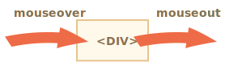
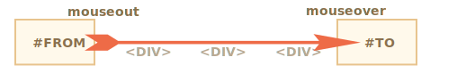
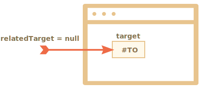
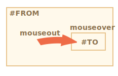
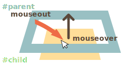

# mouseover/out 이벤트와 mouseenter/leave 이벤트

이제 마우스가 요소 사이에서 움직일 때 발생하는 이벤트에 대해 더 자세히 알아보겠습니다.

## mouseover/mouseout 이벤트와 relatedTarget

마우스가 요소 위로 올라갈 때는 `mouseover` 이벤트가 발생하고, 요소 밖으로 나갈 때는 `mouseout` 이벤트가 발생합니다.



이 이벤트들은 `target` 프로퍼티를 보조할 수 있는 `relatedTarget` 프로퍼티를 갖고 있습니다. 마우스가 어떤 요소에서 다른 요소로 이동할 때, 한 요소는 `target`이 되고 다른 한 요소는 `relatedTarget`이 됩니다.

`mouseover` 이벤트에서는 아래와 같이 설정됩니다.

- `event.target`: 마우스가 현재 가리키는 요소
- `event.relatedTarget`: 기존에 마우스가 가리켰던 요소 (`relatedTarget` -> `target`).

`mouseout` 이벤트는 그 반대입니다.

- `event.target`: 기존에 마우스가 가리켰던 요소
- `event.relatedTarget`: 마우스가 현재 가리키는 요소 (`target` -> `relatedTarget`).

```online
아래 예시에서 각 얼굴과 얼굴의 기능은 서로 독립적인 요소입니다. 마우스가 움직임에 따라 어떤 이벤트가 발생하는지 확인할 수 있습니다.

각 이벤트는 `target`과  `relatedTarget`에 해당하는 요소를 나타냅니다.

[codetabs src="mouseoverout" height=280]
```

```warn header="`relatedTarget`은 `null`이 될 수 있습니다."
`relatedTarget` 프로퍼티는 `null`이 될 수 있습니다.

이는 정상적인 상황이며 윈도우 밖에 있던 마우스가 다른 요소 위로 움직였거나, 요소 위에 있던 마우스가 윈도우를 떠났음을 의미합니다.

따라서 `event.relatedTarget` 프로퍼티가 `null`인 경우에 `event.relatedTarget.tagName`에 접근한다면 에러가 발생할 수 있음을 명심해야 합니다.

````

## 요소 건너뛰기

마우스가 움직이면 `mousemove` 이벤트가 발생합니다. 브라우저는 일정 시간 간격으로 마우스 위치를 확인하면서 마우스의 이전 위치와 현재 위치가 다른 경우에 마우스가 움직였다고 판단하고 `mousemove` 이벤트를 발동시킵니다.

따라서 마우스가 매우 빠르게 움직이게 된다면 브라우저는 마우스가 지나간 요소들 중 일부를 인식하지 못할 수도 있습니다.



위 그림에서처럼 만약 마우스가 `#FROM`에서 `#TO`까지 아주 빠르게 움직이는 경우 두 요소 사이에 있는 `<div>` 요소들은 무시될 수도 있습니다. 이러한 경우 `#FROM`에서 `mouseout` 이벤트가 발생한 다음 곧바로 `#TO`에서 `mouseover` 이벤트가 발생하게 됩니다.

실제로 모든 요소에서 마우스 이벤트가 발생하기를 원하지 않으므로 화면에 많은 요소가 있는 경우 성능 측면에서는 바람직한 현상입니다.

따라서 마우스는 움직이는 경로상의 모든 요소를 "방문"하는 것이 아니라 특정 요소를 "건너뛰기" 할 수도 있다는 것을 알고 있어야 합니다.

실제로 마우스는 윈도우 바깥에서 곧바로 페이지 중앙으로 건너뛰어 올 수 있습니다. 이러한 경우 마우스가 특정 요소에서부터 이동해 온 것이 아니므로 `relatedTarget`은 `null`이 됩니다.



```online
아래 창에서 마우스 이벤트를 실시간으로 확인할 수 있습니다.

`<div id="parent">` 안에 `<div id="child">`가 구현되어 있습니다. 만약 마우스가 두 `div` 요소 위를 아주 빠르게 지나가게 된다면 둘 중 한 개 요소에서만 마우스 이벤트가 발생하거나 전혀 발생하지 않을 수도 있습니다.

마찬가지로 마우스가 child `div` 위로 아주 빠르게 이동할 경우 parent `div`에서는 마우스 이벤트가 발생하지 않을 수도 있습니다.

[codetabs height=360 src="mouseoverout-fast"]
````

```smart header="`mouseover` 이벤트가 발생한다면, `mouseout` 이벤트도 항상 발생합니다."
마우스가 아주 빠르게 움직이는 경우에 일부 요소들에서는 마우스 이벤트가 발생하지 않을 수도 있습니다. 하지만 어떤 요소에서 `mouseover` 이벤트가 발생했다면 마우스가 해당 요소를 떠날 때 `mouseout` 이벤트가 반드시 발생하게 됩니다.

````

## 자식 요소로 이동할 때 발생하는 Mouseout 이벤트

`mouseout` 이벤트의 중요한 특징이 있습니다. 이 이벤트는 마우스가 부모 요소에서 자식 요소로 이동하는 상황에서도 발생합니다. 아래 HTML 코드를 예시로 들자면 `#parent`에서 `#child`로 이동하는 상황입니다.

```html
<div id="parent">
  <div id="child">...</div>
</div>
````

만약 마우스가 `#parent`로부터 `#child`로 이동하게 된다면 `#parent` 요소에서는 `mouseout` 이벤트가 발생하게 됩니다!



이 현상은 조금 이상하게 보일 수는 있지만 아래와 같이 간단하게 설명될 수 있습니다.

**브라우저 작동 로직에 따라 마우스는 가장 안 쪽에 있는 요소, 즉 z-index 기준으로 가장 위에 위치한 요소 하나에만 위치할 수 있습니다.**

따라서 마우스가 한 요소에서 다른 요소로 이동하게 된다면 그 요소가 설령 자식 요소일지라도 이전의 요소를 떠난 것으로 처리됩니다.

이것 말고도 마우스 이벤트 처리에서 중요한 특징이 하나 더 있습니다.

자식 요소에서 발생한 `mouseover` 이벤트는 버블링됩니다. 만약 아래 그림에서 `#parent` 요소가 `mouseover` 이벤트 핸들러를 가지고 있다면, `#child` 요소에서 발생한 `mouseover` 이벤트에 의하여 `#parent` 요소에서도 `mouseover` 이벤트가 발생하게 됩니다.



```online
아래 예시에서 위 현상을 아주 쉽게 확인해 볼 수 있습니다. `<div id="parent">` 요소는 내부에 `<div id="child">` 요소를 포함하고 있습니다.
그리고 `<div id="parent">` 요소에만 이벤트 상세 정보를 표출하는 `mouseover/out` 이벤트 핸들러가 추가되어 있습니다.

마우스를 `#parent`에서 `#child`로 움직이면 `#parent` 요소에서 발생한 이벤트를 두 가지 확인할 수 있습니다.
1. `mouseout [target: parent]` (parent를 떠날 때)
2. `mouseover [target: child]` (child로부터 버블링 됨)

[codetabs height=360 src="mouseoverout-child"]
```

위에서 확인할 수 있듯이 마우스가 `#parent`에서 `#child`로 이동할 때 `mouseout`와 `mouseover` 이벤트가 발생합니다!

```js
parent.onmouseout = function (event) {
  /* event.target: parent element */
};
parent.onmouseover = function (event) {
  /* event.target: child element (bubbled) */
};
```

**만약 `event.target`을 이벤트 핸들러 내부에서 확인하지 않는다면 마우스가 `#parent`를 떠나자마자 다시 돌아온 것처럼 보일 수도 있습니다.**

하지만 실제로는 그렇지 않습니다! 마우스는 여전히 `#parent` 위에 있으면서 그저 `#child`로 더 깊이 이동하였을 뿐입니다.

만약 `parent.onmouseout` 이벤트와 같이 `#parent` 요소를 떠날 때 발생하는 이벤트가 있다면, 보통은 마우스가 `#parent` 요소에서 더 깊숙이 이동하는 상황에서는 해당 이벤트가 발생하기를 원하지 않을 것입니다.

이를 위하여 이벤트 핸들러에서 `relatedTarget`을 확인하고 만약 마우스가 여전히 기존 요소 내부에 위치한다면 해당 이벤트가 발생하지 않도록 개발할 수 있습니다.

다른 대안으로는 상기 문제가 발생하지 않는 `mouseenter` 이벤트와 `mouseleave` 이벤트를 사용할 수 있습니다.

지금부터 이 두 이벤트들에 관하여 알아보도록 하겠습니다.

## mouseenter와 mouseleave 이벤트

`mouseenter/mouseleave` 이벤트는 `mouseover/mouseout` 이벤트와 마찬가지로 마우스가 요소 위로 들어가고 나올 때 발생하는 이벤트입니다.

하지만 두 가지 중요한 차이점이 존재합니다.

1. 자식 요소 안으로 이동할 때는 발생하지 않습니다.
2. 이벤트 버블링이 발생하지 않습니다.

`mouseenter/mouseleave` 이벤트는 매우 단순합니다.

마우스가 요소 안으로 들어갈 때 `mouseenter` 이벤트가 발생합니다. 마우스가 부모 요소에 있는지 자식 요소에 있는지는 고려하지 않습니다.

그리고 마우스가 요소를 떠날 때 `mouseleave` 이벤트가 발생합니다.

```online
아래 예시는 위의 예시와 유사합니다. 하지만 부모 요소는 `mouseover/mouseout` 이벤트 대신에 `mouseenter/mouseleave` 이벤트 핸들러를 가지고 있습니다.

예시에서 확인할 수 있듯이 부모 요소에 마우스가 들어가고 나올 때만 이벤트가 발생합니다. 마우스가 자식 요소로 들어가고 나올 때에는 아무런 이벤트가 발생하지 않습니다. 자식 요소 간의 마우스 이동은 완전히 무시됩니다.

[codetabs height=340 src="mouseleave"]
```

## 이벤트 위임

`mouseenter/leave` 이벤트는 아주 단순하고 사용하기 쉽습니다. 하지만 이벤트 버블링이 발생하지 않으므로 이벤트 위임을 함께 사용할 수 없습니다.

수백 개의 셀이 있는 테이블에서 셀 간의 이동을 관리해야 하는 상황을 가정해 보겠습니다.

`<table>`에 이벤트 핸들러를 설정하여 관리할 수도 있겠지만 `mouseenter/leave` 이벤트는 버블링을 하지 않습니다. 그래서 만약 해당 이벤트가 어떤 `<td>`에서 발생한다면 그 `<td>`에 설정된 이벤트 핸들러에서만 해당 이벤트를 다룰 수 있을 것입니다.

`<table>`에 설정된 `mouseenter/leave` 이벤트 핸들러는 마우스가 `<table>` 안과 밖을 이동할 때만 각 이벤트를 발생시킬 수 있습니다. 따라서 `<table>` 내부에서 발생한 마우스 이동에 관한 어떠한 정보도 알 수 없습니다.

그러니 여기서는 `mouseover/mouseout` 이벤트를 사용해 보겠습니다.

마우스 아래에 있는 요소를 강조하는 단순한 이벤트 핸들러부터 사용해 보겠습니다.

```js
// 마우스 아래 요소를 강조합니다.
table.onmouseover = function (event) {
  let target = event.target;
  target.style.background = 'pink';
};

table.onmouseout = function (event) {
  let target = event.target;
  target.style.background = '';
};
```

```online
아래 예시에서 두 개의 이벤트가 동작하는 것을 확인할 수 있습니다. 마우스가 테이블 내부 요소들 사이를 이동함에 따라 현재 마우스가 위치한 요소가 강조됩니다.

[codetabs height=480 src="mouseenter-mouseleave-delegation"]
```

우리는 테이블 셀인 `<td>`에 마우스가 들어가고 나오는 것을 이벤트 핸들러로 관리하고 싶습니다. 셀 내부에서의 이동 또는 셀 밖으로의 이동에는 관심이 없습니다. 그러니 위 코드를 고쳐보겠습니다.

아래 방식을 적용해 볼 수 있습니다.

- 현재 강조된 `<td>`를 변수에 저장하고, 이 변수를 `currentElem`로 명명합니다.
- 만약 마우스가 여전히 `currentElem` 위에 있다면 `mouseover` 이벤트를 무시합니다.
- 만약 마우스가 `currentElem`를 떠나지 않았다면 `mouseout` 이벤트를 무시합니다.

아래는 모든 발생 가능한 상황을 고려한 코드 작성 예시입니다.

[js src="mouseenter-mouseleave-delegation-2/script.js"]

위 코드에서 중요한 점을 다시 한 번 말씀드리겠습니다.

1. 테이블 내부의 `<td>`를 방문하고 떠나는 것을 관리하기 위해 이벤트 위임을 사용했습니다. 이를 위해 이벤트 버블링이 발생하지 않음에 따라 이벤트 위임을 사용할 수 없는 `mouseenter/leave` 이벤트 대신에 `mouseover/out` 이벤트를 사용했습니다.
2. `<td>`의 자식 요소들 사이에서 발생하는 이벤트와 같은 기타 이벤트들을 걸러냄으로써 `onEnter/Leave` 함수가 다른 `<td>` 요소에 방문하거나 해당 요소를 완전히 떠나는 경우에만 발동하도록 했습니다.

```online
아래는 모든 상세 사항이 적용된 예시입니다.

[codetabs height=460 src="mouseenter-mouseleave-delegation-2"]

마우스를 테이블 셀의 안과 바깥으로 또는 셀 안에서 이동시켜 보세요. 속도는 상관 없습니다. 이전의 예시와 다르게 오직 `<td>`만 강조됩니다.
```

## 요약

우리는  `mouseover`, `mouseout`, `mousemove`, `mouseenter` 그리고 `mouseleave` 이벤트를 다루었습니다.

아래 사항들을 기억해 두세요.

- 빠른 마우스 움직임은 마우스 이동 경로 상의 요소들을 건너뛸 수도 있습니다.
- `mouseover/out`와 `mouseenter/leave` 이벤트는 `relatedTarget` 프로퍼티를 추가로 가지고 있습니다. 이 프로퍼티는 마우스가 어느 요소에서 왔는지 또는 어느 요소로 떠나왔는지를 나타냄으로써 `target` 프로퍼티를 보완하는 역할을 합니다.

`mouseover/out` 이벤트는 부모 요소에서 자식 요소로 이동할 때도 발생합니다. 브라우저는 마우스가 가장 안쪽에 있는 한 개의 요소 위에만 위치할 수 있다고 가정합니다.

`mouseenter/leave` 이벤트는 위와는 다르게 마우스가 자식 요소가 아닌 완전히 다른 요소로 들어오거나 특정 요소에서 완전히 빠져나왔을 때만 발생합니다. 그리고 버블링 이벤트를 발생시키지 않습니다.
