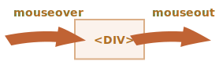

# 마우스 이동: mouseover/out, mouseenter/leave

마우스가 요소 사이를 이동할 때 발생하는 이벤트에 대해 자세히 살펴봅시다.

## mouseover/mouseout 이벤트와 relatedTarget

`mouseover` 이벤트는 마우스 포인터가 요소를 올라올 때 발생하며, `mouseout` 이벤트는 떠날 때 발생합니다.



이 이벤트들은 특별합니다. 왜냐하면 `relatedTarget` 프로퍼티를 갖고 있기 때문이죠. 이 프로퍼티는 `target`을 보완해줍니다. 마우스가 한 요소에서 다른 요소로 떠날 때, 그중 하나는 `target`, 다른 하나는 `relatedTarget`이 됩니다.

`mouseover`의 경우

- `event.target` -- 마우스가 올라온 요소입니다.
- `event.relatedTarget` -- 마우스가 올라와 있었던 요소입니다. (`relatedTarget` -> `target`).

`mouseout`의 경우는 그 반대

- `event.target` -- 마우스가 떠난 요소입니다.
- `event.relatedTarget` -- 마우스가 떠나고 올라온 새로운 요소입니다. (`target` -> `relatedTarget`).

```online
아래의 예에서 각 얼굴과 이목구비는 별개의 요소입니다. 마우스를 이동하면 텍스트 영역에서 마우스 이벤트를 볼 수 있습니다.

각 이벤트에는 `target`과 `relatedTarget`에 대한 정보가 있습니다.

[codetabs src="mouseoverout" height=280]
```

```warn header="`relatedTarget`"은 `null`일 수 있습니다.
(`relatedTarget`프로퍼티는 `null`일 수 있습니다.)

이것은 단지 마우스가 다른 요소에서 온 것이 아니라 창밖에서 왔다는 것을 의미합니다. 혹은 창을 떠났을 수도 있습니다.

`event.relatedTarget`을 코드에 사용할 때는 그러한 가능성을 염두에 두어야 합니다. `event.relatedTarget.tagName`에 액세스하면 오류가 발생합니다.
```

## 건너뛰기 요소

마우스를 움직이면 `mousemove` 이벤트가 트리거 됩니다. 그렇다고 해서 모든 픽셀이 하나의 이벤트로 이어지는 것은 아닙니다.

브라우저는 때때로 마우스 위치를 확인합니다. 그리고 변경 사항을 발견하면 이벤트를 트리거 합니다.

즉, 방문자가 마우스를 매우 빠르게 이동하는 경우 일부 DOM 요소를 건너뛸 수 있습니다.


만약 마우스가 위 그림과 같이 `#FROM`에서 `#TO` 요소로 매우 빠르게 움직이면, 그때 `<div>` (또는 일부)를 건너뛸 수 있습니다. `mouseout` 이벤트는 `#FROM`에서 트리거 된 다음 `#TO`에서 즉시 `mouseover`할 수 있습니다.

중간 요소가 많을 수도 있기 때문에 성능에 좋습니다. 각각의 프로세스를 처리하고 싶지 않기 때문입니다.

한편으로는 마우스 포인터는 모든 요소를 "방문"하지 않는다는 것을 명심해야 합니다. "점프"할 수 있습니다.

특히 포인터가 창밖으로 바로 페이지 중앙 안쪽으로 점프할 수 있습니다. 이 경우 관련 타깃은 "존재하지 않는 곳(갑자기)"에서 나왔기 때문에 `null`입니다.


```online
아래 테스트에서 "실시간" 확인할 수 있습니다.

HTML은 두 개의 중첩된 요소로 이루어져 있는데, `<div id="child">`는 `<div id="parent">` 안에 있습니다. 만약 마우스를 빠르게 위로 이동하면, 자식 div만이 이벤트를 트리거 하거나, 부모만이 이벤트를 트리거 하거나, 이벤트가 전혀 없을 수 있습니다.

또한 포인터를 하위 div로 이동한 다음 부모 포인터를 통해 빠르게 아래로 이동해보세요. 이동이 충분히 빠르면 부모 요소가 무시됩니다. 마우스가 부모 요소를 눈치 채지 못하고 교차합니다.

[codetabs height=360 src="mouseoverout-fast"]
```

```smart header="If `mouseover`", `mouseout`이 있어야 합니다.
마우스가 빠르게 이동하는 경우 중간 요소는 무시될 수 있지만, 한 가지 확실한 것은 요소 전체를 건너뛸 수도 있다는 것입니다.

"공식적으로" 포인터가 `mouseover`가 있는 요소에 들어갔다면, 해당 요소를 떠날 때 항상 `mouseout`를 작동시킵니다.
```

## 자식 요소로 떠날 때 발생하는 Mouseout

`mouseout`의 중요한 특징 -- 포인터가 요소에서 후손 요소로 이동할 때 트리거 합니다.

시각적으로 포인터는 여전히 요소 위에 있지만, `mouseout` 이벤트를 얻습니다.


이상하게 보이지만, 쉽게 설명할 수 있습니다.

**브라우저 로직에 따르면, 마우스 커서는 언제든지 *단일* 요소(z-index에서 가장 내포된 요소 및 맨 위에 있는 요소) 위에 있을 수 있습니다.

그래서 만약 그것이 다른 요소(심지어 후손)로 간다면, 그것은 이전 요소에서 떠나게 됩니다.

중요한 세부 사항을 메모해 두세요.

`mouseover` 이벤트는 계속 후손에게 버블링 됩니다. 그러므로 부모 요소가 이러한 핸들러를 가지고 있으면 트리거 됩니다.


```online
아래 예에서는 `<div id="child">`가 `<div id="parent">` 내부에 있음을 잘 알 수 있습니다. 부모에는 `mouseover/out` 이벤트를 청취하고 세부 정보를 출력하는 핸들러가 있습니다.

마우스를 부모 요소에서 자식 요소로 이동하면, `mouseout [target: parent]` (왼쪽의 부모 요소) `mouseover [target: child]`의 두 가지 이벤트가 표시됩니다. (자식 요소에게 온 버블링 이벤트).

[codetabs height=360 src="mouseoverout-child"]
```

부모 요소에서 자식 요소로 이동할 때 두 개의 핸들러가 부모 요소에서 `mouseout`과 `mouseover`를 트리거 합니다.

```js
parent.onmouseout = function(event) {
  /* event.target: 부모 요소 */
};
parent.onmouseover = function(event) {
  /* event.target: 자식 요소 (버블링) */
};
```

만약 핸들러 내부의 코드가 `target`을 바라보지 않는다면, 그것은 마우스가 `parent` 요소를 떠났다가 다시 그 위로 왔다고 생각할 수도 있습니다. 하지만 그렇지 않습니다! 마우스는 절대 떠나지 않았고, 단지 자식 요소로 옮겨갔습니다.

애니메이션 실행과 같이 요소를 떠난 후 몇 가지 조치를 취할 경우 이러한 해석은 원치 않는 부작용을 초래할 수 있습니다.

이를 방지하기 위해 `relatedTarget`을 확인하고, 마우스가 아직 요소 안에 있으면 해당 이벤트를 무시할 수 있습니다.

또는 다른 이벤트인 `mouseenter`와 `mouseleave`를 사용할 수 있는데, 이 이벤트에는 그러한 문제가 없기 때문에 지금 다루겠습니다.

## mouseenter/mouseleave

`mouseenter/mouseleave` 이벤트는 `mouseover/mouseout` 이벤트와 같습니다. 마우스 포인터가 요소에 들어오거나 떠날 때 트리거 합니다.

하지만 두 가지 중요한 차이점이 있습니다:

1. 요소 내부의 전환, 후손에게 전해지는 것들은 계산하지 않습니다.
2. `mouseenter/mouseleave` 이벤트는 버블을 만들지 않습니다. 

이 이벤트들은 매우 간단합니다.

포인터가 요소에 들어왔을 때 -- `mouseenter` 이벤트가 작동합니다. 요소 또는 후손 요소 내부의 포인터의 정확한 위치는 중요하지 않습니다.

포인터가 요소를 벗어날 때 -- `mouseleave` 이벤트가 작동합니다.

```online
이 예는 위의 예와 비슷하지만, 현재 상단 요소에는 `mouseover/mouseout`이 아닌 `mouseenter/mouseleave`가 있습니다.

보시다시피, 생성된 유일한 이벤트는 포인터를 상단 요소 안팎으로 이동하는 것과 관련된 이벤트입니다. 포인터가 후손에게 갔다가 다시 돌아가면 아무 일도 일어나지 않습니다. 자식 항목 간의 전환은 무시됩니다.

[codetabs height=340 src="mouseleave"]
```

## 이벤트 위임

`mouseenter/leave`이벤트는 매우 간단하고 사용하기 쉽지만, 버블링 되지않습니다. 그렇기 때문에 이벤트 위임을 사용할 수 없습니다.

테이블 셀을 위한 `mouseenter/leave` 이벤트를 처리하고 싶다고 상상해보세요. 그리고 수백 개의 셀이 있습니다.

자연스러운 해결방법은 핸들러를 `<table>`에 설정하고, 이벤트를 처리하는 것입니다. 그러나 `mouseenter/leave`는 버블링이 되지 않습니다. 그래서 만약 그런 이벤트가 `<td>`에서 일어난다면, `<td>`에 대한 핸들러만이 그것을 받을 수 있습니다.

`<table>`의 `mouseenter/leave` 처리기는 포인터가 테이블 전체에 들어가거나 테이블에서 나올 때만 트리거 합니다. 내부 전환에 대한 정보를 얻는 것은 불가능합니다.

그래서, `mouseover/mouseout` 이벤트를 사용해봅시다.

먼저 마우스 아래의 요소를 강조하는 간단한 핸들러로 시작합시다.:

```js
// 포인터 아래에 있는 요소를 강조해봅시다.
table.onmouseover = function(event) {
  let target = event.target;
  target.style.background = 'pink';
};

table.onmouseout = function(event) {
  let target = event.target;
  target.style.background = '';
};
```

```online
여기서 동작을 확인해보세요. 마우스가 이 테이블의 요소를 가로질러 이동하면 현재 마우스가 강조 표시됩니다.

[codetabs height=480 src="mouseenter-mouseleave-delegation"]
```

우리의 경우, 테이블 셀 사이의 전환을 다루고자 합니다. `<td>`: 셀에 들어갔다가 나오는 거죠. 셀의 내부나 외부 같은 다른 전환들은 관심 없습니다. 그것들은 필터링합시다.

우리가 할 수 있는 일은 다음과 같습니다:

- 변수에 현재 강조 표시된 `<td>`를 기억하고, `currentElem`이라고 합시다.
- `mouseover`일때 -- 현재의 `<td>` 안에 있다면 이벤트를 무시합니다.
- `mouseout`일때 -- 현재의 `<td>`를 떠나지 않으면 무시합니다.

여기 가능한 모든 상황을 설명하는 코드의 예가 있습니다:

[js src="mouseenter-mouseleave-delegation-2/script.js"]

```online
다음은 모든 세부 정보가 포함된 전체 예제입니다.

[codetabs height=380 src="mouseenter-mouseleave-delegation-2"]

커서를 테이블 셀 안과 그 안에서 움직여보세요. 빠르든 느리든 상관 없습니다. 앞의 예와 달리 전체적으로 `<td>`만 강조 표시됩니다.
```

## 요약

`mouseover`, `mouseout`, `mousemove`, `mouseenter`, `mouseleave` 이벤트를 살펴보았습니다.

참고사항:

- 마우스를 빠르게 움직이면 중간 요소를 건너뛸 수 있습니다.
- `mouseover/out`, `mouseenter/leave` 이벤트에는 `relatedTarget`이라는 추가 프로퍼티가 있습니다. 이것이 바로 `target`을 보완하는 요소입니다.

부모 요소에서 자식 요소로 이동할 때도 `mouseover/out` 이벤트가 트리거 됩니다. 브라우저는 마우스가 한 번에 하나의 요소, 즉 가장 깊은 요소만 초과할 수 있다고 가정합니다.

`mouseover/out` 이벤트는 그러한 측면에서 다릅니다. 즉, 마우스가 전체 요소를 들어오고 나갈 때만 트리거 됩니다. 또한 버블을 만들지도 않습니다.
