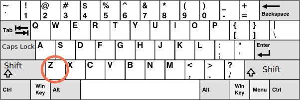

# keydown과 keyup 이벤트

키보드 이야기를 시작하기 전에 먼저 알아 둘 점이 있습니다. 모던 디바이스에선 키보드 말고도 '무언가를 입력'하는 다양한 수단이 있습니다. 음성 인식(특히 모바일 기기)이나 마우스를 사용한 복사·붙여넣기가 그 예입니다.

따라서 `<input>` 필드에 들어오는 입력 전부를 추적하려면 키보드 이벤트만으론 부족합니다. 이를 보완하는 수단으론 입력 수단과 관계없이 `<input>` 필드의 변경을 추적하는 `input`이라는 이벤트가 따로 존재합니다. 입력 추적이 목적이라면 `input` 이벤트가 더 나은 선택일 수 있습니다. `input` 이벤트는 <info:events-change-input> 챕터에서 다루겠습니다.

키보드 이벤트는 키보드 동작 자체를 다루고 싶을 때 사용해야 합니다(가상 키보드 포함). 방향키 `key:Up`·`key:Down` 입력이나 단축키(키 조합 포함)에 반응하는 경우가 그 예입니다.


## 실험용 미니 데모 [#keyboard-test-stand]

```offline
[실험용 미니 데모](sandbox:keyboard-dump)를 돌려보면 키보드 이벤트를 더 잘 이해할 수 있습니다.
```

```online
실험용 미니 데모를 돌려보면 키보드 이벤트를 더 잘 이해할 수 있습니다.

텍스트 필드에 다양한 키 조합을 입력해 봅시다.

[codetabs src="keyboard-dump" height=480]
```


## keydown과 keyup

키를 누르면 `keydown` 이벤트가 발생합니다. 눌렀던 키에서 손을 떼면 `keyup` 이벤트가 발생합니다.

### event.code와 event.key

이벤트 객체의 `key` 프로퍼티로는 입력된 글자를, `code` 프로퍼티로는 '물리적인 키 코드'를 알아낼 수 있습니다.

같은 키 `key:Z`를 눌러도 `key:Shift`와 함께 누르는지에 따라 소문자 `z`와 대문자 `Z`라는 서로 다른 두 글자가 입력됩니다.

`event.key`는 입력된 글자 그 자체를 파악하기 때문에 두 경우에 값이 다릅니다. 반면 `event.code`는 같습니다.

| 키          | `event.key` | `event.code` |
|--------------|-------------|--------------|
| `key:Z`      |`z` (소문자)         |`KeyZ`        |
| `key:Shift+Z`|`Z` (대문자)          |`KeyZ`        |


여러 언어를 오가며 작업하는 사용자라면 다른 언어로 전환하고 `key:Z`를 누르면 `"Z"`와 전혀 다른 글자가 입력됩니다. 이때는 실제 입력된 글자가 `event.key` 값이 됩니다. 반면 `event.code`는 언제나 `"KeyZ"`로 같습니다.

```smart header="\"KeyZ\"와 그 밖의 키 코드"
모든 키에는 키보드 위치에 따라 정해지는 코드가 있습니다. 키 코드는 [UI 이벤트 코드 명세](https://www.w3.org/TR/uievents-code/)에 기술되어 있습니다.

예시를 살펴봅시다.
- 글자 키의 코드는 `"Key<글자>"` 형태입니다. `"KeyA"`, `"KeyB"` 등이 있습니다.
- 숫자 키의 코드는 `"Digit<숫자>"` 형태입니다. `"Digit0"`, `"Digit1"` 등이 있습니다.
- 특수 키의 코드는 키 이름 그대로입니다. `"Enter"`, `"Backspace"`, `"Tab"` 등이 있습니다.

널리 쓰이는 키보드 자판 배열 몇 가지에 대한 키 코드는 명세에서 확인할 수 있습니다.

더 많은 코드가 궁금하다면 [명세의 알파벳·숫자 절](https://www.w3.org/TR/uievents-code/#key-alphanumeric-section)을 읽거나 위 [실험용 미니 데모](#keyboard-test-stand)에서 직접 키를 눌러 보세요.
```

```warn header="대·소문자 구분: `\"keyZ\"`가 아니라 `\"KeyZ\"`"
당연해 보이지만 여전히 많은 사람이 실수하는 부분입니다.

`keyZ`가 아니라 `KeyZ`라는 점에 유의하세요. `event.code=="keyZ"` 같은 비교는 동작하지 않습니다. `"Key"`의 첫 글자는 반드시 대문자여야 합니다.
```

그럼 `key:Shift`나 `key:F1`처럼 아무 글자도 입력하지 않는 키는 어떨까요? 이런 키는 `event.key` 값이 `event.code` 값과 거의 같습니다.

| 키          | `event.key` | `event.code` |
|--------------|-------------|--------------|
| `key:F1`      |`F1`          |`F1`        |
| `key:Backspace`      |`Backspace`          |`Backspace`        |
| `key:Shift`|`Shift`          |`ShiftRight` 또는 `ShiftLeft`        |

`event.code`는 정확히 어떤 키가 눌렸는지 특정한다는 점에 주목하세요. 예를 들어 대부분의 키보드엔 `key:Shift` 키가 왼쪽과 오른쪽에 하나씩 있습니다. `event.code`는 둘 중 어느 쪽이 눌렸는지 알려주고 `event.key`는 그 키의 '의미'('Shift'라는 사실)를 담당합니다.

단축키 `key:Ctrl+Z`(Mac에선 `key:Cmd+Z`)를 처리하고 싶다고 가정하겠습니다. 대부분의 텍스트 에디터는 이 단축키를 누르면 '실행 취소'가 되게 해줍니다. `keydown`에 리스너를 설정하고 어떤 키가 눌렸는지 검사하면 우리도 단축키를 처리해 실행 취소 기능을 구현할 수 있습니다.

여기서 고민이 하나 생깁니다. 리스너에서 검사해야 할 값은 `event.key`일까요, `event.code`일까요?

`event.key` 값은 글자라서 언어에 따라 달라집니다. 사용자가 OS에 여러 언어를 설정해 놓고 전환하면 같은 키를 눌러도 다른 글자가 입력됩니다. 그러니 값이 언제나 같은 `event.code`를 검사하는 편이 타당해 보입니다.

다음처럼 말이죠.

```js run
document.addEventListener('keydown', function(event) {
  if (event.code == 'KeyZ' && (event.ctrlKey || event.metaKey)) {
    alert('실행 취소!')
  }
});
```

그런데 `event.code`엔 문제가 하나 있습니다. 자판 배열이 다르면 같은 키에서 다른 글자가 입력되는 경우가 있습니다.

미국식 배열('QWERTY')과 그 아래 독일식 배열('QWERTZ')을 비교해 봅시다(위키피디아 출처).




같은 키인데 미국식 배열에선 'Z'가, 독일식 배열에선 'Y'가 입력됩니다(각 배열에서 두 글자의 위치가 서로 바뀌어 있습니다).

말 그대로 독일식 배열 사용자가 `key:Y`를 누르면 `event.code`가 `KeyZ`가 됩니다.

코드에서 `event.code == 'KeyZ'`를 검사한다면 독일식 배열 사용자가 `key:Y`를 누를 때도 검사를 통과해 버립니다.

정말 이상하게 들리지만 실제로 그렇습니다. [명세](https://www.w3.org/TR/uievents-code/#table-key-code-alphanumeric-writing-system)에 이런 동작이 명시되어 있습니다.

이렇게 `event.code`는 예상치 못한 자판 배열에서 엉뚱한 글자와 연결될 수 있습니다. 배열이 다르면 같은 글자가 서로 다른 물리 키에 자리해 코드도 달라지기 때문입니다. 다행히 이런 일은 앞서 본 `keyA`·`keyQ`·`keyZ` 등 몇몇 코드에서만 일어나고 `Shift` 같은 특수 키에선 일어나지 않습니다. 해당 목록은 [명세](https://www.w3.org/TR/uievents-code/#table-key-code-alphanumeric-writing-system)에서 확인할 수 있습니다.

자판 배열에 따라 달라지는 글자를 안정적으로 추적해야 한다면 `event.key`가 더 나은 방법일 수 있습니다.

반면 `event.code`는 물리적인 키 위치에 묶여 있어 사용자가 언어를 바꿔도 값이 언제나 같다는 장점이 있습니다. 그래서 `event.code`에 의존하는 단축키는 언어를 전환해도 잘 동작합니다.

자판 배열에 따라 글자가 달라지는 키를 다루고 싶나요? 그렇다면 `event.key`가 좋은 선택입니다.

언어를 전환해도 동작하는 단축키를 만들고 싶나요? 그렇다면 `event.code`가 더 나을 수 있습니다.

## 자동 반복

키를 충분히 오래 누르고 있으면 '자동 반복(auto-repeat)'이 시작됩니다. `keydown` 이벤트가 계속해서 다시 발생하다가 키에서 손을 떼는 순간 마지막으로 `keyup` 이벤트가 한 번 발생합니다. 그래서 `keydown`은 여러 번 발생하고 `keyup`은 한 번만 발생하는 일이 꽤 흔합니다.

자동 반복으로 발생한 이벤트는 이벤트 객체의 `event.repeat` 프로퍼티가 `true`로 설정됩니다.


## 기본 동작

키보드는 그 조합이 다양한 만큼 기본 동작도 다양합니다.

예시를 살펴봅시다.

- 글자 키를 누르면 화면에 글자가 나타납니다(가장 대표적인 결과입니다).
- `key:Delete` 키를 누르면 글자가 삭제됩니다.
- `key:PageDown` 키를 누르면 페이지가 스크롤됩니다.
- `key:Ctrl+S`를 누르면 브라우저가 '페이지 저장' 대화상자를 엽니다.
- 이 외에도 브라우저가 기본적으로 지원하는 기능은 다양합니다.

`keydown` 핸들러를 통해 기본 동작을 막으면 OS 기반 특수 키를 제외한 대부분의 기본 동작을 취소할 수 있습니다. 예를 들어 Windows에선 `key:Alt+F4`를 누르면 현재 브라우저 창이 닫히는데 자바스크립트에서 기본 동작을 막게 코딩해도 창을 닫는 것을 막을 수 없습니다.

또 다른 예시를 살펴봅시다. 아래 `<input>`은 전화번호를 입력받는 필드라서 숫자와 `+`, `()`, `-` 이외의 키는 받아들이지 않습니다(다만 한글은 입력기(IME, Input Method Editor)가 여러 키를 조합해 글자를 만들어 넣기 때문에 `keydown`에서 기본 동작을 막아도 입력됩니다 - 옮긴이).

```html autorun height=60 run
<script>
function checkPhoneKey(key) {
  return (key >= '0' && key <= '9') || key == '+' || key == '(' || key == ')' || key == '-';
}
</script>
<input *!*onkeydown="return checkPhoneKey(event.key)"*/!* placeholder="전화번호를 입력해 주세요" type="tel">
```

그런데 이 예시는 `key:Backspace`·`key:Left`·`key:Right`·`key:Ctrl+V` 같은 특수 키도 동작하지 않는다는 점에 주목하세요. 필터 `checkPhoneKey`가 지나치게 엄격해서 생긴 부작용입니다.

필터를 조금 느슨하게 만들어 봅시다.


```html autorun height=60 run
<script>
function checkPhoneKey(key) {
  return (key >= '0' && key <= '9') || key == '+' || key == '(' || key == ')' || key == '-' ||
    key == 'ArrowLeft' || key == 'ArrowRight' || key == 'Delete' || key == 'Backspace';
}
</script>
<input onkeydown="return checkPhoneKey(event.key)" placeholder="전화번호를 입력해 주세요" type="tel">
```

이제 화살표 키와 삭제 키가 잘 동작합니다.

그런데 여전히 마우스 우클릭과 '붙여넣기'를 사용하면 아무 값이나 입력할 수 있습니다. 필터가 100% 신뢰할 만한 수단은 아닌 셈이죠. 이 코드는 대부분의 경우엔 잘 동작하니 이대로 둬도 괜찮습니다. 하지만 좀 더 보완하고 싶다면 어떤 수정이든 일어난 뒤에 트리거되는 `input` 이벤트를 추적하는 방식을 쓰면 됩니다. `input` 이벤트 핸들러에선 새 값을 검사해 유효하지 않은 값일 때 강조 표시하거나 고칠 수 있습니다.

## 레거시

과거엔 `keypress`라는 이벤트가 있었고 이벤트 객체엔 `keyCode`·`charCode`·`which` 프로퍼티도 있었습니다.

이 이벤트와 프로퍼티는 브라우저 간 비호환 문제가 아주 많았습니다. 그래서 레거시 이벤트와 프로퍼티를 전부 폐기(deprecate)하고 새로운 모던 이벤트(위에서 설명한 이벤트)에 대한 명세를 만드는 것 외엔 다른 도리가 없었습니다. 레거시 이벤트도 브라우저가 계속 지원하고 있어 옛 코드도 여전히 동작하지만 지금은 옛 이벤트와 프로퍼티를 사용할 필요가 전혀 없습니다.

## 요약

글자 키를 비롯해 `key:Shift`·`key:Ctrl` 같은 특수 키를 누르면 항상 키보드 이벤트가 발생합니다. 유일한 예외는 노트북용 키보드에 종종 있는 `key:Fn` 키입니다. `key:Fn`은 OS보다 낮은 레벨에서 구현될 때가 많아 키보드 이벤트가 발생하지 않습니다.

키보드 이벤트는 두 가지가 있습니다.

- `keydown` -- 키를 누를 때 발생(키를 오래 누르고 있으면 자동 반복)
- `keyup` -- 키에서 손을 뗄 때 발생

키보드 이벤트의 주요 프로퍼티는 다음과 같습니다.

- `code` -- 키보드에서 키가 자리한 물리적 위치에 따라 정해지는 '키 코드'(`"KeyA"`, `"ArrowLeft"` 등)
- `key` -- 입력된 글자(`"A"`, `"a"` 등). `key:Esc`처럼 글자가 없는 키에선 대개 `code`와 값이 같음

과거엔 폼 필드의 사용자 입력을 추적할 때 키보드 이벤트를 쓰기도 했습니다. 하지만 입력은 다양한 경로로 들어올 수 있어 이 방법은 신뢰하기 어렵습니다. 모든 입력을 다루는 `input`·`change` 이벤트를 사용하는 게 더 신뢰하기 좋습니다(<info:events-change-input> 챕터에서 다룹니다). 두 이벤트는 복사·붙여넣기나 음성 인식을 포함해 어떤 종류의 입력이든 일어난 뒤에 트리거됩니다.

키보드 이벤트는 정말로 키보드를 다루고 싶을 때 사용해야 합니다. 단축키나 특수 키에 반응해야 하는 경우가 그 예입니다.
