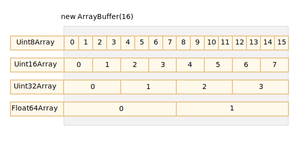
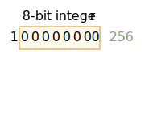
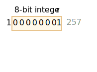
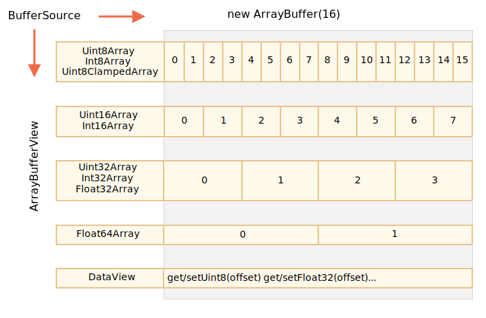

# ArrayBuffer와 이진 배열

웹 개발에서 파일 생성, 업로드, 다운로드를 처리할 때 이진 데이터를 주로 사용합니다. 이미지 처리 또한 대표적인 이진 데이터 사용 사례 중 하나입니다.

자바스크립트에서는 이 모든 작업이 가능하며 이진 연산에서도 뛰어난 성능을 보여줍니다.

다만 아래와 같은 다양한 클래스로 인해 약간 혼란스러울 수 있습니다.
- `ArrayBuffer`, `Uint8Array`, `DataView`, `Blob`, `File` 등

자바스크립트에서 이진 데이터는 다른 프로그래밍 언어에 비해 표준적이지 않은 방식으로 구현되어 있습니다. 하지만 개념을 하나씩 정리하고 나면 꽤 단순하게 이해할 수 있습니다.

**가장 기본이 되는 이진 객체는 `ArrayBuffer`입니다. `ArrayBuffer`는 고정 길이의 연속된 메모리 영역을 참조합니다.**

다음과 같이 `ArrayBuffer`를 생성할 수 있습니다.
```js run
let buffer = new ArrayBuffer(16); // 길이가 16바이트인 버퍼 생성
alert(buffer.byteLength); // 16
```

이 코드는 16바이트의 연속된 메모리 공간을 할당하고 0으로 미리 채웁니다.

```warn header="`ArrayBuffer`는 배열이 아닙니다."
혼동할 수 있는 부분을 먼저 짚고 넘어갑시다. `ArrayBuffer`는 `Array`와 전혀 공통점이 없습니다.
- `ArrayBuffer`는 길이가 고정되어 있어, 늘리거나 줄일 수 없습니다.
- `ArrayBuffer`는 메모리에서 정확히 선언된 길이만큼만 차지합니다.
- 개별 바이트에 접근하려면 `buffer[index]`가 아닌 별도의 '뷰(view)' 객체가 필요합니다.
```

`ArrayBuffer`는 메모리 영역입니다. 이 영역 안에 어떤 것이 저장될까요? `ArrayBuffer`는 알지 못합니다. 그저 가공되지 않은 일련의 바이트일 뿐입니다.

**`ArrayBuffer`를 조작하기 위해 '뷰' 객체가 필요합니다.**

<<<<<<< HEAD
뷰 객체는 자체적으로 어떤 것도 저장하지 않으며 `ArrayBuffer`에 저장된 바이트를 해석하는 '안경' 역할을 수행합니다.
=======
A view object does not store anything on its own. It's the "eyeglasses" that give an interpretation of the bytes stored in the `ArrayBuffer`.
>>>>>>> 725653fd99b19d42195e837ac3bb23c1784f8f6e

예시:

<<<<<<< HEAD
- **`Uint8Array`** -- `ArrayBuffer`의 각 바이트를 별개의 숫자로 취급합니다. 1바이트는 8비트이므로 0부터 255까지의 값을 가질 수 있으며 이러한 값을 '8비트 부호 없는 정수(8-bit unsigned integer)'라고 부릅니다.
- **`Uint16Array`** -- 2바이트마다 하나의 정수로 취급합니다. 0부터 65535까지의 값을 가질 수 있으며 이러한 값을 '16비트 부호 없는 정수(16-bit unsigned integer)'라고 부릅니다.
- **`Uint32Array`** -- 4바이트마다 하나의 정수로 취급합니다. 0부터 4294967295까지의 값을 가질 수 있으며 이러한 값을 '32비트 부호 없는 정수(32-bit unsigned integer)'라고 부릅니다.
- **`Float64Array`** -- 8바이트마다 하나의 부동 소수점 숫자로 취급합니다. <code>5.0x10<sup>-324</sup></code>부터 <code>1.8x10<sup>308</sup></code>까지의 값을 가질 수 있습니다.
=======
- **`Uint8Array`** -- treats each byte in `ArrayBuffer` as a separate number, with possible values from 0 to 255 (a byte is 8-bit, so it can hold only that much). Such value is called a "8-bit unsigned integer".
- **`Uint16Array`** -- treats every 2 bytes as an integer, with possible values from 0 to 65535. That's called a "16-bit unsigned integer".
- **`Uint32Array`** -- treats every 4 bytes as an integer, with possible values from 0 to 4294967295. That's called a "32-bit unsigned integer".
- **`Float64Array`** -- treats every 8 bytes as a floating point number with possible values from <code>5.0x10<sup>-324</sup></code> to <code>1.8x10<sup>308</sup></code>.
>>>>>>> 725653fd99b19d42195e837ac3bb23c1784f8f6e

따라서 16바이트 `ArrayBuffer`의 이진 데이터는 16개의 '작은 숫자', 8개의 더 큰 숫자(각 2바이트), 4개의 더 큰 숫자(각 4바이트), 정밀도가 높은 부동 소수점 값 2개(각 8바이트)로 해석할 수 있습니다.



`ArrayBuffer`는 이진 데이터 처리의 근간이 되는 핵심 객체이며, 가공되지 않은 이진 데이터를 저장하고 있습니다.

하지만 `ArrayBuffer`에 값을 쓰거나 순회와 같은 기본 연산을 수행하려면 다음과 같이 뷰를 사용해야 합니다.

```js run
let buffer = new ArrayBuffer(16); // 길이가 16바이트인 버퍼 생성

*!*
let view = new Uint32Array(buffer); // 버퍼를 32비트 정수의 연속으로 취급

alert(Uint32Array.BYTES_PER_ELEMENT); // 정수 하나당 4바이트
*/!*

alert(view.length); // 4, 정수 4개 저장 가능
alert(view.byteLength); // 16, 전체 바이트 길이

// 값을 저장해봅시다.
view[0] = 123456;

// 값을 순회해봅시다.
for(let num of view) {
  alert(num); // 123456, 그 뒤 0, 0, 0 (총 4개의 값)
}

```

## TypedArray

<<<<<<< HEAD
지금까지 살펴본 모든 뷰(`Uint8Array`, `Uint32Array` 등)를 통칭하는 용어는 [TypedArray](https://tc39.github.io/ecma262/#sec-typedarray-objects)입니다. 앞서 살펴본 뷰들은 같은 메서드와 프로퍼티를 공유합니다.
=======
The common term for all these views (`Uint8Array`, `Uint32Array`, etc) is [TypedArray](https://tc39.github.io/ecma262/#sec-typedarray-objects). They share the same set of methods and properties.
>>>>>>> 725653fd99b19d42195e837ac3bb23c1784f8f6e

참고로 `TypedArray`라는 생성자는 존재하지 않습니다. `TypedArray`는 `ArrayBuffer`의 여러 뷰를 아울러 지칭하는 상위 용어입니다. 예를 들어 `Int8Array`, `Uint8Array` 등이 있으며 전체 목록은 곧 살펴보겠습니다.

`new TypedArray`와 같은 표현을 본다면 `new Int8Array`, `new Uint8Array`와 같은 뷰 중 하나를 뜻한다고 이해하면 됩니다.

<<<<<<< HEAD
타입이 지정된 배열(typed array)은 일반 배열처럼 인덱스가 있고 반복 가능(iterable, 이터러블)합니다.
=======
Typed arrays behave like regular arrays: have indexes and are iterable.
>>>>>>> 725653fd99b19d42195e837ac3bb23c1784f8f6e

타입이 지정된 배열의 생성자는 `Int8Array`나 `Float64Array`든 상관없이 주어진 인수 타입에 따라 다르게 동작합니다.

5가지 방식으로 인수를 넘길 수 있습니다.

```js
new TypedArray(buffer, [byteOffset], [length]);
new TypedArray(object);
new TypedArray(typedArray);
new TypedArray(length);
new TypedArray();
```

1. `ArrayBuffer` 인수를 전달하면 그 위에 뷰를 바로 생성합니다. 이 문법은 이미 위에서 사용해 보았습니다.

    선택적으로 시작 위치를 나타내는 `byteOffset`(기본값 0)과 `length`(기본값 버퍼의 끝)를 제공하면 `buffer`의 일부분만 뷰로 지정할 수 있습니다.

2. `Array`나 유사 배열 객체(array-like object)를 전달하면 타입이 지정된 배열을 동일한 길이로 생성하고 내용을 복사합니다.

    다음과 같이 사용하여 배열에 미리 값을 채워 넣을 수 있습니다.
    ```js run
    *!*
    let arr = new Uint8Array([0, 1, 2, 3]);
    */!*
    alert( arr.length ); // 4, 동일한 길이의 이진 배열을 생성
    alert( arr[1] ); // 1, 주어진 값으로 4바이트 (8비트 부호 없는 정수)를 채움
    ```
3. 또 다른 `TypedArray`를 전달해도 동일하게 동작합니다. 타입이 지정된 배열을 동일한 길이로 생성하고 값을 복사합니다. 필요하다면 새로운 타입으로 변환할 수 있습니다.
    ```js run
    let arr16 = new Uint16Array([1, 1000]);
    *!*
    let arr8 = new Uint8Array(arr16);
    */!*
    alert( arr8[0] ); // 1
    alert( arr8[1] ); // 232, 1000을 복사하려 했지만 1000은 8비트에 담을 수 없습니다(아래 설명 참조).
    ```

4. 숫자 인수 `length`를 전달하면 그만큼의 요소를 저장할 타입이 지정된 배열을 생성합니다. 전체 바이트 길이는 `length` 값에 단일 요소에 대한 바이트 수를 반환하는 `TypedArray.BYTES_PER_ELEMENT`를 곱한 값입니다.
    ```js run
    let arr = new Uint16Array(4); // 4개의 정수를 저장할 타입이 지정된 배열을 생성
    alert( Uint16Array.BYTES_PER_ELEMENT ); // 정수 하나당 2바이트로 취급
    alert( arr.byteLength ); // 8 (전체 바이트 길이)
    ```

5. 인수를 전달하지 않으면 길이가 0인 타입이 지정된 배열을 만듭니다.

`ArrayBuffer` 없이 `TypedArray`를 직접 생성할 수 있습니다. 하지만 뷰는 그 기반이 되는 `ArrayBuffer` 없이 존재할 수 없기 때문에 `ArrayBuffer`를 직접 전달하는 첫 번째 경우를 제외하고는 위 경우 모두 `ArrayBuffer`가 자동으로 생성됩니다.

<<<<<<< HEAD
기반이 되는 `ArrayBuffer`에 접근하기 위해 `TypedArray`의 프로퍼티를 사용할 수 있습니다.
- `buffer` -- `ArrayBuffer`의 참조
- `byteLength` -- `ArrayBuffer`의 길이
=======
To access the underlying `ArrayBuffer`, there are following properties in `TypedArray`:
- `buffer` -- references the `ArrayBuffer`.
- `byteLength` -- the length of the `ArrayBuffer`.
>>>>>>> 725653fd99b19d42195e837ac3bb23c1784f8f6e

그렇기에 아래와 같이 하나의 뷰에서 다른 뷰를 만들 수 있습니다.
```js
let arr8 = new Uint8Array([0, 1, 2, 3]);

// 동일한 값을 가진 또 다른 뷰
let arr16 = new Uint16Array(arr8.buffer);
```


타입이 지정된 배열의 목록은 다음과 같습니다.

- `Uint8Array`, `Uint16Array`, `Uint32Array` -- 8비트, 16비트, 32비트 정수에 사용합니다.
  - `Uint8ClampedArray` -- 8비트 정수에 사용하며, 값을 할당할 때 값의 범위를 '고정(clamp)'합니다(아래 참조).
- `Int8Array`, `Int16Array`, `Int32Array` -- 음수를 포함한 부호 있는 정수에 사용합니다.
- `Float32Array`, `Float64Array` -- 32비트, 64비트 부호 있는 부동 소수점 숫자에 사용합니다.

```warn header="`int8`과 같이 단일 값을 나타내는 타입은 없습니다."
`Int8Array`라는 이름과 달리 자바스크립트에는 `int`나 `int8`과 같은 단일 값 타입이 없다는 것에 유의하세요.

`Int8Array`는 개별 값을 갖는 배열이 아닌 `ArrayBuffer` 위의 뷰입니다.
```

### 범위를 벗어난 값의 동작

타입이 지정된 배열에 범위를 벗어난 값을 쓰려고 하면 어떻게 될까요? 에러는 발생하지 않습니다. 하지만 범위를 초과한 비트는 잘립니다.

`Uint8Array`에 256을 넣는다고 생각해 봅시다. 256의 이진 형태는 `100000000` (9비트)이지만 `Uint8Array`는 값 하나당 8비트만 제공하기 때문에 0부터 255까지의 값만 가질 수 있습니다.

표현할 수 있는 값의 범위를 초과하는 수에 대해 오른쪽 끝의 하위 8비트만 저장하고 나머지 비트는 잘립니다.



결과적으로 0이 나옵니다.

만약 257을 넣으면 257의 이진 형태는 `100000001` (9비트)이므로 오른쪽 끝의 8비트만 저장하여 배열에 `1`이 들어갑니다.



다시 말해 숫자를 2<sup>8</sup>로 나눈 나머지가 저장됩니다.

아래 사례를 살펴봅시다.

```js run
let uint8array = new Uint8Array(16);

let num = 256;
alert(num.toString(2)); // 100000000 (이진 표기법)

uint8array[0] = 256;
uint8array[1] = 257;

alert(uint8array[0]); // 0
alert(uint8array[1]); // 1
```

이 점에서 `Uint8ClampedArray`는 특별하게 동작합니다. `Uint8ClampedArray`는 255보다 큰 숫자는 255로, 음수는 0으로 저장합니다. 이러한 동작은 이미지 처리에 유용합니다.

## TypedArray 메서드

`TypedArray`는 일반 `Array` 메서드를 사용할 수 있지만 몇 가지 주목할 만한 예외가 존재합니다.

기본적으로 `TypedArray`는 배열처럼 순회하거나 `map`, `slice`, `find`, `reduce` 메서드를 사용할 수 있습니다.

하지만 배열처럼 동작하지 않는 부분도 있습니다.

- `splice` 메서드를 사용할 수 없습니다. 타입이 지정된 배열은 버퍼에 대한 뷰이고, 버퍼는 고정된 일련의 메모리 영역이기 때문에 값을 '제거'할 수 없습니다. 할 수 있는 일이라고는 0을 할당하는 것뿐입니다.
- `concat` 메서드를 사용할 수 없습니다.

그 외에 두 가지 메서드가 더 있습니다.

- `arr.set(fromArr, [offset])`는 `fromArr`의 `offset`(기본값 0) 위치부터 모든 요소를 `arr`에 복사합니다.
- `arr.subarray([begin, end])`는 `begin`부터 `end` 이전까지 동일한 타입의 새로운 뷰를 생성합니다. `slice` 메서드와 유사하지만(`slice`도 지원합니다) 범위 내 요소를 복사하지 않고 별도의 새로운 뷰를 생성합니다.

지금까지 본 메서드를 통해 타입이 지정된 배열을 복사하거나 조합하고 기존 배열에서 새로운 배열을 생성하는 등 여러 작업을 수행할 수 있습니다.


## DataView

<<<<<<< HEAD
[DataView](mdn:/JavaScript/Reference/Global_Objects/DataView)는 `ArrayBuffer` 위에 놓이는 특별하고 매우 유연한 '타입이 없는(untyped)' 뷰입니다. `DataView`는 임의의 오프셋에 있는 데이터를 원하는 형식으로 읽고 쓸 수 있게 합니다.
=======
[DataView](mdn:/JavaScript/Reference/Global_Objects/DataView) is a special super-flexible "untyped" view over `ArrayBuffer`. It allows to access the data on any offset in any format.
>>>>>>> 725653fd99b19d42195e837ac3bb23c1784f8f6e

- 타입이 지정된 배열에서는 생성자가 데이터 형식을 결정합니다. 배열 전체가 같은 타입이라고 가정하며 i번째 숫자는 `arr[i]`를 통해 접근합니다.
- `DataView`는 `.getUint8(i)`나 `.getUint16(i)`와 같은 메서드를 사용하여 데이터에 접근합니다. 데이터 형식은 생성 시점이 아닌 메서드 호출 시점에 결정됩니다.

문법:

```js
new DataView(buffer, [byteOffset], [byteLength])
```

- **`buffer`** -- 뷰의 기반이 되는 `ArrayBuffer`입니다. 타입이 지정된 배열과 달리 `DataView`는 스스로 새로운 버퍼를 만들지 않기 때문에 전달할 버퍼가 필요합니다.
- **`byteOffset`** -- 뷰의 시작 바이트 지점(기본값 0)
- **`byteLength`** -- 뷰의 바이트 길이(기본값 `buffer`의 끝)

예를 들어 아래와 같이 동일한 버퍼에서 다른 데이터 형식의 숫자를 추출할 수 있습니다.

```js run
// 모든 값이 최댓값 255인 4바이트 이진 배열
let buffer = new Uint8Array([255, 255, 255, 255]).buffer;

let dataView = new DataView(buffer);

// 오프셋 0에서 8비트 숫자를 가져옵니다.
alert( dataView.getUint8(0) ); // 255

<<<<<<< HEAD
// 오프셋 0에서 16비트 숫자를 가져옵니다. 이 숫자는 2바이트로 구성되며 두 바이트를 함께 해석하여 65535가 됩니다.
alert( dataView.getUint16(0) ); // 65535 (16비트 부호 없는 정수 중 가장 큰 값)
=======
// now get 16-bit number at offset 0, it consists of 2 bytes, together interpreted as 65535
alert( dataView.getUint16(0) ); // 65535 (biggest 16-bit unsigned int)
>>>>>>> 725653fd99b19d42195e837ac3bb23c1784f8f6e

// 오프셋 0에서 32비트 숫자를 가져옵니다.
alert( dataView.getUint32(0) ); // 4294967295 (32비트 부호 없는 정수 중 가장 큰 값)

dataView.setUint32(0, 0); // 4바이트 숫자를 0으로 설정하여 모든 바이트를 0으로 만듭니다.
```

<<<<<<< HEAD
`DataView`는 동일한 버퍼에 여러 데이터 형식의 데이터를 저장할 때 유용합니다. 예를 들어 16비트 정수와 32비트 부동 소수점 값을 한 쌍으로 묶어 연속해서 저장할 때, `DataView`를 사용하면 쉽게 데이터에 접근할 수 있습니다.
=======
`DataView` is great when we store mixed-format data in the same buffer. For example, when we store a sequence of pairs (16-bit integer, 32-bit float), `DataView` allows to access them easily.
>>>>>>> 725653fd99b19d42195e837ac3bb23c1784f8f6e

## 요약

`ArrayBuffer`는 고정 길이의 연속된 메모리 영역을 참조하는 핵심 객체입니다.

`ArrayBuffer`의 데이터를 조작하기 위해 뷰가 필요합니다.

- `TypedArray`가 뷰의 역할을 수행합니다.
    - `Uint8Array`, `Uint16Array`, `Uint32Array` -- 8비트, 16비트, 32비트 부호 없는 정수에 사용합니다.
    - `Uint8ClampedArray` -- 8비트 정수에 사용하며, 값을 할당할 때 값을 '고정'합니다.
    - `Int8Array`, `Int16Array`, `Int32Array` -- 음수를 포함한 부호 있는 정수에 사용합니다.
    - `Float32Array`, `Float64Array` -- 32비트, 64비트 부호 있는 부동 소수점 숫자에 사용합니다.
- 또는 `DataView` -- `DataView`는 `getUint8(offset)` 같은 메서드로 형식을 지정하는 뷰입니다.

<<<<<<< HEAD
대부분의 경우 `ArrayBuffer`를 내부에 감춘 채 타입이 지정된 배열을 직접 생성하고 값을 다룹니다. 이때 `ArrayBuffer`는 '공통분모(common denominator)' 역할을 합니다. 필요하다면 `.buffer`로 `ArrayBuffer`에 접근하여 또 다른 뷰를 만들 수 있습니다.
=======
In most cases we create and operate directly on typed arrays, leaving `ArrayBuffer` under cover, as a "common denominator". We can access it as `.buffer` and make another view if needed.
>>>>>>> 725653fd99b19d42195e837ac3bb23c1784f8f6e

이진 데이터를 다루는 메서드를 설명할 때 사용하는 용어가 두 가지 더 있습니다.
- `ArrayBufferView`는 이런 모든 종류의 뷰를 아울러 지칭하는 상위 용어입니다.
- `BufferSource`는 `ArrayBuffer` 또는 `ArrayBufferView`를 아울러 지칭하는 상위 용어입니다.

다음 챕터에서 이런 용어들에 대해 더 자세히 살펴보겠습니다. `BufferSource`는 가장 흔하게 쓰이는 용어 중 하나로, `ArrayBuffer`나 그 위의 뷰처럼 '모든 종류의 이진 데이터'를 의미합니다.

요약표는 다음과 같습니다.


