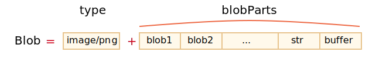

# Blob

`ArrayBuffer`와 뷰(view)는 ECMA 표준의 일부로 자바스크립트에 속합니다.

브라우저엔 이보다 더 고수준의 객체가 추가로 존재하는데 자세한 내용은 [File API](https://www.w3.org/TR/FileAPI/)에 기술되어 있습니다. `Blob`에 대한 설명 역시 명세에서 확인할 수 있습니다.

`Blob`은 생략 가능한 문자열인 `type`(주로 MIME 타입)과 `blobParts`(다른 `Blob` 객체·문자열·`BufferSource`의 나열)로 구성됩니다.



생성자 문법은 다음과 같습니다.

```js
new Blob(blobParts, options);
```

- **`blobParts`** -- 배열로 `Blob`·`BufferSource`·`String` 값을 담습니다.
- **`options`** -- 생략 가능한 객체입니다.
  - **`type`** -- `Blob`의 타입으로 주로 `image/png` 같은 MIME 타입이 들어갑니다.
  - **`endings`** -- 줄 바꿈 문자를 현재 OS(`\r\n` 또는 `\n`)에 맞게 변환할지 결정합니다. 기본값(옵션을 직접 지정하지 않음)은 아무 처리도 하지 않는 `"transparent"`이고 변환을 수행하는 `"native"`로 지정할 수도 있습니다.

예시를 살펴봅시다.

```js
// 문자열로 Blob을 만듭니다.
let blob = new Blob(["<html>…</html>"], {type: 'text/html'});
// 첫 번째 인수는 반드시 배열 [...] 형태여야 한다는 점에 유의하세요.
```

```js
// TypedArray와 문자열을 조합해 Blob을 만듭니다.
let hello = new Uint8Array([72, 101, 108, 108, 111]); // 이진 데이터로 변환한 "Hello"

let blob = new Blob([hello, ' ', 'world'], {type: 'text/plain'});
```


`Blob`의 일부를 추출할 땐 다음 메서드를 사용합니다.

```js
blob.slice([byteStart], [byteEnd], [contentType]);
```

- **`byteStart`** -- 시작 바이트로 기본값은 0입니다.
- **`byteEnd`** -- 마지막 바이트입니다(해당 바이트 직전까지 추출. 생략하면 blob의 마지막 바이트까지 전부 잘라냄).
- **`contentType`** -- 새로 만들 blob의 `type`입니다. 생략하면 새 Blob은 원본 Blob의 `type`을 그대로 물려받습니다.

`blob.slice`의 인수 구성은 `array.slice`와 유사하고 음수도 허용됩니다.

```smart header="`Blob` 객체는 불변(immutable)입니다"
`Blob` 안의 데이터를 직접 변경할 방법은 없습니다. 대신 `Blob`을 잘라 새로운 `Blob` 객체를 만들고 이를 다른 것과 섞어 또 다른 `Blob`을 만드는 일은 가능합니다.

이런 동작 방식은 자바스크립트 문자열과 유사합니다. 자바스크립트 문자열은 중간의 글자 하나를 고칠 순 없지만 고친 내용을 담은 새 문자열은 만들 수 있습니다.
```

## Blob을 URL로 사용하기

Blob 객체를 마치 서버에 있는 파일처럼 URL로 만들어 `<a>`·`` 등의 태그에 쉽게 연결할 수 있습니다.

여기에 더해 `Blob` 객체를 다운로드·업로드할 수도 있는데, 이는 `type` 덕분입니다. 네트워크 요청에서 `type`은 자연스럽게 `Content-Type` 헤더가 됩니다.

간단한 예시부터 살펴봅시다. 링크를 클릭하면 동적으로 생성된 `hello world`를 담은 `Blob`이 파일로 다운로드됩니다.

```html run
<!-- download 속성이 있으면 브라우저는 링크 이동 대신 다운로드를 수행합니다. -->
<a download="hello.txt" href='#' id="link">다운로드</a>

<script>
let blob = new Blob(["Hello, world!"], {type: 'text/plain'});

link.href = URL.createObjectURL(blob);
</script>
```

자바스크립트 코드로 링크를 동적으로 만들고 `link.click()`으로 클릭을 시뮬레이션할 수도 있습니다. 이러면 사용자 조작 없이 다운로드가 자동으로 시작됩니다.

다음은 HTML 없이 동적으로 생성한 `Blob`을 다운로드하게 만드는 코드입니다.

```js run
let link = document.createElement('a');
link.download = 'hello.txt';

let blob = new Blob(['Hello, world!'], {type: 'text/plain'});

link.href = URL.createObjectURL(blob);

link.click();

URL.revokeObjectURL(link.href);
```

여기서 `URL.createObjectURL`은 `Blob`을 받아 `blob:<origin>/<uuid>` 같은 형태의 고유한 URL을 만듭니다.

`link.href` 값은 다음과 같이 생겼습니다.

```
blob:https://javascript.info/1e67e00e-860d-40a5-89ae-6ab0cbee6273
```

브라우저는 `URL.createObjectURL`로 생성한 URL마다 URL → `Blob` 매핑을 내부에 저장합니다. 그래서 URL이 짧아도 이 URL로 `Blob`에 접근할 수 있습니다.

생성된 URL(과 그 URL을 쓰는 링크)은 현재 문서가 열려 있는 동안 그 문서 안에서만 유효합니다. 이 URL은 ``·`<a>`를 비롯해 URL을 기대하는 모든 객체에서 `Blob`을 참조하는 데 쓸 수 있습니다.

다만 부작용이 하나 있습니다. `Blob` 매핑이 존재하는 동안엔 `Blob` 자체가 메모리에 상주합니다. 브라우저가 이를 해제할 수 없습니다.

매핑은 문서가 언로드될 때(탭을 닫거나 다른 페이지로 이동해서 현재 문서가 사라질 때 - 옮긴이) 자동으로 정리되고 그때 `Blob` 객체도 함께 해제됩니다. 하지만 앱이 오래 살아 있다면(탭을 몇 시간, 며칠씩 열어두는 경우가 많음 - 옮긴이) `Blob`을 더 이상 쓰지 않는 경우에도 금방 객체가 해제되지 않습니다.

**그렇기 때문에 URL을 만들어 두면 `Blob`이 더는 필요 없어져도 메모리에 남아 있게 됩니다.**

`URL.revokeObjectURL(url)`은 내부 매핑에서 참조를 제거합니다. 그 덕분에(다른 참조가 없다면) `Blob`이 삭제될 수 있고 메모리도 해제됩니다.

바로 위 예시에선 `Blob`을 다운로드할 때 한 번만 쓸 생각이므로 `URL.revokeObjectURL(link.href)`를 바로 호출했습니다.

클릭 가능한 HTML 링크를 쓴 이전 예시에선 `URL.revokeObjectURL(link.href)`를 호출하지 않았습니다. 호출하면 `Blob` URL이 무효가 되기 때문입니다. 취소 후엔 매핑이 제거되어 URL이 더는 동작하지 않습니다.

## Blob을 base64로 변환하기

`URL.createObjectURL`을 쓰는 대신 `Blob`을 base64 인코딩 문자열로 변환하는 방법도 있습니다.

base64 인코딩은 이진 데이터를 0부터 64까지의 ASCII 코드만으로 이루어진 '읽을 수 있는' 안전한 문자열로 표현합니다. 더 중요한 점은 base64로 인코딩한 문자열을 '데이터 URL(data url)'에 쓸 수 있다는 사실입니다.

[Data URL](mdn:/http/Data_URIs)은 `data:[<mediatype>][;base64],<data>` 형태입니다. 이렇게 만든 URL은 '일반' URL과 동등하게 어디에서나 사용할 수 있습니다.

웃는 얼굴 이미지를 데이터 URL로 나타내면 다음과 같습니다.

```html

```

브라우저는 문자열을 알아서 디코딩해 이미지를 표시합니다. 


`Blob`을 base64로 변환할 땐 내장 객체 `FileReader`를 사용합니다. `FileReader`는 Blob의 데이터를 원하는 형식으로 읽어내는 객체인데, base64가 그 형식 중 하나입니다. `FileReader`는 [다음 챕터](info:file)에서 더 자세히 다루겠습니다.

이번엔 blob을 base64로 변환해 다운로드하는 데모입니다.

```js run
let link = document.createElement('a');
link.download = 'hello.txt';

let blob = new Blob(['Hello, world!'], {type: 'text/plain'});

*!*
let reader = new FileReader();
reader.readAsDataURL(blob); // blob을 base64로 변환하고 변환이 끝나면 onload를 호출합니다.
*/!*

reader.onload = function() {
  link.href = reader.result; // 데이터 URL
  link.click();
};
```

지금까지 `Blob`으로 URL을 만드는 두 방법에 대해 살펴봤는데, 보통은 `URL.createObjectURL(blob)` 쪽이 더 간단하고 빠릅니다.

```compare title-plus="URL.createObjectURL(blob)" title-minus="Blob을 데이터 URL로 변환"
+ 메모리를 신경 쓴다면 URL을 직접 취소(revoke)해야 합니다.
+ blob에 바로 접근하므로 '인코딩·디코딩' 과정이 없습니다.
- 아무것도 취소할 필요가 없습니다.
- 큰 `Blob` 객체를 인코딩할 땐 성능과 메모리에서 손해를 봅니다.
```

## 이미지를 Blob으로 변환하기

이미지 전체나 이미지 일부, 심지어 페이지 스크린샷으로도 `Blob`을 만들 수 있습니다. 이렇게 만든 `Blob`은 이미지를 어딘가에 업로드할 때 쓰면 유용합니다.

이미지 연산은 `<canvas>` 요소에서 이뤄집니다.

1. [canvas.drawImage](mdn:/api/CanvasRenderingContext2D/drawImage)를 사용해 캔버스에 이미지(또는 이미지 일부)를 그립니다.
2. 캔버스 메서드 [.toBlob(callback, format, quality)](mdn:/api/HTMLCanvasElement/toBlob)를 호출하면 `Blob`이 만들어집니다. `Blob`이 완성되면 완성된 `Blob`을 인수로 넘겨 `callback`을 호출합니다.

아래는 이미지를 복사하기만 하는 예시입니다. 참고로 blob으로 만들기 전에 캔버스에서 이미지를 잘라내거나 변형할 수도 있습니다.

```js run
// 아무 이미지나 가져옵니다.
let img = document.querySelector('img');

// 이미지와 같은 크기로 <canvas>를 만듭니다.
let canvas = document.createElement('canvas');
canvas.width = img.clientWidth;
canvas.height = img.clientHeight;

let context = canvas.getContext('2d');

// 캔버스에 이미지를 복사합니다(참고로 drawImage는 이미지를 자르기도 가능합니다).
context.drawImage(img, 0, 0);
// 캔버스에선 context.rotate() 등을 사용해 다양한 작업을 할 수 있습니다.

// toBlob은 비동기 연산이고, 작업이 끝나면 콜백이 호출됩니다.
canvas.toBlob(function(blob) {
  // blob이 준비되었으니 다운로드합니다.
  let link = document.createElement('a');
  link.download = 'example.png';

  link.href = URL.createObjectURL(blob);
  link.click();

  // 내부 blob 참조를 삭제해 브라우저가 메모리를 해제할 수 있게 합니다.
  URL.revokeObjectURL(link.href);
}, 'image/png');
```

콜백 대신 `async/await`를 선호한다면 다음처럼 쓸 수 있습니다.
```js
let blob = await new Promise(resolve => canvasElem.toBlob(resolve, 'image/png'));
```

페이지 스크린샷을 찍을 땐 <https://github.com/niklasvh/html2canvas> 같은 라이브러리를 사용할 수 있습니다. 이 라이브러리가 하는 일은 페이지를 훑으며 모든 요소를 `<canvas>`에 그대로 그리는 것뿐입니다. 그다음은 위에서 한 방법 그대로 `Blob`을 얻으면 됩니다.

## Blob에서 ArrayBuffer 추출하기

`Blob` 생성자를 사용하면 `BufferSource`(`ArrayBuffer`나 `Uint8Array` 같은 저수준 데이터의 통칭 - 옮긴이)를 포함해 거의 모든 것으로 blob을 만들 수 있습니다.

반대 방향의 변환도 가능합니다. 저수준 처리가 필요하다면 `blob.arrayBuffer()`로 blob에서 가장 저수준 형태인 `ArrayBuffer`를 꺼낼 수 있습니다.

```js
// blob에서 arrayBuffer를 얻습니다.
const bufferPromise = await blob.arrayBuffer();

// 또는
blob.arrayBuffer().then(buffer => /* ArrayBuffer를 처리합니다. */);
```

## Blob을 스트림으로 변환하기

2GB가 넘는 blob을 읽고 쓸 땐 `arrayBuffer`를 사용하면 메모리 사용량이 커집니다. 이럴 땐 blob을 스트림으로 바로 변환하는 편이 좋습니다.

스트림은 조각(portion) 단위로 데이터를 읽거나 쓸 수 있는 특별한 객체입니다. 스트림 자체는 이 챕터의 범위를 벗어나는 주제라 여기선 예시만 살펴봅니다. 자세한 내용은 <https://developer.mozilla.org/en-US/docs/Web/API/Streams_API>에서 읽을 수 있습니다. 스트림은 데이터를 통째로 메모리에 올리지 않고 조각 단위로 처리하고 싶을 때 편리합니다.

`Blob` 인터페이스의 `stream()` 메서드는 `ReadableStream`을 반환합니다. 이 스트림을 읽으면 `Blob` 안에 담긴 데이터를 얻을 수 있습니다.

그다음 이렇게 스트림에서 데이터를 읽으면 됩니다.

```js
// blob에서 readableStream을 얻습니다.
const readableStream = blob.stream();
const stream = readableStream.getReader();

while (true) {
  // 반복마다 value엔 다음 blob 조각이 담깁니다.
  let { done, value } = await stream.read();
  if (done) {
    // 스트림에 더 이상 데이터가 없습니다.
    console.log('blob을 전부 처리했습니다.');
    break;
  }

   // blob에서 방금 읽은 데이터 조각을 처리합니다.
  console.log(value);
}
```

## 요약

`ArrayBuffer`·`Uint8Array` 등의 `BufferSource`가 '이진 데이터'라면 [Blob](https://www.w3.org/TR/FileAPI/#dfn-Blob)은 '타입이 있는 이진 데이터'를 나타냅니다.

같은 이진 데이터라도 Blob은 타입을 갖고있기 때문에 Blob은 브라우저에서 아주 흔한 작업인 업로드·다운로드에 편리하게 쓰입니다.

[XMLHttpRequest](info:xmlhttprequest)·[fetch](info:fetch) 등 웹 요청을 수행하는 메서드는 다른 이진 타입과 마찬가지로 `Blob`도 기본으로 다룰 수 있습니다.

`Blob`과 저수준 이진 데이터 타입간 변환도 간단합니다.

- `new Blob(...)` 생성자를 사용하면 TypedArray로 `Blob`을 만들 수 있습니다.
- `blob.arrayBuffer()`를 사용하면 Blob에서 `ArrayBuffer`를 다시 얻을 수 있고 그 위에 뷰를 만들어 저수준 이진 처리를 할 수 있습니다.

스트림은 큰 blob을 다뤄야 할 때 아주 유용합니다. blob으로는 `ReadableStream`을 쉽게 만들 수 있습니다. `Blob` 인터페이스의 `stream()` 메서드가 반환하는 `ReadableStream`을 읽으면 blob 안에 담긴 데이터를 얻을 수 있습니다.
