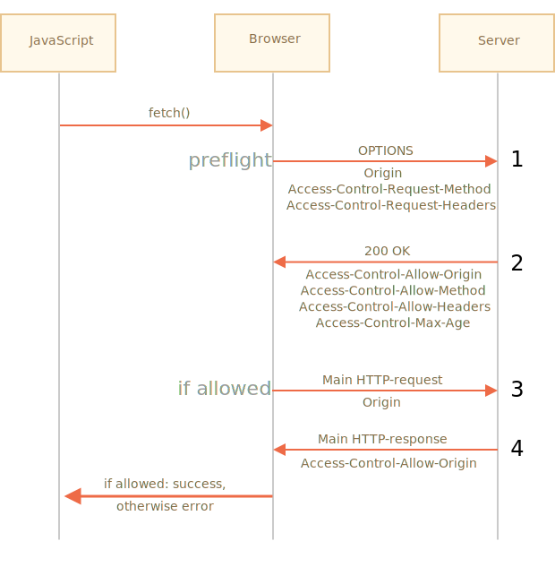

# fetch와 Cross-Origin 요청

`fetch`로 요청을 보내게 될 사이트가 현재 접속 사이트와 다르다면 요청이 실패할 수 있습니다.

직접 `http://example.com`라는 사이트에 요청을 보내봅시다.

```js run async
try {
  await fetch('http://example.com');
} catch(err) {
  alert(err); // TypeError: Failed to fetch
}
```

요청이 실패한 것을 확인할 수 있네요.

왜 요청이 실패하는지 알기 위해선 도메인·프로토콜·포트 세 가지에 의해 결정되는 *오리진(origin)* 이라는 핵심 개념을 알아야 합니다.

도메인이나 서브도메인, 프로토콜, 포트가 다른 곳에 요청을 보내는 것을 Cross-Origin Request(크로스 오리진 요청)라고 합니다. 크로스 오리진 요청을 보내려면 리모트 오리진에서 전송받은 특별한 헤더가 필요합니다.

이러한 정책을 'CORS(Cross-Origin Resource Sharing, 크로스 오리진 리소스 공유)'라고 부릅니다.

## 왜 CORS가 필요한가에 대한 짧은 역사

CORS는 악의를 가진 해커로부터 인터넷을 보호하기 위해 만들어졌습니다.

지금부턴 어떤 사건 때문에 CORS가 만들어졌는지를 짧은 역사를 통해 살펴보겠습니다.

**과거 수 년 동안, 한 사이트의 스크립트에서 다른 사이트에 있는 콘텐츠에 접근할 수 없다는 제약이 있었습니다.**

이런 간단하지만 강력한 규칙은 인터넷 보안을 위한 근간이었습니다. 보안 규칙 덕분에 해커가 만든 웹 사이트 `hacker.com`에서 `gmail.com`에 있는 메일 박스에 접근할 수 없던 것이죠. 사람들은 이런 제약 덕분에 안전하게 인터넷을 사용할 수 있었습니다.

그런데 이 당시의 자바스크립트는 네트워크 요청을 보낼 수 있을 만한 메서드를 지원하지 않았습니다. 자바스크립트는 웹 페이지를 꾸미기 위한 토이 랭귀지 수준이었죠.

하지만 많은 웹 개발자들이 강력한 기능을 원하기 시작하면서 위와 같은 제약을 피해 다른 웹 사이트에 요청을 보내기 위한 트릭들을 만들기 시작했습니다.

### 폼 사용하기

트릭 중 하나로 `<form>`이 사용되곤 했습니다. 개발자들은 `<form>`안에 `<iframe>`을 넣어 `<form>`을 전송했습니다. 이렇게 해 현재 사이트에 남아있으면서 네트워크 요청을 보냈었죠. 예시를 살펴봅시다.

```html
<!-- 폼 target -->
*!*
<iframe name="iframe"></iframe>
*/!*

<!-- 자바스크립트를 사용해 폼을 동적으로 생성하고 보냄-->
*!*
<form target="iframe" method="POST" action="http://another.com/…">
*/!*
  ...
</form>
```

이 당시엔 네트워크 관련 메서드가 없었지만, 폼은 어디든 데이터를 보낼 수 있다는 특징을 이용해 폼으로 다른 사이트에 GET, POST 요청을 보냈었습니다. 하지만 다른 사이트에서 `<iframe>`에 있는 콘텐츠를 읽는 것은 금지되었기 때문에 응답을 읽는 것은 불가능했습니다.

개발자들은 iframe과 페이지 양쪽에 특별한 스크립트를 심어 이런 제약 역시 피할 수 있는 트릭을 만들었습니다. 이렇게 iframe을 사용한 트릭은 오리진이 다른 사이트간에도 양방향 통신이 가능하도록 해주었죠. 어떤 스크립트를 사용하면 가능한지에 대해선 다뤄도 의미가 없기 때문에 상세한 내용은 넘어가도록 하겠습니다.

### 스크립트 사용하기

`script` 태그를 사용하는 것 역시 제약을 피하기 위한 트릭이었습니다. `script` 태그의 `src` 속성값엔 도메인 제약이 없기 때문입니다. 이 특징을 이용하면 어디서든 스크립트를 실행할 수 있습니다.

`script` 태그를 사용해 `<script src="http://another.com/…">` 형태로 `another.com`에 데이터를 요청하게 되면 'JSONP(JSON with padding)'라 불리는 프로토콜을 사용해 데이터를 가져오게 됩니다.

단계별로 살펴보면 다음과 같습니다.

날씨 정보가 저장되어 있는 `http://another.com`에서 데이터를 가져와야 한다고 가정하겠습니다.

1.  먼저 서버에서 받아온 데이터를 소비하는 전역 함수 `gotWeather`를 선언합니다.

    ```js
    // 1. 날씨 데이터를 처리하는데 사용되는 함수를 선언
    function gotWeather({ temperature, humidity }) {
      alert(`temperature: ${temperature}, humidity: ${humidity}`);
    }
    ```
2. 다음으로 `src="http://another.com/weather.json?callback=gotWeather"`를 속성으로 갖는 `<script>` 태그를 만듭니다. 1에서 만든 함수를 URL 매개변수 `callback`의 값으로 사용하였습니다.

    ```js
    let script = document.createElement('script');
    script.src = `http://another.com/weather.json?callback=gotWeather`;
    document.body.append(script);
    ```
3. 리모트 서버 `another.com`은 클라이언트에서 필요한 날씨 데이터와 함께 `gotWeather(...)`를 호출하는 스크립트를 동적으로 생성합니다.
    ```js
    // 서버로부터 다음과 같은 형태의 응답이 클라이언트로 전송됩니다.
    gotWeather({
      temperature: 25,
      humidity: 78
    });
    ```
4. 리모트 서버에서 받아온 스크립트가 로드 및 실행되면 `gotWeather`가 호출됩니다. `gotWeather`는 현재 페이지에서 만든 함수이고 서버에서 받은 데이터도 있기 때문에 원하는 결과를 얻을 수 있습니다.

이런 꼼수를 쓰면 보안 규칙을 어기지 않으면서도 양방향으로 데이터를 전달할 수 있습니다. 양쪽에서 동의한 상황이라면 해킹도 아니죠. 아직도 이런 방식을 사용해 통신을 하는 서비스가 있습니다. 이 방식은 오래된 브라우저도 지원합니다.

그러던 와중에 브라우저측 자바스크립트에도 네트워크 관련 메서드가 추가됩니다.

처음 네트워크 요청 메서드가 등장했을 때엔 크로스 오리진 요청이 불가능했습니다. 하지만 긴 논의 끝에 크로스 오리진 요청을 허용하기로 결정합니다. 대신 크로스 오리진 요청은 서버에서 명시적으로 크로스 오리진 요청을 '허가' 했다는 것을 알려주는 특별한 헤더를 전송받았을 때만 가능하도록 제약을 걸게 됩니다.

## 안전한 요청

크로스 오리진 요청은 크게 두 가지 종류로 구분됩니다.

1. 안전한 요청(safe request)
2. 그 외의 요청(안전한 요청이 아닌 요청)

안전한 요청은 그 외의 요청 대비 만들기 쉽습니다. 그러니 먼저 안전한 요청부터 살펴보도록 합시다.

안전한 요청은 다음과 같은 두 가지 조건 모두를 충족하는 말 그대로 안전한 요청입니다.

1. [안전한 메서드(safe method)](https://fetch.spec.whatwg.org/#cors-safelisted-method) -- GET이나 POST, HEAD를 사용한 요청
2. [안전한 헤더(safe header)](https://fetch.spec.whatwg.org/#cors-safelisted-request-header) -- 다음 목록에 속하는 헤더
    - `Accept`
    - `Accept-Language`
    - `Content-Language`
    - 값이 `application/x-www-form-urlencoded`이나 `multipart/form-data`, `text/plain`인 `Content-Type`

두 조건을 모두 충족하지 않는 요청은 '안전하지 않은(unsafe) 요청'으로 취급됩니다. `PUT` 메서드를 사용하거나 헤더에 `API-Key`가 명시된 요청의 경우같이 말이죠.

안전한 요청과 그렇지 않은 요청의 근본적인 차이는 **특별한 방법을 사용하지 않고도 `<form>`이나 `<script>`를 사용해 요청을 만들 수 있다는 점**에 있습니다.

아주 오래된 웹 서버라도 안전한 요청은 당연히 처리할 수 있어야 하는 것이죠.

표준이 아닌 헤더가 들어있거나 안전하지 않은 메서드(`DELETE` 등)를 사용한 요청은 안전한 요청이 될 수 없습니다. 아주 오래전에는 자바스크립트를 사용해 이런 요청을 보내는 것이 불가능 했습니다. 따라서 연식이 오래된 서버는 이런 요청을 받으면 '웹 페이지는 이런 요청을 보낼 수 없었기 때문에' 뭔가 특별한 곳에서 요청이 왔을거라 해석했었습니다.

그런데 시간이 지나고 개발자가 자바스크립트를 사용해 안전하지 않은 요청을 보낼 수 있게되자, 브라우저는 안전하지 않은 요청을 서버에 전송하기 전에 'preflight' 요청을 먼저 전송해 '서버가 크로스 오리진 요청을 받을 준비가 되어있는지를 확인'합니다.

이때 서버에서 크로스 오리진 요청은 허용하지 않는다는 정보를 담은 헤더를 브라우저에 응답하면 안전하지 않은 요청은 서버로 전송되지 않습니다. 

이제 개괄적인 설명이 끝났으니 CORS에 대해 좀 더 자세히 알아봅시다.

## CORS와 안전한 요청

크로스 오리진 요청을 보낼 경우 브라우저는 항상 `Origin`이라는 헤더를 요청에 추가합니다.

`https://javascript.info/page`에서 `https://anywhere.com/request`에 요청을 보낸다고 가정해 봅시다. 헤더는 다음과 같은 형태가 됩니다.

```http
GET /request
Host: anywhere.com
*!*
Origin: https://javascript.info
*/!*
...
```

보시다시피 `Origin` 헤더엔 요청이 이뤄지는 페이지 경로(/page)가 아닌 오리진(도메인·프로토콜·포트) 정보가 담기게 됩니다.

서버는 요청 헤더에 있는 `Origin`를 검사하고, 요청을 받아들이기로 동의한 상태라면 특별한 헤더 `Access-Control-Allow-Origin`를 응답에 추가합니다. 이 헤더엔 허가된 오리진(위 예시에선 `https://javascript.info`)에 대한 정보나 `*`이 명시됩니다. 이때 응답 헤더 `Access-Control-Allow-Origin`에 오리진 정보나 `*`이 들어있으면 응답은 성공하고 그렇지 않으면 응답이 실패하게 됩니다.

이 과정에서 브라우저는 중재인의 역할을 합니다.
1. 브라우저는 크로스 오리진 요청 시 `Origin`에 값이 제대로 설정, 전송되었는지 확인합니다.
2. 브라우저는 서버로부터 받은 응답에 `Access-Control-Allow-Origin`이 있는지를 확인해서 서버가 크로스 오리진 요청을 허용하는지 아닌지를 확인합니다. 응답 헤더에 `Access-Control-Allow-Origin`이 있다면 자바스크립트를 사용해 응답에 접근할 수 있고 아니라면 에러가 발생합니다.


서버에서 크로스 오리진 요청을 허용한 경우, preflight 요청에 대한 응답은 다음과 같은 형태를 띕니다.
```http
200 OK
Content-Type:text/html; charset=UTF-8
*!*
Access-Control-Allow-Origin: https://javascript.info
*/!*
```

## 응답 헤더

크로스 오리진 요청이 이뤄진 경우, 자바스크립트는 기본적으로 '안전한' 응답 헤더로 분류되는 헤더에만 접속할 수 있습니다. '안전한' 응답 헤더는 다음과 같습니다.

- `Cache-Control`
- `Content-Language`
- `Content-Type`
- `Expires`
- `Last-Modified`
- `Pragma`

이 외의 응답 헤더에 접근하면 에러가 발생합니다.

```smart
위 리스트에 `Content-Length` 헤더는 없습니다!

`Content-Length`는 응답 본문 크기 정보를 담고 있는 헤더입니다. 무언가를 다운로드하는데, 다운로드가 몇 퍼센트나 진행되었는지 확인하려면 이 헤더에 접근할 수 있어야 합니다. 그런데 이 헤더에 접근하려면 특별한 권한이 필요합니다. 자세한 내용은 아래에서 다루겠습니다.
```

자바스크립트를 사용해 안전하지 않은 응답 헤더에 접근하려면 서버에서 `Access-Control-Expose-Headers`라는 헤더를 보내줘야만 합니다. `Access-Control-Expose-Headers`엔 자바스크립트 접근을 허용하는 안전하지 않은 헤더 목록이 담겨있습니다. 각 헤더는 콤마로 구분됩니다.

예시:

```http
200 OK
Content-Type:text/html; charset=UTF-8
Content-Length: 12345
API-Key: 2c9de507f2c54aa1
Access-Control-Allow-Origin: https://javascript.info
*!*
Access-Control-Expose-Headers: Content-Length,API-Key
*/!*
```

이렇게 `Access-Control-Expose-Headers` 헤더가 응답 헤더에 있어야만 자바스크립트로 응답 헤더의 `Content-Length`와 `API-Key`를 읽을 수 있습니다.

## 안전하지 않은 요청

요즘엔 요청에 `GET`, `POST` 뿐만 아니라 `PATCH`, `DELETE` 등 어떤 메서드도 사용할 수 있습니다.

그런데 과거엔 웹페이지에서 `GET`, `POST` 이외의 HTTP 메서드를 사용해 요청을 보낼 수 있을거란 상상조차 할 수 없었습니다. 아직까지도 이런 메서드를 다룰 수 없는 웹서버도 꽤 있죠. 이런 서버들은 `GET`, `POST` 이외의 메서드를 사용한 요청이 오면 '이건 브라우저가 보낸 요청이 아니야'라고 판단하고 접근 권한을 확인합니다.

이런 혼란스러운 상황을 피하고자 브라우저는 '안전하지 않은' 요청이 이뤄지는 경우, 서버에 바로 요청을 보내지 않고 'preflight' 요청이라는 사전 요청을 서버에 보내 권한이 있는지를 확인합니다.

preflight 요청은 `OPTIONS` 메서드를 사용하고 두 헤더가 함께 들어가며, 본문은 비어있습니다.

- `Access-Control-Request-Method` 헤더 -- 안전하지 않은 요청에서 사용하는 메서드 정보가 담겨있습니다.
- `Access-Control-Request-Headers` 헤더 -- 안전하지 않은 요청에서 사용하는 헤더 목록이 담겨있습니다. 각 헤더는 쉼표로 구분됩니다.

안전하지 않은 요청을 허용하기로 협의하였다면 서버는 본문이 비어있고 상태 코드가 200인 응답을 다음과 같은 헤더와 함께 브라우저로 보냅니다.

- `Access-Control-Allow-Origin` -- `*`이나 요청을 보낸 오리진 이어야 합니다(예: https://javascript.info)
- `Access-Control-Allow-Methods` -- 허용된 메서드 정보가 담겨있습니다.
- `Access-Control-Allow-Headers` -- 허용된 헤더 목록이 담겨있습니다.
- `Access-Control-Max-Age` -- 퍼미션 체크 여부를 몇 초간 캐싱해 놓을지를 명시합니다. 이렇게 퍼미션 정보를 캐싱해 놓으면 브라우저는 일정 기간 동안 preflight 요청을 생략하고 안전하지 않은 요청을 보낼 수 있습니다.



필요한 개념은 충분히 다뤘으니 이제 실제 안전하지 않은 크로스 오리진 요청이 어떻게 이뤄지는지 예시를 통해 살펴봅시다. 예시에선 `PATCH` 메서드를 사용해 요청을 보내겠습니다. 참고로 `PATCH` 메서드는 데이터를 갱신할 때 자주 쓰입니다.

```js
let response = await fetch('https://site.com/service.json', {
  method: 'PATCH',
  headers: {
    'Content-Type': 'application/json',
    'API-Key': 'secret'
  }
});
```

참고로 위 요청이 안전하지 않은 요청으로 분류되는 데는 세 가지 이유가 있습니다.
- `PATCH` 메서드를 사용하고 있습니다.
- `Content-Type`이 `application/x-www-form-urlencoded`나 `multipart/form-data`, `text/plain`가 아닙니다.
- 비표준 헤더 `API-Key`를 사용합니다.

### 1단계(preflight 요청)

본 요청을 보내기 전에 브라우저는 자체적으로 다음과 같은 preflight 요청을 보냅니다.

```http
OPTIONS /service.json
Host: site.com
Origin: https://javascript.info
Access-Control-Request-Method: PATCH
Access-Control-Request-Headers: Content-Type,API-Key
```

- 메서드 -- `OPTIONS`
- 경로 -- 본 요청과 동일한 경로(`/service.json`)
- 크로스 오리진 특수 헤더:
    - `Origin` -- 본 요청의 오리진
    - `Access-Control-Request-Method` -- 본 요청에서 사용하는 메서드
    - `Access-Control-Request-Headers` -- 본 요청에서 사용하는 안전하지 않은 헤더 목록(콤마로 구분)

### 2단계(preflight 응답)

서버는 상태 코드 200과 함께 다음과 같은 헤더를 담은 응답을 보냅니다.
- `Access-Control-Allow-Methods: PATCH`
- `Access-Control-Allow-Headers: Content-Type,API-Key`

이렇게 응답이 와야 비로소 본 요청을 보낼 수 있습니다. 그렇지 않으면 에러가 발생합니다.

미래에 `PATCH` 이외의 메서드와 다양한 헤더를 허용할 수 있도록 세팅하려면 `Access-Control-Allow-Methods`와 `Access-Control-Allow-Headers`에 원하는 메서드와 헤더를 추가해 놓으면 됩니다.

아래와 같이 말이죠.

```http
200 OK
Access-Control-Allow-Origin: https://javascript.info
Access-Control-Allow-Methods: PUT,PATCH,DELETE
Access-Control-Allow-Headers: API-Key,Content-Type,If-Modified-Since,Cache-Control
Access-Control-Max-Age: 86400
```

이렇게 서버에서 preflight 응답이 오면 브라우저는 `Access-Control-Allow-Methods`에 `PATCH`가 있는 것을 확인하고, 이어서 `Access-Control-Allow-Headers`에 `Content-Type`과 `API-Key`가 있는 것을 확인합니다. 둘 다 있는 것을 확인했기 때문에 이제 브라우저는 본 요청을 서버에 보냅니다.

참고로 `Access-Control-Max-Age` 헤더가 응답으로 오면 preflight 허용 여부가 헤더와 함께 캐싱되기 때문에 브라우저는 헤더 값에 명시한 초동안 preflight 요청을 보내지 않습니다. 따라서 위 예시처럼 응답이 온 경우엔 하루동안 preflight 요청을 전송하지 않고 바로 본 요청이 전송됩니다.

### 3단계(실제 요청)

preflight 요청이 성공적으로 이뤄진 후에야 브라우저는 본 요청을 보냅니다. 지금부터의 프로세스는 안전한 요청이 이뤄질때의 절차와 동일합니다.

본 요청은 크로스 오리진 요청이기 때문에 `Origin` 헤더가 붙습니다.

```http
PATCH /service.json
Host: site.com
Content-Type: application/json
API-Key: secret
Origin: https://javascript.info
```

### 4단계(실제 응답)

서버에선 본 응답에 `Access-Control-Allow-Origin` 헤더를 반드시 붙여줘야 합니다. preflight 요청이 성공했더라도 말이죠.

```http
Access-Control-Allow-Origin: https://javascript.info
```

이 모든 과정이 끝나야 자바스크립트를 사용해 실제 응답을 읽을 수 있습니다.

```smart
preflight 요청은 '무대 밖에서' 일어나기 때문에 자바스크립트를 사용해 관찰할 수는 없습니다.

자바스크립트로는 본 요청의 응답을 받는 일만 할 수 있습니다. 서버에서 크로스 오리진 요청을 허용하지 않는 경우엔 에러가 발생합니다.
```

## 자격 증명

자바스크립트로 크로스 오리진 요청을 보내는 경우, 기본적으로 쿠키나 HTTP 인증 같은 자격 증명(credential)이 함께 전송되지 않습니다.

HTTP 요청의 경우 대개 쿠키가 함께 전송되는데, 자바스크립트를 사용해 만든 크로스 오리진 요청은 예외이죠.

따라서 `fetch('http://another.com')`를 사용해 요청을 보내도 `another.com` 관련 쿠키가 함께 전송되지 않습니다.

왜 그럴까요?

이런 예외가 생긴 이유는 자격 증명과 함께 전송되는 요청의 경우 영향력이 강하기 때문입니다. 크로스 오리진 요청 시 자격 증명을 함께 전송할 수 있으면 사용자 동의 없이 자바스크립트로 민감한 정보에 접근할 수 있게 됩니다.

그럼에도 불구하고 서버에서 이를 허용하고 싶다면, 자격 증명이 담긴 헤더를 명시적으로 허용하겠다는 세팅을 서버에 해줘야 합니다.

`fetch` 메서드에 자격 증명 정보를 함께 전송하려면 다음과 같이 `credentials: "include"` 옵션을 추가하면 됩니다.

```js
fetch('http://another.com', {
  credentials: "include"
});
```

이렇게 옵션을 추가하면 `fetch`로 요청을 보낼 때 `another.com`에 대응하는 쿠키가 함께 전송됩니다.

*자격 증명 정보가 담긴* 요청을 서버에서 받아들이기로 동의했다면 서버는 응답에 `Access-Control-Allow-Origin` 헤더와 함께 `Access-Control-Allow-Credentials: true` 헤더를 추가해서 보냅니다.

예시:

```http
200 OK
Access-Control-Allow-Origin: https://javascript.info
Access-Control-Allow-Credentials: true
```

자격 증명이 함께 전송되는 요청을 보낼 땐 `Access-Control-Allow-Origin`에 `*`을 쓸 수 없습니다. 위 예시에서처럼 `Access-Control-Allow-Origin`엔 정확한 오리진 정보만 명시되어야 합니다. 이런 제약이 있어야 어떤 오리진에서 요청이 왔는지에 대한 정보를 서버가 신뢰할 수 있기 때문입니다.

## 요약

브라우저 관점에선 크로스 오리진 요청은 안전한(safe) 크로스 오리진 요청과 그렇지 않은 크로스 오리진 요청 두 분류로 나뉩니다.

안전한 요청은 다음 조건을 모두 충족하는 요청입니다.
- 메서드: GET이나 POST 혹은 HEAD
- 헤더:
    - `Accept`
    - `Accept-Language`
    - `Content-Language`
    - 값이 `application/x-www-form-urlencoded`나 `multipart/form-data`, `text/plain`인 `Content-Type`

안전한 요청은 아주 오래전 부터 `<form>`이나 `<script>`태그를 사용해도 가능했던 요청인 반면 안전하지 않은 요청은 브라우저에선 보낼 수 없었던 요청이라는 점이 두 요청의 근본적인 차이입니다.

실무 관점에서 두 요청의 차이는 안전한 요청은 `Origin` 헤더와 함께 바로 요청이 전송되는 반면 안전하지 않은 요청은 브라우저에서 본 요청이 이뤄지기 전에 preflight 요청이라 불리는 사전 요청을 보내 퍼미션 여부를 물어본다는 점입니다.

**안전한 요청**은 다음과 같은 절차를 따릅니다.

- → 오리진 정보가 담긴 `Origin` 헤더와 함께 브라우저가 요청을 보냅니다.
- ← 자격 증명이 없는 요청의 경우(기본), 서버는 아래와 같은 응답을 보냅니다.
    - `Origin` 값과 동일하거나 `*`인 `Access-Control-Allow-Origin`
- ← 자격 증명이 있는 요청의 경우 서버는 아래와 같은 응답을 보냅니다.
    - `Origin` 값과 동일한 `Access-Control-Allow-Origin`
    - 값이 `true`인 `Access-Control-Allow-Credentials`

자바스크립트를 사용해 `Cache-Control`이나  `Content-Language`, `Content-Type`, `Expires`, `Last-Modified`, `Pragma`를 제외한 응답 헤더에 접근하려면 응답 헤더의 `Access-Control-Expose-Headers`에 접근을 허용하는 헤더가 명시돼 있어야 합니다. 

**안전하지 않은 요청**의 절차는 다음과 같습니다. 사전 요청인 'preflight' 요청이 본 요청 전에 전송됩니다.

- → 브라우저는 동일한 URL에 `OPTIONS` 메서드를 사용한 preflight 요청을 보내게 되는데, 이때 헤더엔 다음과 같은 정보가 들어갑니다.
    - `Access-Control-Request-Method` -- 본 요청의 메서드 정보가 담김
    - `Access-Control-Request-Headers` -- 본 요청의 헤더 정보가 담김
- ← 서버는 상태 코드 200과 아래와 같은 헤더를 담은 응답을 전송합니다.
    - `Access-Control-Allow-Methods` -- 허용되는 메서드 목록이 담김
    - `Access-Control-Allow-Headers` -- 허용되는 헤더 목록이 담김
    - `Access-Control-Max-Age` -- 몇 초간 preflight 요청 없이 크로스 오리진 요청을 바로 보낼지에 대한 정보가 담김
- 이후엔 본 요청이 전송되고, 절차는 '안전한' 요청과 동일합니다.
