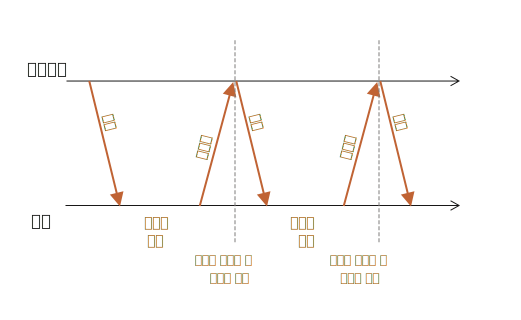

# 롱 폴링

폴링(long polling)을 사용하면 웹소켓이나 server-sent event 같은 특정한 프로토콜을 사용하지 않아도 아주 간단히 서버와 지속적인 커넥션을 유지할 수 있습니다.

Being very easy to implement, it's also good enough in a lot of cases.

## Regular Polling

The simplest way to get new information from the server is periodic polling. That is, regular requests to the server: "Hello, I'm here, do you have any information for me?". For example, once every 10 seconds.

In response, the server first takes a notice to itself that the client is online, and second - sends a packet of messages it got till that moment.

That works, but there are downsides:
1. Messages are passed with a delay up to 10 seconds (between requests).
2. Even if there are no messages, the server is bombed with requests every 10 seconds, even if the user switched somewhere else or is asleep. That's quite a load to handle, speaking performance-wise.

서비스 규모가 작은 경우 폴링은 꽤 괜찮은 방식입니다. 하지만 일반적인 경우엔 개선이 필요합니다.

## Long polling

롱 폴링(long polling)은 일반 폴링보단 더 나은 방식입니다.

It's also very easy to implement, and delivers messages without delays.

The flow:

1. A request is sent to the server.
2. The server doesn't close the connection until it has a message to send.
3. When a message appears - the server responds to the request with it.
4. The browser makes a new request immediately.

The situation when the browser sent a request and has a pending connection with the server, is standard for this method. Only when a message is delivered, the connection is reestablished.



If the connection is lost, because of, say, a network error, the browser immediately sends a new request.

다음과 같은 클라이언트 측 구독(`subscribe`) 함수는 롱 요청을 가능하게 해줍니다.

```js
async function subscribe() {
  let response = await fetch("/subscribe");

  if (response.status == 502) {
    // Status 502 is a connection timeout error,
    // may happen when the connection was pending for too long,
    // and the remote server or a proxy closed it
    // let's reconnect
    await subscribe();
  } else if (response.status != 200) {
    // An error - let's show it
    showMessage(response.statusText);
    // Reconnect in one second
    await new Promise(resolve => setTimeout(resolve, 1000));
    await subscribe();
  } else {
    // Get and show the message
    let message = await response.text();
    showMessage(message);
    // Call subscribe() again to get the next message
    await subscribe();
  }
}

subscribe();
```

As you can see, `subscribe` function makes a fetch, then waits for the response, handles it and calls itself again.

```warn header="Server should be ok with many pending connections"
The server architecture must be able to work with many pending connections.

Certain server architectures run one process per connection, resulting in there being as many processes as there are connections, while each process consumes quite a bit of memory. So, too many connections will just consume it all.

That's often the case for backends written in languages like PHP and Ruby.

Servers written using Node.js usually don't have such problems.

That said, it isn't a programming language issue. Most modern languages, including PHP and Ruby allow to implement a proper backend. Just please make sure that your server architecture works fine with many simultaneous connections.
```

## Demo: a chat

Here's a demo chat, you can also download it and run locally (if you're familiar with Node.js and can install modules):

[codetabs src="longpoll" height=500]

Browser code is in `browser.js`.

## Area of usage

Long polling works great in situations when messages are rare.

If messages come very often, then the chart of requesting-receiving messages, painted above, becomes saw-like.

Every message is a separate request, supplied with headers, authentication overhead, and so on.

So, in this case, another method is preferred, such as [Websocket](info:websocket) or [Server Sent Events](info:server-sent-events).
