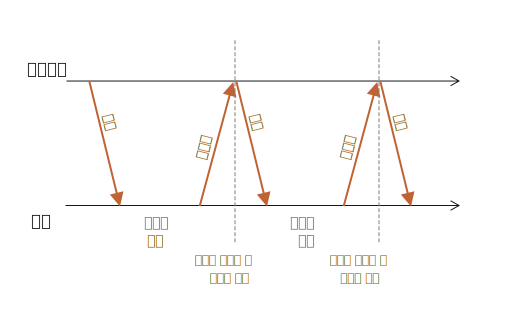

# 롱 폴링

롱 폴링(long polling)은 웹소켓이나 서버 전송 이벤트(Server-Sent Events) 같은 특정 프로토콜을 사용하지 않고 서버와 지속적인 연결을 유지할 수 있는 가장 간단한 방법입니다.

폴링은 구현이 매우 쉽고 다양한 경우에 사용할 수 있습니다.

## 폴링

주기적인 폴링(regular polling)을 통해 간단하게 서버에서 새로운 정보를 얻을 수 있습니다. 10초에 한 번씩 서버에 "안녕하세요. 저 클라이언트인데 저에게 줄 새로운 정보가 있나요?"라고 요청을 보내는 방식입니다.

서버는 응답을 보내며 우선 클라이언트가 온라인 상태라는 것을 확인하고, 그다음 해당 시점까지 받은 메시지 묶음을 전송합니다.

이 방식은 잘 작동하지만 단점이 있습니다.
1. 메시지는 요청 간격만큼, 예시에선 최대 10초까지 지연되어 전달됩니다.
2. 메시지가 없어도 서버는 10초마다 계속 요청을 받습니다. 사용자가 다른 곳으로 이동했거나 아무 동작도 하지 않는 경우에도 마찬가지입니다. 성능 측면에서 꽤 큰 부하가 됩니다.

서비스 규모가 작은 경우 폴링은 꽤 괜찮은 방식입니다. 하지만 일반적인 경우엔 개선이 필요합니다.

## 롱 폴링

롱 폴링(long polling)은 일반 폴링보단 더 나은 방식입니다.

롱 폴링은 폴링과 마찬가지로 구현이 쉬운데, 지연 없이 메시지를 전달한다는 차이가 있습니다.

흐름은 다음과 같습니다.

1. 서버에 요청을 보냅니다.
2. 서버는 보낼 메시지가 생길 때까지 연결을 종료하지 않습니다.
3. 메시지가 생기면 서버는 해당 메시지를 담아 요청에 응답합니다.
4. 브라우저는 즉시 새 요청을 보냅니다.

브라우저가 요청을 보내고 서버와의 연결을 계속 유지하는 방식이 이 방식의 기본 동작입니다. 메시지가 전달되었으면 연결을 종료하고 다시 연결합니다.



네트워크 에러 등으로 연결이 끊어지면 브라우저는 즉시 새 요청을 보냅니다.

다음과 같은 클라이언트 측 구독(`subscribe`) 함수는 롱 요청을 가능하게 해줍니다.

```js
async function subscribe() {
  let response = await fetch("/subscribe");

  if (response.status == 502) {
    // 상태 코드 502는 연결 시간 초과 에러입니다.
    // 연결이 너무 오래 대기 상태로 있으면
    // 원격 서버나 프락시가 연결을 닫을 수 있습니다.
    // 다시 연결합니다.
    await subscribe();
  } else if (response.status != 200) {
    // 에러가 발생하면 보여줍니다.
    showMessage(response.statusText);
    // 1초 후 다시 연결합니다.
    await new Promise(resolve => setTimeout(resolve, 1000));
    await subscribe();
  } else {
    // 메시지를 받아 보여줍니다.
    let message = await response.text();
    showMessage(message);
    // 다음 메시지를 받기 위해 subscribe()를 다시 호출합니다.
    await subscribe();
  }
}

subscribe();
```

롱 폴링을 구현한 함수 `subscribe`는 보시다시피 fetch를 사용해 요청을 보내고 응답이 올 때까지 기다린다음 응답을 처리하고 스스로 다시 요청을 보냅니다.

```warn header="서버는 대기 중인 연결을 많이 처리할 수 있어야 합니다"
서버 아키텍처는 대기 중인 연결을 많이 처리할 수 있어야 합니다.

일부 서버 아키텍처는 연결마다 프로세스 하나를 실행합니다. 이 경우 연결 수만큼 프로세스가 생기고, 각 프로세스는 상당한 메모리를 사용합니다. 따라서 연결이 너무 많으면 메모리를 전부 소모하게 됩니다.

PHP나 Ruby 같은 언어로 작성한 백엔드에서 이런 경우가 종종 있습니다.

Node.js로 작성한 서버에는 보통 이런 문제가 없습니다.

다만 프로그래밍 언어 자체의 문제는 아닙니다. PHP와 Ruby를 포함한 대부분의 모던 언어로도 적절한 백엔드를 구현할 수 있습니다. 서버 아키텍처가 동시에 많은 연결을 잘 처리할 수 있는지만 확인하면 됩니다.
```

## 데모: 채팅

다음은 채팅 데모입니다. Node.js에 익숙하고 모듈을 설치할 수 있다면 다운로드한 뒤 로컬 환경에서 실행할 수도 있습니다.

[codetabs src="longpoll" height=500]

브라우저 코드는 `browser.js`에 있습니다.

## 사용 영역

롱 폴링은 메시지가 드물게 발생하는 상황에 잘 맞습니다.

메시지가 매우 빈번하게 온다면 위에서 본 요청-응답 흐름이 톱니 모양처럼 반복됩니다.

각 메시지가 별도 요청이 되며, 요청마다 헤더와 인증에 따른 오버헤드 등이 붙습니다.

따라서 이런 경우엔 [웹소켓](info:websocket)이나 [서버 전송 이벤트](info:server-sent-events) 같은 다른 방법을 사용하는 편이 좋습니다.
