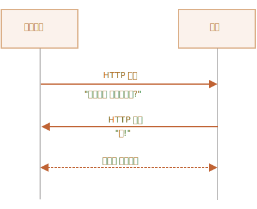

# 웹소켓

[RFC 6455](http://tools.ietf.org/html/rfc6455) 명세서에 정의된 프로토콜인 `웹소켓(WebSocket)`을 사용하면 서버와 브라우저 간 연결을 유지한 상태로 데이터를 교환할 수 있습니다. 이때 데이터는 '패킷(packet)' 형태로 전달되며, 전송은 커넥션 중단과 추가 HTTP 요청 없이 양방향으로 이뤄집니다.

이런 특징 때문에 웹소켓은 온라인 게임이나 주식 트레이딩 시스템같이 데이터 교환이 지속적으로 이뤄져야 하는 서비스에 아주 적합합니다.

## A simple example

웹소켓 연결을 만들려면 `new WebSocket`을 호출하면 되는데, 이때 `ws`라는 특수 프로토콜을 사용합니다.

```js
let socket = new WebSocket("*!*ws*/!*://javascript.info");
```

`ws`말고 `wss://`라는 프로토콜도 있는데, 두 프로토콜의 관계는 HTTP와 HTTPS의 관계와 유사하다고 보시면 됩니다.

```smart header="항상 `wss://`를 사용합시다."
`wss://`는 보안 이외에도 신뢰성(reliability) 측면에서 `ws`보다 좀 더 신뢰할만한 프로토콜입니다.

`ws://`를 사용해 데이터를 전송하면 데이터가 암호화되어있지 않은 채로 전송되기 때문에 데이터가 그대로 노출됩니다. 그런데 아주 오래된 프락시 서버는 웹소켓이 무엇인지 몰라서 '이상한' 헤더가 붙은 요청이 들어왔다고 판단하고 연결을 끊어버립니다.

반면 `wss://`는 TSL(전송 계층 보안(Transport Layer Security))이라는 보안 계층을 통과해 전달되므로 송신자 측에서 데이터가 암호화되고, 복호화는 수신자 측에서 이뤄지게 됩니다. 따라서 데이터가 담긴 패킷은 암호화된 상태로 프락시 서버를 통과하므로 프락시 서버는 패킷 내부를 볼 수 없게 됩니다. 
```

소켓이 정상적으로 만들어지면 아래 네 개의 이벤트를 사용할 수 있게 됩니다.
- **`open`** -- 커넥션이 제대로 만들어짐
- **`message`** -- data received,
- **`error`** -- 웹소켓 에러
- **`close`** -- 커넥션 종료

커넥션이 만들어진 상태에서 무언가를 보내고 싶으면 `socket.send(data)`를 사용하면 됩니다.

예시를 살펴봅시다.

```js run
let socket = new WebSocket("wss://javascript.info/article/websocket/demo/hello");

socket.onopen = function(e) {
  alert("[open] 커넥션이 만들어졌습니다.");
  alert("데이터를 서버에 전송해봅시다.");
  socket.send("My name is John");
};

socket.onmessage = function(event) {
  alert(`[message] 서버로부터 전송받은 데이터: ${event.data}`);
};

socket.onclose = function(event) {
  if (event.wasClean) {  
    alert(`[close] 커넥션이 정상적으로 종료되었습니다(code=${event.code} reason=${event.reason})`);
  } else {
    // 예시: 프로세스가 죽거나 네트워크에 장애가 있는 경우
    // event.code가 1006이 됩니다.
    alert('[close] 커넥션이 죽었습니다.');
  }
};

socket.onerror = function(error) {
  alert(`[error] ${error.message}`);
};
```

위 예시는 데모 목적을 위해 만들어놓은 작은 Node.js 서버([server.js](demo/server.js))에서 돌아갑니다. 이 서버는 'Hello from server, John'이라는 메시지가 담긴 응답을 보내고, 5초 후 커넥션을 종료시킵니다.

서버에 작성한 코드가 동작하면서 `open` -> `message` -> `close` 순의 이벤트를 볼 수 있었던 것이죠.

이제 여러분은 웹소켓 통신이 어떻게 이뤄지는지를 알게 되셨습니다. 생각보다 꽤 간단하죠?

그렇긴 하지만 실무 수준에서 웹소켓을 활용할 수 있도록 웹소켓에 대해 좀 더 자세하게 알아봅시다.

## 웹소켓 열기

When `new WebSocket(url)` is created, it starts connecting immediately.

During the connection the browser (using headers) asks the server: "Do you support Websocket?" And if the server replies "yes", then the talk continues in WebSocket protocol, which is not HTTP at all.



Here's an example of browser headers for request made by `new WebSocket("wss://javascript.info/chat")`.

```
GET /chat
Host: javascript.info
Origin: https://javascript.info
Connection: Upgrade
Upgrade: websocket
Sec-WebSocket-Key: Iv8io/9s+lYFgZWcXczP8Q==
Sec-WebSocket-Version: 13
```

- `Origin` -- the origin of the client page, e.g. `https://javascript.info`. WebSocket objects are cross-origin by nature. There are no special headers or other limitations. Old servers are unable to handle WebSocket anyway, so there are no compabitility issues. But `Origin` header is important, as it allows the server to decide whether or not to talk WebSocket with this website.
- `Connection: Upgrade` -- signals that the client would like to change the protocol.
- `Upgrade: websocket` -- the requested protocol is "websocket".
- `Sec-WebSocket-Key` -- a random browser-generated key for security.
- `Sec-WebSocket-Version` -- WebSocket protocol version, 13 is the current one.

```smart header="WebSocket handshake can't be emulated"
We can't use `XMLHttpRequest` or `fetch` to make this kind of HTTP-request, because JavaScript is not allowed to set these headers.
```

If the server agrees to switch to WebSocket, it should send code 101 response:

```
101 Switching Protocols
Upgrade: websocket
Connection: Upgrade
Sec-WebSocket-Accept: hsBlbuDTkk24srzEOTBUlZAlC2g=
```

Here `Sec-WebSocket-Accept` is `Sec-WebSocket-Key`, recoded using a special algorithm. The browser uses it to make sure that the response corresponds to the request.

Afterwards, the data is transfered using WebSocket protocol, we'll see its structure ("frames") soon. And that's not HTTP at all.

### Extensions and subprotocols

There may be additional headers `Sec-WebSocket-Extensions` and `Sec-WebSocket-Protocol` that describe extensions and subprotocols.

For instance:

- `Sec-WebSocket-Extensions: deflate-frame` means that the browser supports data compression. An extension is something related to transferring the data, functionality that extends WebSocket protocol. The header `Sec-WebSocket-Extensions` is sent automatically by the browser, with the list of all extenions it supports.

- `Sec-WebSocket-Protocol: soap, wamp` means that we'd like to transfer not just any data, but the data in [SOAP](http://en.wikipedia.org/wiki/SOAP) or WAMP ("The WebSocket Application Messaging Protocol") protocols. WebSocket subprotocols are registered in the [IANA catalogue](http://www.iana.org/assignments/websocket/websocket.xml). So, this header describes data formats that we're going to use.

    This optional header is set using the second parameter of `new WebSocket`. That's the array of subprotocols, e.g. if we'd like to use SOAP or WAMP:

    ```js
    let socket = new WebSocket("wss://javascript.info/chat", ["soap", "wamp"]);
    ```

The server should respond with a list of protocols and extensions that it agrees to use.

For example, the request:

```
GET /chat
Host: javascript.info
Upgrade: websocket
Connection: Upgrade
Origin: https://javascript.info
Sec-WebSocket-Key: Iv8io/9s+lYFgZWcXczP8Q==
Sec-WebSocket-Version: 13
*!*
Sec-WebSocket-Extensions: deflate-frame
Sec-WebSocket-Protocol: soap, wamp
*/!*
```

Response:

```
101 Switching Protocols
Upgrade: websocket
Connection: Upgrade
Sec-WebSocket-Accept: hsBlbuDTkk24srzEOTBUlZAlC2g=
*!*
Sec-WebSocket-Extensions: deflate-frame
Sec-WebSocket-Protocol: soap
*/!*
```

Here the server responds that it supports the extension "deflate-frame", and only SOAP of the requested subprotocols.

## Data transfer

WebSocket communication consists of "frames" -- data fragments, that can be sent from either side, and can be of several kinds:

- "text frames" -- contain text data that parties send to each other.
- "binary data frames" -- contain binary data that parties send to each other.
- "ping/pong frames" are used to check the connection, sent from the server, the browser responds to these automatically.
- there's also "connection close frame" and a few other service frames.

In the browser, we directly work only with text or binary frames.

**WebSocket `.send()` method can send either text or binary data.**

A call `socket.send(body)` allows `body` in string or a binary format, including `Blob`, `ArrayBuffer`, etc. No settings required: just send it out in any format.

**When we receive the data, text always comes as string. And for binary data, we can choose between `Blob` and `ArrayBuffer` formats.**

That's set by `socket.binaryType` property, it's `"blob"` by default, so binary data comes as `Blob` objects.

[Blob](info:blob) is a high-level binary object, it directly integrates with `<a>`, `` and other tags, so that's a sane default. But for binary processing, to access individual data bytes, we can change it to `"arraybuffer"`:

```js
socket.binaryType = "arraybuffer";
socket.onmessage = (event) => {
  // event.data is either a string (if text) or arraybuffer (if binary)
};
```

## Rate limiting

Imagine, our app is generating a lot of data to send. But the user has a slow network connection, maybe on a mobile internet, outside of a city.

We can call `socket.send(data)` again and again. But the data will be buffered (stored) in memory and sent out only as fast as network speed allows.

The `socket.bufferedAmount` property stores how many bytes are buffered at this moment, waiting to be sent over the network.

We can examine it to see whether the socket is actually available for transmission.

```js
// every 100ms examine the socket and send more data  
// only if all the existing data was sent out
setInterval(() => {
  if (socket.bufferedAmount == 0) {
    socket.send(moreData());
  }
}, 100);
```


## Connection close

Normally, when a party wants to close the connection (both browser and server have equal rights), they send a "connection close frame" with a numeric code and a textual reason.

The method for that is:
```js
socket.close([code], [reason]);
```

- `code` is a special WebSocket closing code (optional)
- `reason` is a string that describes the reason of closing (optional)

Then the other party in `close` event handler gets the code and the reason, e.g.:

```js
// closing party:
socket.close(1000, "Work complete");

// the other party
socket.onclose = event => {
  // event.code === 1000
  // event.reason === "Work complete"
  // event.wasClean === true (clean close)
};
```

Most common code values:

- `1000` -- the default, normal closure (used if no `code` supplied),
- `1006` -- no way to such code manually, indicates that the connection was lost (no close frame).

There are other codes like:

- `1001` -- the party is going away, e.g. server is shutting down, or a browser leaves the page,
- `1009` -- the message is too big to process,
- `1011` -- unexpected error on server,
- ...and so on.

The full list can be found in [RFC6455, §7.4.1](https://tools.ietf.org/html/rfc6455#section-7.4.1).

WebSocket codes are somewhat like HTTP codes, but different. In particular, any codes less than `1000` are reserved, there'll be an error if we try to set such a code.

```js
// in case connection is broken
socket.onclose = event => {
  // event.code === 1006
  // event.reason === ""
  // event.wasClean === false (no closing frame)
};
```


## Connection state

To get connection state, additionally there's `socket.readyState` property with values:

- **`0`** -- "CONNECTING": the connection has not yet been established,
- **`1`** -- "OPEN": communicating,
- **`2`** -- "CLOSING": the connection is closing,
- **`3`** -- "CLOSED": the connection is closed.


## Chat example

Let's review a chat example using browser WebSocket API and Node.js WebSocket module <https://github.com/websockets/ws>. We'll pay the main attention to the client side, but the server is also simple.

HTML: we need a `<form>` to send messages and a `<div>` for incoming messages:

```html
<!-- message form -->
<form name="publish">
  <input type="text" name="message">
  <input type="submit" value="Send">
</form>

<!-- div with messages -->
<div id="messages"></div>
```

From JavaScript we want three things:
1. Open the connection.
2. On form submission -- `socket.send(message)` for the message.
3. On incoming message -- append it to `div#messages`.

Here's the code:

```js
let socket = new WebSocket("wss://javascript.info/article/websocket/chat/ws");

// send message from the form
document.forms.publish.onsubmit = function() {
  let outgoingMessage = this.message.value;

  socket.send(outgoingMessage);
  return false;
};

// message received - show the message in div#messages
socket.onmessage = function(event) {
  let message = event.data;

  let messageElem = document.createElement('div');
  messageElem.textContent = message;
  document.getElementById('messages').prepend(messageElem);
}
```

Server-side code is a little bit beyond our scope. Here we'll use Node.js, but you don't have to. Other platforms also have their means to work with WebSocket.

The server-side algorithm will be:

1. Create `clients = new Set()` -- a set of sockets.
2. For each accepted websocket, add it to the set `clients.add(socket)` and setup `message` event listener to get its messages.
3. When a message received: iterate over clients and send it to everyone.
4. When a connection is closed: `clients.delete(socket)`.

```js
const ws = new require('ws');
const wss = new ws.Server({noServer: true});

const clients = new Set();

http.createServer((req, res) => {
  // here we only handle websocket connections
  // in real project we'd have some other code here to handle non-websocket requests
  wss.handleUpgrade(req, req.socket, Buffer.alloc(0), onSocketConnect);
});

function onSocketConnect(ws) {
  clients.add(ws);

  ws.on('message', function(message) {
    message = message.slice(0, 50); // max message length will be 50

    for(let client of clients) {
      client.send(message);
    }
  });

  ws.on('close', function() {
    clients.delete(ws);
  });
}
```


Here's the working example:

[iframe src="chat" height="100" zip]

You can also download it (upper-right button in the iframe) and run locally. Just don't forget to install [Node.js](https://nodejs.org/en/) and `npm install ws` before running.

## Summary

WebSocket is a modern way to have persistent browser-server connections.

- WebSockets don't have cross-origin limitations.
- They are well-supported in browsers.
- Can send/receive strings and binary data.

The API is simple.

Methods:
- `socket.send(data)`,
- `socket.close([code], [reason])`.

Events:
- `open`,
- `message`,
- `error`,
- `close`.

WebSocket by itself does not include reconnection, authentication and many other high-level mechanisms. So there are client/server libraries for that, and it's also possible to implement these capabilities manually.

Sometimes, to integrate WebSocket into existing project, people run WebSocket server in parallel with the main HTTP-server, and they share a single database. Requests to WebSocket use `wss://ws.site.com`, a subdomain that leads to WebSocket server, while `https://site.com` goes to the main HTTP-server.

Surely, other ways of integration are also possible.
