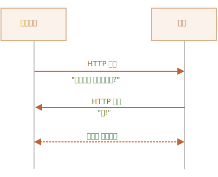

# 웹소켓

[RFC 6455](https://datatracker.ietf.org/doc/html/rfc6455) 명세서에 정의된 프로토콜인 `웹소켓(WebSocket)`을 사용하면 서버와 브라우저 간 연결을 유지한 상태로 데이터를 교환할 수 있습니다. 이때 데이터는 '패킷(packet)' 형태로 전달되며, 전송은 커넥션 중단과 추가 HTTP 요청 없이 양방향으로 이뤄집니다.

이런 특징 때문에 웹소켓은 온라인 게임이나 주식 트레이딩 시스템같이 데이터 교환이 지속적으로 이뤄져야 하는 서비스에 아주 적합합니다.

## 간단한 예시

웹소켓 커넥션을 만들려면 `new WebSocket`을 호출하면 되는데, 이때 `ws`라는 특수 프로토콜을 사용합니다.

```js
let socket = new WebSocket("*!*ws*/!*://javascript.info");
```

`ws`말고 `wss://`라는 프로토콜도 있는데, 두 프로토콜의 관계는 HTTP와 HTTPS의 관계와 유사합니다.

```smart header="항상 `wss://`를 사용합시다."
`wss://`는 보안 이외에도 신뢰성(reliability) 측면에서 `ws`보다 좀 더 신뢰할만한 프로토콜입니다.

`ws://`를 사용해 데이터를 전송하면 데이터가 암호화되어있지 않은 채로 전송되기 때문에 데이터가 그대로 노출됩니다. 그런데 아주 오래된 프락시 서버는 웹소켓이 무엇인지 몰라서 '이상한' 헤더가 붙은 요청이 들어왔다고 판단하고 연결을 끊어버립니다.

반면 `wss://`는 TLS 위에서 동작하는 웹소켓입니다(HTTPS가 TLS 위에서 동작하는 HTTP인 것과 같습니다). 전송 보안 계층은 송신 측에서 데이터를 암호화하고 수신 측에서 복호화합니다. 따라서 데이터 패킷은 암호화된 채 프락시를 통과합니다. 프락시는 내부를 볼 수 없으므로 패킷을 통과시킵니다.
```

소켓이 정상적으로 만들어지면 아래 네 개의 이벤트를 사용할 수 있게 됩니다.
- **`open`** -- 커넥션이 제대로 만들어졌을 때 발생함
- **`message`** -- 데이터를 수신하였을 때 발생함
- **`error`** -- 에러가 생겼을 때 발생함
- **`close`** -- 커넥션이 종료되었을 때 발생함

커넥션이 만들어진 상태에서 무언가를 보내고 싶으면 `socket.send(data)`를 사용하면 됩니다.

예시를 살펴봅시다.

```js run
let socket = new WebSocket("wss://javascript.info/article/websocket/demo/hello");

socket.onopen = function(e) {
  alert("[open] 커넥션이 만들어졌습니다.");
  alert("데이터를 서버에 전송해봅시다.");
  socket.send("제 이름은 Bora입니다");
};

socket.onmessage = function(event) {
  alert(`[message] 서버로부터 전송받은 데이터: ${event.data}`);
};

socket.onclose = function(event) {
  if (event.wasClean) {  
    alert(`[close] 커넥션이 정상적으로 종료되었습니다(code=${event.code} reason=${event.reason})`);
  } else {
    // 예시: 프로세스가 죽거나 네트워크에 장애가 있는 경우
    // event.code가 1006이 됩니다.
    alert('[close] 커넥션이 죽었습니다.');
  }
};

socket.onerror = function(error) {
  alert(`[error]`);
};
```

위 예시는 데모 목적을 위해 만들어놓은 간이 Node.js 서버([server.js](demo/server.js))에서 돌아갑니다. 서버는 'Hello from server, Bora'라는 메시지가 담긴 응답을 클라이언트에 보내고, 5초 후 커넥션을 종료시킵니다.

서버 쪽 코드가 동작하면서 `open` -> `message` -> `close` 순의 이벤트를 볼 수 있었던 것이죠.

이제 여러분은 웹소켓 통신이 어떻게 이뤄지는지를 알게 되셨습니다. 생각보다 꽤 간단하죠?

지금부턴 실무 수준에서 웹소켓을 활용할 수 있도록 웹소켓에 대해 좀 더 자세히 알아봅시다.

## 웹소켓 핸드셰이크

`new WebSocket(url)`을 호출해 소켓을 생성하면 즉시 연결이 시작됩니다.

연결 과정에서 브라우저는 (헤더를 사용해) 서버에 "웹소켓을 지원하나요?"라고 묻습니다. 이에 서버가 "네"라고 응답하면 이후 서버-브라우저간 통신은 HTTP가 아닌 웹소켓 프로토콜을 사용해 진행됩니다.



다음은 `new WebSocket("wss://javascript.info/chat")`으로 요청을 보낼 때 브라우저가 전송하는 헤더 예시입니다.

```
GET /chat
Host: javascript.info
Origin: https://javascript.info
Connection: Upgrade
Upgrade: websocket
Sec-WebSocket-Key: Iv8io/9s+lYFgZWcXczP8Q==
Sec-WebSocket-Version: 13
```

- `Origin` -- 클라이언트 오리진(예시에선 `https://javascript.info`)을 나타냅니다. 웹소켓 객체는 기본적으로 크로스 오리진을 지원합니다. 웹소켓 통신만을 위한 전용 헤더나 별도 제약도 없습니다. 오래된 서버는 어차피 웹소켓을 처리할 수 없으므로 호환성 문제도 없습니다. 하지만 서버가 해당 웹사이트와 웹소켓 통신을 할지 결정할 수 있게 해주므로 `Origin` 헤더는 중요합니다.
- `Connection: Upgrade` -- 클라이언트  측에서 프로토콜을 바꾸고 싶다는 신호를 보냈다는 것을 나타냅니다.
- `Upgrade: websocket` -- 클라이언트측에서 요청한 프로토콜은 'websocket'이라는걸 의미합니다.
- `Sec-WebSocket-Key` -- 브라우저가 무작위로 생성한 키로, 서버가 웹소켓 프로토콜을 지원하는지 확인하는 데 사용됩니다. 이후 통신이 프락시에 캐시되지 않도록 무작위 값이 사용됩니다.
- `Sec-WebSocket-Version` -- 웹소켓 프로토콜 버전입니다. 현재는 13버전을 사용합니다.

```smart header="웹소켓 핸드셰이크는 모방이 불가능합니다."
바닐라 자바스크립트로 헤더를 설정하는 건 기본적으로 막혀있기 때문에 `XMLHttpRequest`나 `fetch`로 위 예시와 유사한 헤더를 가진 HTTP 요청을 만들 수 없습니다.
```

서버는 클라이언트 측에서 보낸 웹소켓 통신 요청을 최초로 받고 이에 동의하면, 상태 코드 101이 담긴 응답을 클라이언트에 전송합니다. 

```
101 Switching Protocols
Upgrade: websocket
Connection: Upgrade
Sec-WebSocket-Accept: hsBlbuDTkk24srzEOTBUlZAlC2g=
```

여기서 `Sec-WebSocket-Accept` 값은 `Sec-WebSocket-Key`를 특별한 알고리즘으로 변환한 값입니다. 브라우저는 이 값을 보고 서버가 실제로 웹소켓 프로토콜을 지원한다는 것을 확인합니다.

이렇게 핸드셰이크가 끝나면 데이터는 웹소켓 프로토콜로 전송됩니다. 데이터 구조인 프레임(frame)은 곧 살펴보겠습니다. 여기서부터는 HTTP가 아닙니다.

### 확장과 서브 프로토콜 헤더

웹소켓 통신은 `Sec-WebSocket-Extensions`와 `Sec-WebSocket-Protocol` 헤더를 지원합니다. 두 헤더는 각각 웹소켓 프로토콜 기능을 확장(extension)할 때와 서브 프로토콜(subprotocol)을 사용해 데이터를 전송할 때 사용합니다.

각 헤더에 대한 예시를 살펴봅시다.

- `Sec-WebSocket-Extensions: deflate-frame` -- 이 헤더는 브라우저에서 데이터 압축(deflate)을 지원한다는 것을 의미합니다. 확장(extension)은 데이터 전송과 관련된 기능으로, 웹소켓 프로토콜을 확장합니다. `Sec-WebSocket-Extensions` 헤더는 브라우저에서 자동으로 전송하며, 브라우저가 지원하는 모든 확장 목록이 담깁니다.

- `Sec-WebSocket-Protocol: soap, wamp` -- 평범한 데이터가 아니라 [SOAP](https://en.wikipedia.org/wiki/SOAP)나 WAMP ("The WebSocket Application Messaging Protocol") 프로토콜에 맞는 데이터를 전송하려 한다는 의미입니다. 웹소켓 서브 프로토콜은 [IANA 카탈로그](https://www.iana.org/assignments/websocket/websocket.xml)에 등록되어 있습니다. 개발자는 이 헤더를 보고 앞으로 사용할 데이터 형식을 확인할 수 있습니다.

    두 헤더는 `new WebSocket`의 두 번째 매개변수에 값을 넣어서 설정할 수 있습니다. 서브 프로토콜로 SOAP나 WAMP를 사용하고 싶다고 가정해 봅시다. 두 번째 매개변수에 다음과 같이 배열을 넣으면 됩니다.

    ```js
    let socket = new WebSocket("wss://javascript.info/chat", ["soap", "wamp"]);
    ```

이때 서버는 지원 가능한 익스텐션과 프로토콜을 응답 헤더에 담아 클라이언트에 전달해야 합니다.

예시를 살펴봅시다. 요청 헤더는 다음과 같습니다.

```
GET /chat
Host: javascript.info
Upgrade: websocket
Connection: Upgrade
Origin: https://javascript.info
Sec-WebSocket-Key: Iv8io/9s+lYFgZWcXczP8Q==
Sec-WebSocket-Version: 13
*!*
Sec-WebSocket-Extensions: deflate-frame
Sec-WebSocket-Protocol: soap, wamp
*/!*
```

이때 서버가 다음과 같은 응답을 했다고 해봅시다.

```
101 Switching Protocols
Upgrade: websocket
Connection: Upgrade
Sec-WebSocket-Accept: hsBlbuDTkk24srzEOTBUlZAlC2g=
*!*
Sec-WebSocket-Extensions: deflate-frame
Sec-WebSocket-Protocol: soap
*/!*
```

이 경우, 우리는 서버에선 'deflate-frame'이라는 익스텐션과 요청 프로토콜 중 SOAP라는 서브 프로토콜만 지원한다는 사실을 알 수 있습니다.

## 데이터 전송

웹소켓 통신은 '프레임(frame)'이라 불리는 데이터 조각을 사용해 이뤄집니다. 프레임은 서버와 클라이언트 양측 모두에서 보낼 수 있는데, 프레임 내 담긴 데이터 종류에 따라 다음과 같이 분류할 수 있습니다.

- 텍스트 프레임(text frame) -- 텍스트 데이터가 담긴 프레임
- 이진 데이터 프레임(binary data frame) -- 이진 데이터가 담긴 프레임
- 핑·퐁 프레임(ping/pong frame) -- 커넥션이 유지되고 있는지 확인할 때 사용하는 프레임으로 서버나 브라우저에서 자동 생성해서 보내는 프레임
- 이 외에도 커넥션 종료 프레임(connection close frame) 등 다양한 프레임이 있음

브라우저 환경에서 개발자는 텍스트나 이진 데이터 프레임만 다루게 됩니다.

이유는 **웹소켓 `.send()` 메서드는 텍스트나 이진 데이터만 보낼 수 있기 때문입니다.**

`socket.send(body)`를 호출하면 `body`에는 문자열이나 `Blob`, `ArrayBuffer` 등의 이진 형식 데이터를 넣을 수 있습니다. 별도 설정 없이 원하는 형식으로 보내기만 하면 됩니다.

한편, **데이터를 받을 때 텍스트 데이터는 항상 문자열 형태로 옵니다. 이진 데이터를 받을 때엔 `Blob`이나 `ArrayBuffer` 포맷 둘 중 하나를 고를 수 있습니다.**

`socket.binaryType` 프로퍼티를 사용하면 `Blob`이나 `ArrayBuffer` 포맷 둘 중 하나를 고를 수 있는데, 프로퍼티 기본값은 `"blob"`이라서 이진 데이터는 기본적으로 `Blob` 객체 형태로 전송받게 됩니다.

[Blob](info:blob)은 고차원(high-level)의 이진 객체인데, `<a>`나 `` 등의 태그와 바로 통합할 수 있어서 기본값으로 아주 적절합니다. 하지만 이진 데이터를 처리하는 과정에 개별 데이터 바이트에 접근해야 한다면 프로퍼티 값을 `"arraybuffer"`로 바꿀 수도 있습니다.

```js
socket.binaryType = "arraybuffer";
socket.onmessage = (event) => {
  // event.data는 (텍스트인 경우) 문자열이거나 (이진 데이터인 경우) arraybuffer입니다.
};
```

## 전송 제한

데이터 전송량이 상당한 앱을 개발하고 있다고 가정해봅시다. 그런데 우리 앱의 사용자는 모바일이나 시골같이 네트워크 속도가 느린 곳에서 앱을 사용하고 있다고 해보죠.

앱 쪽에서 `socket.send(data)`를 계속해서 호출할 순 있습니다. 하지만 이렇게 하면 데이터가 메모리에 쌓일 테고(버퍼) 네트워크 속도가 데이터를 송신하기에 충분할 때만 송신될 겁니다.

`socket.bufferedAmount` 프로퍼티에는 현재 네트워크로 송신 대기 중이며 버퍼에 쌓여 있는 바이트 수가 저장됩니다.

따라서 `socket.bufferedAmount` 프로퍼티 값을 확인하면 소켓을 전송에 사용할 수 있는지 아닌지를 판단할 수 있습니다.

```js
// 100ms마다 소켓을 확인해 쌓여있는 바이트가 없는 경우에만
// 데이터를 추가 전송합니다.
setInterval(() => {
  if (socket.bufferedAmount == 0) {
    socket.send(moreData());
  }
}, 100);
```


## 커넥션 닫기

연결 주체(브라우저나 서버) 중 한쪽에서 커넥션 닫기(close)를 원하는 경우엔 보통 숫자로 된 코드와 문자로 된 사유가 담긴 '커넥션 종료 프레임'을 전송하게 됩니다.

메서드는 다음과 같습니다.
```js
socket.close([code], [reason]);
```

- `code` -- 커넥션을 닫을 때 사용하는 특수 코드(옵션)
- `reason` -- 커넥션 닫기 사유를 설명하는 문자열(옵션)

그러면 상대방의 `close` 이벤트 핸들러에서 다음과 같이 코드와 사유를 확인할 수 있습니다.

```js
// 닫기를 요청한 주체:
socket.close(1000, "작업 완료");

// 다른 주체:
socket.onclose = event => {
  // event.code === 1000
  // event.reason === "작업 완료"
  // event.wasClean === true (clean close)
};
```

가장 많이 사용하는 코드는 다음과 같습니다.

- `1000` -- 기본값으로 정상 종료를 의미함(`code`값이 주어지지 않을 때 기본 세팅됨)
- `1006` -- `1000` 같은 코드를 수동으로 설정할 수 없을 때 사용하고, 커넥션이 유실되었음(no close frame)을 의미함

이외의 코드는 다음과 같습니다.

- `1001` -- 연결 주체 중 한쪽이 떠남(예: 서버 셧다운, 브라우저에서 페이지 종료)
- `1009` -- 메시지가 너무 커서 처리하지 못함
- `1011` -- 서버 측에서 비정상적인 에러 발생
- ...기타 등등...

코드 전체 목록은 [RFC6455, §7.4.1](https://tools.ietf.org/html/rfc6455#section-7.4.1)에서 확인할 수 있습니다.

웹소켓 코드는 언뜻 보기에 HTTP 코드 같아 보이지만 서로 다릅니다. 특히 `1000`보다 작은 코드는 예약되어 있어서 이런 코드를 설정하려고 하면 에러가 발생합니다.

```js
// 사례: 커넥션 유실
socket.onclose = event => {
  // event.code === 1006
  // event.reason === ""
  // event.wasClean === false (no closing frame)
};
```


## 커넥션 상태

커넥션 상태를 알고 싶다면 `socket.readyState` 프로퍼티의 값을 확인하면 됩니다.

- **`0`** -- "CONNECTING": 연결 중
- **`1`** -- "OPEN": 연결이 성립되고 통신 중
- **`2`** -- "CLOSING": 커넥션 종료 중
- **`3`** -- "CLOSED": 커넥션이 종료됨


## 채팅 앱 만들기

브라우저의 웹소켓 API와 Node.js에서 제공하는 웹소켓 모듈을 사용해 채팅앱을 만들어봅시다. 여기선 클라이언트(브라우저) 측에 집중해서 앱을 만들건데 서버측도 아주 간단하니 참고해주세요.

HTML에선 메시지를 보낼 때 사용할 `<form>`과 수신받을 메시지를 보여줄 `<div>`가 필요합니다.

```html
<!-- 메시지 폼 -->
<form name="publish">
  <input type="text" name="message">
  <input type="submit" value="전송">
</form>

<!-- 수신받을 메시지가 노출될 div -->
<div id="messages"></div>
```

자바스크립트론 다음 세 가지 기능을 구현해야 합니다.
1. 커넥션 생성
2. 폼 제출 -- `socket.send(message)`를 사용해 메시지 전송
3. 메시지 수신 처리 -- 수신한 메시지는 `div#messages`에 추가

코드는 다음과 같습니다.

```js
let socket = new WebSocket("wss://javascript.info/article/websocket/chat/ws");

// 폼에 있는 메시지를 전송합니다.
document.forms.publish.onsubmit = function() {
  let outgoingMessage = this.message.value;

  socket.send(outgoingMessage);
  return false;
};

// 메시지를 수신하고, 수신한 메시지를 div#messages에 보여줍니다.
socket.onmessage = function(event) {
  let message = event.data;

  let messageElem = document.createElement('div');
  messageElem.textContent = message;
  document.getElementById('messages').prepend(messageElem);
}
```

서버 측 코드는 튜토리얼 범위를 조금 벗어납니다. 여기서는 Node.js를 사용하지만 반드시 Node.js를 써야 하는 것은 아닙니다. 다른 플랫폼도 웹소켓을 다룰 수 있는 방법을 제공합니다.

서버 측 알고리즘은 다음과 같습니다.

1. `clients = new Set()`을 만듭니다 -- 소켓 집합입니다.
2. 수락된 각 웹소켓마다, 집합 `clients.add(socket)`에 추가하고 메시지를 받기 위해 `message` 이벤트 리스너를 설정합니다.
3. 메시지를 받으면 클라이언트를 순회하며 모두에게 보냅니다.
4. 커넥션이 종료되면 `clients.delete(socket)`을 호출합니다.

```js
const ws = new require('ws');
const wss = new ws.Server({noServer: true});

const clients = new Set();

http.createServer((req, res) => {
  // 여기서는 웹소켓 커넥션만 처리합니다.
  // 실제 프로젝트라면 웹소켓이 아닌 요청을 처리하는 다른 코드도 있을 것입니다.
  wss.handleUpgrade(req, req.socket, Buffer.alloc(0), onSocketConnect);
});

function onSocketConnect(ws) {
  clients.add(ws);

  ws.on('message', function(message) {
    message = message.slice(0, 50); // 메시지 최대 길이를 50으로 제한합니다.

    for(let client of clients) {
      client.send(message);
    }
  });

  ws.on('close', function() {
    clients.delete(ws);
  });
}
```


다음은 실제 동작하는 예시입니다.

[iframe src="chat" height="100" zip]

다운로드한 뒤 로컬 환경에서 실행할 수도 있습니다(iframe 오른쪽 위 버튼). 단, 실행 전에 [Node.js](https://nodejs.org/en/)를 설치하고 `npm install ws` 명령어도 꼭 실행해 주세요.

## 요약

웹소켓은 브라우저와 서버 간에 지속적인 연결을 유지하기 위한 현대적인 방법입니다.

- 웹소켓에는 크로스 오리진 제약이 없습니다.
- 브라우저에서 잘 지원됩니다.
- 문자열과 이진 데이터를 주고받을 수 있습니다.

API는 간단합니다.

메서드:
- `socket.send(data)`,
- `socket.close([code], [reason])`.

이벤트:
- `open`,
- `message`,
- `error`,
- `close`.

웹소켓 자체에는 재연결, 인증 같은 고수준 메커니즘이 포함되어 있지 않습니다. 이런 기능을 제공하는 클라이언트/서버 라이브러리가 있고, 직접 구현하는 것도 가능합니다.

기존 프로젝트에 웹소켓을 통합하기 위해 웹소켓 서버를 메인 HTTP 서버와 병렬로 실행하고, 두 서버가 하나의 데이터베이스를 공유하는 방식을 쓰기도 합니다. 웹소켓 요청은 웹소켓 서버로 연결되는 서브도메인인 `wss://ws.site.com`을 사용하고, `https://site.com`은 메인 HTTP 서버로 연결됩니다.

물론 다른 통합 방식도 가능합니다.
