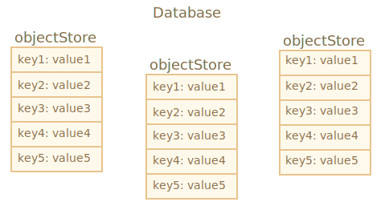
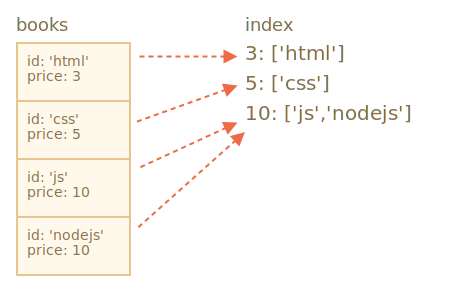

libs:
  - 'https://cdn.jsdelivr.net/npm/idb@3.0.2/build/idb.min.js'

---

# IndexedDB

IndexedDB는 `localStorage`보다 훨씬 강력한 브라우저 내장 데이터베이스입니다.

- 여러 타입의 키를 사용해 거의 모든 종류의 값을 저장할 수 있습니다.
- 신뢰성을 위한 트랜잭션을 지원합니다.
- 키 범위 질의와 인덱스를 지원합니다.
- `localStorage`보다 훨씬 많은 양의 데이터를 저장할 수 있습니다.

이런 강력함은 일반적인 클라이언트-서버 앱에는 대개 과합니다. IndexedDB는 서비스 워커와 기타 기술을 함께 사용하는 오프라인 앱을 위해 만들어졌습니다.

설명서 <https://www.w3.org/TR/IndexedDB>에 기술된 IndexedDB에 대한 기본 인터페이스는 이벤트 기반입니다.

<https://github.com/jakearchibald/idb>와 같은 프라미스 기반 래퍼의 도움을 받아 `async/await`도 사용할 수 있습니다. 꽤 편리하긴 하지만 래퍼가 완벽하지는 않아 모든 경우에 대한 이벤트를 대체할 수는 없습니다. 먼저 이벤트부터 시작하고, IndexedDB에 대한 이해를 얻은 후 래퍼를 사용할 것입니다.

```smart header="데이터는 어디에 저장될까요?"
기술적으로 데이터는 대개 브라우저 설정, 확장 프로그램 등과 함께 방문자의 홈 디렉터리에 저장됩니다.

브라우저마다, 그리고 운영체제 사용자마다 각자 독립적인 저장소를 가집니다.
```

## 데이터베이스 열기

IndexedDB로 작업을 시작하려면 먼저 데이터베이스를 열어야 합니다.

구문:

```js
let openRequest = indexedDB.open(name, version);
```

- `name` -- 데이터베이스 이름인 문자열입니다.
- `version` -- 양수 버전입니다. 기본값은 `1`이며 아래에서 설명합니다.

서로 다른 이름을 가진 데이터베이스를 여러 개 만들 수 있지만, 이 데이터베이스들은 모두 현재 도메인·프로토콜·포트로 정의되는 오리진 안에 존재합니다. 서로 다른 웹사이트는 서로의 데이터베이스에 접근할 수 없습니다.

호출은 `openRequest` 객체를 반환하므로 이 객체의 이벤트를 감시해야 합니다.
- `success`: 데이터베이스가 준비되면 `openRequest.result`에 "데이터베이스 객체"가 들어 있습니다. 이후 호출에는 이 데이터베이스 객체를 사용해야 합니다.
- `error`: 열기 실패입니다.
- `upgradeneeded`: 데이터베이스가 준비되었지만, 데이터베이스 버전이 오래되었습니다. 아래에서 설명합니다.

**IndexedDB에는 서버 측 데이터베이스에는 없는 "스키마 버전 관리" 메커니즘이 내장되어 있습니다.**

서버 측 데이터베이스와 달리 IndexedDB는 클라이언트 쪽에 있고 데이터는 브라우저에 저장되므로 개발자가 데이터베이스에 "언제든지" 접근할 수 없습니다. 그래서 새 버전의 앱을 배포한 후 사용자가 웹페이지를 방문하면 데이터베이스를 업데이트해야 할 수도 있습니다.

로컬 데이터베이스 버전이 `open`에 명시된 것보다 작을 경우, 특별한 이벤트 `upgradeneeded`가 발생하며 필요에 따라 버전을 비교하고 데이터 구조를 업그레이드할 수 있습니다.

데이터베이스가 아직 존재하지 않을 때도, 즉 기술적으로 버전 `0`인 경우에도 `upgradeneeded` 이벤트가 발생하여 초기화를 수행할 수 있습니다.

우리 앱의 첫 번째 버전을 배포했다고 합시다.

그런 다음 버전 `1`로 데이터베이스를 열고 다음과 같이 `upgradeneeded` 핸들러에서 초기화를 수행할 수 있습니다.

```js
let openRequest = indexedDB.open("store", *!*1*/!*);

openRequest.onupgradeneeded = function() {
  // 클라이언트에 데이터베이스가 없는 경우 발생합니다.
  // ...초기화를 수행합니다...
};

openRequest.onerror = function() {
  console.error("Error", openRequest.error);
};

openRequest.onsuccess = function() {
  let db = openRequest.result;
  // db 객체를 사용하여 데이터베이스 작업을 계속합니다.
};
```

그러고 나서 나중에 두 번째 버전을 배포합니다.

버전 `2`로 데이터베이스를 열고 다음과 같이 업그레이드를 수행할 수 있습니다.

```js
let openRequest = indexedDB.open("store", *!*2*/!*);

openRequest.onupgradeneeded = function(event) {
  // 기존 데이터베이스 버전이 2보다 작거나 존재하지 않습니다.
  let db = openRequest.result;
  switch(event.oldVersion) { // 기존 db 버전
    case 0:
      // 버전 0은 클라이언트에 데이터베이스가 없음을 의미합니다.
      // 초기화를 수행합니다.
    case 1:
      // 클라이언트에 버전 1이 있습니다.
      // 갱신합니다.
  }
};
```

참고: 현재 버전이 `2`이므로 `onupgradeneeded` 핸들러에는 버전 `0`에 대한 코드 분기가 있습니다. 이는 처음 방문해서 데이터베이스가 없는 사용자에게 필요합니다. 또한 업그레이드를 위한 버전 `1` 분기도 있습니다.

그런 다음 에러 없이 `onupgradeneeded` 핸들러가 끝나야 `openRequest.onsuccess`가 발생하고 데이터베이스가 성공적으로 열린 것으로 간주합니다.

데이터베이스를 삭제하려면 다음과 같이 해야 합니다.

```js
let deleteRequest = indexedDB.deleteDatabase(name)
// deleteRequest.onsuccess/onerror가 결과를 추적합니다.
```

```warn header="이전 open 호출 버전으로 데이터베이스를 열 수 없습니다"
현재 사용자 데이터베이스의 버전이 `open` 호출에 지정한 버전보다 높다면, 예를 들어 기존 DB 버전이 `3`인데 `open(...2)`를 시도한다면 이는 에러이며 `openRequest.onerror`가 발생합니다.

드문 일이지만 방문자가 프록시 캐시 등에서 오래된 자바스크립트 코드를 로드하면 이런 일이 발생할 수 있습니다. 코드는 오래되었지만 방문자의 데이터베이스는 새로운 상태인 것이죠.

이런 에러를 막으려면 `db.version`을 확인하여 페이지를 다시 로드하라고 안내해야 합니다. 오래된 코드가 로드되지 않도록 올바른 HTTP 캐싱 헤더를 사용합시다.
```

### 병렬 업데이트 문제

버전 관리 이야기가 나온 김에 관련된 작은 문제도 다뤄 봅시다.

다음과 같이 한다고 합시다.
1. 방문자가 데이터베이스 버전 `1`로 브라우저 탭에서 사이트를 열었습니다.
2. 그러고 나서 업데이트를 배포해서 코드가 최신 상태가 되었습니다.
3. 그리고 같은 방문자가 같은 사이트를 다른 탭에서 엽니다.

DB 버전 `1`에 대한 열린 연결을 가진 탭이 있고, 두 번째 탭은 `upgradeneeded` 핸들러에서 데이터베이스를 버전 `2`로 업데이트하려고 합니다.

문제는 데이터베이스가 동일한 사이트, 동일한 오리진에 속하므로 두 탭에서 공유된다는 점입니다. 하나의 데이터베이스가 버전 `1`이면서 동시에 버전 `2`일 수는 없습니다. 버전 `2`로 업데이트하려면 첫 번째 탭에 있는 연결을 포함하여 버전 `1`에 대한 모든 연결을 닫아야 합니다.

이를 처리하기 위해 "오래된" 데이터베이스 객체에서 `versionchange` 이벤트가 발생합니다. 이 이벤트를 감시하고 이전 데이터베이스 연결을 닫아야 합니다. 방문자에게 페이지를 다시 로드하여 업데이트된 코드를 불러오라고 안내할 수도 있습니다.

`versionchange` 이벤트를 감시하지 않고 기존 연결도 닫지 않으면 두 번째 연결은 만들어지지 않습니다. `openRequest` 객체는 `success` 대신 `blocked` 이벤트를 내보냅니다. 따라서 두 번째 탭은 동작하지 않습니다.

여기에 병렬 업그레이드를 올바르게 처리하기 위한 코드가 있습니다. 현재 데이터베이스 연결이 오래된 상태가 되었을 때, 즉 다른 곳에서 DB 버전이 업데이트되었을 때 실행되는 `onversionchange` 핸들러를 설치하고, 이 핸들러에서 연결을 닫습니다.

```js
let openRequest = indexedDB.open("store", 2);

openRequest.onupgradeneeded = ...;
openRequest.onerror = ...;

openRequest.onsuccess = function() {
  let db = openRequest.result;

  *!*
  db.onversionchange = function() {
    db.close();
    alert("Database is outdated, please reload the page.")
  };
  */!*

  // ...db가 준비되었으니 사용해 봅시다...
};

*!*
openRequest.onblocked = function() {
  // onversionchange를 올바르게 처리한다면 이 이벤트는 발생하지 않아야 합니다.

  // 같은 데이터베이스에 대한 다른 개방된 연결이 있다는 뜻입니다.
  // db.onversionchange가 발생한 후에도 닫히지 않았다는 뜻입니다.
};
*/!*
```

다시 말해, 여기서는 두 가지 일을 합니다.

1. `db.onversionchange` 리스너는 현재 데이터베이스 버전이 오래된 상태가 되었을 때 병렬 업데이트 시도를 알려줍니다.
2. `openRequest.onblocked` 리스너는 반대 상황, 즉 어딘가에 오래된 버전 연결이 있고 그 연결이 닫히지 않아 새 연결을 만들 수 없는 상황을 알려줍니다.

`db.onversionchange`에서 더 부드럽게 처리할 수도 있습니다. 예를 들어 연결을 닫기 전에 방문자에게 데이터를 저장하라고 안내할 수 있습니다.

또 다른 방법으로는 `db.onversionchange`에서 데이터베이스를 닫지 않고, 대신 새 탭의 `onblocked` 핸들러에서 방문자에게 새 버전을 불러오려면 다른 탭을 닫아야 한다고 알려줄 수도 있습니다.

이러한 업데이트 충돌은 거의 발생하지 않지만, 스크립트가 조용히 죽어서 사용자를 놀라게 하지 않도록 적어도 `onblocked` 핸들러 정도는 마련해야 합니다.

## 객체 저장소

IndexedDB에 저장하려면 *객체 저장소*가 필요합니다.

객체 저장소는 IndexedDB의 핵심 개념입니다. 다른 데이터베이스에서 이에 대응하는 개념은 "테이블" 또는 "컬렉션"이라고 불립니다. 이곳이 데이터가 저장되는 장소입니다. 데이터베이스에는 사용자용, 상품용 등 여러 저장소가 있을 수 있습니다.

"객체 저장소"로 이름 붙여졌음에도 불구하고 원시 요소도 저장될 수 있습니다.

**복잡한 객체를 포함한 거의 모든 값을 저장할 수 있습니다.**

IndexedDB는 [표준 직렬화 알고리즘](https://www.w3.org/TR/html53/infrastructure.html#section-structuredserializeforstorage)을 사용하여 객체를 복제하고 저장합니다. `JSON.stringify` 같지만, 더 강력하고 훨씬 더 많은 데이터 타입을 저장할 수 있습니다.

원형 참조가 있는 객체는 저장할 수 없고 직렬화할 수 없습니다. `JSON.stringify`도 원형 참조가 있는 객체에 실패합니다.

**저장소에 있는 모든 값에는 고유한 `key`가 있어야 합니다.**

키에는 숫자, 날짜, 문자열, 이진 또는 배열 중 하나의 유형이 있어야 합니다. 키는 값을 검색/삭제/갱신할 수 있는 고유 식별자입니다.




곧 알게 되겠지만 `localStorage`와 비슷하게 값을 저장소에 추가할 때 키를 제공할 수 있습니다. 그러나 객체를 저장할 때 IndexedDB는 객체 프로퍼티를 키로 설정할 수 있게 해주므로 훨씬 편리합니다. 또는 키를 자동으로 생성할 수도 있습니다.

그러나 첫 번째로 객체 저장소를 생성해야 합니다.


객체 저장소를 생성하는 구문입니다.
```js
db.createObjectStore(name[, keyOptions]);
```

이 연산은 동기식이기 때문에 `await`가 필요하지 않다는 점에 유의합니다.

- `name`은 저장소 이름입니다. 예를 들어 book을 위한 저장소라면 `"books"`입니다.
- `keyOptions`는 다음 두 가지 속성 중 하나를 가진 선택적 객체입니다.
  - `keyPath` -- IndexedDB가 키로 사용할 객체 프로퍼티의 경로입니다. 예를 들어 `id`를 사용할 수 있습니다.
  - `autoIncrement` -- `true`라면 새로 저장된 객체의 키는 계속 증가하는 숫자로 자동 생성됩니다.

`keyOptions`를 제공하지 않으면 나중에 객체를 저장할 때 명시적으로 키를 제공해야 합니다.

예를 들어 이 객체 저장소는 `id` 속성을 키로 사용합니다.
```js
db.createObjectStore('books', {keyPath: 'id'});
```

**객체 저장소는 `upgradeneeded` 핸들러에서 DB 버전을 업데이트하는 동안에만 생성/수정될 수 있습니다.**

이는 기술적인 제한입니다. 핸들러 외부에서 데이터를 추가/삭제/갱신할 수 있지만, 객체 저장소를 생성/삭제/변경할 수 있는 시점은 버전 업데이트 중뿐입니다.

데이터베이스 버전 업그레이드를 수행하기 위해 다음 두 가지 처리 방법이 있습니다.
1. 버전별로 1에서 2로, 2에서 3으로, 3에서 4로 업그레이드 기능을 구현할 수 있습니다. 그런 다음 `upgradeneeded`에서 버전을 비교하고, 예를 들어 기존 버전이 2이고 현재 버전이 4라면 모든 중간 버전 업그레이드를 단계적으로 실행할 수 있습니다.
2. 또는 `db.objectStoreNames`로 기존 객체 저장소 목록을 얻어 데이터베이스를 살펴볼 수 있습니다. 이 객체는 존재 여부를 확인할 수 있는 `contains(name)` 메서드를 제공하는 [DOMStringList](https://html.spec.whatwg.org/multipage/common-dom-interfaces.html#domstringlist)입니다. 존재 여부에 따라 업데이트할 수 있습니다.

작은 데이터베이스의 경우 두 번째 변형이 더 단순할 수 있습니다.

여기에 두 번째 처리 방법의 데모가 있습니다.

```js
let openRequest = indexedDB.open("db", 2);

// 버전 확인 없이 데이터베이스를 생성/갱신합니다.
openRequest.onupgradeneeded = function() {
  let db = openRequest.result;
  if (!db.objectStoreNames.contains('books')) { // "books" 저장소가 없는 경우입니다.
    db.createObjectStore('books', {keyPath: 'id'}); // "books" 저장소를 생성합니다.
  }
};
```


객체 저장소를 지우려면 다음과 같이 해야 합니다.

```js
db.deleteObjectStore('books')
```

## 트랜잭션

"트랜잭션"이라는 용어는 일반적이며 많은 종류의 데이터베이스에서 사용됩니다.

트랜잭션은 그룹 연산으로, 모두 성공하거나 모두 실패해야 합니다.

예를 들어 사람이 무언가를 살 때 다음이 요구됩니다.
1. 계좌에서 돈을 뺍니다.
2. 인벤토리에 아이템을 추가합니다.

첫 번째 단계를 완수하고 나서 불이 꺼지는 것과 같이 뭔가 잘못돼서 두 번째 단계에 실패하면 꽤 안 좋을 것입니다. 둘 다 성공해 구매가 완료되거나, 최소한 돈을 보관한 사람이 재시도할 수 있도록 둘 다 실패해야 합니다.

트랜잭션은 다음을 보장할 수 있습니다.

**모든 데이터 연산은 IndexedDB 내의 트랜잭션에서 수행되어야 합니다.**

트랜잭션을 시작하려면 다음과 같이 해야 합니다.

```js
db.transaction(store[, type]);
```

- `store`은 트랜잭션이 접근하려는 `"books"`와 같은 저장소 이름입니다. 여러 저장소에 접근하려면 저장소 이름의 배열이 되어야 합니다.
- `type` – 다음 중 하나인 트랜잭션 타입입니다.
  - `readonly` -- 기본값인 읽기만 가능합니다.
  - `readwrite` -- 데이터를 읽고 쓸 수 있을 뿐 객체 저장소를 생성/삭제/변형할 수는 없습니다.

또한 `versionchange` 트랜잭션 타입도 있는데 이러한 트랜잭션은 모든 것을 할 수 있지만, 수동으로 만들 수 없습니다. IndexedDB는 데이터베이스를 열 때 `upgradeneeded` 핸들러를 위해 `versionchange` 트랜잭션을 자동으로 생성합니다. 데이터베이스 구조를 업데이트하고 객체 저장소를 생성/삭제할 수 있는 유일한 장소인 것도 이러한 이유 때문입니다.

```smart header="다양한 타입의 트랜잭션이 존재하는 이유는 무엇일까요?"
성능은 트랜잭션이 `readonly`와 `readwrite`로 분류되어야 하는 이유입니다.

많은 `readonly` 트랜잭션은 같은 저장소에 동시에 접근할 수 있지만, `readwrite` 트랜잭션은 그렇지 못합니다. `readwrite` 트랜잭션은 저장소를 쓰기 작업을 위해 "잠급니다". 다음 트랜잭션은 동일한 저장소에 접근하기 전에 이전 트랜잭션이 끝날 때까지 기다려야 합니다.
```

트랜잭션이 생성된 후에는 다음과 같은 아이템을 저장소에 추가할 수 있습니다.

```js
let transaction = db.transaction("books", "readwrite"); // (1)

// 저장소 객체에서 연산하기 위해 저장소 객체를 얻습니다.
*!*
let books = transaction.objectStore("books"); // (2)
*/!*

let book = {
  id: 'js',
  price: 10,
  created: new Date()
};

*!*
let request = books.add(book); // (3)
*/!*

request.onsuccess = function() { // (4)
  console.log("Book added to the store", request.result);
};

request.onerror = function() {
  console.log("Error", request.error);
};
```

기본적으로 네 가지 단계가 있습니다.

1. `(1)`에서 접근할 모든 저장소를 지정하면서 트랜잭션을 생성합니다.
2. `(2)`에서 `transaction.objectStore(name)`을 사용하여 저장소 객체를 얻습니다.
3. `(3)`에서 저장소 객체 `books.add(book)`에 요청을 수행합니다.
4. `(4)`에서 성공/에러 이벤트를 처리하면 필요한 경우 다른 요청도 할 수 있습니다.

객체 저장소는 값을 저장하는 두 가지 함수를 지원합니다.

- **put(value, [key])**
    저장소에 `value`를 추가합니다. `key`는 객체 저장소에 `keyPath` 또는 `autoIncrement` 옵션이 없는 경우에만 제공됩니다. 이미 같은 키를 가진 값이 있으면 교체될 수 있습니다.

- **add(value, [key])**
    `put`과 동일하지만 같은 키를 가진 값이 이미 있으면 요청이 실패하고 `"ConstraintError"` 라는 이름의 에러가 발생합니다.

데이터베이스를 여는 것과 마찬가지로 `books.add(book)` 요청을 보낸 다음 `success/error` 이벤트를 기다릴 수 있습니다.

- `add`에 대한 `request.result`는 새로운 객체의 키입니다.
- 에러가 있다면 `request.error`에 담깁니다.

## 트랜잭션의 자동 커밋

위의 예에서 트랜잭션을 시작했고 `add` 요청을 했습니다. 그러나 앞에서 언급한 바와 같이 트랜잭션에는 모두 성공 또는 모두 실패해야 하는 여러 가지 관련 요청이 있을 수 있습니다. 더 이상의 요청은 없고 트랜잭션을 완료된 것으로 어떻게 표시할까요?

짧은 대답으로는 그렇게 하지 않습니다.

설명서의 다음 버전 3.0에서는 트랜잭션을 마칠 수 있는 수동적인 방법이 있겠지만, 현재 버전 2.0에서는 그렇지 않습니다.

**모든 트랜잭션 요청이 완료되고 [microtasks queue](info:microtask-queue)가 비어있으면 자동으로 커밋됩니다.**

흔히 모든 요청이 완료되고 현재 코드가 완료될 때 트랜잭션이 커밋된다고 가정할 수 있습니다.

따라서 위의 예에서 트랜잭션을 완료하기 위해 특별한 호출이 필요하지 않습니다.

트랜잭션 자동 커밋 원칙에는 중요한 부작용이 있습니다. 트랜잭션 중간에 `fetch`, `setTimeout` 같은 비동기 연산은 삽입할 수 없습니다. IndexedDB는 이런 연산이 끝날 때까지 트랜잭션을 유지하지 않습니다.

아래 코드 `(*)`줄에서 `request2`가 실패하면 트랜잭션이 이미 커밋되었기 때문에 해당 코드에서 어떠한 요청도 할 수 없습니다.

```js
let request1 = books.add(book);

request1.onsuccess = function() {
  fetch('/').then(response => {
*!*
    let request2 = books.add(anotherBook); // (*)
*/!*
    request2.onerror = function() {
      console.log(request2.error.name); // TransactionInactiveError
    };
  });
};
```

`fetch`는 비동기 연산인 매크로태스크이기 때문입니다. 트랜잭션은 브라우저가 매크로태스크를 시작하기 전에 닫힙니다.

IndexedDB 명세 작성자는 대부분 성능상의 이유로 트랜잭션이 짧게 유지되어야 한다고 봅니다.

특히 `readwrite` 트랜잭션은 쓰기 작업을 위해 저장소를 "잠급니다". 따라서 애플리케이션의 한 부분이 `books` 객체 저장소에 대해 `readwrite` 트랜잭션을 시작했다면, 같은 작업을 하려는 다른 부분은 첫 번째 트랜잭션이 끝날 때까지 기다려야 합니다. 트랜잭션이 오래 걸리면 예상치 못한 지연이 생길 수 있습니다.

그래서 무엇을 해야 할까요?

위의 예에서, 새로운 요청 `(*)` 직전에 새로운 `db.transaction`을 생성할 수 있습니다.

하지만 연산을 한 번의 트랜잭션으로 묶어야 한다면, IndexedDB 트랜잭션과 "다른" 비동기 작업을 분리하는 편이 훨씬 낫습니다.

먼저 `fetch`를 실행하고 필요하면 데이터를 준비한 다음, 트랜잭션을 생성하여 모든 데이터베이스 요청을 수행하면 동작합니다.

성공적으로 완료되는 시점을 잡으려면 `transaction.oncomplete` 이벤트를 사용할 수 있습니다.

```js
let transaction = db.transaction("books", "readwrite");

// ...연산을 수행합니다...

transaction.oncomplete = function() {
  console.log("Transaction is complete");
};
```

오직 `complete`만 트랜잭션 전체가 저장되었음을 보장합니다. 개별 요청은 성공할 수 있지만, 최종 쓰기 연산이 실패할 수 있습니다. 예를 들어 I/O 에러가 발생할 수 있습니다.

트랜잭션을 수동적으로 중단하려면 다음을 호출해 봅시다.

```js
transaction.abort();
```

위는 요청에 따라 이루어진 모든 수정을 취소하고 `transaction.onabort` 이벤트를 유발합니다.


## 에러 처리

쓰기 요청은 실패할 수 있습니다.

에러는 우리 코드뿐만 아니라 트랜잭션 자체와 관련이 없는 이유로도 발생할 수 있습니다. 예를 들어 저장소 쿼터가 초과될 수 있습니다. 따라서 이런 경우를 처리할 준비가 되어 있어야 합니다.

**실패한 요청은 트랜잭션을 자동으로 중단하여 모든 변경사항을 취소합니다.**

때에 따라서는 기존 변경사항을 취소하지 않고 실패를 처리한 뒤, 예를 들어 다른 요청을 시도한 다음 트랜잭션을 계속하고 싶을 수 있습니다. 가능합니다. `request.onerror` 핸들러는 `event.preventDefault()`를 호출하여 트랜잭션 중단을 방지할 수 있습니다.

아래 예시에서는 새로운 book이 기존과 같은 키(`id`)로 추가됩니다. `store.add` 함수는 이럴 때 `"ConstraintError"`를 발생시키죠. 트랜잭션을 취소하지 않고 처리합니다.

```js
let transaction = db.transaction("books", "readwrite");

let book = { id: 'js', price: 10 };

let request = transaction.objectStore("books").add(book);

request.onerror = function(event) {
  // 동일한 id를 가진 객체가 이미 있는 경우 ConstraintError가 발생합니다.
  if (request.error.name == "ConstraintError") {
    console.log("Book with such id already exists"); // 에러를 처리합니다.
    event.preventDefault(); // 트랜잭션을 중단하지 않습니다.
    // book을 위한 다른 key를 사용할까요?
  } else {
    // 예기치 않은 에러로, 처리할 수 없습니다.
    // 트랜잭션이 중단됩니다.
  }
};

transaction.onabort = function() {
  console.log("Error", transaction.error);
};
```

### 이벤트 위임

모든 요청에 대해 `onerror/onsuccess`를 설정해야 할까요? 매번 그럴 필요는 없습니다. 대신 이벤트 위임을 사용할 수 있습니다.

**IndexedDB 이벤트는 버블링됩니다. `request` -> `transaction` -> `database`.**

모든 이벤트는 캡처링과 버블링을 가진 DOM 이벤트이지만, 흔히 버블링 단계만 사용됩니다.

따라서 보고나 다른 목적을 위해 `db.onerror` 핸들러를 사용하여 모든 에러를 잡아낼 수 있습니다.

```js
db.onerror = function(event) {
  let request = event.target; // 에러를 발생시키는 request

  console.log("Error", request.error);
};
```

하지만 에러가 완전히 처리된다면? 그런 경우에는 알리고 싶지 않죠.

`request.onerror`에서 `event.stopPropagation()`을 사용하면 버블링을 막아 `db.onerror`까지 이벤트가 올라가지 않게 할 수 있습니다.

```js
request.onerror = function(event) {
  if (request.error.name == "ConstraintError") {
    console.log("Book with such id already exists"); // 에러를 처리합니다.
    event.preventDefault(); // 트랜잭션을 중단하지 않습니다.
    event.stopPropagation(); // 에러가 위로 전파되지 않도록 여기서 처리합니다.
  } else {
    // 아무것도 하지 않습니다.
    // 트랜잭션이 중단됩니다.
    // transaction.onabort에서 에러를 처리할 수 있습니다.
  }
};
```

## 검색하기

객체 저장소에는 다음과 같은 두 가지 유형의 검색이 있습니다.
1. 키 값 또는 키 범위로 검색합니다. "books" 저장소에서는 `book.id`의 값 또는 값 범위로 검색하는 것입니다.
2. `book.price` 같은 다른 객체 필드로 검색합니다. 이 경우 "인덱스"라는 추가 데이터 구조가 필요합니다.

### 키로 검색하기

먼저 첫 번째 유형인 키를 사용한 검색부터 다뤄 봅시다.

검색 메서드는 정확한 키 값과 이른바 "값 범위"를 모두 지원합니다. [IDBKeyRange](https://www.w3.org/TR/IndexedDB/#keyrange) 객체는 허용되는 "키 범위"를 지정합니다.

`IDBKeyRange` 객체는 다음 호출로 생성합니다.

- `IDBKeyRange.lowerBound(lower, [open])` 의미: `≥lower`. 또는 `open`이 true이면 `>lower`
- `IDBKeyRange.upperBound(upper, [open])` 의미: `≤upper`. 또는 `open`이 true이면 `<upper`
- `IDBKeyRange.bound(lower, upper, [lowerOpen], [upperOpen])` 의미: `lower`와 `upper` 사이. open 플래그가 true일 경우 해당 키는 범위에 포함되지 않습니다.
- `IDBKeyRange.only(key)` -- 거의 사용되지 않는 하나의 `key`로만 구성된 범위입니다.

이들을 사용하는 실제 예시는 곧 살펴보겠습니다.

실제 검색을 수행할 때 사용하는 메서드는 다음과 같습니다. 각 메서드는 정확한 키나 키 범위를 담은 `query` 인수를 받습니다.

- `store.get(query)` -- 키 또는 범위로 첫 번째 값을 검색합니다.
- `store.getAll([query], [count])` -- 모든 값을 검색합니다. `count`가 주어지면 그 개수까지만 가져옵니다.
- `store.getKey(query)` -- `query`를 만족시키는 첫 번째 키를 검색합니다. 일반적으로 범위를 사용합니다.
- `store.getAllKeys([query], [count])` -- `query`를 만족시키는 모든 키를 검색합니다. `count`가 주어지면 그 개수까지만 가져옵니다. 일반적으로 범위를 사용합니다.
- `store.count([query])` -- `query`를 충족시키는 키의 총 개수를 가져옵니다. 일반적으로 범위를 사용합니다.

예를 들어 저장소에 많은 books가 있습니다. `id` 필드가 키이기 때문에 이 모든 메서드는 `id`로 검색할 수 있다는 점을 기억합시다.

요청 예제입니다.

```js
// book을 얻습니다.
books.get('js')

// 'css' <= id <= 'html'로 books를 얻습니다.
books.getAll(IDBKeyRange.bound('css', 'html'))

// id < 'html'로 books를 얻습니다.
books.getAll(IDBKeyRange.upperBound('html', true))

// 모든 books를 얻습니다.
books.getAll()

// id > 'js'인 모든 키를 얻습니다.
books.getAllKeys(IDBKeyRange.lowerBound('js', true))
```

```smart header="저장소 객체는 항상 정렬됩니다."
객체 저장소는 내부적으로 키를 기준으로 값을 정렬합니다.

따라서 많은 값을 반환하는 요청은 항상 키 순서에 따라 정렬된 값을 반환합니다.
```

### 인덱스로 필드 검색하기

다른 객체 필드로 검색하려면 "인덱스"라는 이름의 추가적인 데이터 구조를 생성해야 합니다.

인덱스는 지정된 객체 필드를 추적하는 저장소의 부가 구조입니다. 이 필드의 각 값에 대해 해당 값을 가진 객체의 키 목록을 저장합니다. 아래에 좀 더 자세한 그림이 있습니다.

구문입니다.

```js
objectStore.createIndex(name, keyPath, [options]);
```

- **`name`** -- 인덱스 이름입니다.
- **`keyPath`** -- 인덱스가 추적해야 하는 객체 필드의 경로입니다. 이 필드를 기준으로 검색합니다.
- **`options`** -- 아래 특징을 가진 선택적 객체입니다.
  - **`unique`** -- true일 경우 `keyPath`에 지정된 값을 가진 객체가 저장소에 하나만 있을 수 있습니다. 중복 값을 추가하려고 하면 인덱스가 에러를 발생시켜 이를 막습니다.
  - **`multiEntry`** -- `keyPath`의 값이 배열인 경우에만 사용됩니다. 이 경우 기본적으로 인덱스는 전체 배열을 키로 처리하죠. 그러나 `multiEntry`가 true이면 인덱스는 해당 배열의 각 값에 대한 저장소 객체 목록을 보관합니다. 따라서 배열 원소는 인덱스 키가 됩니다.

예시에서 `id` 키로 된 books를 저장합니다.

`price`로 검색하길 원한다고 합시다.

우선 인덱스를 생성해야 합니다. 객체 저장소와 마찬가지로 반드시 `upgradeneeded`에서 생성해야 합니다.

```js
openRequest.onupgradeneeded = function() {
  // versionchange 트랜잭션에서 인덱스를 생성해야 합니다.
  let books = db.createObjectStore('books', {keyPath: 'id'});
*!*
  let index = books.createIndex('price_idx', 'price');
*/!*
};
```

- 인덱스는 `price` 필드를 추적합니다.
- `price`는 유일하지 않고 같은 `price`를 가진 book이 여러 개 있을 수 있기 때문에 `unique` 옵션을 설정하지 않습니다.
- `price`는 배열이 아니기 때문에 `multiEntry` 플래그는 적용할 수 없습니다.

`inventory`에 book 네 개가 있다고 상상해 봅시다. 다음 그림은 `index`가 정확히 무엇인지 보여줍니다.



앞서 말했듯이, 인덱스는 두 번째 인수인 `price`의 각 값에 대해 그 `price`를 가진 객체의 키 목록을 유지합니다.

인덱스는 자동으로 최신 상태를 유지하므로 따로 신경 쓰지 않아도 됩니다.

이제 지정된 `price`를 검색하고자 할 때 동일한 검색 메서드를 인덱스에 적용하면 됩니다.

```js
let transaction = db.transaction("books"); // 읽기 전용입니다.
let books = transaction.objectStore("books");
let priceIndex = books.index("price_idx");

*!*
let request = priceIndex.getAll(10);
*/!*

request.onsuccess = function() {
  if (request.result !== undefined) {
    console.log("Books", request.result); // price=10인 books 배열
  } else {
    console.log("No such books");
  }
};
```

또한 `IDBKeyRange`를 사용하여 범위를 생성하고 저렴한 book이나 비싼 book을 찾을 수 있습니다.

```js
// price <= 5인 books를 찾습니다.
let request = priceIndex.getAll(IDBKeyRange.upperBound(5));
```

이 예시에서 인덱스는 추적하는 객체 필드인 `price`에 따라 내부적으로 정렬됩니다. 그래서 검색 결과도 `price`에 따라 정렬되죠.

## 저장소로부터 삭제하기

`delete` 메서드는 쿼리에 의해 삭제되는 값을 검색하며 호출 형식은 `getAll`과 유사합니다.

- **`delete(query)`** -- query에 일치하는 값을 삭제합니다.

예시입니다.
```js
// id='js'인 book을 삭제합니다.
books.delete('js');
```

`price` 또는 다른 객체 필드를 기준으로 book을 삭제하려면, 먼저 인덱스에서 키를 찾은 다음 `delete`를 호출합니다.

```js
// price = 5인 키를 찾습니다.
let request = priceIndex.getKey(5);

request.onsuccess = function() {
  let id = request.result;
  let deleteRequest = books.delete(id);
};
```

모든 것을 지우려면 다음과 같이 해야 합니다.
```js
books.clear(); // 저장소를 지웁니다.
```

## 커서

`getAll/getAllKeys`와 같은 메서드는 키/값의 배열을 반환합니다.

그러나 객체 저장소가 사용 가능한 메모리보다 더 클 수 있습니다. 그러면 `getAll`은 모든 레코드를 배열로 가져오는 데 실패하게 되죠.

무엇을 해야 할까요?

커서는 이런 상황을 처리하는 방법을 제공합니다.

**커서는 주어진 쿼리에 맞춰 객체 저장소를 순회하며 키/값을 한 번에 하나씩 반환해 메모리를 절약하는 특수 객체입니다.**

객체 저장소는 내부적으로 키에 따라 정렬되므로, 커서는 기본적으로 오름차순인 키 순서로 저장소를 순회합니다.

구문입니다.
```js
// getAll과 유사하지만 커서가 있는 경우입니다.
let request = store.openCursor(query, [direction]);

// getAllKeys처럼 값이 아닌 키를 얻으려면 store.openKeyCursor를 사용합니다.
```

- **`query`**는 `getAll`과 같은 키 또는 키 범위입니다.
- **`direction`**은 어떤 순서를 사용할지 지정하는 선택적 인수입니다.
  - `"next"` -- 기본값입니다. 커서는 가장 낮은 키를 가진 레코드부터 올라갑니다.
  - `"prev"` -- 역순입니다. 가장 큰 키를 가진 레코드부터 내려갑니다.
  - `"nextunique"`, `"prevunique"` -- 위와 같지만, 동일한 키를 가진 레코드는 건너뜁니다. 예를 들어 `price=5`인 book이 여러 개 있어도 첫 번째 것만 반환됩니다. 인덱스에 대한 커서에서만 사용할 수 있습니다.

**커서의 주요 차이점은 `request.onsuccess`가 각 결과에 대해 한 번씩 여러 번 발생한다는 점입니다.**

커서 사용 예시는 다음과 같습니다.

```js
let transaction = db.transaction("books");
let books = transaction.objectStore("books");

let request = books.openCursor();

// 커서로 찾은 각 book에 대해 호출합니다.
request.onsuccess = function() {
  let cursor = request.result;
  if (cursor) {
    let key = cursor.key; // id 필드인 book 키
    let value = cursor.value; // book 객체
    console.log(key, value);
    cursor.continue();
  } else {
    console.log("No more books");
  }
};
```

주된 커서 메서드는 다음과 같습니다.

- `advance(count)` -- 값을 건너뛰며 커서를 `count`번 앞으로 이동시킵니다.
- `continue([key])` -- 일치하는 범위 내에서 커서를 다음 값으로 이동시킵니다. `key`가 주어지면 해당 키 바로 다음 값으로 이동합니다.

커서 조건에 일치하는 값이 더 있든 없든 `onsuccess`는 호출됩니다. 이때 `result`에는 다음 레코드를 가리키는 커서가 들어 있거나, 더 이상 값이 없다면 `undefined`가 들어 있습니다.

위의 예시에서 커서는 객체 저장소로 만들어졌습니다.

그러나 인덱스에 대한 커서를 만들 수도 있습니다. 앞서 봤듯이, 인덱스를 사용하면 객체 필드로 검색할 수 있습니다. 인덱스에 대한 커서는 객체 저장소에 대한 커서와 같은 역할을 합니다. 한 번에 하나의 값을 반환해 메모리를 절약하죠.

인덱스에 대한 커서의 경우 `cursor.key`는 `price` 같은 인덱스 키이며, 객체 키로는 `cursor.primaryKey` 프로퍼티를 사용해야 합니다.

```js
let request = priceIdx.openCursor(IDBKeyRange.upperBound(5));

// 각 레코드에 대해 호출합니다.
request.onsuccess = function() {
  let cursor = request.result;
  if (cursor) {
    let primaryKey = cursor.primaryKey; // id 필드인 다음 객체 저장소 키
    let value = cursor.value; // 다음 객체 저장소 객체인 book 객체
    let key = cursor.key; // 다음 인덱스 키인 price
    console.log(key, value);
    cursor.continue();
  } else {
    console.log("No more books");
  }
};
```

## 프라미스 래퍼

모든 요청에 `onsuccess/onerror`를 추가하는 것은 상당히 번거로운 일입니다. 때로는 전체 트랜잭션에 핸들러를 설치하는 등 이벤트 위임을 이용해 작업을 더 쉽게 만들 수 있지만, `async/await`이 훨씬 편리합니다.

이 장의 남은 부분에서는 얇은 프라미스 래퍼 <https://github.com/jakearchibald/idb>를 사용해 봅시다. 이 래퍼는 [프라미스화된](info:promisify) IndexedDB 메서드를 가진 전역 `idb` 객체를 생성합니다.

그러면 `onsuccess/onerror` 대신 다음과 같이 쓸 수 있습니다.

```js
let db = await idb.openDB('store', 1, db => {
  if (db.oldVersion == 0) {
    // 초기화를 수행합니다.
    db.createObjectStore('books', {keyPath: 'id'});
  }
});

let transaction = db.transaction('books', 'readwrite');
let books = transaction.objectStore('books');

try {
  await books.add(...);
  await books.add(...);

  await transaction.complete;

  console.log('jsbook saved');
} catch(err) {
  console.log('error', err.message);
}
```

이제 깔끔한 "일반적인 비동기 코드"와 "try..catch"를 모두 사용할 수 있습니다.

### 에러 처리

에러를 잡아내지 않으면 가장 가까운 바깥 `try..catch`까지 전파됩니다.

잡히지 않은 에러는 `window` 객체의 "unhandled promise rejection" 이벤트가 됩니다.

이런 에러는 다음과 같이 처리할 수 있습니다.

```js
window.addEventListener('unhandledrejection', event => {
  let request = event.target; // IndexedDB 네이티브 request 객체입니다.
  let error = event.reason; // request.error와 같은 처리되지 않은 error 객체입니다.
  ...에러에 대하여 알립니다...
});
```

### "비활성 트랜잭션" 함정


이미 알고 있는 바와 같이, 브라우저가 현재 코드와 마이크로태스크 처리를 끝내는 즉시 트랜잭션은 자동 커밋됩니다. 그래서 트랜잭션 중간에 `fetch`와 같은 *매크로태스크*를 넣으면 트랜잭션은 그 작업이 끝날 때까지 기다리지 않습니다. 그냥 자동 커밋될 뿐이죠. 따라서 다음 요청은 실패합니다.


프라미스 래퍼와 `async/await`도 상황은 마찬가지입니다.

다음은 트랜잭션 중간에서 `fetch`를 사용하는 예시입니다.

```js
let transaction = db.transaction("inventory", "readwrite");
let inventory = transaction.objectStore("inventory");

await inventory.add({ id: 'js', price: 10, created: new Date() });

await fetch(...); // (*)

await inventory.add({ id: 'js', price: 10, created: new Date() }); // Error
```

`fetch` `(*)` 이후 다음 `inventory.add`는 트랜잭션이 이미 커밋되고 종료되었기 때문에 "비활성 트랜잭션" 에러로 실패합니다.

해결 방법은 네이티브 IndexedDB로 작업할 때와 같습니다. 새로운 트랜잭션을 만들거나 작업을 나누면 됩니다.
1. 데이터를 준비하고 필요한 모든 것을 먼저 가져옵니다.
2. 그런 다음 데이터베이스에 저장합니다.

### 네이티브 객체 얻기

내부적으로 래퍼는 네이티브 IndexedDB 요청을 수행하고 여기에 `onerror/onsuccess`를 추가한 뒤, 결과에 따라 거부되거나 이행되는 프라미스를 반환합니다.

대부분의 경우 잘 동작합니다. 예시는 라이브러리 페이지 <https://github.com/jakearchibald/idb>에서 볼 수 있습니다.

드물지만, 원래의 `request` 객체가 필요할 때 프라미스의 `promise.request` 속성으로 접근할 수 있습니다.

```js
let promise = books.add(book); // 프라미스를 얻고 결과를 기다리지 않습니다.

let request = promise.request; // 네이티브 request 객체입니다.
let transaction = request.transaction; // 네이티브 transaction 객체입니다.

// ...네이티브 IndexedDB 관련 작업을 수행합니다...

let result = await promise; // 여전히 필요하다면
```

## 요약

IndexedDB는 "강력해진 localStorage"라고 생각할 수 있습니다. 단순한 키-값 데이터베이스로, 오프라인 앱에 적합하면서도 사용이 간편합니다.

가장 좋은 매뉴얼은 명세입니다. [현재 명세](https://www.w3.org/TR/IndexedDB-2/)는 2.0이지만 [3.0](https://w3c.github.io/IndexedDB/)의 일부 메서드도 부분적으로 지원됩니다. 3.0도 크게 다르지는 않습니다.

기본적인 사용법은 다음과 같이 몇 가지 단계로 설명할 수 있습니다.

1. [idb](https://github.com/jakearchibald/idb)와 같은 프라미스 래퍼를 얻습니다.
2. 데이터베이스 열기: `idb.openDb(name, version, onupgradeneeded)`
    - `onupgradeneeded` 핸들러에 객체 저장소 및 인덱스를 생성하거나 필요한 경우 버전 업데이트를 수행합니다.
3. 요청하려면 다음과 같이 합니다.
    - 트랜잭션 `db.transaction('books')`를 생성합니다. 필요하다면 `readwrite`로 생성합니다.
    - 저장소 객체 `transaction.objectStore('books')`를 얻습니다.
4. 그런 다음, 키로 검색하려면 객체 저장소의 메서드를 직접 호출합니다.
    - 객체 필드로 검색하려면 인덱스를 생성합니다.
5. 데이터가 메모리에 맞지 않으면 커서를 사용합니다.

여기에 작은 데모 앱이 있습니다.

[codetabs src="books" current="index.html"]
