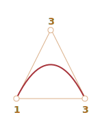

# 베지어 곡선

베지어 곡선(Bezier curve)은 CSS 애니메이션과 다른 많은 곳에서 도형을 그리기 위한 컴퓨터 그래픽스에 사용됩니다.

베지어 곡선은 매우 간단합니다. 한 번 정도 공을 들여 공부해 두면 벡터 그래픽스와 고급 애니메이션을 다룰 때 도움이 되죠.

## 제어점(Control points)

[베지어 곡선](https://en.wikipedia.org/wiki/B%C3%A9zier_curve)은 제어점으로 정의됩니다.

제어점은 2, 3, 4개 혹은 더 많이 존재할 수 있습니다.

예를 들어, 두 점의 곡선은:


세 점의 곡선은:


네 점의 곡선은:


이 곡선들을 깊게 들여다본다면, 즉시 알아차릴 수 있습니다.

1. **점들은 항상 곡선과 닿지 않습니다.** 그것은 완전히 일반적으로, 후에 곡선이 어떻게 만들어지는지 볼 수 있을 것입니다.
2. **곡선의 차원은 점의 개수에서 하나 뺀 숫자와 같습니다.**
두 점으로 선형의 곡선(직선입니다.), 세 점으로 -- 2차 곡선을, 네점으로 3차 곡선을 가집니다.
3. **곡선은 항상 제어점의 [컨벡스 헐(convex hull)](https://en.wikipedia.org/wiki/Convex_hull)안에 존재합니다:**

     

마지막 속성 때문에, 컴퓨터 그래픽스에서는 교차 검사(intersection tests)를 최적화하는 것이 가능합니다. 컨벡스 헐(convex hulls)은 교차가 아니라면, 곡선은 같지 않습니다. 그래서 먼저 컨벡스 헐(convex hulls)의 교차를 검사하는 것은 가장 빠르게 "교차 없음" 결과를 도출할 수 있습니다. 교차를 검사하는 것 또는 컨벡스 헐(convex hulls)은 더욱 쉽습니다, 사각형, 삼각형 그리고 기타 등등 (위에 그림을 보세요), 곡선보다 더욱 간단한 도형이기 때문입니다.

**베지어 곡선(Bezier curves)을 그리는 가장 중요한 속성은 곡선은 *직감적으로 명백한 방법으로* 변화하는 점을 옮기는 것입니다.**

아래 예제에서 제어점을 마우스로 옮기면서 시도해보세요:

[iframe src="demo.svg?nocpath=1&p=0,0,0.5,0,0.5,1,1,1" height=370]

**당신이 알고 있는 것처럼, 곡선은 접선 사이로 1 -> 2 and 3 -> 4. 뻗습니다.**

조금의 연습 후에 필요한 곡선을 얻으려면 점을 어디에 두어야 하는지 명백하게 알 수 있습니다. 몇몇 곡선을 연결하는 것은 연습할 수도 있습니다.

아래 예제가 있습니다:

  

## 카스텔조 알고리즘(De Casteljau's algorithm)

베지어 곡선(Bezier curves)을 위한 수학 공식이 있는데, 나중에 설명하겠습니다,
[카스텔조 알고리즘(De Casteljau's algorithm)](https://en.wikipedia.org/wiki/De_Casteljau%27s_algorithm)과 동일한 수학적 정의와 시각적으로 어떻게 구성되었는지 보여주기 때문입니다.

먼저 세 점의 예를 보시죠.

설명을 해주는 데모가 있습니다.

제어점(1,2 그리고 3)은 마우스로 움직일 수 있습니다. "play"버튼을 누르고 실행해보세요.

[iframe src="demo.svg?p=0,0,0.5,1,1,0&animate=1" height=370]

**3-점 베지어 곡선(bezier curve)를 만드는 카스텔조 알고리즘(De Casteljau's algorithm)**

1. 제어점을 그리세요. 데모 위에서 '1', '2', '3'으로 이름 지어집니다.
2. 제어점 1 -> 2 -> 3 사이에 선분을 만드세요. 데모 위에서 <span style="color:#825E28">갈색</span>입니다.
3. 파라미터 't'는 '0'에서 '1'로 움직입니다. 예를 들어 위의 '0.05'단계는 `0, 0.05, 0.1, 0.15, ... 0.95, 1'로 나아갑니다.

    각 `t`의 속성은:

    각 <span style="color:#825E28">갈색</span> 선분의 시작점에서 `t`와 비례하는 거리만큼의 위치에 점을 가져다 놓습니다. 두 선분이 있는 만큼, 두 점이 있습니다.

        예를 들어, `t=0` -- 두 점 모두 선분의 시작에 위치할 것이다, `t=0.25` -- 시작에서 25% 길이에, `t=0.5` -- 50%(가운데), `t=1` -- 선분의 마지막.

    - 점을 연결하세요. 그림에서 연결된 선분은 <span style="color:#167490">파란색</span>으로 칠해졌습니다.


| `t=0.25`                 | `t=0.5`                |
| ------------------------ | ---------------------- |
|    |  |

4. <span style="color:#167490">파란색</span> 선분 안에서 `t`의 값과 동일하게 비례하는 거리만큼 점을 가져다 놓습니다. `t=0.25`(왼쪽 그림)은 선분의 4분의 1지점에 위치하고, `t=0.5`(오른쪽 그림) -- 선분의 가운데에 위치. 위 그림에서 점은 <span style="color:red">빨간색</span>입니다. 

5. `t`가 `0`에서 `1` 달리듯, 모든 `t` 값은 곡선의 점으로 추가됩니다. 이 같은 점의 집합은 베지어 곡선(Bezier curve)을 형성합니다. 위 그림에서 빨간색 포물선입니다.

세 점의 프로세스였습니다. 그래도 4점의 프로세스 역시 같습니다.

네 점의 데모입니다(점은 마우스로 움직일 수 있습니다):

[iframe src="demo.svg?p=0,0,0.5,0,0.5,1,1,1&animate=1" height=370]

네 점 알고리즘:

- 선분으로 제어점을 연결합니다: 1 -> 2, 2 -> 3, 3 -> 4. 3개의 <span style="color:#825E28">갈색</span> 선분이 있습니다.
- 각 `t`의 `0`에서 `1`까지 간격:
    - 시작점으로부터 `t`만큼 거리 비레적으로 이 선분에 점을 가져다 놓습니다.
    - 이 선분들에 `t`만큼 비례적으로 점을 가져다 놓습니다. <span style="color:#167490">파란색 선분</span>을 얻습니다.
    - 파란색 선분에서는 `t`만큼 비례적으로 점을 가져다 놓습니다. 위 예에서는 <span style="color:red">빨간색</span>입니다. 
- 이 점들은 곡선을 형성합니다.

알고리즘은 재귀적이고 몇 개의 제어점이든 일반화할 수 있습니다.

N개의 제어점이 주어질 경우:

1. 기본적으로 N-1개의 선분을 얻기 위해 연결합니다.
2. 각 `t`는 `0`에서 `1`까지, 거리 비례적인 각 선분에 `t`만큼 점을 놓고 연결합니다. N-2 선분이 나올 것입니다.
3. 하나의 점만 남을 때까지 2번을 반복합니다.

이 점들은 곡선을 만듭니다.

```온라인
**선분을 분명히 보고 어떻게 만들어지는지 예제를 실행하고 정지해 보세요.**
```

`y=1/t`와 같은 곡선:

[iframe src="demo.svg?p=0,0,0,0.75,0.25,1,1,1&animate=1" height=370]

지그재그 제어점도 제대로 동작함:

[iframe src="demo.svg?p=0,0,1,0.5,0,0.5,1,1&animate=1" height=370]

루프를 만드는 것도 가능함:

[iframe src="demo.svg?p=0,0,1,0.5,0,1,0.5,0&animate=1" height=370]

부드럽지 않은 베지어 곡선(Bezier curve)(이것 역시 가능함):

[iframe src="demo.svg?p=0,0,1,1,0,1,1,0&animate=1" height=370]

```online
알고리즘 설명에 불확실한 어떤 것이 있었다면, 위의 예제에서 곡선이 어떻게 만들어지는 지 보여줍니다.
```

알고리즘은 재귀적이어서, 5, 6 혹은 더 많은 제어점을 사용하여 어떤 차수의 베지어 곡선(Bezier curves)이든지 만들 수 있습니다. 그러나 연습에서 많은 점을 사용하는 것은 불필요합니다. 보통 우리는 2-3개의 점을 가지고, 복잡한 선은 여러 곡선을 함께 붙입니다. 그것이 계산하고 개발하기보다 간단합니다.

```smart header="어떻게 주어진 점을 *통하여* 곡선을 그리나요?"
베지어 곡선(Bezier curve)을 특정하기 제어점을 사용합니다. 지금까지 보았듯이, 첫번째와 마지막을 제외한 제어점은 곡선상에 있지 않습니다.

때때로 우리는 또 다른 업무를 가집니다: *몇몇의 점을 통하는 곡선*을 그리기 위한, 단독의 부드러운 곡선을. 그것은 [보간법(interpolation)](https://en.wikipedia.org/wiki/Interpolation)이라고 불리며, 우리는 다루지는 않습니다.

이 같은 곡선을 위한 수학적 공식이 있습니다. 예를 들어 [라그랑즈 다항식(Lagrange polynomial)](https://en.wikipedia.org/wiki/Lagrange_polynomial)이 있습니다. 컴퓨터 그래픽스에서는 [스플라인 보간법(spline interpolation)](https://en.wikipedia.org/wiki/Spline_interpolation)이 많은 점을 이어주는 부드러운 곡선을 만드는 데 사용되곤 합니다.
```


## 수학

베지어 곡선(Bezier curve)은 수학 공식을 사용하여 설명할 수 있습니다.

우리가 보았듯이 -- 사실 이것을 아는 것은 필요하지는 않습니다, 대부분의 사람은 단지 마우스로 점을 옮기면서 곡선을 그립니다. 그러나 수학이 필요하다면, 여기에서 보세요.

제어점의 좌표는 <code>P<sub>i</sub></code>: 첫 번째 제어점은 <code>P<sub>1</sub> = (x<sub>1</sub>, y<sub>1</sub>)</code>, 두번째는: <code>P<sub>2</sub> = (x<sub>2</sub>, y<sub>2</sub>)</code>, 그리고 기타 등등의 좌표를 가집니다, 곡선 좌표는 선분 `[0,1]`에서 부터 파라미터 `t`에 의존하는 방정식으로 설명됩니다.

- 2-점 곡선의 공식:

    <code>P = (1-t)P<sub>1</sub> + tP<sub>2</sub></code>
- 3 제어점:

    <code>P = (1−t)<sup>2</sup>P<sub>1</sub> + 2(1−t)tP<sub>2</sub> + t<sup>2</sup>P<sub>3</sub></code>
- 4 제어점:

    <code>P = (1−t)<sup>3</sup>P<sub>1</sub> + 3(1−t)<sup>2</sup>tP<sub>2</sub>  +3(1−t)t<sup>2</sup>P<sub>3</sub> + t<sup>3</sup>P<sub>4</sub></code>


이것들은 벡터 방정식들입니다. 다른 말로, 일치하는 좌표를 얻기 위해 `P` 대신에 `x`와 `y`를 넣을 수 있습니다.

예를 들어, 3-점 곡선은 계산된 `(x,y)` 점들로 만들어집니다:

- <code>x = (1−t)<sup>2</sup>x<sub>1</sub> + 2(1−t)tx<sub>2</sub> + t<sup>2</sup>x<sub>3</sub></code>
- <code>y = (1−t)<sup>2</sup>y<sub>1</sub> + 2(1−t)ty<sub>2</sub> + t<sup>2</sup>y<sub>3</sub></code>

<code>x<sub>1</sub>, y<sub>1</sub>, x<sub>2</sub>, y<sub>2</sub>, x<sub>3</sub>, y<sub>3</sub></code> 대신에 우리는 3 제어점의 좌표를 넣습니다, 그러면 `t`가 `0` 에서 `1`로 옮겨가면서, 각 `t`의 값은 곡선의 `(x,y)`을 가질 것입니다.

예를 들어, 제어점이 `(0,0)`, `(0.5, 1)` 그리고 `(1, 0)`이라면, 방정식은:

- <code>x = (1−t)<sup>2</sup> * 0 + 2(1−t)t * 0.5 + t<sup>2</sup> * 1 = (1-t)t + t<sup>2</sup> = t</code>
- <code>y = (1−t)<sup>2</sup> * 0 + 2(1−t)t * 1 + t<sup>2</sup> * 0 = 2(1-t)t = –2t<sup>2</sup> + 2t</code>

이제 `t`를 `0`부터 `1`까지 돌리면서, 각 `t`를 위한 `(x,y)`값의 집합은 제어점과 같은 곡선을 구성합니다.

## 요약

베지어 곡선(Bezier curves)은 제어점으로 정의됩니다.

우리는 베지어 곡선(Bezier curves)의 두 가지 정의를 보았습니다:

1. 그리기 과정을 통해서: 카스탈조 알고리즘(De Casteljau's algorithm)
2. 수학 공식을 사용하여

베지어 곡선의 좋은 점:

- 제어점을 마우스로 움직이면서 선을 부드럽게 그릴 수 있습니다.
- 복잡한 도형은 몇 개의 베지어 곡선(Bezier curves)으로 만들 수 있습니다.

사용법:

- 컴퓨터 그래픽스, 모델링, 벡터 그래픽 편집기에서. 폰트는 베지어 곡선(Bezier curves)으로 설명됩니다.
- 웹 개발에서 -- 캔버스의 그래픽 그리고 SVG 포맷에서. 그러나, 위의 "살아있는" 예제는 SVG로 작성되었습니다. 그것들은 사실 파라미터로 다른 점이 주어진 단독 SVG 문서입니다. 당신은 새로운 창으로 링크를 열 수 있고 소스를 볼 수 있습니다:[demo.svg](demo.svg?p=0,0,1,0.5,0,0.5,1,1&animate=1).
- 애니메이션의 경로와 속도를 설명하기 위한 CSS 애니메이션.
