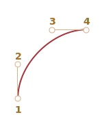

# CSS 애니메이션

<<<<<<< HEAD
CSS 애니메이션을 사용하면 자바스크립트 없이도 간단한 애니메이션을 만들 수 있습니다.

여기에 자바스크립트를 더하면 CSS 애니메이션을 조정할 수 있고, 짧은 코드로도 훨씬 더 효과적인 애니메이션을 만들 수 있습니다.
=======
CSS animations make it possible to do simple animations without JavaScript at all.

JavaScript can be used to control CSS animations and make them even better, with little code.
>>>>>>> fb4fc33a2234445808100ddc9f5e4dcec8b3d24c

## CSS 트랜지션 [#css-transition]

CSS 트랜지션이 나온 배경은 단순합니다. 애니메이션 관련 프로퍼티를 만들고, 프로퍼티 값을 통해 애니메이션 효과를 정의해보자는 데서 출발했습니다. 프로퍼티가 변하면 브라우저는 자동으로 프로퍼티 값에 해당하는 애니메이션을 화면에 보여주자는 의도이죠.

<<<<<<< HEAD
따라서 개발자는 값만 변경하면 됩니다. 프로퍼티 값이 변경되면 자연스러운 트랜지션(전환) 효과는 브라우저가 알아서 처리해줍니다.
=======
That is, all we need is to change the property, and the fluid transition will be done by the browser.
>>>>>>> fb4fc33a2234445808100ddc9f5e4dcec8b3d24c

예시를 살펴봅시다. 아래 CSS를 적용하면 3초 동안 `background-color`가 서서히 변합니다.

```css
.animated {
  transition-property: background-color;
  transition-duration: 3s;
}
```

이 CSS를 적용하면 `animated` 클래스 속성이 있는 요소의 `background-color`가 3초 동안 변하게 되죠.

다른 예시를 살펴봅시다. 버튼을 클릭하면 버튼 배경색이 변합니다.

```html run autorun height=60
<button id="color">클릭</button>

<style>
  #color {
    transition-property: background-color;
    transition-duration: 3s;
  }
</style>

<script>
  color.onclick = function() {
    this.style.backgroundColor = 'red';
  };
</script>
```

CSS 트랜지션에 사용되는 프로퍼티는 네 가지입니다.

- `transition-property`
- `transition-duration`
- `transition-timing-function`
- `transition-delay`

<<<<<<< HEAD
각 프로퍼티에 대해서는 잠시 후에 다룰 예정입니다. 지금은 `transition`이라는 공통 프로퍼티를 사용해 이 네 프로퍼티를 한 번에 선언할 수 있다는 사실 정도만 알아둡시다. `transition` 프로퍼티에 값을 넣어주면 이 값은 `property`, `duration`, `timing-function`, `delay` 프로퍼티에 각각 할당되고, 애니메이션 효과는 한 번에 적용됩니다.
=======
We'll cover them in a moment, for now let's note that the common `transition` property allows declaring them together in the order: `property duration timing-function delay`, as well as animating multiple properties at once.
>>>>>>> fb4fc33a2234445808100ddc9f5e4dcec8b3d24c

아래와 같이 `transition` 프로퍼티를 정의하면 `font-size`는 3초 동안, `color`는 2초 동안 변화하는 것을 확인할 수 있습니다.

```html run height=80 autorun no-beautify
<button id="growing">클릭</button>

<style>
#growing {
*!*
  transition: font-size 3s, color 2s;
*/!*
}
</style>

<script>
growing.onclick = function() {
  this.style.fontSize = '36px';
  this.style.color = 'red';
};
</script>
```

<<<<<<< HEAD
이제 본격적으로 각 프로퍼티를 살펴봅시다.

## transition-property

`transition-property` 프로퍼티엔 `left`, `margin-left`, `height`, `color` 같이 애니메이션 효과를 적용할 프로퍼티 목록을 정의합니다.

이때 주의할 점은 모든 프로퍼티에 애니메이션 효과를 적용할 수 없다는 사실입니다. 참고로 [흔히 사용되는 프로퍼티 대다수엔](https://developer.mozilla.org/en-US/docs/Web/CSS/CSS_animated_properties) 애니메이션 효과를 적용할 수 있습니다.
=======
Now, let's cover animation properties one by one.

## transition-property

In `transition-property`, we write a list of properties to animate, for instance: `left`, `margin-left`, `height`, `color`. Or we could write `all`, which means "animate all properties".

Do note that, there are properties which can not be animated. However, [most of the generally used properties are animatable](https://developer.mozilla.org/en-US/docs/Web/CSS/CSS_animated_properties).
>>>>>>> fb4fc33a2234445808100ddc9f5e4dcec8b3d24c

## transition-duration

`transition-duration` 프로퍼티엔 애니메이션 효과를 얼마 동안 줄지를 설정합니다. 시간은 [CSS 시간 형식(CSS time format)](http://www.w3.org/TR/css3-values/#time)을 따라야 하는데, 초 단위(`s`)나 밀리초 단위(`ms`)를 사용할 수 있습니다.

## transition-delay

<<<<<<< HEAD
`transition-delay` 프로퍼티엔 애니메이션 효과가 *시작되기 전*에 얼마만큼의 지연 시간을 줄지 설정합니다. `transition-delay` 값을 `1s`로 설정하면 애니메이션 효과가 1초 후에 나타납니다.

`transition-delay`엔 음수 값도 넣을 수 있습니다. 값이 음수일 땐 애니메이션 효과가 중간부터 나타납니다. `transition-duration`을 `2s`, 지연 시간을 `-1s`로 설정하면 애니메이션 효과는 1초가 지난 후 1초 동안 지속됩니다.

CSS `translate` 프로퍼티와 지금까지 배운 내용을 사용해 `0`부터 `9`까지가 화면에 자연스럽게 나타나도록 해봅시다.
=======
In `transition-delay` we can specify the delay *before* the animation. For instance, if `transition-delay` is `1s` and `transition-duration` is `2s`, then the animation starts 1 second after the property change and the total duration will be 2 seconds.

Negative values are also possible. Then the animation is shown immediately, but the starting point of the animation will be after given value (time). For example, if `transition-delay` is `-1s` and `transition-duration` is `2s`, then animation starts from the halfway point and total duration will be 1 second. 

Here the animation shifts numbers from `0` to `9` using CSS `translate` property:
>>>>>>> fb4fc33a2234445808100ddc9f5e4dcec8b3d24c

[codetabs src="digits"]

참고로 숫자를 왼쪽으로 이동시키기 위해 `transform` 프로퍼티에 translate(-90%)를 넣었습니다.

```css
#stripe.animate {
  transform: translate(-90%);
  transition-property: transform;
  transition-duration: 9s;
}
```

숫자를 클릭하면 자바스크립트가 실행되면서 숫자가 들어 있는 요소(stripe)에 `animate` 클래스가 추가되고 애니메이션 효과가 나타납니다.

```js
stripe.classList.add('animate');
```

<<<<<<< HEAD
이번엔 `transition-delay`에 음수를 써서 예시를 약간 변형해봅시다. 현재 시각을 기준으로 '초'를 추출하고, 이 값에 마이너스 기호를 붙여서 `transition-delay` 값으로 지정하면 현재 초를 기준으로 숫자가 나타나고, 애니메이션 효과가 적용되는 것을 확인할 수 있습니다.
=======
We could also start it from somewhere in the middle of the transition, from an exact number, e.g. corresponding to the current second, using a negative `transition-delay`.
>>>>>>> fb4fc33a2234445808100ddc9f5e4dcec8b3d24c

직접 숫자를 클릭해보세요. 현재 날짜가 2020년 9월 12일 오후 12시 17분 8초라면, 숫자 8부터 스르륵 이동합니다.

[codetabs src="digits-negative-delay"]

<<<<<<< HEAD
사용한 코드는 아래와 같습니다.
=======
JavaScript does it with an extra line:
>>>>>>> fb4fc33a2234445808100ddc9f5e4dcec8b3d24c

```js
stripe.onclick = function() {
  let sec = new Date().getSeconds() % 10;
*!*
  // sec가 3이라면 transitionDelay 값이 -3s가 되어 3부터 애니메이션 효과가 적용됩니다.
  stripe.style.transitionDelay = '-' + sec + 's';
*/!*
  stripe.classList.add('animate');
};
```

## transition-timing-function

<<<<<<< HEAD
`transition-timing-function` 프로퍼티를 사용해 timing 함수를 만들면 시간에 따라 애니메이션 효과를 어떻게 분배할지를 설정할 수 있습니다. 애니메이션 효과가 초반엔 천천히 나타나다가 나중엔 빠르게 나타나게 할 수 있고, 물론 이 반대도 가능합니다.

처음 이 프로퍼티를 접하면 애니메이션 프로퍼티 중 가장 복잡한 프로퍼티 같다고 느낄 수 있습니다. 그렇지만 시간을 조금 투자해 학습하면 매우 간단한 프로퍼티라는 생각이 들 겁니다.

`transition-timing-function` 프로퍼티 값엔 베지어 곡선(bezier curve)이나 단계(step)가 올 수 있습니다. 먼저 사용 빈도가 높은 베지어 곡선부터 알아봅시다.
=======
The timing function describes how the animation process is distributed along its timeline. Will it start slowly and then go fast, or vice versa.

It appears to be the most complicated property at first. But it becomes very simple if we devote a bit time to it.

That property accepts two kinds of values: a Bezier curve or steps. Let's start with the curve, as it's used more often.
>>>>>>> fb4fc33a2234445808100ddc9f5e4dcec8b3d24c

### 베지어 곡선

<<<<<<< HEAD
`transition-timing-function`엔 조절점이 4개면서 아래 조건을 만족하는 [베지어 곡선](/bezier-curve)을 지정할 수 있습니다.

1. 첫 번째 조절점: `(0,0)`
2. 마지막 조절점: `(1,1)`
3. 중간 조절점들: `x`가 `0`과 `1` 사이에 있어야 함. `y`엔 제약이 없음
=======
The timing function can be set as a [Bezier curve](/bezier-curve) with 4 control points that satisfy the conditions:

1. First control point: `(0,0)`.
2. Last control point: `(1,1)`.
3. For intermediate points, the values of `x` must be in the interval `0..1`, `y` can be anything.
>>>>>>> fb4fc33a2234445808100ddc9f5e4dcec8b3d24c

CSS에선 베지어 곡선을 `cubic-bezier(x2, y2, x3, y3)`형태로 정의합니다. 규칙에 따라 첫 번째 조절점은 `(0,0)`, 네 번째 조절점은 `(1,1)`로 고정되므로 두 번째와 세 번째 조절점만 설정하면 됩니다.

<<<<<<< HEAD
조절점을 변경해 만든 베지어 곡선을 사용해 정의한 timing 함수는 시간이 지남에 따라 얼마나 빠르게 애니메이션 효과가 나타나게 할지를 보여줍니다.

- `x`축은 시간이 됩니다. `0`은 애니메이션 시작하는 시간, `1`은 끝나는 시간을 나타냅니다.
- `y`축은 프로세스 완성 정도를 나타냅니다. `0`은 프로퍼티 시작 값, `1`은 최종값을 나타냅니다.
=======
The timing function describes how fast the animation process goes.

- The `x` axis is the time: `0` -- the start, `1` -- the end of `transition-duration`.
- The `y` axis specifies the completion of the process: `0` -- the starting value of the property, `1` -- the final value.
>>>>>>> fb4fc33a2234445808100ddc9f5e4dcec8b3d24c

가장 간단한 timing 함수를 적용하면 애니메이션 효과가 일정한 속도로 나타납니다. `cubic-bezier(0, 0, 1, 1)`를 사용해 기울기가 1인 직선형 함수를 만들어봅시다.

베지어 곡선이 이렇게 그려지겠죠.


보시다시피 그냥 직선입니다. 시간(`x`)이 지나면서 애니메이션의 완성도(`y`)가 `0`에서 `1`로 꾸준히 올라갑니다.

이제 아래 기차를 클릭해, 기차가 일정한 속도로 왼쪽에서 오른쪽으로 이동하게 해봅시다.

[codetabs src="train-linear"]

실제 사용한 스타일은 다음과 같습니다.

```css
.train {
  left: 0;
  transition: left 5s cubic-bezier(0, 0, 1, 1);
  /* left 속성값(450px)은 자바스크립트에서 설정함 */
}
```

이제 기차가 점점 느리게 이동하도록 만들어봅시다.

다른 베지어 곡선 `cubic-bezier(0.0, 0.5, 0.5 ,1.0)`을 사용해서 말이죠.

새로운 베지어 곡선은 다음과 같습니다.



그래프에서 볼 수 있듯이 프로세스는 초반에 빠르게 진행되다가 점점 느려질 겁니다.

기차를 클릭해 실제 timing 함수가 어떻게 적용되었는지 확인해봅시다.

[codetabs src="train"]

CSS:
```css
.train {
  left: 0;
  transition: left 5s cubic-bezier(0, .5, .5, 1);
    /* left 속성값(450px)은 자바스크립트에서 설정함 */
}
```

직접 베지어 곡선을 만드는 것 말고, 내장 곡선을 사용할 수도 있습니다. 내장 곡선엔 `linear`, `ease`, `ease-in`, `ease-out`, `ease-in-out` 등이 있습니다.

<<<<<<< HEAD
`linear`는 위에서 본 직선 형태의 timing 함수를 쓸 때 사용된 `cubic-bezier(0, 0, 1, 1)`와 동일한 효과를 줍니다.
=======
The `linear` is a shorthand for `cubic-bezier(0, 0, 1, 1)` -- a straight line, which we described above.
>>>>>>> fb4fc33a2234445808100ddc9f5e4dcec8b3d24c

각 내장 곡선에 대응하는 베지어 곡선은 다음과 같습니다.

| <code>ease</code><sup>*</sup> | <code>ease-in</code> | <code>ease-out</code> | <code>ease-in-out</code> |
|-------------------------------|----------------------|-----------------------|--------------------------|
| <code>(0.25, 0.1, 0.25, 1.0)</code> | <code>(0.42, 0, 1.0, 1.0)</code> | <code>(0, 0, 0.58, 1.0)</code> | <code>(0.42, 0, 0.58, 1.0)</code> |
|  |  |  |  |

`*`로 표시한 내장 곡선 `ease`는 timing 함수가 없을 때 기본값으로 사용됩니다.

이제 `ease-out`을 사용해 기차가 점점 느려지도록 해봅시다.


```css
.train {
  left: 0;
  transition: left 5s ease-out;
  /* transition: left 5s cubic-bezier(0, .5, .5, 1); */
}
```

베지어 곡선 `cubic-bezier(0.0, 0.5, 0.5 ,1.0)`을 사용한 것처럼 기차가 점점 느려지긴 하지만 프로세스 정도가 조금 다른 것을 확인할 수 있습니다.

<<<<<<< HEAD
한편, **베지어 곡선을 사용하면 애니메이션이 지정한 범위를 '넘어서' 적용되게 할 수 있습니다.**

베지어 곡선에서 중간 조절점의 `y` 좌표는 제약이 없습니다. 음수 또는 매우 큰 값도 가능하죠. 그런데 조절점의 `y` 좌표가 음수 또는 큰 값일 때 베지어 곡선은 매우 낮거나 높게 그려집니다. 이러면 애니메이션이 정상 범위를 벗어납니다.
=======
**A Bezier curve can make the animation exceed its range.**

The control points on the curve can have any `y` coordinates: even negative or huge ones. Then the Bezier curve would also extend very low or high, making the animation go beyond its normal range.
>>>>>>> fb4fc33a2234445808100ddc9f5e4dcec8b3d24c

아래쪽 기차 예시에 다음과 같은 css를 적용했다고 가정해봅시다.
```css
.train {
  left: 100px;
  transition: left 5s cubic-bezier(.5, -1, .5, 2);
    /* left 속성값(400px)은 자바스크립트에서 설정함 */
}
```

이 css가 적용되면, `left` 프로퍼티가 `100px`에서 `400px`로 점차 변해야 합니다.

그런데 기차를 클릭하면 기차는 다음과 같이 움직입니다.

- 먼저 기차가 뒤로 이동합니다. `left` 값은 `100px`보다 조금 안되게 설정됩니다.
- 그리고 나서 다시 기차는 앞으로 이동합니다. 이때 `left` 값은 `400px`보다 조금 큽니다.
- 그리고 나서 `left`가 `400px`일 때의 위치로 후진합니다.

[codetabs src="train-over"]

<<<<<<< HEAD
왜 이렇게 이동하는지는 아래의 베지어 곡선 그래프를 보면 아주 명확히 알 수 있습니다.


두 번째 조절점의 `y` 좌표가 `0`보다 작아지고, 세 번째 조절점의 좌표가 `1`보다 커지면서 곡선이 '정상' 범위를 벗어난 것을 확인할 수 있습니다. '정상' 범위인 `0..1`을 벗어난 것이죠.

아시다시피, timing 함수의 `y`축은 '애니메이션 프로세스의 완성도'를 나타냅니다. `y`가 `0`일 땐 프로퍼티 시작 값을, `y`가 `1`일 땐 프로세스 종료 값을 의미하죠. 그렇기 때문에 `y`가 `0`보다 작아지면 `left` 프로퍼티가 시작 값인 100px 보다 낮게 설정되고, `y`가 `1`보다 커지면 `left` 프로퍼티가 끝값인 400px보다 커지게 됩니다.
=======
Why it happens is pretty obvious if we look at the graph of the given Bezier curve:


We moved the `y` coordinate of the 2nd point below zero, and for the 3rd point we made it over `1`, so the curve goes out of the "regular" quadrant. The `y` is out of the "standard" range `0..1`.

As we know, `y` measures "the completion of the animation process". The value `y = 0` corresponds to the starting property value and `y = 1` -- the ending value. So values `y<0` move the property beyond the starting `left` and `y>1` -- past the final `left`.
>>>>>>> fb4fc33a2234445808100ddc9f5e4dcec8b3d24c

이 예시에선 `y` 값이 정상 범위를 크게 벗어나지 않기 때문에 '부드럽게' 변형이 일어납니다. 그런데 `y` 값이 `-99`나 `99`가 되면 기차가 앞·뒤로 아주 크게 움직이겠죠?

<<<<<<< HEAD
이쯤 되면 원하는 애니메이션 효과를 줄 수 있는 베지어 곡선은 어떻게 만들 수 있을지 의문이 들 겁니다. 베지어 곡선을 만들어주는 툴은 다양한데, <http://cubic-bezier.com/>에서도 가능합니다.
=======
But how do we make a Bezier curve for a specific task? There are many tools. For instance, we can do it on the site <http://cubic-bezier.com/>.
>>>>>>> fb4fc33a2234445808100ddc9f5e4dcec8b3d24c

### 단계

<<<<<<< HEAD
timing 함수 `steps(number of steps[, start/end])`를 사용하면 애니메이션을 여러 단계(step)로 나눌 수 있습니다.
=======
The timing function `steps(number of steps[, start/end])` allows splitting an animation into steps.
>>>>>>> fb4fc33a2234445808100ddc9f5e4dcec8b3d24c

숫자를 사용해 예시를 만들어봅시다.

지금은 애니메이션을 적용하지 않았습니다.

[codetabs src="step-list"]

이제 애니메이션을 적용해 빨간 '박스' 밖에 있는 숫자들은 숨기고, 단계별로 숫자 목록을 왼쪽으로 이동 시켜, 사용자 눈엔 숫자가 하나씩 증가하는 것처럼 보이게 합시다.

9까지 숫자를 증가시켜야 하므로 단계는 총 9개가 됩니다.

```css
#stripe.animate  {
  transform: translate(-90%);
  transition: transform 9s *!*steps(9, start)*/!*;
}
```

숫자를 클릭해 원하는 대로 동작하는지 확인해봅시다.

[codetabs src="step"]

timing 함수 `steps(9, start)`에서 첫 번째 인수는 단계의 수이므로 전체 프로세스가 9단계로 나눠 적용되 10%씩 진행되는 것을 확인할 수 있습니다. 이때 시간 간격도 자동으로 9단계로 나뉘기 때문에 1초 간격으로 숫자가 증가하게 됩니다.

두 번째 인수는 `start`나 `end` 중 하나입니다.

<<<<<<< HEAD
두 번째 인수가 `start`인 경우엔 애니메이션이 첫 번째 단계부터 바로 시작됩니다.
=======
The `start` means that in the beginning of animation we need to make the first step immediately.
>>>>>>> fb4fc33a2234445808100ddc9f5e4dcec8b3d24c

숫자를 클릭하면 숫자가 `1`로 바로 바뀌고(첫 번째 단계), 1초 후에 다음 숫자(다음 단계)로 바뀌는 것을 확인할 수 있습니다.

초별로 프로세스가 몇 %씩 진행되는지를 정리하면 다음과 같죠.

- `0s` -- `-10%` (애니메이션이 시작하자마자 바로 첫 번째 단계가 수행됨)
- `1s` -- `-20%`
- ...
- `8s` -- `-80%`
- (마지막 초에 최종값이 나타남)

반면 두 번째 인수가 `end`인 경우엔 애니메이션이 바로 시작하지 않고 각 초가 끝날 때 시작됩니다.

초별 프로세스 정도는 다음과 같습니다.

- `0s` -- `0`
- `1s` -- `-10%` (1초가 지난 후에 첫 단계가 수행됨)
- `2s` -- `-20%`
- ...
- `9s` -- `-90%`

두 번째 인수를 변화 시켜(`steps(9, end)`) 실제 어떻게 애니메이션이 변화하는지 확인해봅시다.

[codetabs src="step-end"]

참고로 다음과 같은 내장 값을 사용해 timing 함수를 지정할 수도 있습니다.

- `step-start` -- `steps(1, start)`와 같습니다. 따라서 애니메이션의 첫 단계가 바로 시작되고 첫 번째 단계만 실행됩니다. 마치 애니메이션 효과가 없는 것처럼 보입니다.
- `step-end` -- `steps(1, end)`와 같습니다. `transition-duration`의 끝에 애니메이션이 한 단계만 진행됩니다.

위 값들을 사용하면 움직이는 효과를 볼 수 없기 때문에 거의 사용되지 않습니다.

## transitionend 이벤트

CSS 애니메이션이 끝나면 `transitionend` 이벤트가 자동으로 트리거됩니다.

`transitionend` 이벤트는 애니메이션이 끝났을 때 무언가를 하고 싶은 경우 많이 사용됩니다. 애니메이션 여러 개를 조합할 때도 자주 쓰이죠.

<<<<<<< HEAD
예를 들어봅시다. 아래 예시에서 배를 클릭하면 배가 오른쪽, 왼쪽으로 움직이는데 한번 왕복할 때마다 오른쪽으로 더 멀리 이동합니다.

[iframe src="boat" height=300 edit link]

트랜지션이 종료될 때마다 방향을 뒤집는 함수 `go`가 다시 실행되면서 새로운 애니메이션이 시작되는 것이죠.
=======
For instance, the ship in the example below starts to sail there and back when clicked, each time farther and farther to the right:

[iframe src="boat" height=300 edit link]

The animation is initiated by the function `go` that re-runs each time the transition finishes, and flips the direction:
>>>>>>> fb4fc33a2234445808100ddc9f5e4dcec8b3d24c

```js
boat.onclick = function() {
  //...
  let times = 1;

  function go() {
    if (times % 2) {
<<<<<<< HEAD
      // 오른쪽으로 가기
      boat.classList.remove('back');
      boat.style.marginLeft = 100 * times + 200 + 'px';
    } else {
      // 왼쪽으로 가기
=======
      // sail to the right
      boat.classList.remove('back');
      boat.style.marginLeft = 100 * times + 200 + 'px';
    } else {
      // sail to the left
>>>>>>> fb4fc33a2234445808100ddc9f5e4dcec8b3d24c
      boat.classList.add('back');
      boat.style.marginLeft = 100 * times - 200 + 'px';
    }

  }

  go();

  boat.addEventListener('transitionend', function() {
    times++;
    go();
  });
};
```

<<<<<<< HEAD
트렌지션과 관련된 이벤트는 몇 가지 특수 프로퍼티를 지원합니다.
=======
The event object for `transitionend` has a few specific properties:
>>>>>>> fb4fc33a2234445808100ddc9f5e4dcec8b3d24c

`event.propertyName`
: 애니메이션이 완료된 프로퍼티로, 동시에 여러 개의 프로퍼티에 애니메이션 효과를 줄 때 사용할 수 있습니다.

`event.elapsedTime`
: `transition-delay`가 없다는 가정하에 애니메이션 효과에 걸린 시간(초)을 나타냅니다.

## keyframes

CSS 문법인 `@keyframes`을 사용하면 간단한 애니메이션 여러 개를 한꺼번에 실행시킬 수 있습니다.

<<<<<<< HEAD
`@keyframes`엔 애니메이션 '이름'과 무엇을, 언제, 어디서 움직일지를 설정할 수 있습니다. `@keyframes`에 적절한 값을 넣은 후엔 `animation` 프로퍼티를 사용해 원하는 요소에 커스텀 애니메이션을 적용할 수 있습니다. 물론 추가 매개변수도 지정할 수 있습니다.
=======
It specifies the "name" of the animation and rules - what, when and where to animate. Then using the `animation` property, we can attach the animation to the element and specify additional parameters for it.
>>>>>>> fb4fc33a2234445808100ddc9f5e4dcec8b3d24c

주석에 설명을 달아놓은 예시를 살펴봅시다.

```html run height=60 autorun="no-epub" no-beautify
<div class="progress"></div>

<style>
*!*
  @keyframes go-left-right {        /* 애니메이션 이름 지정: "go-left-right" */
    from { left: 0px; }             /* left 0px 부터 애니메이션 시작 */
    to { left: calc(100% - 50px); } /* left 값이 100%-50px 될 때까지 애니메이션 적용 */
  }
*/!*

  .progress {
*!*
    animation: go-left-right 3s infinite alternate;
    /* 해당 요소에 커스텀 애니메이션 'go-left-right' 적용
       지속 시간은 3초,
       반복 횟수는 무한(infinite)
       방향은 매번 바뀜
    */
*/!*

    position: relative;
    border: 2px solid green;
    width: 50px;
    height: 20px;
    background: lime;
  }
</style>
```

`@keyframes`을 다루는 글이나 [명세서](https://drafts.csswg.org/css-animations/)를 읽으면 더 많은 정보를 찾을 수 있으니 참고해보시기 바랍니다.

<<<<<<< HEAD
참고로 사이트에 있는 특정 요소를 계속 정적인 형태로 움직이지 않는 한은 `@keyframes`를 쓸 일은 많지 않을 겁니다.
=======
You probably won't need `@keyframes` often, unless everything is in constant motion on your sites.
>>>>>>> fb4fc33a2234445808100ddc9f5e4dcec8b3d24c

## 요약

<<<<<<< HEAD
CSS 애니메이션을 사용하면 하나 또는 여러 CSS 프로퍼티를 부드럽게(부드럽지 않게도 가능) 변화시킬 수 있습니다.
=======
CSS animations allow smoothly (or not) animated changes of one or multiple CSS properties.
>>>>>>> fb4fc33a2234445808100ddc9f5e4dcec8b3d24c

CSS 애니메이션은 전환이 필요한 대다수의 경우에 큰 도움을 줍니다. 자바스크립트를 사용해도 전환 효과를 줄 수 있긴 한데 이에 대해선 다음 챕터에서 다룰 예정입니다.

참고로 CSS 애니메이션은 자바스크립트 애니메이션과 비교해 다음과 같은 장단점이 있습니다.

```compare plus="CSS animations" minus="JavaScript animations"
<<<<<<< HEAD
+ 간단한 애니메이션을 간단히 수행함
+ 빠르고 CPU를 많이 소모하지 않음
- 자바스크립트 애니메이션보다 덜 유연함. 요소의 '폭발' 같은 특수한 애니메이션 로직을 구현할 수 없음
- 자바스크립트를 사용하면 프로퍼티의 변화뿐만 아니라, 애니메이션에 필요한 새로운 요소를 만들 수 있는데, CSS만으로는 불가능함
```

사실 대부분의 애니메이션은 이번 챕터에 설명한 CSS 프로퍼티를 사용해 구현할 수 있습니다. 여기에 더하여 `transitionend` 이벤트를 사용해 애니메이션이 끝난 후에 실행시킬 자바스크립트 코드를 지정할 수도 있죠.
=======
+ Simple things done simply.
+ Fast and lightweight for CPU.
- JavaScript animations are flexible. They can implement any animation logic, like an "explosion" of an element.
- Not just property changes. We can create new elements in JavaScript as part of the animation.
```

The majority of animations can be implemented using CSS as described in this chapter. And the `transitionend` event allows JavaScript to be run after the animation, so it integrates fine with the code.
>>>>>>> fb4fc33a2234445808100ddc9f5e4dcec8b3d24c

하지만 좀 더 복잡한 케이스를 다루려면 자바스크립트 애니메이션을 알아야 하므로 다음 챕터에선 이를 다뤄보겠습니다.
