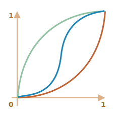

# 자바스크립트 애니메이션

자바스크립트 애니메이션은 CSS로는 할수 없었던 몇가지 일들이 더 가능합니다.

예를 들어 복잡한 경로를 따라 움직이게 하거나, Bazier 커브가 아닌 다른 타이밍 함수의 활용 혹은 캔버스에 애니메이션을 표현하기 등입니다.

## setInterval 사용하기

애니메이션은 프레임들의 연속으로 구현할 수 있습니다. 이는 보통 HTML/CSS 프로퍼티의 작은 변경을 활용합니다.

예를 들어 `style.left`를 `0px`에서 `100px`로 바꾸면 해당 엘리멘트는 이동합니다. 만약 이 변경을 `setInterval` 을 활용하여 아주 약간의 간격을 두고, 가령 1초에 50번 정도 `2px` 씩 더해준다면 엘리먼트는 부드럽게 이동하는 듯 보일 것입니다. 이는 영화상영의 기본 원리와 같습니다. 1초에 24프레임이면 부드럽게 움직이는 것처럼 보이기에 충분합니다.

슈도 코드는 대략 다음과 같습니다:

```js
let timer = setInterval(function() {
  if (animation complete) clearInterval(timer);
  else increase style.left by 2px
}, 20); // 매 20ms마다 2px 변경, 초당 약 50프레임
```

애니메이션에 관한 조금 더 복잡한 예제입니다:

```js
let start = Date.now(); // 시작 시각을 저장합니다.

let timer = setInterval(function() {
  // 시작부터 얼마만큼 시간이 지났는지를 저장합니다.
  let timePassed = Date.now() - start;

  if (timePassed >= 2000) {
    clearInterval(timer); // 2초가 지난 후 애니메이션을 종료합니다.
    return;
  }

  // timePassed 순간의 애니메이션을 그립니다.
  draw(timePassed);

}, 20);

// timePassed 값이 0에서 2000까지 변화할 때
// left 변수의 값은 0px에서 400px이 됩니다.
function draw(timePassed) {
  train.style.left = timePassed / 5 + 'px';
}
```

데모를 확인하려면 클릭하세요:

[codetabs height=200 src="move"]

## requestAnimationFrame 사용하기

여러 개의 애니메이션을 동시에 실행하는 상황을 생각해봅시다.

만약 각각의 애니메이션을 따로 실행한다면 실행되는 모든 애니메이션은 `setInterval(..., 20)` 을 가지게 될 것입니다. 그리고 브라우저는 매 `20ms` 보다 훨씬 더 자주 화면을 다시 그리게 될 것 입니다.

이는 각각의 실행 시작 시각이 다르기에 '매 20ms' 도 모두 다르기 때문입니다. 실행 간격은 정렬되지 않습니다. 따라서 이 경우 `20ms` 안에 몇 번의 독립적인 실행이 있게 됩니다.

다시 말해, 이렇게 하는 것이:

```js
setInterval(function() {
  animate1();
  animate2();
  animate3();
}, 20)
```

...이렇게 각각 따로 호출하는 것보다 효율적입니다:

```js
setInterval(animate1, 20); // 각각 호출되는 애니메이션
setInterval(animate2, 20); // 스크립의 다양한 곳에서
setInterval(animate3, 20);
```

이렇게 각각 화면을 새로 그리는 작업은 브라우저의 화면 갱신 작업을 효율적으로 하기 위해 그리고 CPU 의 효율적인 사용과 보다 부드러운 움직임을 위해 모아서 한번에 처리되야 합니다.

한가지 더 기억해 두어야 할 것이 있습니다. CPU가 overloaded 상태이거나 혹은 그 외에 어떤 이유든 화면 갱신 작업이 더 적게 일어나야 할때가 있습니다(예를 들면 브라우저 탭이 숨겨져 있는 경우), 그러므로 정말로 매 '20ms'마다 애니메이션을 실행하지 않는편이 좋습니다.

그렇다면 Javascript 에서 이러한 상황을 어떻게 알수 있을까요? 이를 위해 `requestAnimationFrame` 함수를 제공하는 [Animation timing](http://www.w3.org/TR/animation-timing/) 사양이 있습니다. 
이를 활용하면 위의 모든 issues 들을 포함하여 많은것을 해결할 수 있습니다. 

문법:
```js
let requestId = requestAnimationFrame(callback)
```

이 방법은 함수 `callback` 이 브라우저가 원하는 순간에서 가장 가까운 시점에 호출 될 수 있도록 스케줄링합니다.

`callback` 안에서 수정하는 엘리먼트들은 자동으로 다른 `requestAnimationFrame` callbacks 그리고 CSS 애니메이션들과 함께 그룹화됩니다. 그리고 여러 번이 아닌 단 한번의 형상 재계산과 화면 갱신이 수행됩니다.

반환되는 `requestId` 값은 호출을 취소하는데 사용될 수 있습니다:
```js
// 스케쥴링 된 callback 함수의 실행을 취소합니다.
cancelAnimationFrame(requestId);
```

`callback` 함수는 페이지의 로드가 시작된 시점에서부터 지난 시간을 microseconds 로 제공하는 하나의 인수를 받습니다. 이 시각은 [performance.now()](mdn:api/Performance/now) 호출을 통해서도 얻을 수 있습니다.

일반적으로 `callback` 함수는 곧 실행됩니다, CPU가 overloaded 돼 있거나 노트북의 배터리가 거의 방전되거나 혹은 다른 비슷한 이유가 있지 않은 한 그렇습니다.

아래 코드는 처음 10번의 `requestAnimationFrame` 실행 간격을 보여줍니다. 보통 10-20ms 정도입니다:

```html run height=40 refresh
<script>
  let prev = performance.now();
  let times = 0;

  requestAnimationFrame(function measure(time) {
    document.body.insertAdjacentHTML("beforeEnd", Math.floor(time - prev) + " ");
    prev = time;

    if (times++ < 10) requestAnimationFrame(measure);
  })
</script>
```

## Structured animation

Now we can make a more universal animation function based on `requestAnimationFrame`:

```js
function animate({timing, draw, duration}) {

  let start = performance.now();

  requestAnimationFrame(function animate(time) {
    // timeFraction goes from 0 to 1
    let timeFraction = (time - start) / duration;
    if (timeFraction > 1) timeFraction = 1;

    // calculate the current animation state
    let progress = timing(timeFraction)

    draw(progress); // draw it

    if (timeFraction < 1) {
      requestAnimationFrame(animate);
    }

  });
}
```

Function `animate` accepts 3 parameters that essentially describes the animation:

`duration`
: Total time of animation. Like, `1000`.

`timing(timeFraction)`
: Timing function, like CSS-property `transition-timing-function` that gets the fraction of time that passed (`0` at start, `1` at the end) and returns the animation completion (like `y` on the Bezier curve).

    For instance, a linear function means that the animation goes on uniformly with the same speed:

    ```js
    function linear(timeFraction) {
      return timeFraction;
    }
    ```

    It's graph:
    

    That's just like `transition-timing-function: linear`. There are more interesting variants shown below.

`draw(progress)`
: The function that takes the animation completion state and draws it. The value `progress=0` denotes the beginning animation state, and `progress=1` -- the end state.

    This is that function that actually draws out the animation.

    It can move the element:
    ```js
    function draw(progress) {
      train.style.left = progress + 'px';
    }
    ```

    ...Or do anything else, we can animate anything, in any way.


Let's animate the element `width` from `0` to `100%` using our function.

Click on the element for the demo:

[codetabs height=60 src="width"]

The code for it:

```js
animate({
  duration: 1000,
  timing(timeFraction) {
    return timeFraction;
  },
  draw(progress) {
    elem.style.width = progress * 100 + '%';
  }
});
```

Unlike CSS animation, we can make any timing function and any drawing function here. The timing function is not limited by Bezier curves. And `draw` can go beyond properties, create new elements for like fireworks animation or something.

## Timing functions

We saw the simplest, linear timing function above.

Let's see more of them. We'll try movement animations with different timing functions to see how they work.

### Power of n

If we want to speed up the animation, we can use `progress` in the power `n`.

For instance, a parabolic curve:

```js
function quad(timeFraction) {
  return Math.pow(timeFraction, 2)
}
```

The graph:


See in action (click to activate):

[iframe height=40 src="quad" link]

...Or the cubic curve or event greater `n`. Increasing the power makes it speed up faster.

Here's the graph for `progress` in the power `5`:


In action:

[iframe height=40 src="quint" link]

### The arc

Function:

```js
function circ(timeFraction) {
  return 1 - Math.sin(Math.acos(timeFraction));
}
```

The graph:


[iframe height=40 src="circ" link]

### Back: bow shooting

This function does the "bow shooting". First we "pull the bowstring", and then "shoot".

Unlike previous functions, it depends on an additional parameter `x`, the "elasticity coefficient". The distance of "bowstring pulling" is defined by it.

The code:

```js
function back(x, timeFraction) {
  return Math.pow(timeFraction, 2) * ((x + 1) * timeFraction - x)
}
```

**The graph for `x = 1.5`:**


For animation we use it with a specific value of `x`. Example for `x = 1.5`:

[iframe height=40 src="back" link]

### Bounce

Imagine we are dropping a ball. It falls down, then bounces back a few times and stops.

The `bounce` function does the same, but in the reverse order: "bouncing" starts immediately. It uses few special coefficients for that:

```js
function bounce(timeFraction) {
  for (let a = 0, b = 1, result; 1; a += b, b /= 2) {
    if (timeFraction >= (7 - 4 * a) / 11) {
      return -Math.pow((11 - 6 * a - 11 * timeFraction) / 4, 2) + Math.pow(b, 2)
    }
  }
}
```

In action:

[iframe height=40 src="bounce" link]

### Elastic animation

One more "elastic" function that accepts an additional parameter `x` for the "initial range".

```js
function elastic(x, timeFraction) {
  return Math.pow(2, 10 * (timeFraction - 1)) * Math.cos(20 * Math.PI * x / 3 * timeFraction)
}
```

**The graph for `x=1.5`:**


In action for `x=1.5`:

[iframe height=40 src="elastic" link]

## Reversal: ease*

So we have a collection of timing functions. Their direct application is called "easeIn".

Sometimes we need to show the animation in the reverse order. That's done with the "easeOut" transform.

### easeOut

In the "easeOut" mode the `timing` function is put into a wrapper `timingEaseOut`:

```js
timingEaseOut(timeFraction) = 1 - timing(1 - timeFraction)
```

In other words, we have a "transform" function `makeEaseOut` that takes a "regular" timing function and returns the wrapper around it:

```js
// accepts a timing function, returns the transformed variant
function makeEaseOut(timing) {
  return function(timeFraction) {
    return 1 - timing(1 - timeFraction);
  }
}
```

For instance, we can take the `bounce` function described above and apply it:

```js
let bounceEaseOut = makeEaseOut(bounce);
```

Then the bounce will be not in the beginning, but at the end of the animation. Looks even better:

[codetabs src="bounce-easeout"]

Here we can see how the transform changes the behavior of the function:


If there's an animation effect in the beginning, like bouncing -- it will be shown at the end.

In the graph above the <span style="color:#EE6B47">regular bounce</span> has the red color, and the <span style="color:#62C0DC">easeOut bounce</span> is blue.

- Regular bounce -- the object bounces at the bottom, then at the end sharply jumps to the top.
- After `easeOut` -- it first jumps to the top, then bounces there.

### easeInOut

We also can show the effect both in the beginning and the end of the animation. The transform is called "easeInOut".

Given the timing function, we calculate the animation state like this:

```js
if (timeFraction <= 0.5) { // first half of the animation
  return timing(2 * timeFraction) / 2;
} else { // second half of the animation
  return (2 - timing(2 * (1 - timeFraction))) / 2;
}
```

The wrapper code:

```js
function makeEaseInOut(timing) {
  return function(timeFraction) {
    if (timeFraction < .5)
      return timing(2 * timeFraction) / 2;
    else
      return (2 - timing(2 * (1 - timeFraction))) / 2;
  }
}

bounceEaseInOut = makeEaseInOut(bounce);
```

In action, `bounceEaseInOut`:

[codetabs src="bounce-easeinout"]

The "easeInOut" transform joins two graphs into one: `easeIn` (regular) for the first half of the animation and `easeOut` (reversed) -- for the second part.

The effect is clearly seen if we compare the graphs of `easeIn`, `easeOut` and `easeInOut` of the `circ` timing function:



- <span style="color:#EE6B47">Red</span> is the regular variantof `circ` (`easeIn`).
- <span style="color:#8DB173">Green</span> -- `easeOut`.
- <span style="color:#62C0DC">Blue</span> -- `easeInOut`.

As we can see, the graph of the first half of the animation is the scaled down `easeIn`, and the second half is the scaled down `easeOut`. As a result, the animation starts and finishes with the same effect.

## More interesting "draw"

Instead of moving the element we can do something else. All we need is to write the write the proper `draw`.

Here's the animated "bouncing" text typing:

[codetabs src="text"]

## Summary

For animations that CSS can't handle well, or those that need tight control, JavaScript can help. JavaScript animations should be implemented via `requestAnimationFrame`. That built-in method allows to setup a callback function to run when the browser will be preparing a repaint. Usually that's very soon, but the exact time depends on the browser.

When a page is in the background, there are no repaints at all, so the callback won't run: the animation will be suspended and won't consume resources. That's great.

Here's the helper `animate` function to setup most animations:

```js
function animate({timing, draw, duration}) {

  let start = performance.now();

  requestAnimationFrame(function animate(time) {
    // timeFraction goes from 0 to 1
    let timeFraction = (time - start) / duration;
    if (timeFraction > 1) timeFraction = 1;

    // calculate the current animation state
    let progress = timing(timeFraction);

    draw(progress); // draw it

    if (timeFraction < 1) {
      requestAnimationFrame(animate);
    }

  });
}
```

Options:

- `duration` -- the total animation time in ms.
- `timing` -- the function to calculate animation progress. Gets a time fraction from 0 to 1, returns the animation progress, usually from 0 to 1.
- `draw` -- the function to draw the animation.

Surely we could improve it, add more bells and whistles, but JavaScript animations are not applied on a daily basis. They are used to do something interesting and non-standard. So you'd want to add the features that you need when you need them.

JavaScript animations can use any timing function. We covered a lot of examples and transformations to make them even more versatile. Unlike CSS, we are not limited to Bezier curves here.

The same is about `draw`: we can animate anything, not just CSS properties.
